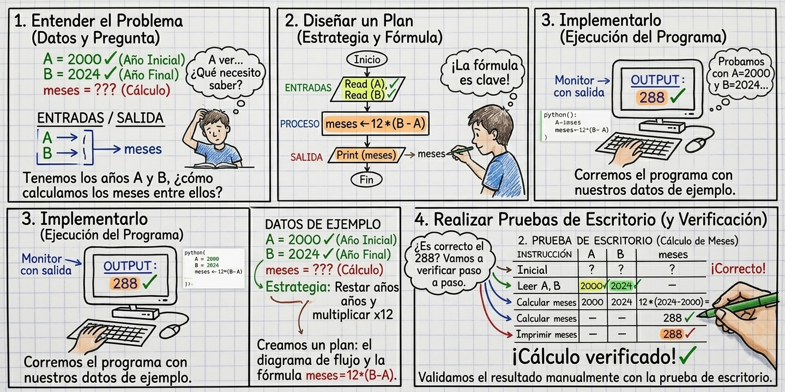
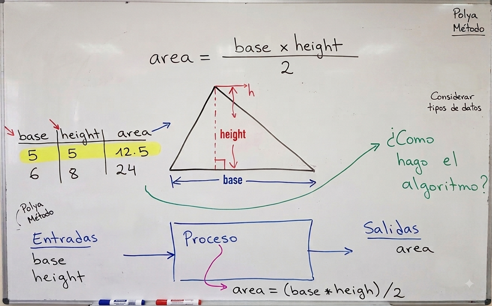
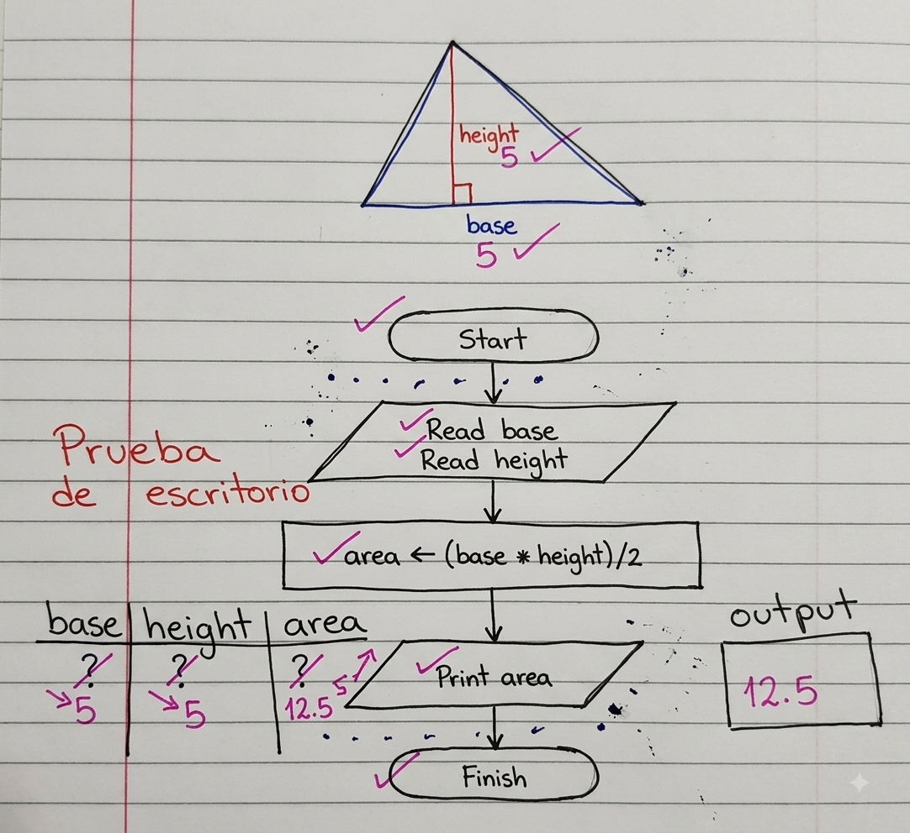
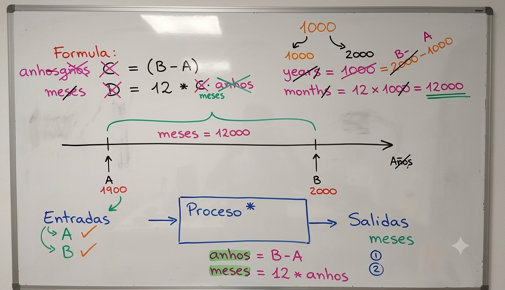
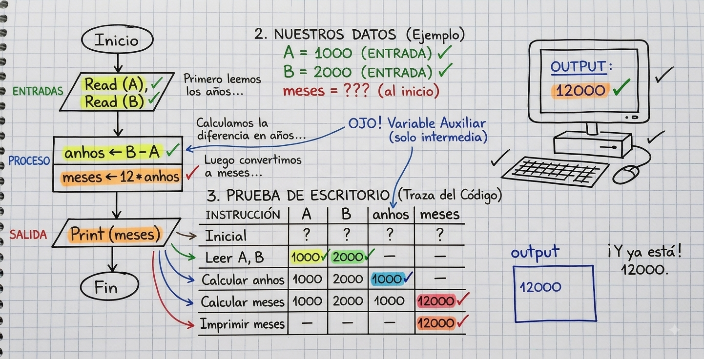
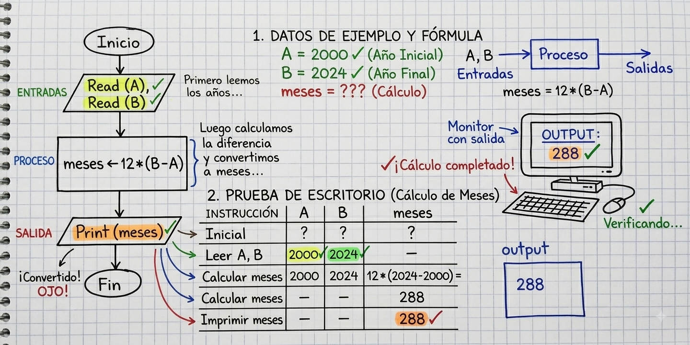

# Resumen de la clase

**Fecha**: 10/08/2026

## Tema principal

La clase se centró en los algoritmos estructurados y en los conceptos básicos de programación en Python. el profesor explicó la temática de forma virtual, teniendo en cuenta la situación ocasionada por el terremoto y la suspensión de la siguiente sesión por una diligencia inaplazable.

## 1. Algoritmos estructurados

- Se discutieron los fundamentos de los algoritmos usando diagramas de bloques.
- Se explicó la relación entre entradas, procesos y salidas.
- Se mostraron bloques básicos para representar soluciones algorítmicas.
- Se enfatizó la importancia de organizar la lógica de un problema antes de programarlo.

## 2. Conceptos básicos de programación en Python

- Se trabajó con la terminal de comandos para mostrar el uso de variables, entradas y salidas.
- Se realizó un ejemplo simple con operaciones matemáticas.
- Se utilizó la instrucción `print()` para mostrar resultados en pantalla.
- Se explicó la importancia de la interacción entre entrada y salida para hacer programas más comprensibles e interactivos.
- Se recomendaron herramientas como Anaconda y Jupyter para desarrollar algoritmos.

## 3. Visualización y diseño de algoritmos

- El profesor mostró una herramienta y un programa en Python para visualizar algoritmos.
- Se explicó el proceso de entrada de datos y la creación de variables.
- Se presentó el método de Polya, que incluye:
  1. Entender el problema.
  2. Diseñar un plan.
  3. Implementarlo.
  4. Realizar pruebas de escritorio.

El procedimiento completo se resume a continuación:




## 4. Ejemplo práctico: cálculo del área de un triángulo

- Se definieron las entradas: base y altura.
- Se describió el proceso de cálculo.
- Se especificó la salida: el área del triángulo.
- Se explicó la fórmula necesaria para resolver el problema.
- Se realizó una prueba de escritorio paso a paso con valores específicos para verificar la lógica.


La siguiente figura resume el planteamiento:



Luego se muestra el algoritmo:



La implementación en python se muestra a continuación ([link](https://pythontutor.com/visualize.html#code=%23%201.%20Entradas%0Abase%20%3D%20float%28input%28%22Ingrese%20la%20base%20del%20tri%C3%A1ngulo%3A%20%22%29%29%0Aheight%20%3D%20float%28input%28%22Ingrese%20la%20altura%20del%20tri%C3%A1ngulo%3A%20%22%29%29%0A%0A%23%202.%20Proceso%0Aarea%20%3D%20%28base%20*%20height%29%20/%202%0A%0A%23%203.%20Salida%0Aprint%28f%22El%20%C3%A1rea%20del%20tri%C3%A1ngulo%20es%3A%20%7Barea%7D%22%29&curInstr=0&mode=display&origin=opt-frontend.js&py=311)): 

```python
# 1. Entradas
base = float(input("Ingrese la base del triángulo: "))
height = float(input("Ingrese la altura del triángulo: "))

# 2. Proceso
area = (base * height) / 2

# 3. Salida
print(f"El área del triángulo es: {area}")
```

## 4. Ejemplo práctico: Calculo de meses

Se requiere diseñar un algoritmo que calcule el
número de meses que hay entre los años A y B.

1. **Entendiendo el problema**

   

2. **Diseño plan**
3. **Implementacion del plan**
4. **Prueba de Escritorio**

Los pasos 2, 3 y 4 se resumen en los siguientes dos algoritmos:

* **Diseño 1**: Se uso una varible axiliar para los años.

  
  
  **Implementación en python**: [link](https://pythontutor.com/visualize.html#code=%23%201.%20Entradas%0AA%20%3D%20int%28input%28%22Ingrese%20el%20a%C3%B1o%20inicial%20%28A%29%3A%20%22%29%29%0AB%20%3D%20int%28input%28%22Ingrese%20el%20a%C3%B1o%20final%20%28B%29%3A%20%22%29%29%0A%0A%23%202.%20Proceso%0Aanhos%20%3D%20B%20-%20A%20%20%20%20%20%20%20%20%20%20%23%20Variable%20auxiliar%20intermedia%0Ameses%20%3D%2012%20*%20anhos%0A%0A%23%203.%20Salida%0Aprint%28f%22Meses%3A%20%7Bmeses%7D%22%29&curInstr=0&mode=display&origin=opt-frontend.js&py=311)

  ```python
  # 1. Entradas
  A = int(input("Ingrese el año inicial (A): "))
  B = int(input("Ingrese el año final (B): "))

  # 2. Proceso
  anhos = B - A          # Variable auxiliar intermedia
  meses = 12 * anhos

  # 3. Salida
  print(f"Meses: {meses}")
  ```
  
* **Diseño 2**: El numero de meses se obtuvo a partir de las entradas (Años inicial (`A`) y final (`B`)).

  

  **Implementación en python**: [link](https://pythontutor.com/visualize.html#code=%23%201.%20Entradas%0AA%20%3D%20int%28input%28%22Ingrese%20el%20a%C3%B1o%20inicial%20%28A%29%3A%20%22%29%29%0AB%20%3D%20int%28input%28%22Ingrese%20el%20a%C3%B1o%20final%20%28B%29%3A%20%22%29%29%0A%0A%23%202.%20Proceso%0Ameses%20%3D%2012%20*%20%28B%20-%20A%29%0A%0A%23%203.%20Salida%0Aprint%28f%22Meses%3A%20%7Bmeses%7D%22%29&curInstr=0&mode=display&origin=opt-frontend.js&py=311)

  ```python
  # 1. Entradas
  A = int(input("Ingrese el año inicial (A): "))
  B = int(input("Ingrese el año final (B): "))

  # 2. Proceso
  meses = 12 * (B - A)

  # 3. Salida
  print(f"Meses: {meses}")
  ```


## 5. Introducción a la programación en Python
- Se mostró cómo convertir un algoritmo en código en Python.
- Se enfatizó que los programadores trabajan con código, mientras que los usuarios interactúan con la interfaz.
- Se destacó la importancia de seguir una secuencia lógica para asegurar que la solución sea correcta.

## Cierre
- El profesor indicó que el material de la clase será compartido con los estudiantes.
- Se mencionó que pueden consultar dudas con él.
- También se planean ejercicios prácticos adicionales para reforzar los conceptos aprendidos.