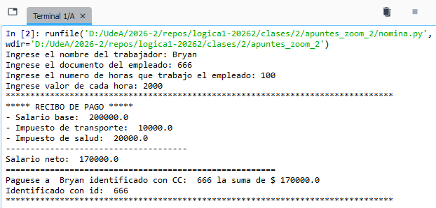
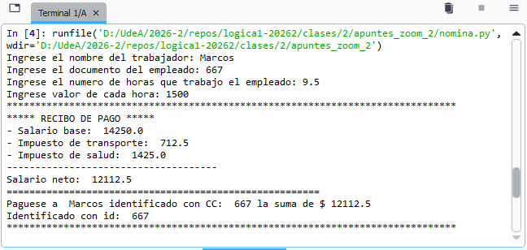

# Plantilla de solución de problemas — Método de Polya

## Ejemplo diligenciado

A continuación, un ejemplo de la plantilla completa, resuelto para el ejercicio de cálculo de salario neto.

### Encabezado

- **Nombre del estudiante**: <br>Estudiante UdeA
- **Fecha**: 
<br>13/08/2026

La siguiente tabla muestra recursos adicionales:
* **Solucion a mano** [[pdf]](metodo_polya_nomina_manuscrito.pdf)
* **Solución llenando la plantilla** [[pdf]](metodo_polya_nomina.pdf)

#### Ejercicio / problema a resolver

**Enunciado del problema**

```
Hacer un programa que solicite el nombre, la identificación, el número de horas trabajadas y el valor por hora y realice el cálculo del salario neto teniendo en cuenta que se cobra un impuesto del 10% por salud y un 5% debido a pensiones.
```

### 1. Entender el problema

> Lea el enunciado con cuidado. Identifique qué se pide, qué información se conoce y cómo se relacionan los datos.

**¿Qué se pide calcular u obtener?**

```
El salario neto de un empleado
```

**Datos de entrada**

| Nombre de la variable | Tipo de dato | Descripción |
|---|---|---|
| `nombre` | `Texto` | Nombre del empleado |
| `id` | `Texto` | Cédula del empleado |
| `num_horas` | `Real` | Horas trabajadas por el empleado |
| `valor_hora` | `Entero` | Valor hora trabajada |

**Nota**: Las variables `nombre` e `id` se imprimirán a la salida.

**Datos de salida**

| Nombre de la variable | Tipo de dato | Descripción |
|---|---|---|
| `salario_neto` | `Real` | Total a pagar al empleado |

**Variables auxiliares**

| Nombre de la variable | Tipo de dato | Descripción |
|---|---|---|
| `salario_base` | `Real` | Salario sin deducción de impuestos |
| `imp_salud` | `Real` | Impuesto de salud (10%) |
| `imp_pension` | `Real` | Impuesto de pensión (5%) |

**Nota**: las variables anteriores se usarán también como salida.

**Constantes (si aplica)**

| Nombre de la variable | Tipo de dato | Descripción |
|---|---|---|
| `TASA_SALUD = 0.1` | `Real` | Porcentaje de cobro por salud (10%) |
| `TASA_PENSION = 0.05` | `Real` | Porcentaje de cobro por pensión (5%) |

**Fórmula(s) o relación matemática**

```
1. salario_base = num_horas * valor_hora

2. imp_salud = TASA_SALUD * salario_base

3. imp_pension = TASA_PENSION * salario_base

4. salario_neto = salario_base - imp_pension - imp_salud
```

### 2. Diseñar un plan

> Describa en palabras el proceso que llevará de las entradas a las salidas, antes de programarlo.

**Diagrama entradas → proceso → salidas**

```
[ Entradas ]              [ Proceso ]                  [ Salidas ]
  hombre *                  TASA_SALUD = 0.1             salario_neto
  id *                      TASA_PENSION = 0.05
  num_horas                 salario_base *
  valor_hora                imp_salud *
                            imp_pension *
```

**Nota**: las variables con asterisco (\*) serán desplegadas a la salida.

### 3. Implementar el plan

> Traduzca el plan a un diagrama de flujo y a pseudocódigo, usando la simbología vista en clase (óvalo = inicio/fin, paralelogramo = entrada/salida, rectángulo = proceso).

**Diagrama de flujo**

<!-- Insertar aquí la imagen del diagrama de flujo tomada del repositorio -->


**Pseudocódigo**

```
Inicio
    TASA_SALUD = 0.1
    TASA_PENSION = 0.05
    Leer(nombre)
    Leer(id)
    Leer(num_horas)
    Leer(valor_horas)
    salario_base = num_horas * valor_horas
    imp_salud = TASA_SALUD * sabario_base
    imp_pension = TASA_PENSION * salario_base
    salario_neto = salario_base - (imp_salud + imp_pension)
    Escribir(salario_base, imp_salud, imp_pension)
    Escribir(nombre, id, salario_neto)
Fin
```

### 4. Revisar el plan

> Verifique el algoritmo con al menos dos casos de prueba. Use ↘ para los valores que ingresan y ↗ para los valores que se calculan.

**Prueba de escritorio — Caso 1**

Para la prueba de escritorio 1, vamos a usar los siguientes valores para las variables de entrada:

| Variable | Valor |
|---|---|
| nombre | Bryan |
| id | 666 |
| num_horas | 100 |
| valor_hora | 2000 |

Los resultados esperados para los cálculos son:

| Variable | Valor |
|---|---|
| salario_base | 200000 |
| imp_salud | 20000 |
| imp_pension | 10000 |
| salario_neto | 17000 |

La prueba de escritorio se muestra a continuación:

| valor_hora | num_horas | sal_base | imp_salud | imp_pens | salario_neto |
|---|---|---|---|---|---|
| ~~?~~ | ~~?~~ | ~~?~~ | ~~?~~ | ~~?~~ | ~~?~~ |
| ↘2000 | ↘100 | 200000 | 20000↗ | 10000↗ | 170000↗ |

**Prueba de escritorio — Caso 2**

Para la prueba de escritorio 2, vamos a usar los siguientes valores para las variables de entrada:

| Variable | Valor |
|---|---|
| nombre | Marcos |
| id | 667 |
| num_horas | 9.5 |
| valor_hora | 1500 |

Los resultados esperados para los cálculos son:

| Variable | Valor |
|---|---|
| salario_base | 14250 |
| imp_salud | 1425 |
| imp_pension | 712.5 |
| salario_neto | 12112.5 |

La prueba de escritorio se muestra en la siguiente tabla:

| valor_hora | num_horas | sal_base | imp_salud | imp_pens | salario_neto |
|---|---|---|---|---|---|
| ~~?~~ | ~~?~~ | ~~?~~ | ~~?~~ | ~~?~~ | ~~?~~ |
| ↘1500 | ↘9.5 | 14250↗ | 1425↗ | 712.5↗ | 12112.5↗ |


**¿El resultado obtenido coincide con lo esperado? ¿El algoritmo resuelve el problema planteado?**

La implementación en Python se muestra a continuación:

```python
# Inicializacion
TASA_SALUD = 0.10
TASA_PENSION = 0.05

# Entrada de datos
nombre = input("Ingrese el nombre del trabajador: ")
id = input("Ingrese el documento del empleado: ")
num_horas = float(input("Ingrese el numero de horas que trabajo el empleado: "))
val_hora = float(input("Ingrese valor de cada hora: "))

# Proceso
salario_base = num_horas * val_hora
imp_salud = salario_base * TASA_SALUD
imp_pesion = salario_base * TASA_PENSION
salario_neto = salario_base - imp_salud - imp_pesion

# Salida de datos
print("*******************************************************************************")
print("***** RECIBO DE PAGO *****")
print("- Salario base: ", salario_base)
print("- Impuesto de transporte: ", imp_pesion)
print("- Impuesto de salud: ", imp_salud)
print("-------------------------------------")
print("Salario neto: ", salario_neto)
print("=======================================================")
print("Paguese a ", nombre, "identificado con CC: ", id, "la suma de $", salario_neto)
print("Identificado con id: ", id)
print("*******************************************************************************")
```

El archivo solución es: [nomina.py](nomina.py)

La simulación online se encuentra en el siguiente [link](https://pythontutor.com/visualize.html#code=%0A%23%20Inicializacion%0ATASA_SALUD%20%3D%200.10%0ATASA_PENSION%20%3D%200.05%0A%0A%23%20Entrada%20de%20datos%0Anombre%20%3D%20input%28%22Ingrese%20el%20nombre%20del%20trabajador%3A%20%22%29%0Aid%20%3D%20input%28%22Ingrese%20el%20documento%20del%20empleado%3A%20%22%29%0Anum_horas%20%3D%20float%28input%28%22Ingrese%20el%20numero%20de%20horas%20que%20trabajo%20el%20empleado%3A%20%22%29%29%0Aval_hora%20%3D%20float%28input%28%22Ingrese%20valor%20de%20cada%20hora%3A%20%22%29%29%0A%0A%23%20Proceso%0Asalario_base%20%3D%20num_horas%20*%20val_hora%0Aimp_salud%20%3D%20salario_base%20*%20TASA_SALUD%0Aimp_pesion%20%3D%20salario_base%20*%20TASA_PENSION%0Asalario_neto%20%3D%20salario_base%20-%20imp_salud%20-%20imp_pesion%0A%0A%23%20Salida%20de%20datos%0Aprint%28%22*******************************************************************************%22%29%0Aprint%28%22*****%20RECIBO%20DE%20PAGO%20*****%22%29%0Aprint%28%22-%20Salario%20base%3A%20%22,salario_base%29%0Aprint%28%22-%20Impuesto%20de%20transporte%3A%20%22,imp_pesion%29%0Aprint%28%22-%20Impuesto%20de%20salud%3A%20%22,imp_salud%29%0Aprint%28%22-------------------------------------%22%29%0Aprint%28%22Salario%20neto%3A%20%22,salario_neto%29%0Aprint%28%22%3D%3D%3D%3D%3D%3D%3D%3D%3D%3D%3D%3D%3D%3D%3D%3D%3D%3D%3D%3D%3D%3D%3D%3D%3D%3D%3D%3D%3D%3D%3D%3D%3D%3D%3D%3D%3D%3D%3D%3D%3D%3D%3D%3D%3D%3D%3D%3D%3D%3D%3D%3D%3D%3D%3D%22%29%0Aprint%28%22Paguese%20a%20%22,nombre,%20%22identificado%20con%20CC%3A%20%22,%20id,%20%22la%20suma%20de%20%24%22,%20salario_neto%29%0Aprint%28%22Identificado%20con%20id%3A%20%22,id%29%0Aprint%28%22*******************************************************************************%22%29&curInstr=0&mode=display&origin=opt-frontend.js&py=311
)

**Caso de prueba 1**



**Caso de prueba 2**



