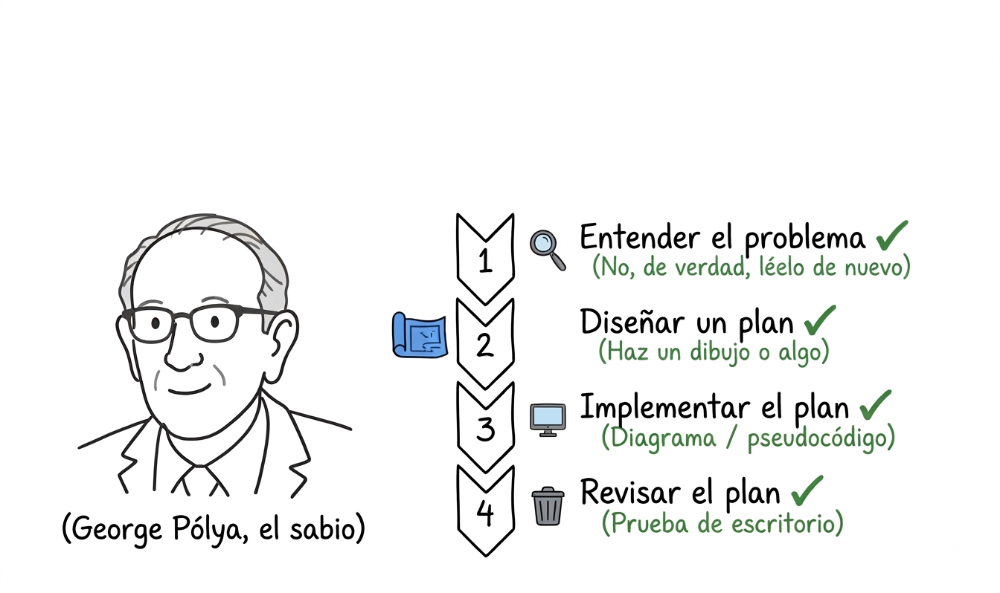
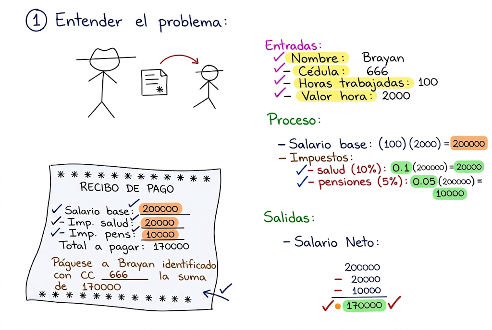
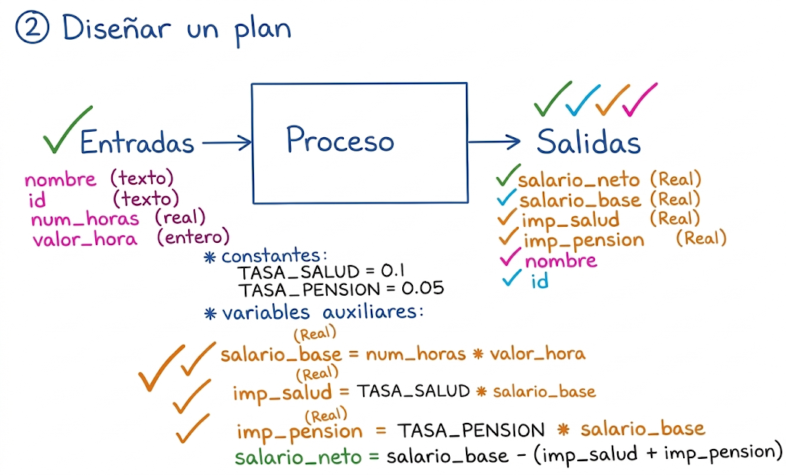
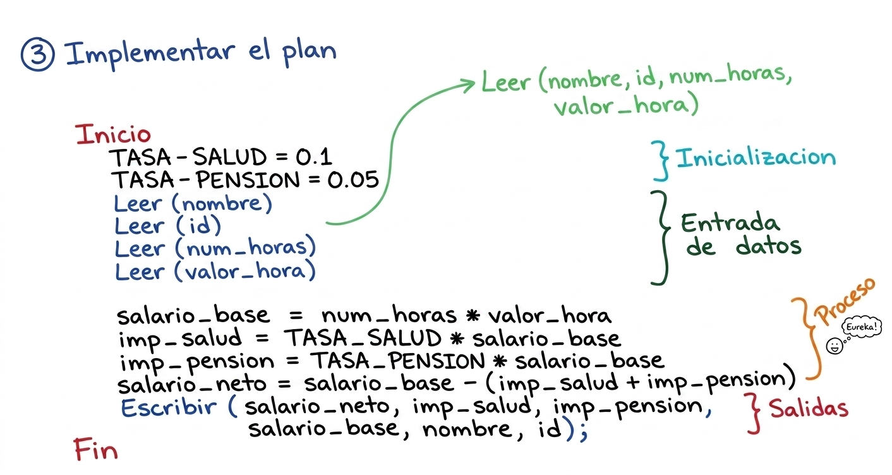
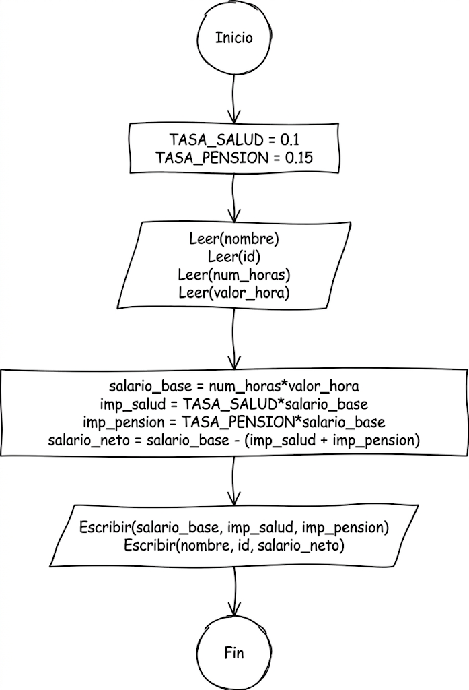
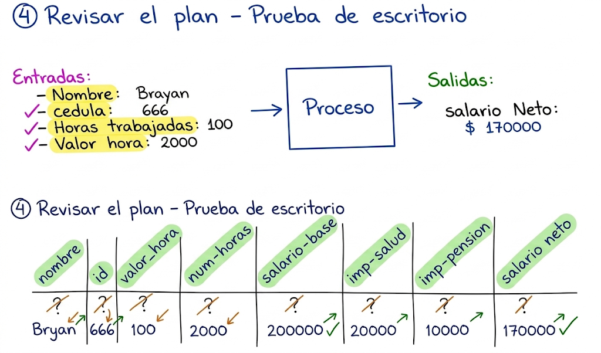

# Sesion magistral 5

* **Tipo**: Virtual.
* **Fecha**: 13/08/2026

Sesión de refuerzo del tema 2 (algoritmos y diagramas de flujo), centrada en resolver un problema completo de cálculo de nómina aplicando los cuatro pasos del **método de Polya**, y en llevar esa solución hasta código Python funcional. También se reforzaron varios conceptos vistos previamente (tipos de dato, constantes, comentarios) y se presentaron dos herramientas de apoyo para el resto del curso. Los apuntes a mano se encuentra en el siguiente [pdf](apuntes_clase5_annotated.pdf)

## El ejercicio: cálculo de nómina con el método de Polya

> Hacer un programa que solicite el nombre, la identificación, el número de horas trabajadas y el valor por hora y realice el cálculo del salario neto teniendo en cuenta que se cobra un impuesto del 10% por salud y un 5% debido a pensiones.

**1. Entender el problema.** Se identificaron las entradas (`nombre`, `id`, `num_horas`, `valor_hora`), la salida principal (`salario_neto`) y las variables auxiliares (`salario_base`, `imp_salud`, `imp_pension`) — se aclaró que estas últimas también terminan mostrándose en la salida. El ejercicio se resolvió primero a mano con un caso concreto (empleado Bryan, cédula 666, 100 horas a $2.000/hora), simulando el recibo de pago: salario base $200.000, impuesto de salud $20.000, impuesto de pensión $10.000, salario neto $170.000.

**2. Diseñar el plan.** Se definieron nombres de variable en `snake_case` y constantes en mayúsculas (`TASA_SALUD = 0.1`, `TASA_PENSION = 0.05`). Sobre los tipos de dato surgió la discusión más relevante de la clase: `num_horas` se decidió como **real (`float`)** y no entero, porque un empleado puede trabajar una fracción de hora (ej. 2.5 horas); `nombre` e `id` como texto; `valor_hora` como entero.

**3. Implementar el plan.** Se tradujo el plan a pseudocódigo (inicialización de constantes, lectura de las cuatro entradas, cálculo de `salario_base`, `imp_salud`, `imp_pension` y `salario_neto`, escritura de resultados) y luego a código Python en Spyder. Se revisó en vivo el código enviado por un estudiante (Jorge Orlando Giraldo Bedoya), corrigiendo nombres de variables y una confusión entre "impuesto de transporte" e "impuesto de pensiones".

**4. Revisar el plan (prueba de escritorio).** Se ejecutó el algoritmo a mano con los valores de ejemplo y se confirmó que el resultado coincidía con el cálculo manual ($170.000). Quedó claro que la prueba de escritorio no necesita incluir todas las variables, solo las que intervienen en los cálculos — y que es de carácter **obligatorio en los parciales y laboratorios**, especialmente útil cuando no se tiene acceso a un computador.

La solución completa y autocontenida (plantilla diligenciada, pseudocódigo, diagrama de flujo, código Python, dos casos de prueba con capturas) está en [`ejemplo_clase/`](ejemplo_clase/) — empezar por [`ejemplo_clase/nomina_polya.md`](ejemplo_clase/nomina_polya.md).

## Conceptos reforzados

- **Variables de entrada, salida y auxiliares**: cómo distinguir el rol de cada variable antes de codificar.
- **Tipos de dato en Python**: texto (`str`), entero (`int`) y real (`float`), y el criterio para elegir uno u otro (¿el valor puede tener decimales?).
- **Constantes**: valores fijos definidos al inicio del programa, en mayúsculas por convención, para hacer el código más reutilizable.
- **Python dinámicamente tipado**: no es necesario declarar explícitamente el tipo de cada variable.
- **Comentarios en Python**: `#` para una línea, comillas triples para bloques de documentación (autor, descripción del programa).
- **Buenas prácticas de salida**: uso de `float()` para convertir entradas numéricas y formateo con separadores para simular una colilla de pago real.

## Preguntas resueltas en clase

- **¿El número de horas debería ser entero o real?** Real (`float`): un empleado puede trabajar, por ejemplo, 2.5 horas.
- **¿Hay inconsistencia si las horas trabajadas son un valor bajo, como 1?** No — la fórmula funciona igual para cualquier valor de entrada (1 hora a $2.000 da salario neto $1.700).
- **¿Es obligatorio especificar si una variable es entrada o salida en el pseudocódigo?** Es aceptable no hacerlo explícito, siempre que el código o diagrama de flujo sea coherente con la lógica del problema.
- **¿Es necesario hacer la prueba de escritorio en el parcial?** Sí, es obligatoria.
- **¿En qué consiste el proyecto de aula?** Un programa que integre lo visto en el curso, probablemente en parejas; los detalles se definirán más adelante.

## Herramientas y recursos mencionados

- **[Python Tutor](https://pythontutor.com)**: visualiza paso a paso la ejecución de un programa Python — útil para hacer pruebas de escritorio de forma interactiva. El enlace generado para el ejemplo de esta clase está en [`ejemplo_clase/nomina_polya.md`](ejemplo_clase/nomina_polya.md).
- **Draw.io**: recomendado para construir diagramas de flujo (y más adelante diagramas de clases UML y entidad-relación) de forma más profesional.
- **Libro de algoritmos recomendado por el docente**: texto usado durante su pregrado en Ingeniería Electrónica, con ejemplos de algoritmos secuenciales, condicionales y pseudocódigo en un formato similar al de la clase — disponible en `material/libros/` del repositorio.
- **Video "Bobby Tables" (SQL Injection)**: recomendado para reflexionar sobre los riesgos de no validar correctamente las entradas de un programa.
- Se advirtió sobre el **uso excesivo de herramientas de IA** para resolver los ejercicios: las bases de lógica de programación deben construirse de forma sólida desde el primer semestre.

## Próximos pasos anunciados

- Intentar codificar en Python los ejercicios adicionales compartidos por el docente antes de la siguiente clase.
- Próximamente un quiz corto (fecha por definir, después del primer laboratorio).
- El primer parcial quedará agendado aproximadamente 8 días después del primer laboratorio.
- Los dos primeros parciales incluirán pseudocódigo y/o diagramas de flujo; a partir del tema de clases y objetos se trabajará exclusivamente en Python.

## Recursos

| Archivo | Descripción |
|---|---|
| [`ejemplo_clase/`](ejemplo_clase/) | Ejemplo completo y autocontenido del problema de nómina: plantilla de Polya diligenciada, pseudocódigo, diagrama de flujo, código Python y dos casos de prueba con capturas. |
| [`apuntes_clase5_annotated.pdf`](apuntes_clase5_annotated.pdf) | Manuscrito con las anotaciones tomadas en vivo durante la explicación: los cuatro pasos de Polya aplicados al ejemplo, identificación de entradas/salidas/auxiliares, pseudocódigo, tabla de prueba de escritorio y su verificación. |
| [`apuntes_clase5.xopp`](apuntes_clase5.xopp) | Archivo fuente (Xournal++) de las anotaciones anteriores. |
| [`plantilla_metodo_polya_UdeA.pdf`](plantilla_metodo_polya_UdeA.pdf) | Plantilla en blanco del método de Polya usada como formato base (ver también `clases/2/template_polya/`). |
| [`metodo_polya_nomina_UdeA.xopp`](metodo_polya_nomina_UdeA.xopp) | Archivo fuente (Xournal++) de la plantilla diligenciada para el ejercicio de nómina. |
| [`diagrama.drawio`](diagrama.drawio) / [`diagrama.png`](diagrama.png) | Diagrama de flujo del algoritmo de nómina (entrada → proceso → salida). |
| [`test1.png`](test1.png) / [`test2.png`](test2.png) | Capturas de la ejecución del programa con los dos casos de prueba. |

> [!Important]
> Se usó IA generativa para redactar y organizar este contenido a partir del resumen de la sesión y de las notas manuscritas de la clase. El docente revisó y validó la versión final.

