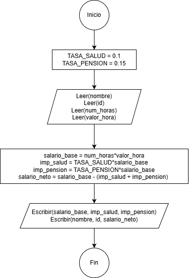

# Ejemplos

1. Hacer un programa que calcule el área y el perímetro de un circulo dado su radio.


   <details>
   <summary><strong>Ver solución</strong></summary>

   ### Planteamiento del algoritmo

   * **Datos de entrada**

     | Nombre de la variable | Tipo de dato | Descripción |
     |---|---|---|
     | `` | `` | |

   * **Datos de salida**

     | Nombre de la variable | Tipo de dato | Descripción |
     |---|---|---|
     | `` | `` | |

   * **Variables auxiliares**

     | Nombre de la variable | Tipo de dato | Descripción |
     |---|---|---|
     | `` | `` | |

   * **Constantes (si aplica)**

     | Nombre de la variable | Tipo de dato | Descripción |
     |---|---|---|
     | `` | `` | |

   * **Fórmula(s) o relación matemática**

     ```
     
     ```

   ### Diagrama de flujo

   

   ### Pseudocódigo

   ```
   Inicio
      
   Fin
   ```

   </details>


2. Hacer un programa que solicite el nombre, la identificación, el número de horas trabajadas y el valor por hora y realice el cálculo del salario neto teniendo en cuenta que se cobra un impuesto del 10% por salud y un 5% debido a pensiones.

   <details>
   <summary><strong>Ver solución</strong></summary>

   ### Planteamiento del algoritmo

   * **Datos de entrada**

     | Nombre de la variable | Tipo de dato | Descripción |
     |---|---|---|
     | `nombre` | `Texto` | Nombre del empleado |
     | `id` | `Texto` | Cédula del empleado |
     | `num_horas` | `Real` | Horas trabajadas por el empleado |
     | `valor_hora` | `Entero` | Valor hora trabajada |

     **Nota**: Las variables `nombre` e `id` se imprimirán a la salida.

   * **Datos de salida**

     | Nombre de la variable | Tipo de dato | Descripción |
     |---|---|---|
     | `salario_neto` | `Real` | Total a pagar al empleado |

   * **Variables auxiliares**

     | Nombre de la variable | Tipo de dato | Descripción |
     |---|---|---|
     | `salario_base` | `Real` | Salario sin deducción de impuestos |
     | `imp_salud` | `Real` | Impuesto de salud (10%) |
     | `imp_pension` | `Real` | Impuesto de pensión (5%) |

     **Nota**: las variables anteriores se usarán también como salida.

   * **Constantes (si aplica)**

     | Nombre de la variable | Tipo de dato | Descripción |
     |---|---|---|
     | `TASA_SALUD = 0.1` | `Real` | Porcentaje de cobro por salud (10%) |
     | `TASA_PENSION = 0.05` | `Real` | Porcentaje de cobro por pensión (5%) |

   * **Fórmula(s) o relación matemática**

     ```
     1. salario_base = num_horas * valor_hora

     2. imp_salud = TASA_SALUD * salario_base

     3. imp_pension = TASA_PENSION * salario_base

     4. salario_neto = salario_base - imp_pension - imp_salud
     ```

   ### Diagrama de flujo

   

   ### Pseudocódigo

   ```
   Inicio
      TASA_SALUD = 0.1
      TASA_PENSION = 0.05
      Leer(nombre)
      Leer(id)
      Leer(num_horas)
      Leer(valor_horas)
      salario_base = num_horas * valor_horas
      imp_salud = TASA_SALUD * sabario_base
      imp_pension = TASA_PENSION * salario_base
      salario_neto = salario_base - (imp_salud + imp_pension)
      Escribir(salario_base, imp_salud, imp_pension)
      Escribir(nombre, id, salario_neto)
   Fin
   ```

   </details>


3. Hacer un programa que pida el nombre y la edad (en años) y retorne un mensaje con el nombre y la edad en días.

   <details>
   <summary><strong>Ver solución</strong></summary>

   ### Planteamiento del algoritmo

   * **Datos de entrada**

     | Nombre de la variable | Tipo de dato | Descripción |
     |---|---|---|
     | `` | `` | |

   * **Datos de salida**

     | Nombre de la variable | Tipo de dato | Descripción |
     |---|---|---|
     | `` | `` | |

   * **Variables auxiliares**

     | Nombre de la variable | Tipo de dato | Descripción |
     |---|---|---|
     | `` | `` | |

   * **Constantes (si aplica)**

     | Nombre de la variable | Tipo de dato | Descripción |
     |---|---|---|
     | `` | `` | |

   * **Fórmula(s) o relación matemática**

     ```
     
     ```

   ### Diagrama de flujo

   

   ### Pseudocódigo

   ```
   Inicio
      
   Fin
   ```

   </details>

4. Hacer un programa que solicite los 2 catetos de un triangulo rectángulo y calcule su hipotenusa.

   <details>
   <summary><strong>Ver solución</strong></summary>

   ### Planteamiento del algoritmo

   * **Datos de entrada**

     | Nombre de la variable | Tipo de dato | Descripción |
     |---|---|---|
     | `` | `` | |

   * **Datos de salida**

     | Nombre de la variable | Tipo de dato | Descripción |
     |---|---|---|
     | `` | `` | |

   * **Variables auxiliares**

     | Nombre de la variable | Tipo de dato | Descripción |
     |---|---|---|
     | `` | `` | |

   * **Constantes (si aplica)**

     | Nombre de la variable | Tipo de dato | Descripción |
     |---|---|---|
     | `` | `` | |

   * **Fórmula(s) o relación matemática**

     ```
     
     ```

   ### Diagrama de flujo

   

   ### Pseudocódigo

   ```
   Inicio
      
   Fin
   ```

   </details>

5. Diseñar un algoritmo que lea dos valores reales y nos muestre los resultados de sumar, restar, dividir y multiplicar dichos números.

   <details>
   <summary><strong>Ver solución</strong></summary>

   ### Planteamiento del algoritmo

   * **Datos de entrada**

     | Nombre de la variable | Tipo de dato | Descripción |
     |---|---|---|
     | `` | `` | |

   * **Datos de salida**

     | Nombre de la variable | Tipo de dato | Descripción |
     |---|---|---|
     | `` | `` | |

   * **Variables auxiliares**

     | Nombre de la variable | Tipo de dato | Descripción |
     |---|---|---|
     | `` | `` | |

   * **Constantes (si aplica)**

     | Nombre de la variable | Tipo de dato | Descripción |
     |---|---|---|
     | `` | `` | |

   * **Fórmula(s) o relación matemática**

     ```
     
     ```

   ### Diagrama de flujo

   

   ### Pseudocódigo

   ```
   Inicio
      
   Fin
   ```

   </details>

6. Si una persona corta sus uñas en promedio una vez por cada 1.5 semanas, dada la edad de una persona calcular cuantas veces ha cortado sus uñas en toda su vida. Adicionalmente, si en cada corte en promedio obtiene 0.5 gramos del material de la uñas cuantos kilos lleva en su existencia.

   <details>
   <summary><strong>Ver solución</strong></summary>

   ### Planteamiento del algoritmo

   * **Datos de entrada**

     | Nombre de la variable | Tipo de dato | Descripción |
     |---|---|---|
     | `` | `` | |

   * **Datos de salida**

     | Nombre de la variable | Tipo de dato | Descripción |
     |---|---|---|
     | `` | `` | |

   * **Variables auxiliares**

     | Nombre de la variable | Tipo de dato | Descripción |
     |---|---|---|
     | `` | `` | |

   * **Constantes (si aplica)**

     | Nombre de la variable | Tipo de dato | Descripción |
     |---|---|---|
     | `` | `` | |

   * **Fórmula(s) o relación matemática**

     ```
     
     ```

   ### Diagrama de flujo

   

   ### Pseudocódigo

   ```
   Inicio
      
   Fin
   ```

   </details>


