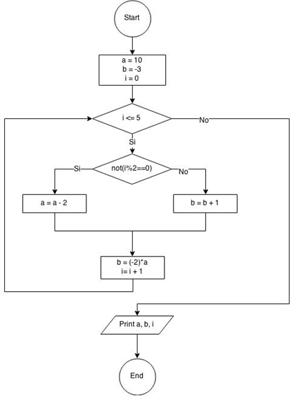

# Sesion magistral 9

* **Tipo**: Presencial
* **Fecha**: 25/08/2026
* **Parte**: Primer bloque de clase (14-16)

Se cubrio el tema de las presentaciones de la teoria sobre condicionales [link](../teoria/)

## 1. Prueba de escritorio

Dado el diagrama de flujo de la figura, hacer la prueba de escritorio y a partir de esta determinar los valores finales de las variables y la salida en pantalla.

### Diagrama de flujo



### Código Python

**Achivo**: [prueba_escritorio.py](prueba_escritorio.py)

```py
a = 10
b = -3
i = 0

while i <= 5:
    if not(i%2 == 0):
        # yes
        a = a - 2
    else:
        # No
        b = b + 1
    b = (-2)*a
    i = i + 1
# Fin ciclo
print(a,b,i)
```

## Ejemplo 1

Moe con el fin de incentivar su negocio organizo una noche de solos y solas. Los precios que fijo fueron de $10000 para los hombres y de la mitad de este valor para las mujeres. Hacer un programa que de acuerdo al sexo de la persona que asista muestre el precio de la entrada al bar de Moe.

### Solución 1

Bug, no funciona miento con letras minusculas asociadas al sexo.

#### Pseudocodigo

```
Inicio
  PRECIO_HOMBRE = 10000
  PRECIO_MUJER = PRECIO_HOMBRE/2
  Leer(sexo)
  Si (sexo == 'M') Entonces    
    precio = PRECIO_HOMBRE
  Sino
    precio = PRECIO_MUJER
  Fin_Si
  Escribir(precio)
Fin
```

####  Código python

**Solución**: [ejemplo1_bar_moe_bug.py](ejemplo1_bar_moe_bug.py)

```py
# Constantea
PRECIO_HOMBRES = 10000
PRECIO_MUJERES = PRECIO_HOMBRES/2

# Entradas
sexo = input("Digite el sexo (M: Hombre / F: Mujer): ")

# Proceso
if sexo == 'M':
    precio = PRECIO_HOMBRES
else:
    precio = PRECIO_MUJERES

# Salidas
print(f"Valor: {precio}")
```

### Solución 2

#### Pseudocodigo

Mejora el problema de la anterior 

```
Inicio
  PRECIO_HOMBRE = 10000
  PRECIO_MUJER = PRECIO_HOMBRE/2
  Leer(sexo)
  Si ((sexo == 'M') or (sexo == 'm')) Entonces    
    precio = PRECIO_HOMBRE
  Sino
    precio = PRECIO_MUJER
  Fin_Si
  Escribir(precio)
Fin
```

**Código**: [ejemplo1_bar_moe_if_else.py](ejemplo1_bar_moe_if_else.py)

```py
# Constantea
PRECIO_HOMBRES = 10000
PRECIO_MUJERES = PRECIO_HOMBRES//2

# Entradas
sexo = input("Digite el sexo (M: Hombre / F: Mujer): ")

# Proceso
if (sexo == 'M') or (sexo == 'm'):
    precio = PRECIO_HOMBRES
else:
    precio = PRECIO_MUJERES

# Salidas
print(f"Valor: {precio}")
```

### Solución 3

Usa un único `if` (sin `else`), inicializando el precio por defecto para hombres y sobrescribiéndolo solo si la persona es mujer.

#### Pseudocodigo

```
Inicio
  PRECIO_HOMBRE = 10000
  PRECIO_MUJER = PRECIO_HOMBRE/2
  precio = PRECIO_HOMBRE
  Leer(sexo)
  Si ((sexo == 'F') or (sexo == 'f')) Entonces
    precio = PRECIO_MUJER
  Fin_Si
  Escribir(precio)
Fin
```

**Código**: [ejemplo1_bar_moe_if.py](ejemplo1_bar_moe_if.py)

```py
# Constantea
PRECIO_HOMBRES = 10000
PRECIO_MUJERES = PRECIO_HOMBRES//2
precio = PRECIO_HOMBRES

# Entradas
sexo = input("Digite el sexo (M: Hombre / F: Mujer): ")

if (sexo == 'F') or (sexo == 'f'):
    precio = PRECIO_MUJERES

# Salidas
print(f"Valor: {precio}")
```

## Ejemplo 2

En una empresa le dan a los empleados un subsidio de transporte si el sueldo base de estos es menor que el salario mínimo ($2000000), este subsidio es el 30% del sueldo base. Hacer un algoritmo que calcule el salario neto de un empleado (sueldo base mas prestaciones si el empleado tiene derecho a estas). Los datos de entrada son la cedula y el sueldo base.

### Solución 1

#### Pseudocodigo

```
Inicio
  SAL_MINIMO = 2000000
  Leer(cedula)
  Leer(sal_base)
  Si (sal_base < SAL_MINIMO) Entonces
    subsidio = 0.3*sal_base
  Sino
    subsidio = 0
  Fin_Si
  sal_neto = sal_base + subsidio
  Escribir(cedula, sal_neto)
Fin
```

**Código**: [ejemplo2_subsidio_if_else.py](ejemplo2_subsidio_if_else.py)

```py
# Constantes
SAL_MINIMO = 2_000_000

# Inicializacion


# Entradas
cedula = input("Digite la cedula: ")
sal_base = float(input("Digite el salario base: "))

# Proceso
if sal_base < SAL_MINIMO:
    subsidio = 0.3*sal_base
else:
    subsidio = 0
    
sal_neto = sal_base + subsidio

# Salidas
print("-----------------------")
print(f"{cedula} recibe ${sal_neto}")
print("-----------------------")
```

### Solución 2

Usa un único `if` (sin `else`), inicializando el subsidio en 0 y sobrescribiéndolo solo si el sueldo base es menor al salario mínimo.

#### Pseudocodigo

```
Inicio
  SAL_MINIMO = 2000000
  subsidio = 0
  Leer(cedula)
  Leer(sal_base)
  Si (sal_base < SAL_MINIMO) Entonces
    subsidio = 0.3*sal_base
  Fin_Si
  sal_neto = sal_base + subsidio
  Escribir(cedula, sal_neto)
Fin
```

**Código**: [ejemplo2_subsidio_if.py](ejemplo2_subsidio_if.py)

```py
# Constantes
SAL_MINIMO = 2_000_000

# Inicializacion
subsidio = 0

# Entradas
cedula = input("Digite la cedula: ")
sal_base = float(input("Digite el salario base: "))

# Proceso
if sal_base < SAL_MINIMO:
    subsidio = 0.3*sal_base

sal_neto = sal_base + subsidio

# Salidas
print("-----------------------")
print(f"{cedula} recibe ${sal_neto}")
print("-----------------------")
```


Aquí tiene el bloque completo, listo para pegar al final del README, después de la Solución 2 del Ejemplo 2:

## Para explorar por su cuenta

*Ideas complementarias basadas en la Lecture 1 de CS50's Introduction to Programming with Python (Harvard). No fueron parte del contenido dictado en esta sesión — se incluyen como material opcional para quien quiera profundizar.*

### ¿Por qué `elif`/`else` y no varios `if` independientes?

En las Soluciones 1 y 2 del Ejemplo 1 se usó `if-else` para decidir entre precio de hombre y precio de mujer. Vale la pena notar que, cuando dos condiciones son mutuamente excluyentes (una persona no puede ser "hombre" y "mujer" a la vez en este modelo), encadenar la segunda opción con `else` es más eficiente que escribir un segundo `if` independiente: el programa evalúa una sola pregunta en vez de dos, sin cambiar el resultado. Es la misma lógica detrás de por qué la Solución 3 (con un único `if` y un valor por defecto) también es válida.

### Simplificar la condición del sexo (idea para más adelante)

La condición `(sexo == 'F') or (sexo == 'f')` funciona bien, pero más adelante, cuando el curso llegue a cadenas de texto, podrá simplificarse a una sola comparación normalizando el valor leído (por ejemplo, convirtiendo la letra a mayúscula antes de compararla). No se resuelve aquí porque todavía no se han visto métodos de cadenas — queda como una idea para retomar en su momento.

### Ejemplo adicional — Paridad de un número

Determinar si un número entero es par o impar usando el operador módulo (`%`), como un tercer caso de `if-else` simple con un contexto puramente numérico.

#### Pseudocodigo

```
Inicio
  Leer(numero)
  Si (numero % 2 == 0) Entonces
    resultado = "Par"
  Sino
    resultado = "Impar"
  Fin_Si
  Escribir(resultado)
Fin
```

#### Código python

```py
# Entradas
numero = int(input("Digite un número entero: "))

# Proceso
if numero % 2 == 0:
    resultado = "Par"
else:
    resultado = "Impar"

# Salidas
print(f"{numero} es {resultado}")
```

### Variante del Ejemplo 2 — subsidio con dos condiciones (`and`)

Extensión del ejemplo del subsidio: además de que el sueldo base sea menor al salario mínimo, se exige una antigüedad mínima de 3 meses en la empresa para tener derecho al subsidio.

#### Pseudocodigo

```
Inicio
  SAL_MINIMO = 2000000
  ANTIGUEDAD_MIN = 3
  Leer(cedula)
  Leer(sal_base)
  Leer(antiguedad_meses)
  Si ((sal_base < SAL_MINIMO) and (antiguedad_meses >= ANTIGUEDAD_MIN)) Entonces
    subsidio = 0.3*sal_base
  Sino
    subsidio = 0
  Fin_Si
  sal_neto = sal_base + subsidio
  Escribir(cedula, sal_neto)
Fin
```

#### Código python

```py
# Constantes
SAL_MINIMO = 2_000_000
ANTIGUEDAD_MIN = 3

# Entradas
cedula = input("Digite la cedula: ")
sal_base = float(input("Digite el salario base: "))
antiguedad_meses = int(input("Digite la antigüedad en meses: "))

# Proceso
if (sal_base < SAL_MINIMO) and (antiguedad_meses >= ANTIGUEDAD_MIN):
    subsidio = 0.3*sal_base
else:
    subsidio = 0

sal_neto = sal_base + subsidio

# Salidas
print("-----------------------")
print(f"{cedula} recibe ${sal_neto}")
print("-----------------------")
```

### Referencias

## Referencia

- Malan, D. (Harvard). *CS50's Introduction to Programming with Python* — [Lecture 1: Conditionals](https://cs50.harvard.edu/python/notes/1/#if-statements).