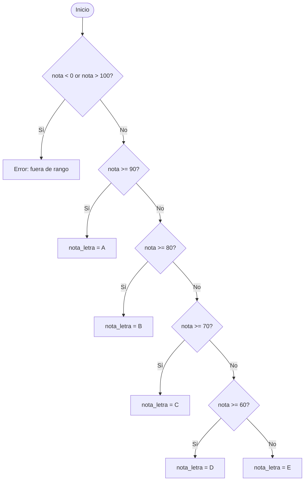

# Sesion magistral 10

* **Tipo**: Presencial
* **Fecha**: 25/08/2026
* **Parte**: Segundo bloque de clase (16-18)

Esta sesión se centra en la implementación de condicionales múltiples: primero se retoma el Ejemplo 1 (bar de Moe) para agregarle validación de entradas inválidas, y luego se introduce el Ejemplo 3 (notas de la primaria de Springfield), donde se explora primero la lógica del condicional con fragmentos de prueba y luego se adapta al programa completo con entrada y salida.

Se cubrio el tema de las presentaciones de la teoria sobre condicionales multiples [link](../teoria/). Para esta clase solo alcanzamos a analizar hasta el ejemplo de la primaria de Sprinfield. El ejemplo 2 de las diapositivas no se analizo (se dejo al estudiante). El ejemplo 4, se dejará para la proxima clase magistral.

## Ejemplo 1

Moe con el fin de incentivar su negocio organizó una noche de solos y solas. Los precios que fijó fueron de $10000 para los hombres y de la mitad de este valor para las mujeres. Hacer un programa que de acuerdo al sexo de la persona que asista muestre el precio de la entrada al bar de Moe. Si se ingresa una letra inválida (que no corresponda a hombre o mujer), el programa debe mostrar un mensaje de error y cobrar el precio correspondiente a los hombres.

#### Pseudocodigo

```
Inicio
  PRECIO_HOMBRE = 10000
  PRECIO_MUJER = PRECIO_HOMBRE/2
  Leer(sexo)
  Si ((sexo == 'M') or (sexo == 'm')) Entonces
    precio = PRECIO_HOMBRE
  Sino
    Si ((sexo == 'F') or (sexo == 'f')) Entonces
      precio = PRECIO_MUJER
    Sino
      Escribir('ERROR: Genero no valido. Se cobra lo normal')
      precio = PRECIO_HOMBRE
    Fin_Si
  Fin_Si
  Escribir(precio)
Fin
```

*Nota: el pseudocódigo anterior aplica a las dos soluciones que siguen — la diferencia entre ellas es únicamente la forma en que se implementa la validación en Python (anidada vs. encadenada con `elif`), no la lógica del algoritmo.*

### Solución 1 (anidada)

**Código**: [ejemplo1_bar_moe_if_anidados.py](ejemplo1_bar_moe_if_anidados.py)

```py
# Constantea
PRECIO_HOMBRES = 10000
PRECIO_MUJERES = PRECIO_HOMBRES//2

#

# Entradas
sexo = input("Digite el sexo (M: Hombre / F: Mujer): ")

# Proceso
if (sexo == 'M') or (sexo == 'm'):
    # Hombre
    precio = PRECIO_HOMBRES
else:
    if (sexo == 'F') or (sexo == 'f'):
        precio = PRECIO_MUJERES
    else:
        print("ERROR: Genero no valido. Se conbra lo normal")
        precio = PRECIO_HOMBRES
# Salidas
print(f"Valor: {precio}")
```

### Solución 2 (`elif`)

**Código**: [ejemplo1_bar_moe_if_elif_else.py](ejemplo1_bar_moe_if_elif_else.py)

```py
# Constantea
PRECIO_HOMBRES = 10000
PRECIO_MUJERES = PRECIO_HOMBRES//2

#

# Entradas
sexo = input("Digite el sexo (M: Hombre / F: Mujer): ")

# Proceso
if (sexo == 'M') or (sexo == 'm'):
    # Hombre
    precio = PRECIO_HOMBRES
elif(sexo == 'F') or (sexo == 'f'):
    # Mujer
    precio = PRECIO_MUJERES
else:
    # Otro
    print("ERROR: Genero no valido. Se conbra lo normal")
    precio = PRECIO_HOMBRES
# Salidas
print(f"Valor: {precio}")
```

## Ejemplo 3

En el bachillerato de Springfield las calificaciones se suelen calcular de acuerdo al siguiente cuadro:

| Grado numérico | Grado en letra |
|---|---|
| Grado mayor o igual a 90 | A |
| Grado menor que 90 pero mayor o igual a 80 | B |
| Grado menor que 80 pero mayor o igual a 70 | C |
| Grado menor que 70 pero mayor o igual a 60 | D |
| Grado menor que 60 | E |

Utilizando esta información, escribir un algoritmo que acepte una calificación numérica del estudiante [0,100], convierta esta calificación a su equivalente letra y visualice la calificación correspondiente en letra.

### Fragmento de prueba (verificación rápida del condicional)

Antes de armar el programa completo, se verifica que la lógica del condicional funcione correctamente usando un valor fijo en vez de `input()`.

**Código**: [test_condicional_nota_anidado.py](test_condicional_nota_anidado.py)

```py
# -*- coding: utf-8 -*-
"""
Created on Tue Aug 25 17:21:24 2026

@author: Soportedrai
"""

nota_num = 82
nota_letra = 'X' # Nota desconocia

if (nota_num < 0) or (nota_num > 100):
    print("ERROR: Nota fuera de rango")
else:
    # rango [0,100]
    if (nota_num >= 90):
        # rango [90,100]
        nota_letra = 'A'
    else:
        if (nota_num >= 80):
            # rango [80,90]
            nota_letra = 'B'
        else:
            if (nota_num >= 70):
                # rango [70,80]
                nota_letra = 'C'
            else:
                if (nota_num >= 60):
                    # rango [60,70]
                    nota_letra = 'D'
                else:
                    # rango [0,60)
                    nota_letra = 'E'

print(nota_letra)
```

**Código**: [test_condicional_nota_if_elif_else.py](test_condicional_nota_if_elif_else.py)

```py
# -*- coding: utf-8 -*-
"""
Created on Tue Aug 25 17:41:10 2026

@author: Soportedrai
"""


nota_num = 101
nota_letra = 'X' # Nota desconocia

if (nota_num < 0) or (nota_num > 100):
    print("ERROR: Nota fuera de rango")
    # rango [0,100]
elif (nota_num >= 90):
    # rango [90,100]
    nota_letra = 'A'
elif (nota_num >= 80):
    # rango [80,90]
    nota_letra = 'B'
elif (nota_num >= 70):
    # rango [70,80]
    nota_letra = 'C'
elif (nota_num >= 60):
    # rango [60,70]
    nota_letra = 'D'
else:
    # rango [0,60)
    nota_letra = 'E'

print(nota_letra)
```

### Programa completo (con entrada y salida)

#### Pseudocodigo

```
Inicio
  NOTA_INVALIDA = 'X'
  nota_letra = NOTA_INVALIDA
  Leer(nota_num)
  Si ((nota_num < 0) or (nota_num > 100)) Entonces
    Escribir('ERROR: Nota fuera de rango')
  Sino
    Si (nota_num >= 90) Entonces
       nota_letra = 'A'
    Sino
       Si (nota_num >= 80) Entonces
          nota_letra = 'B'
       Sino
          Si (nota_num >= 70) Entonces
             nota_letra = 'C'
          Sino
             Si (nota_num >= 60) Entonces
                nota_letra = 'D'
             Sino
                nota_letra = 'E'
             Fin_Si
          Fin_Si
       Fin_Si
    Fin_Si
  Fin_Si
  Si (nota_letra != NOTA_INVALIDA) Entonces
    Escribir(nota_num, " = ", nota_letra)
  Fin_Si
Fin
```

*Nota: el pseudocódigo anterior aplica a las dos soluciones que siguen — igual que en el Ejemplo 1, la diferencia entre ellas es solo la forma de implementar la cascada de condiciones en Python (anidada vs. encadenada con `elif`).*

### Solución 1 (anidado completo)

**Código**: [ejemplo3_nota_anidado_completo.py](ejemplo3_nota_anidado_completo.py)

```py
# -*- coding: utf-8 -*-
"""
Created on Tue Aug 25 17:21:24 2026

@author: Soportedrai
"""

# Constantes
NOTA_INVALIDA = 'X'

# Inicialializacion
nota_letra = NOTA_INVALIDA # Nota desconocia

# Entradas
nota_num = int(input("Digite una nota en el rango [0,100]: "))

# Proceso
if (nota_num < 0) or (nota_num > 100):
    print("ERROR: Nota fuera de rango")
else:
    # rango [0,100]
    if (nota_num >= 90):
        # rango [90,100]
        nota_letra = 'A'
    else:
        if (nota_num >= 80):
            # rango [80,90]
            nota_letra = 'B'
        else:
            if (nota_num >= 70):
                # rango [70,80]
             nota_letra = 'C'
            else:
                if (nota_num >= 60):
                    # rango [60,70]
                    nota_letra = 'D'
                else:
                    # rango [0,60)
                    nota_letra = 'E'
                    
if nota_letra != NOTA_INVALIDA:
    print(f"{nota_num} = {nota_letra}")
```

### Solución 2 (`elif`)

**Código**: [ejemplo3_nota_if_elif_else.py](ejemplo3_nota_if_elif_else.py)

```py
# Constantes
NOTA_INVALIDA = 'X'

# Inicialializacion
nota_letra = NOTA_INVALIDA # Nota desconocia

# Entradas
nota_num = int(input("Digite una nota en el rango [0,100]: "))

# Proceso

if (nota_num < 0) or (nota_num > 100):
    print("ERROR: Nota fuera de rango")
    # rango [0,100]
elif (nota_num >= 90):
    # rango [90,100]
    nota_letra = 'A'
elif (nota_num >= 80):
    # rango [80,90]
    nota_letra = 'B'
elif (nota_num >= 70):
    # rango [70,80]
    nota_letra = 'C'
elif (nota_num >= 60):
    # rango [60,70]
    nota_letra = 'D'
else:
    # rango [0,60)
    nota_letra = 'E'

if nota_letra != NOTA_INVALIDA:
    print(f"{nota_num} = {nota_letra}")
```

## Para explorar por su cuenta

*Ideas complementarias basadas en la Lecture 1 de CS50's Introduction to Programming with Python (Harvard). No fueron parte del contenido dictado en esta sesión — se incluyen como material opcional para quien quiera profundizar.*

### ¿Por qué las Soluciones 1 y 2 del Ejemplo 3 dan el mismo resultado con distinta eficiencia?

Las dos soluciones del Ejemplo 3 (anidada y con `elif`) implementan exactamente la misma lógica de clasificación por rangos, y es el mismo tipo de comparación que se usa para justificar el uso de `elif` en vez de varios `if` independientes: cuando el primer `elif` resulta verdadero, ninguno de los siguientes se evalúa, mientras que en la versión anidada cada nivel depende de haber entrado al `else` del nivel anterior. El resultado final (`nota_letra`) es idéntico en ambas — lo que cambia es cuántas condiciones evalúa el programa en el peor y en el mejor caso. Vale la pena notar que esta es la misma relación que ya vieron entre la Solución 1 (anidada) y la Solución 2 (`elif`) del Ejemplo 1 (bar de Moe), solo que aquí con más de dos ramas.

### Diagramas de flujo: anidado vs. `elif`

Visualizando la cascada de decisiones del Ejemplo 3, la diferencia estructural entre ambas soluciones se aprecia más claramente:

**Versión anidada (Solución 1):**


**Versión `elif` (Solución 2):**



*Nota: el flujo de decisiones es idéntico entre ambas versiones — la diferencia real está en el código (anidamiento de bloques `if-else` vs. cadena plana de `elif`), no en la lógica del algoritmo en sí. Ambos diagramas se ven iguales a propósito, para ilustrar precisamente ese punto: cambiar de anidado a `elif` no altera qué decide el programa, solo cómo se expresa en el código.*

### Referencia

- Malan, D. (Harvard). *CS50's Introduction to Programming with Python* — [Lecture 1: Conditionals](https://cs50.harvard.edu/python/notes/1/#if-statements).


> [!Important]
> Se usó IA generativa para redactar y organizar este contenido a partir del material de la clase. El docente revisó y validó la versión final.