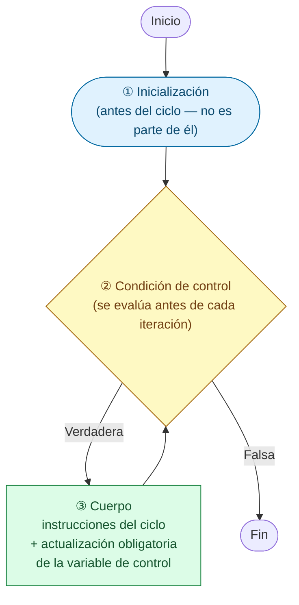
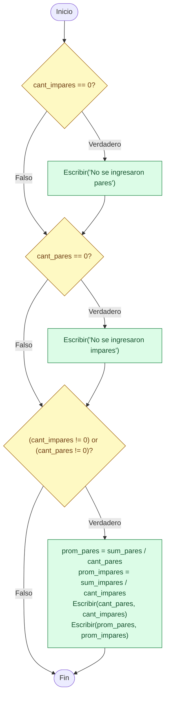
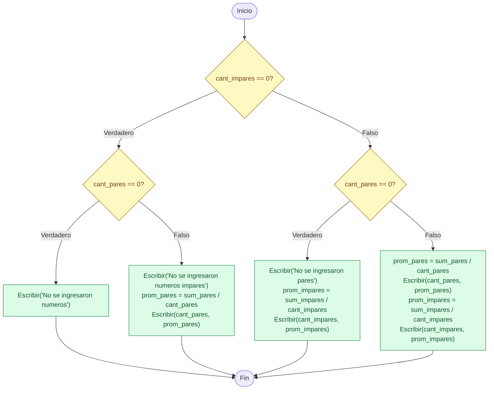

# Sesion magistral 13

* **Tipo**: Presencial
* **Fecha**: 08/09/2026
* **Parte**: Primer bloque de clase (16-18)

## Resumen

Continuando la introducción a ciclos de las diapositivas de la clase [(teoría)](../teoria/), esta sesión formaliza los tres componentes de un ciclo `Mientras`/`while` (inicialización, condición de control y cuerpo con actualización obligatoria), y los repasa con seis casos que exploran la frontera de la condición, el orden de las instrucciones dentro del cuerpo y el riesgo de un ciclo infinito. Sobre esa base se introducen los tipos de variables de apoyo en ciclos (variable de control, contador, acumulador, bandera, centinela) mediante un programa que clasifica números pares e impares, calculando su cantidad y su promedio. El programa se construye y se depura en vivo: una prueba de escritorio revela un bug de división por cero en la validación de "no hay pares/impares", que se corrige primero con `if` anidados y luego se reescribe con `if-elif-else` para evitar el anidamiento.

## Parte 1

### Marco teórico: Componentes de un ciclo

Antes de continuar, conviene fijar el vocabulario con el que se nombra cada parte de un ciclo `Mientras`/`while`. Todo ciclo controlado por condición tiene tres componentes, sin importar si se mira como diagrama de flujo, pseudocódigo o código Python:



1. **① Inicialización** — se ejecuta una sola vez, *antes* de entrar al ciclo. No es parte del ciclo: por eso nunca vuelve a ejecutarse en ninguna iteración.
2. **② Condición de control (o parada)** — se evalúa antes de cada iteración, incluida la primera. Mientras sea verdadera, el cuerpo se ejecuta; en el instante en que es falsa, el ciclo termina.
3. **③ Cuerpo** — instrucciones que se repiten en cada iteración. Debe incluir, obligatoriamente, la actualización de la variable de control: si falta, o está mal ubicada dentro del cuerpo, la condición nunca cambia (ciclo infinito) o cambia en el momento equivocado (como el off-by-one visto en `hola_ciclos`).

Estos tres componentes se ven exactamente igual en las tres representaciones que se usan en el curso:

| Componente | Diagrama de flujo | Pseudocódigo | Python |
|---|---|---|---|
| ① Inicialización | Bloque antes de llegar al rombo | Instrucción antes de `Mientras` | Instrucción antes de `while` |
| ② Condición de control | Rombo de decisión | `Mientras (condición) Entonces` | `while (condición):` |
| ③ Cuerpo (con actualización) | Bloques dentro del ciclo, antes de volver al rombo | Entre `Mientras` y `Fin_Mientras` | Cuerpo indentado del `while` |

### Casos de repaso — frontera de la condición y componentes del ciclo

#### Caso 1

<table>
<tr><th>Pseudocódigo</th><th>Python</th></tr>
<tr><td>

```
Inicio
  i = 0
  Mientras i < 3 Haga
    Escriba(i)
    i = i + 1
  Fin_Mientras
Fin
```

</td><td>

```python
i = 0
while i < 3:
    print(i)
    i = i + 1
```

</td></tr>
</table>

|`i`|`i < 3`|`Escriba(i)`|
|---|---|---|
|~~0~~|~~Verdadera~~|~~0~~|
|~~1~~|~~Verdadera~~|~~1~~|
|~~2~~|~~Verdadera~~|~~2~~|
|**3**|**Falsa**|**—**|

**Salida esperada** (el cuerpo se ejecuta 3 veces):

```
0
1
2
```

#### Caso 2

<table>
<tr><th>Pseudocódigo</th><th>Python</th></tr>
<tr><td>

```
Inicio
  i = 1
  Mientras i <= 3 Haga
    Escriba(i)
    i = i + 1
  Fin_Mientras
Fin
```

</td><td>

```python
i = 1
while i <= 3:
    print(i)
    i = i + 1
```

</td></tr>
</table>

|`i`|`i <= 3`|`Escriba(i)`|
|---|---|---|
|~~1~~|~~Verdadera~~|~~1~~|
|~~2~~|~~Verdadera~~|~~2~~|
|~~3~~|~~Verdadera~~|~~3~~|
|**4**|**Falsa**|**—**|

**Salida esperada** (también 3 valores, pero desplazados respecto al Caso 1: al cambiar simultáneamente la inicialización (0→1) y el operador (`<`→`<=`), el rango recorrido se corre una unidad):

```
1
2
3
```

#### Caso 3

<table>
<tr><th>Pseudocódigo</th><th>Python</th></tr>
<tr><td>

```
Inicio
  i = 0
  Mientras i < 3 Haga
    i = i + 1
    Escriba(i)
  Fin_Mientras
Fin
```

</td><td>

```python
i = 0
while i < 3:
    i = i + 1
    print(i)
```

</td></tr>
</table>

|`i` (al evaluar la condición)|`i < 3`|`Escriba(i)`|
|---|---|---|
|~~0~~|~~Verdadera~~|~~1~~|
|~~1~~|~~Verdadera~~|~~2~~|
|~~2~~|~~Verdadera~~|~~3~~|
|**3**|**Falsa**|**—**|

**Salida esperada** (mismas 3 iteraciones que el Caso 1 — misma inicialización y misma condición — pero corrida una unidad porque `i = i + 1` ocurre **antes** de `Escriba(i)`: se imprime el valor ya actualizado. Es el mismo mecanismo del off-by-one visto en `hola_ciclos`):

```
1
2
3
```

#### Caso 4

<table>
<tr><th>Pseudocódigo</th><th>Python</th></tr>
<tr><td>

```
Inicio
  i = 0
  Mientras i < 3 Haga    
    Escriba(i)
  Fin_Mientras
Fin
```

</td><td>

```python
i = 0
while i < 3:
    print(i)
# Ojo: falta actualizar i -> ciclo infinito
# (no ejecutar tal cual)
```

</td></tr>
</table>

|`i`|`i < 3`|`Escriba(i)`|
|---|---|---|
|~~0~~|~~Verdadera~~|~~0~~|
|~~0~~|~~Verdadera~~|~~0~~|
|~~0~~|~~Verdadera~~|~~0~~|
|...|...|...|

**Salida esperada:** el ciclo nunca termina — a `i` le falta la actualización, viola el componente ③ de la teoría:

```
0
0
0
0
...
```

#### Caso 5

<table>
<tr><th>Pseudocódigo</th><th>Python</th></tr>
<tr><td>

```
Inicio
  i = 10
  Mientras i >= 0 Haga    
    Escriba(i)
    i = i - 3
  Fin_Mientras
Fin
```

</td><td>

```python
i = 10
while i >= 0:
    print(i)
    i = i - 3
```

</td></tr>
</table>

|`i`|`i >= 0`|`Escriba(i)`|
|---|---|---|
|~~10~~|~~Verdadera~~|~~10~~|
|~~7~~|~~Verdadera~~|~~7~~|
|~~4~~|~~Verdadera~~|~~4~~|
|~~1~~|~~Verdadera~~|~~1~~|
|**-2**|**Falsa**|**—**|

**Salida esperada** (`i` nunca llega exactamente a 0: la condición se vuelve falsa al saltar de 1 a -2, porque el paso del decremento (`-3`) no "calza" con el límite de la condición):

```
10
7
4
1
```

#### Caso 6

<table>
<tr><th>Pseudocódigo</th><th>Python</th></tr>
<tr><td>

```
Inicio
  i = 100
  Mientras i > 0 Haga    
    Escriba(i)
    i = i//3
  Fin_Mientras
Fin
```

</td><td>

```python
i = 100
while i > 0:
    print(i)
    i = i // 3
```

</td></tr>
</table>

|`i`|`i > 0`|`Escriba(i)`|
|---|---|---|
|~~100~~|~~Verdadera~~|~~100~~|
|~~33~~|~~Verdadera~~|~~33~~|
|~~11~~|~~Verdadera~~|~~11~~|
|~~3~~|~~Verdadera~~|~~3~~|
|~~1~~|~~Verdadera~~|~~1~~|
|**0**|**Falsa**|**—**|

**Salida esperada** (a diferencia del Caso 5, `i` sí llega exactamente a 0 porque la división entera (`//`) siempre converge a 0):

```
100
33
11
3
1
```

> [!TIP]
> ### Lecciones que deja la práctica con ciclos
>
> - Antes de escribir el cuerpo, hay que poder responder sin dudar dos preguntas: ¿en qué valor arranca la variable de control?, y ¿en qué valor exacto se supone que debe parar? Si no se tiene clara la respuesta, es mejor no seguir escribiendo código todavía.
> - Cuando un ciclo imprime un valor de más o de menos de lo esperado, lo primero que se revisa no es el cuerpo completo, sino dos cosas puntuales: el operador de la condición (`<` no es lo mismo que `<=`) y el momento exacto —antes o después de la actualización— en que se está mirando esa variable.
> - Nunca hay que asumir que el paso de la actualización va a "aterrizar" justo en el límite de la condición: a veces lo salta por completo, y toca decidir con qué operador se cubre ese caso.
> - Cuando un programa se queda pegado sin responder, lo primero que se busca es la línea que actualiza la variable de control. Si no aparece en el cuerpo, o quedó en un lugar donde nunca se ejecuta, ahí está el problema — no más allá.
> - El orden de las instrucciones dentro del cuerpo no es un detalle de estilo: decide qué valor se ve en cada vuelta, aunque el ciclo se repita exactamente el mismo número de veces.
> - Cuando la prueba de escritorio a mano se vuelve difícil de seguir, un truco artesanal es agregar temporalmente un `print` dentro del cuerpo que muestre la variable de control en cada vuelta: se conoce como *print debugging*, y sigue siendo una de las formas más rápidas de confirmar una intuición antes de usar un depurador formal.

## Parte 2

### Teoría relacionada

Tipos de variables de apoyo en ciclos:
* Variable de control
* Contador (`contador = contador + CONSTANTE`)
* Acumulador (se actualiza en cantidad variable)
* Bandera
* Centinela

El siguiente ejemplo estará enfocado en ilustrar los tres primeros conceptos:

### Ejemplo

Realizar un programa que permita ingresar `N` números enteros no negativos (incluido el `0`) por teclado. El programa debe permitir desplegar la siguiente información:

* Cantidad de pares e impares ingresados.
* Promedio de números pares e impares.

El programa debe validar el caso en que no haya números pares o impares.

#### De Polya a la práctica

A medida que se va adquiriendo más pericia en el arte de programar, lo que antes se hacía siguiendo cada paso del método de Polya se va sintetizando. Por ejemplo, para empezar basta con tener muy claro qué se va a almacenar en cada variable:

|Variable|Descripción|Tipo|Observaciones|
|---|---|---|---|
| `cant_pares` | Cantidad de números pares ingresados | Contador (Entera) | No olvidar inicializar |
| `cant_impares` | Cantidad de números impares ingresados | Contador (Entera) | No olvidar inicializar |
| `sum_pares` | Suma de los números pares ingresados | Acumulador (Entera) | No olvidar inicializar |
| `sum_impares` | Suma de los números impares ingresados | Acumulador (Entera) | No olvidar inicializar |
| `i` | Cuenta cuántos números se han leído hasta el momento | Contador, variable de control (Entera) | No olvidar inicializar |
| `N` | Cantidad de números a leer | Entrada (Entera) | No es necesario inicializar porque es una entrada de datos (se pide por teclado) |
| `num` | Número leído en la iteración actual | Entrada (Entera) | Es una entrada de datos, por lo que no se tiene que inicializar |

Con esto claro, podemos empezar a plantear el algoritmo.

Inicialmente vamos a realizar un programa en pseudocódigo enfocado en el proceso realizado dentro del ciclo:

```
Inicio
  cant_pares = 0
  cant_impares = 0
  sum_pares = 0
  sum_impares = 0
  i = 0
  Leer(N)
  Mientras i < N Haga
    Leer(num)
    Si (num % 2 == 0) Entonces
      cant_pares = cant_pares + 1
      sum_pares = sum_pares + num
    Sino
      cant_impares = cant_impares + 1
      sum_impares = sum_impares + num
    Fin_Si
    i = i + 1
  Fin_Mientras
Fin
```

| # | `N` | `num` | `cant_impares` | `cant_pares` | `sum_impares` | `sum_pares` |
|---|---|---|---|---|---|---|
| 1 | 5 | 3, 4, 7, 8, 10 | 2 | 3 | 10 | 22 |
| 2 | 3 | 2, 4, 6 | 0 | 3 | 0 | 12 |
| 3 | 3 | 1, 3, 5 | 3 | 0 | 9 | 0 |
| 4 | 0 | (ninguno) | 0 | 0 | 0 | 0 |
| 5 | 1 | 8 | 0 | 1 | 0 | 8 |
| 6 | 1 | 7 | 1 | 0 | 7 | 0 |
| 7 | 3 | 0, 1, 2 | 1 | 2 | 1 | 2 |
| 8 | 3 | -4, -3, 6 | 1 | 2 | -3 | 2 |

La codificación en Python asociada al pseudocódigo anterior se muestra a continuación; observe el uso de `print` para hacer la prueba de escritorio, evaluando el estado de las variables:

```py
cant_pares = 0
cant_impares = 0
sum_pares = 0
sum_impares = 0
i = 0 
N = int(input("Digite la cantidad de numeros a ingresar: "))
while i < N:
    # print(i)   # Para mirar el estado de i
    num = int(input(f"Ingrese el numero {i + 1}: "))
    if num%2 == 0:
        # Caso numero par
        cant_pares += 1    # cant_pares = cant_pares + 1
        sum_pares += num   # sum_pares = sum_pares + num
    else:
        # Caso numero impar
        cant_impares += 1
        sum_impares += num
    i = i + 1
"""
# Para verificar si los contadores y acumuladores se estaban actualizando correctamente en el ciclo
print(cant_pares, cant_impares, sum_pares, sum_impares)
"""
```

> [!IMPORTANT]
> ### Abreviaturas para contadores y acumuladores
>
> En el código anterior, `cant_pares += 1` es una forma abreviada de `cant_pares = cant_pares + 1`, y `sum_pares += num` lo es de `sum_pares = sum_pares + num`. Esta notación no es exclusiva de Python: la comparten muchos lenguajes derivados de la familia de C (C, C++, Java, JavaScript, C#, entre otros), y sirve exactamente igual para un contador (donde la cantidad sumada es una constante, como `1`) que para un acumulador (donde la cantidad sumada varía en cada iteración, como `num`) — en ambos casos se trata de "sumarle algo a la variable misma". Existen equivalentes para las demás operaciones: `-=`, `*=`, `/=`, `//=`, `%=`, etc.
>
> Un caso particular es el incremento o decremento en exactamente `1`: lenguajes como C, C++ o Java tienen un operador todavía más corto para ese caso específico (`i++`, `i--`), pero Python decidió no incluirlo — por eso, en Python, `i += 1` sigue siendo la forma más corta disponible para ese caso.

#### Desplegando los resultados: validación y promedios

Hasta aquí el ciclo funciona correctamente. Lo que resta es la parte del despliegue de los resultados, según lo que pide el enunciado — para eso puede ser útil agregar nuevas variables:

|Variable|Descripción|Tipo|Observaciones|
|---|---|---|---|
| `prom_pares` | Promedio de los números pares ingresados | Calculada (Real) | No es necesario inicializarla: siempre se calcula antes de usarse |
| `prom_impares` | Promedio de los números impares ingresados | Calculada (Real) | No es necesario inicializarla: siempre se calcula antes de usarse |

```
Inicio
  cant_pares = 0
  cant_impares = 0
  sum_pares = 0
  sum_impares = 0
  i = 0
  Leer(N)
  Mientras i < N Haga
    Leer(num)
    Si (num % 2 == 0) Entonces
      cant_pares = cant_pares + 1
      sum_pares = sum_pares + num
    Sino
      cant_impares = cant_impares + 1
      sum_impares = sum_impares + num
    Fin_Si
    i = i + 1
  Fin_Mientras
  Si cant_impares == 0 Entonces
    Escribir("No se ingresaron pares")
  Fin_Si
  Si (cant_pares == 0) Entonces
    Escribir("No se ingresaron impares")
  Fin_Si
  Si ((cant_impares != 0) or (cant_pares != 0)) Entonces
    prom_pares = sum_pares/cant_pares
    prom_impares = sum_impares/cant_impares
    print(cant_pares, cant_impares)
    print(prom_pares, prom_impares)
  Fin_Si
Fin
```

Nótese que la implementación de la parte que controla lo que se muestra a la salida tiene la siguiente forma:



La implementación en Python del pseudocódigo anterior se muestra a continuación:

**Código**: [numeros.py](numeros.py) — el script tal como quedó guardado tras la sesión conserva, además, un par de rastros de su construcción en vivo que no se muestran arriba: el `# print(i)` (sin el comentario aclaratorio) usado para depurar el conteo de iteraciones, y un pequeño error de tipeo en un comentario (`sum_paresd` en vez de `sum_pares`) que no afecta la ejecución por tratarse solo de un comentario.

```py
cant_pares = 0
cant_impares = 0
sum_pares = 0
sum_impares = 0
i = 0 
N = int(input("Digite la cantidad de numeros a ingresar: "))
while i < N:
    # print(i)   # Para mirar el estado de i
    num = int(input(f"Ingrese el numero {i + 1}: "))
    if num%2 == 0:
        # Caso numero par
        cant_pares += 1    # cant_pares = cant_pares + 1
        sum_pares += num   # sum_pares = sum_pares + num
    else:
        # Caso numero impar
        cant_impares += 1
        sum_impares += num
    i = i + 1

if cant_impares == 0:
    print("No se ingresaron pares")
if cant_pares == 0:
    print("No se ingresaron impares")
if ((cant_impares != 0) or (cant_pares != 0)):
    prom_pares = sum_pares/cant_pares
    prom_impares = sum_impares/cant_impares
    print(cant_pares, cant_impares)
    print(prom_pares, prom_impares)
```

#### Encontrando el bug

Si ejecuta los diferentes casos de prueba, encontrará un bug. Hacer la prueba de escritorio ayuda a saber más exactamente a qué se debe el error, por eso es tan importante. A continuación, una posible solución:

```
Inicio
  ...
  Si cant_impares == 0 Entonces
    Si cant_pares == 0 Entonces
       Escribir("No se ingresaron numeros")
    Sino
       Escribir("No se ingresaron numeros impares")
       prom_pares = sum_pares/cant_pares       
       Escribir(cant_pares, prom_pares)
    Fin_Si       
  Sino  
    Si cant_pares == 0 Entonces
       Escribir("No se ingresaron pares")
       prom_impares = sum_impares/cant_impares       
       Escribir(cant_impares, prom_impares)
    Sino
       prom_pares = sum_pares/cant_pares       
       Escribir(cant_pares, prom_pares)
       prom_impares = sum_impares/cant_impares       
       Escribir(cant_impares, prom_impares)
    Fin_Si       
  Fin_Si
Fin
```

Esta implementación tiene más sentido, ya que cubre las 4 posibilidades sin caer en el error de división por cero. De paso, también corrige el bug de los mensajes cruzados del programa original: aquí "No se ingresaron pares" solo se imprime cuando `cant_pares == 0` de verdad.



La versión en pseudocódigo corregida será la siguiente:

```
Inicio
  cant_pares = 0
  cant_impares = 0
  sum_pares = 0
  sum_impares = 0
  i = 0
  Leer(N)
  Mientras i < N Haga
    Leer(num)
    Si (num % 2 == 0) Entonces
      cant_pares = cant_pares + 1
      sum_pares = sum_pares + num
    Sino
      cant_impares = cant_impares + 1
      sum_impares = sum_impares + num
    Fin_Si
    i = i + 1
  Fin_Mientras
  Si cant_impares == 0 Entonces
    Si cant_pares == 0 Entonces
       Escribir("No se ingresaron numeros")
    Sino
       Escribir("No se ingresaron numeros impares")
       prom_pares = sum_pares/cant_pares       
       Escribir(cant_pares, prom_pares)
    Fin_Si       
  Sino  
    Si cant_pares == 0 Entonces
       Escribir("No se ingresaron pares")
       prom_impares = sum_impares/cant_impares       
       Escribir(cant_impares, prom_impares)
    Sino
       prom_pares = sum_pares/cant_pares       
       Escribir(cant_pares, prom_pares)
       prom_impares = sum_impares/cant_impares       
       Escribir(cant_impares, prom_impares)
    Fin_Si       
  Fin_Si
Fin
```

Ahora en Python, el código anterior queda de la siguiente manera aprovechando la estructura `if-elif-else` para evitar el anidamiento:

```py
cant_pares = 0
cant_impares = 0
sum_pares = 0
sum_impares = 0
i = 0 
N = int(input("Digite la cantidad de numeros a ingresar: "))
while i < N:
    # print(i)   # Para mirar el estado de i
    num = int(input(f"Ingrese el numero {i + 1}: "))
    if num%2 == 0:
        # Caso numero par
        cant_pares += 1    # cant_pares = cant_pares + 1
        sum_pares += num   # sum_pares = sum_pares + num
    else:
        # Caso numero impar
        cant_impares += 1
        sum_impares += num
    i = i + 1

if (cant_impares == 0) and (cant_pares == 0):
    # No se ingresaron numeros
    print("No se ingresaron numeros")
elif cant_pares == 0:
    # Todos los numeros ingresados fueron impares
    print("No se ingresaron pares")
    prom_impares = sum_impares/cant_impares
    print(f"El promedio de los {cant_impares} ingresados fue {prom_impares:.2f}")
elif cant_impares == 0:
    # Todos los numeros ingresados fueron pares
    print("No se ingresaron impares")
    prom_pares = sum_pares/cant_pares
    print(f"El promedio de los {cant_pares} ingresados fue {prom_pares:.2f}")
else:
    # Se ingresaron tanto numeros pares como impares
    prom_pares = sum_pares/cant_pares
    prom_impares = sum_impares/cant_impares
    print(f"El promedio de los {cant_pares} ingresados fue {prom_pares:.2f}")
    print(f"El promedio de los {cant_impares} ingresados fue {prom_impares:.2f}")
```

> [!Important]
> Se usó IA generativa para redactar y organizar este contenido a partir del material de la clase. El docente revisó y validó la versión final.
