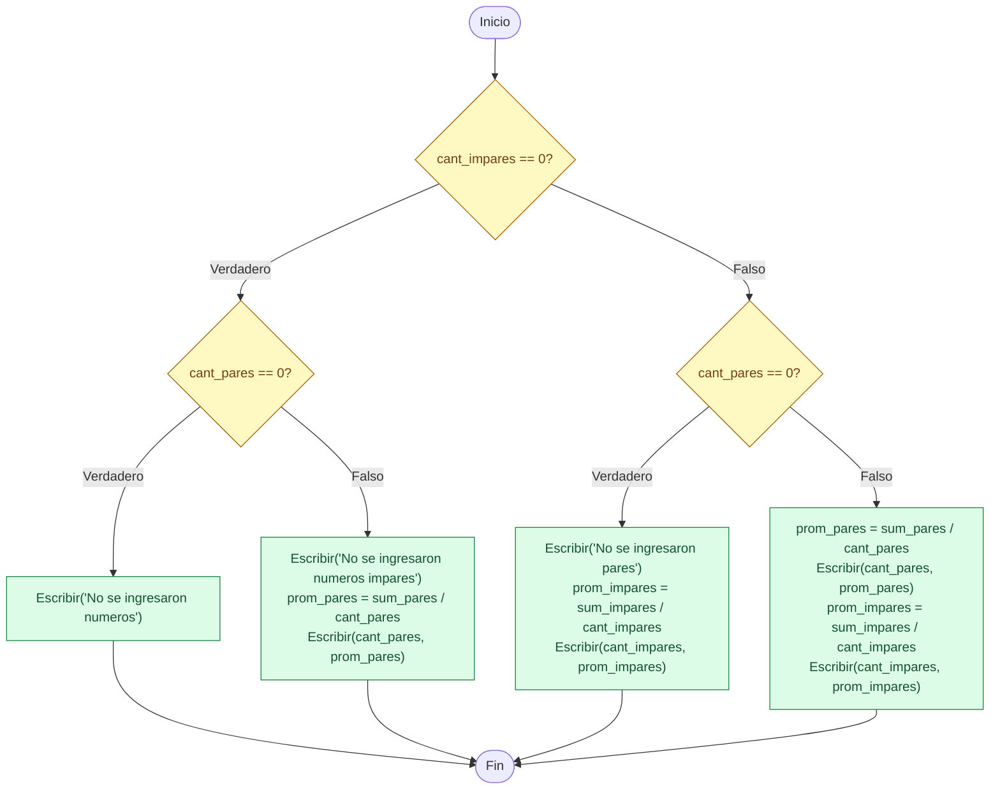
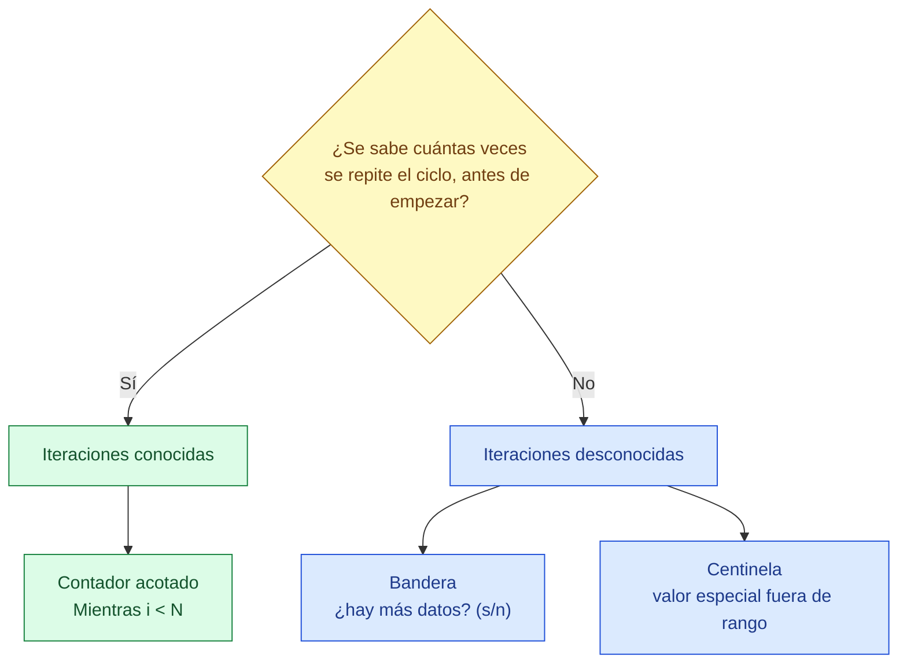
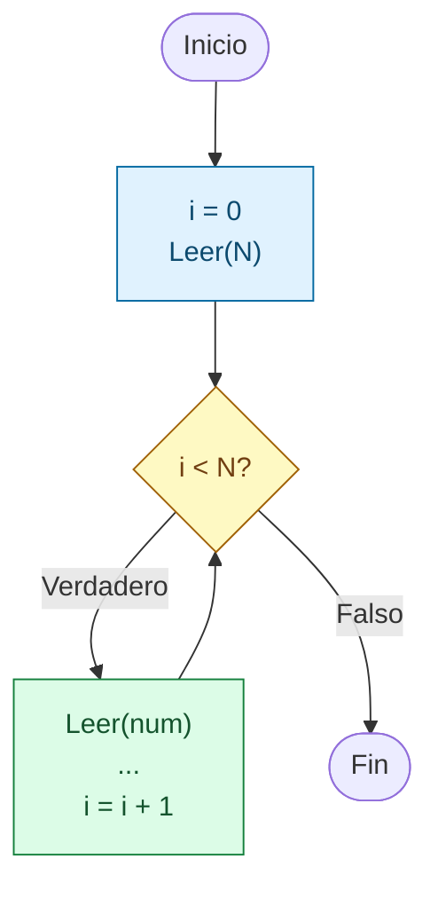
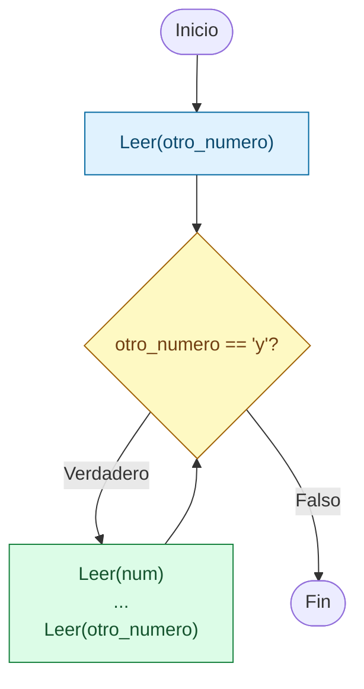
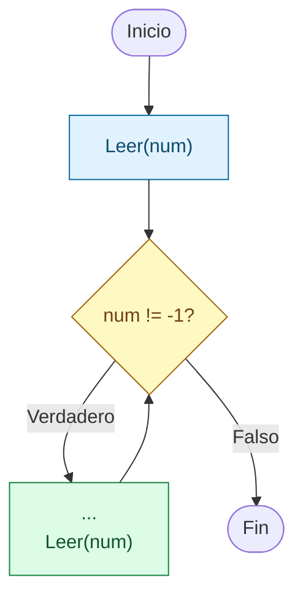

# Sesion magistral 15

* **Tipo**: Presencial
* **Fecha**: 15/09/2026
* **Parte**: Primer bloque de clase (14-16)

## Resumen

Esta sesión es un repaso del ejercicio de conteo y promedio de números pares e impares, planteado originalmente en la [sesión 13](../sesion_magistral-13/README.md): dado un conjunto de `N` números enteros, contar cuántos son pares e impares y calcular el promedio de cada grupo, validando que nunca se calcule un promedio sobre un grupo vacío. La sesión se divide en dos partes independientes:

* **Parte 1** retoma el bloque final de reporte de resultados y compara dos formas de escribirlo en Python: con condicionales anidados y con `elif`.
* **Parte 2** cambia el enfoque hacia el encabezado del ciclo de lectura de los números: el mismo enunciado se resuelve tres veces, usando un contador, una bandera y un centinela para decidir cuándo detener la entrada de datos.

## Parte 1 — Reporte final: anidados vs. `elif`

### Repaso rápido: alternativas en pseudocódigo y Python

Antes de retomar el ejercicio, conviene refrescar cómo se corresponden las estructuras de decisión que se van a usar (revisadas con más detalle en la [teoría de clase 6](../../6/teoria/README.md)):

| Estructura | Pseudocódigo | Python |
|---|---|---|
| Alternativa simple | `Si (condición) Entonces` ... `Fin_Si` | `if condición:` ... |
| Alternativa doble | `Si (condición) Entonces` ... `Sino` ... `Fin_Si` | `if condición:` ... `else:` ... |
| Alternativa múltiple | bloques `Si...Sino` anidados uno dentro de otro (el pseudocódigo del curso no tiene otra forma de expresarlo) | `if`/`else` anidados, o `elif` — dos formas distintas de escribir en Python el mismo anidamiento del pseudocódigo |

**Enunciado**

Realizar un programa que permita ingresar `N` números enteros (mayores o iguales que cero) por teclado. El programa debe permitir desplegar la siguiente información:

* Cantidad de pares e impares ingresados.
* Promedio de números pares e impares.

El planteamiento en pseudocódigo fue el siguiente:

```
Inicio
  cant_pares = 0
  cant_impares = 0
  sum_pares = 0
  sum_impares = 0
  i = 0
  Leer(N)
  Mientras i < N Haga
    Leer(num)
    Si (num % 2 == 0) Entonces
      cant_pares = cant_pares + 1
      sum_pares = sum_pares + num
    Sino
      cant_impares = cant_impares + 1
      sum_impares = sum_impares + num
    Fin_Si
    i = i + 1
  Fin_Mientras
  Si cant_impares == 0 Entonces
    Si cant_pares == 0 Entonces
       Escribir("No se ingresaron numeros")
    Sino
       Escribir("No se ingresaron numeros impares")
       prom_pares = sum_pares/cant_pares       
       Escribir(cant_pares, prom_pares)
    Fin_Si       
  Sino  
    Si cant_pares == 0 Entonces
       Escribir("No se ingresaron pares")
       prom_impares = sum_impares/cant_impares       
       Escribir(cant_impares, prom_impares)
    Sino
       prom_pares = sum_pares/cant_pares       
       Escribir(cant_pares, prom_pares)
       prom_impares = sum_impares/cant_impares       
       Escribir(cant_impares, prom_impares)
    Fin_Si       
  Fin_Si
Fin
```

El bloque final de condicionales anidados, el que se retoma en esta sesión, se puede visualizar así:



Se analizó sobre todo esta parte final, comparando su implementación en Python con condicionales anidados, tal como quedó en [impares_v1.py](codigo/impares_v1.py):

```py
if (cant_impares == 0) and (cant_pares == 0):
    # No se ingresaron numeros
    print("No se ingresaron numeros")
else:
    if cant_pares == 0:
        # Todos los numeros ingresados fueron impares
        print("No se ingresaron pares")
        prom_impares = sum_impares/cant_impares
        print(f"El promedio de los {cant_impares} ingresados fue {prom_impares:.2f}")
    else:
        if cant_impares == 0:
            # Todos los numeros ingresados fueron pares
            print("No se ingresaron impares")
            prom_pares = sum_pares/cant_pares
            print(f"El promedio de los {cant_pares} ingresados fue {prom_pares:.2f}")
        else:
            # Se ingresaron tanto numeros pares como impares
            prom_pares = sum_pares/cant_pares
            prom_impares = sum_impares/cant_impares
            print(f"El promedio de los {cant_pares} ingresados fue {prom_pares:.2f}")
            print(f"El promedio de los {cant_impares} ingresados fue {prom_impares:.2f}")
```

Nótese que del fragmento anterior se pueden identificar 4 posibilidades:

| Caso | `cant_pares` | `cant_impares` | Resultado |
|---|---|---|---|
| 1 | 0 | 0 | "No se ingresaron numeros" |
| 2 | 0 | > 0 | "No se ingresaron pares" + promedio de impares |
| 3 | > 0 | 0 | "No se ingresaron impares" + promedio de pares |
| 4 | > 0 | > 0 | promedio de pares + promedio de impares |

Se realizó la prueba de escritorio con 4 casos, elegidos para poder ver cada una de estas 4 ramas:

| Caso | `N` | Números | `cant_impares` | `cant_pares` | `sum_impares` | `sum_pares` |
|---|---|---|---|---|---|---|
| 1 | 0 | (ninguno) | 0 | 0 | 0 | 0 |
| 2 | 3 | 1, 3, 5 | 3 | 0 | 9 | 0 |
| 3 | 3 | 2, 4, 6 | 0 | 3 | 0 | 12 |
| 4 | 5 | 3, 4, 7, 8, 10 | 2 | 3 | 10 | 22 |

Retomando estos 4 casos, se traza el bloque de anidados tomando `cant_impares`, `sum_impares`, `cant_pares` y `sum_pares` como entradas ya conocidas (las mismas de la tabla anterior), y se deduce de ahí por cuál rama se entra y qué promedios se calculan (`—` donde no se calcula, precisamente para evitar la división por cero):

| Caso | `cant_impares` | `sum_impares` | `cant_pares` | `sum_pares` | `prom_impares` | `prom_pares` |
|---|---|---|---|---|---|---|
| 1 | 0 | 0 | 0 | 0 | — | — |
| 2 | 3 | 9 | 0 | 0 | 3.00 | — |
| 3 | 0 | 0 | 3 | 12 | — | 4.00 |
| 4 | 2 | 10 | 3 | 22 | 5.00 | 7.33 |

El pseudocódigo del curso no cuenta con una estructura equivalente a `elif`: solo permite anidar bloques `Si...Entonces...Sino...Fin_Si`, uno dentro de otro. Por esta razón, el pseudocódigo presentado anteriormente sigue siendo válido para describir la lógica de `v2` — las mismas tres condiciones de la Tabla 1 se evalúan en el mismo orden en ambas versiones, y el cuarto caso ("hay de ambos") no se evalúa explícitamente: es lo que queda por descarte cuando ninguna de las tres condiciones anteriores se cumplió. Lo que cambia entre `v1` y `v2` no es la lógica, sino la forma en que Python organiza esas condiciones en el código.

> [!TIP]
> ### Por qué demasiado anidamiento dificulta la lectura
>
> Cada nivel de anidamiento obliga a recordar, mientras se lee el código, a qué condición pertenece cada `Sino` — entre más profundo el anidamiento, más difícil es rastrear esa relación sin perder el hilo, sobre todo porque en Python no existe un `Fin_Si` explícito: es solo la indentación la que marca dónde empieza y termina cada bloque. En `v1`, el cuarto caso ("hay de ambos") queda a tres niveles de indentación de distancia del primero; en `v2`, las tres condiciones explícitas quedan al mismo nivel, una después de otra, y el `else` final captura ese cuarto caso sin necesidad de evaluarlo. El resultado es idéntico en ambas versiones — lo que cambia es cuánta memoria exige seguir el rastro de los `Sino` anidados para llegar a ese resultado.

| Caso (Tabla 1) | Ubicación en v1 | Ubicación en v2 |
|---|---|---|
| ¿No hay pares ni impares? (evaluado) | primer `if` | primer `if` |
| ¿No hay pares? (evaluado) | `if` dentro del primer `else` | `elif` |
| ¿No hay impares? (evaluado) | `if` dentro del segundo `else` anidado | `elif` |
| Hay de ambos (por descarte, no se evalúa) | `else` más profundo | `else` |

El fragmento correspondiente en Python ([impares_v2.py](codigo/impares_v2.py)) queda así:

```py
if (cant_impares == 0) and (cant_pares == 0):
    # No se ingresaron numeros
    print("No se ingresaron numeros")
elif cant_pares == 0:
    # Todos los numeros ingresados fueron impares
    print("No se ingresaron pares")
    prom_impares = sum_impares/cant_impares
    print(f"El promedio de los {cant_impares} ingresados fue {prom_impares:.2f}")
elif cant_impares == 0:
    # Todos los numeros ingresados fueron pares
    print("No se ingresaron impares")
    prom_pares = sum_pares/cant_pares
    print(f"El promedio de los {cant_pares} ingresados fue {prom_pares:.2f}")
else:
    # Se ingresaron tanto numeros pares como impares
    prom_pares = sum_pares/cant_pares
    prom_impares = sum_impares/cant_impares
    print(f"El promedio de los {cant_pares} ingresados fue {prom_pares:.2f}")
    print(f"El promedio de los {cant_impares} ingresados fue {prom_impares:.2f}")
```

Por eso los resultados de la Tabla 3 no cambian entre versiones: `v1` y `v2` evalúan las mismas tres condiciones explícitas, en el mismo orden, y llegan al mismo cuarto caso por descarte — solo cambia cuánto anidamiento hace falta para expresarlo.

### Conclusiones de la Parte 1

El ejercicio confirma que las 4 ramas identificadas cubren todos los casos posibles sin caer en división por cero — condición necesaria antes de calcular cualquier promedio. El anidamiento (v1) hace explícita la jerarquía de decisiones ("primero pregunto si no hay nada; si hay algo, pregunto qué falta"), lo cual ayuda a razonar el problema paso a paso, pero a costa de una indentación creciente. Reconocer ese patrón es justamente lo que permite aplanarlo con `elif` (v2) sin perder ningún caso.

## Parte 2 — Encabezado del ciclo: contador, bandera y centinela

### Repaso rápido: variables de apoyo y tipos de ciclo

Antes de continuar con el mismo ejercicio de pares/impares, conviene repasar los roles que puede tomar una variable dentro de un ciclo (vistos en detalle en la [teoría de clase 7](../teoria/README.md)):

| Rol | Función | En el ejemplo de pares/impares |
|---|---|---|
| Variable de control | se evalúa en la condición del ciclo para decidir si continúa o se detiene | según la variante: `i` (contador), `otro_numero` (bandera) o `num` (centinela) |
| Contador | cuenta repeticiones; se actualiza en una cantidad constante | `i = i + 1` |
| Acumulador | acumula el resultado de una operación que se repite; se actualiza en una cantidad variable | `sum_pares`, `sum_impares` |
| Bandera | toma dos valores excluyentes; sirve como condición del ciclo o como estado interno | `otro_numero` (`'y'`/`'n'`) |
| Centinela | valor fuera del rango válido de los datos, usado directamente en la condición del ciclo | `num == -1` |

Estos roles no son categorías excluyentes: una misma variable puede cumplir más de uno a la vez. En la variante por contador, `i` es simultáneamente contador y variable de control (aparece en `i = i + 1` y en `i < N`); en la variante por bandera, `otro_numero` es a la vez bandera y variable de control.

Según si el número de iteraciones se conoce o no antes de entrar al ciclo, los problemas con ciclos se clasifican en dos tipos:

* **Iteraciones conocidas**: se sabe de antemano cuántas veces se va a repetir el ciclo (por ejemplo, `N` ya viene dado). Basta un contador acotado, como `i < N`.
* **Iteraciones desconocidas**: no se sabe cuántas veces se va a repetir el ciclo. Hace falta otra forma de decidir cuándo parar — una bandera o un centinela.

El siguiente diagrama resume esa decisión y las dos formas de resolver el caso desconocido:



En esta sesión se retomó el mismo enunciado de pares/impares tres veces, cambiando únicamente el encabezado del ciclo de lectura — contador, bandera y centinela — y reutilizando en las tres el mismo bloque final de reporte (`v2`, con `elif`) analizado en la Parte 1.

En ninguna de las tres variantes que siguen se valida que el número ingresado cumpla el rango del enunciado (`>= 0`): se asume como precondición que el usuario ingresa datos válidos, porque el objetivo de esta sesión es comparar formas de controlar un ciclo, no la validación de entradas.

### Iteraciones conocidas

La forma más simple de encabezar el ciclo es con un contador: se inicializa antes de entrar al ciclo y se actualiza en cada iteración, hasta que la condición de control se vuelve falsa.

```
Inicio
  ...
  i = 0
  Leer(N)
  Mientras i < N Haga
    Leer(num)
    ...
    i = i + 1
  Fin_Mientras
  ...
Fin
```



El código completo está en [impares_v2.py](codigo/impares_v2.py); el fragmento relevante es el siguiente:

```py
# Inicializacion
# Code...
i = 0 # Variable de control 
N = int(input("Digite la cantidad de numeros a ingresar: ")) # Cantidad de numeros a ingresar
while i < N:
    # Ingreso del numero
    num = int(input(f"Ingrese el numero {i + 1}: "))
    # Determinacion si el numero es par o impar
    # Codigo ...    
    i = i + 1 # Actualizacion de la variable de control tipo contador
```

La salida para el mismo caso de prueba usado en la Parte 1 (`N = 5`, números 3, 4, 7, 8, 10) es la siguiente:

```
Digite la cantidad de numeros a ingresar: 5
Ingrese el numero 1: 3
Ingrese el numero 2: 4
Ingrese el numero 3: 7
Ingrese el numero 4: 8
Ingrese el numero 5: 10
El promedio de los 3 ingresados fue 7.33
El promedio de los 2 ingresados fue 5.00
```

Como `N` se conoce desde el inicio, basta un contador (`i`) acotado por `i < N` para controlar el ciclo. El bloque de reporte final no cambió respecto a `v2`: cambiar la forma de decidir cuándo parar el ciclo de lectura no afecta en nada cómo se calculan los promedios.

### Iteraciones desconocidas - Uso de bandera

Si no se sabe de antemano cuántos números va a ingresar el usuario, un contador acotado (`i < N`) ya no sirve como criterio de parada, porque no hay ningún `N` que darle. En su lugar, se puede usar una **bandera**: una variable que se pregunta explícitamente antes de cada iteración para decidir si el ciclo continúa o se detiene. En [impares_v3.py](codigo/impares_v3.py) esa bandera es `otro_numero`, con valores `'y'`/`'n'` — un contador (`i`) todavía puede existir, pero ya no como criterio de parada, sino solo como se ve más abajo: numerando cada solicitud:

```
Inicio
  ...
  Leer(otro_numero)
  Mientras (otro_numero == 'y') Haga
    Leer(num)
    ...
    Leer(otro_numero)
  Fin_Mientras
  ...
Fin
```



El fragmento correspondiente en Python:

```py
otro_numero = input("Desea ingresar un numero (y/n)? ")
while otro_numero == 'y' or otro_numero == 'Y':
    num = int(input(f"Ingrese el numero {i + 1}: "))
    # Determinacion si el numero es par o impar
    # Codigo ...
    i += 1   # i = i + 1
    otro_numero = input("Desea ingresar un numero (y/n)? ")
```

Nótese que aquí `i` ya no es la variable de control del ciclo (ese papel lo tiene la bandera `otro_numero`): es solo un contador auxiliar que numera cada solicitud en el mensaje `Ingrese el numero {i + 1}`, y por eso debe actualizarse dentro del cuerpo aunque no aparezca en la condición del `Mientras`. La salida de ejecución para el mismo caso de prueba usado antes (3, 4, 7, 8, 10) es:

```
Desea ingresar un numero (y/n)? y
Ingrese el numero 1: 3
Desea ingresar un numero (y/n)? y
Ingrese el numero 2: 4
Desea ingresar un numero (y/n)? y
Ingrese el numero 3: 7
Desea ingresar un numero (y/n)? y
Ingrese el numero 4: 8
Desea ingresar un numero (y/n)? y
Ingrese el numero 5: 10
Desea ingresar un numero (y/n)? n
El promedio de los 3 ingresados fue 7.33
El promedio de los 2 ingresados fue 5.00
```

Los promedios finales coinciden exactamente con los de la variante por contador — el bloque de reporte (`elif`) es el mismo en las tres versiones —; lo único que cambia es el encabezado del ciclo.

### Iteraciones desconocidas - Uso de centinela

La otra forma de manejar un número desconocido de iteraciones es un **centinela**: un valor fuera del rango válido de los datos, comparado directamente en la condición del ciclo, sin necesitar una variable adicional (a diferencia de la bandera). En [impares_v4.py](codigo/impares_v4.py) el centinela es `-1`:

```
Inicio
  ...
  Leer(num)
  Mientras (num != -1) Haga
    ...
    Leer(num)
  Fin_Mientras
  ...
Fin
```



El fragmento correspondiente en Python:

```py
num = int(input("Ingrese el numero positivo (-1 para terminar): "))
while num != -1:
    # print(i)   # Para mirar el estado de i
    # Determinacion si el numero es par o impar
    # Codigo ...
    num = int(input("Ingrese el numero positivo (-1 para terminar): "))
```

> [!TIP]
> ### Por qué -1 sí es un centinela válido aquí
>
> Un centinela debe quedar **fuera del rango válido de los datos reales**, para que nunca se confunda con un dato legítimo. El enunciado de esta sesión pide números enteros mayores o iguales que cero, así que ningún dato válido puede ser negativo. Por eso -1 es una elección segura: nunca se puede confundir con un número que el usuario realmente quiera contar.

Con el mismo caso de prueba (3, 4, 7, 8, 10) la salida es:

```
Ingrese el numero positivo (-1 para terminar): 3
Ingrese el numero positivo (-1 para terminar): 4
Ingrese el numero positivo (-1 para terminar): 7
Ingrese el numero positivo (-1 para terminar): 8
Ingrese el numero positivo (-1 para terminar): 10
Ingrese el numero positivo (-1 para terminar): -1
El promedio de los 3 ingresados fue 7.33
El promedio de los 2 ingresados fue 5.00
```

Igual que con la bandera, los promedios coinciden con las otras dos variantes; lo único que cambia es cómo se decide cuándo detener la lectura.

### Conclusiones de la Parte 2

Las tres variantes de esta sesión (contador, bandera, centinela) resuelven el mismo problema y llegan al mismo resultado para los mismos datos de entrada — el bloque final de conteo y promedios no cambia entre ellas. Lo que cambia es únicamente cómo se decide cuándo detener el ciclo de lectura, según qué tanto se conoce de antemano sobre los datos:

* Si el número de datos es conocido (`N`), un contador acotado (`i < N`) es la opción más simple.
* Si no se conoce, hace falta preguntar explícitamente si hay más datos (bandera) o reservar un valor especial dentro de los mismos datos para señalar el final (centinela) — ese valor especial solo es seguro si de verdad queda fuera del rango de los datos válidos, como el `-1` de esta variante, imposible de confundir con un número mayor o igual que cero.

En el fondo, el `Mientras`/`while` sigue siendo exactamente la misma estructura en las tres variantes — lo único que cambia es de dónde sale la información con la que se construye su condición de continuación:

| Estrategia | ¿Cuándo usarla? | Variable de control | Condición típica |
|---|---|---|---|
| Contador | Se conoce de antemano el número de repeticiones | `i` | `i < N` |
| Bandera | Una respuesta explícita del usuario indica si continuar | `otro_numero` | `otro_numero == 'y'` |
| Centinela | Un valor especial, dentro de los mismos datos, señala el final | `num` | `num != -1` |

## Para explorar por su cuenta

*Ideas complementarias basadas en CS50P (Python), CS50x (C) y MIT 6.0001. No fueron parte del contenido dictado en esta sesión — se incluyen como material opcional para quien quiera profundizar.*

### El patrón `while True` + `break`: otra forma de resolver lo mismo que bandera y centinela

La Lecture 2 de CS50P resuelve un problema parecido al de esta sesión — no saber de antemano cuántas veces hace falta pedir un dato — con un patrón distinto al de bandera o centinela:

```py
while True:
    n = int(input("What's n? "))
    if n > 0:
        break
```

*(la línea `for _ in range(n): print("meow")` que sigue en el original usa una sintaxis que este curso todavía no ha visto — lo relevante aquí es solo el `while True` de arriba.)*

Las notas lo explican así: *"At first glance, this `while` loop would appear to run forever, because `True` is always `True`. But when `n` is greater than `0`, the loop breaks."*

Es la misma idea de ruptura de ciclos vista en la teoría de esta clase (`break` para salir apenas se cumple una condición interna), pero aplicada aquí a **validar una entrada** en vez de a **terminar una lectura repetida**: el ciclo se repite hasta que el dato es válido, y `break` corta apenas eso ocurre. Ninguna de las variantes de esta sesión usa este patrón — tanto `impares_v3.py` como `impares_v4.py` preguntan la condición al inicio de cada vuelta (`Mientras (otro_numero == 'y')`, `Mientras (num != -1)`) en vez de usar `Mientras (Verdadero)` con una ruptura interna —, pero cualquiera de las dos podría reescribirse así; queda como ejercicio para quien quiera comparar ambas formas.

### El `do-while` de CS50x y el `Haga` que se viene

Tanto la variante por bandera como la de centinela repiten la misma instrucción `Leer` en dos lugares del pseudocódigo — una vez antes de entrar al ciclo, y otra vez al final del cuerpo —, porque el pseudocódigo del curso solo cuenta con `Mientras...Haga...Fin_Mientras`, que revisa la condición *antes* de la primera vuelta. La teoría de esta clase anuncia como próximo tema una estructura que sí ejecuta el cuerpo al menos una vez antes de revisar la condición: `Haga...Mientras` (equivalente al `do-while` de otros lenguajes).

CS50x muestra ese mismo `do-while` en C, resolviendo el problema de leer un dato hasta que sea válido sin tener que escribir la lectura dos veces:

```c
int n;
do
{
    n = get_int("What's n? ");
}
while (n < 0);
```

Las notas explican: *"Notice that the `do` will always run at least once. That portion of code will loop while `n` is less than zero."* Cuando el curso vea `Haga`, vale la pena volver a esta sesión y reescribir `impares_v4.py` con esa estructura, para comparar cuánto se simplifica el pseudocódigo al no tener que repetir el `Leer`.

### Referencia

- Malan, D. (Harvard). *CS50's Introduction to Programming with Python* — [Lecture 2: Loops](https://cs50.harvard.edu/python/notes/2/).
- Malan, D. (Harvard). *CS50 Introduction to Computer Science* — [Lecture 1: C — Loops and `meow.c`](https://cs50.harvard.edu/x/notes/1/#loops-and-meowc).
- Bell, A. (MIT). *6.0001 Introduction to Computer Science and Programming in Python* — [Lecture 2: Branching and Iteration](https://ocw.mit.edu/courses/6-0001-introduction-to-computer-science-and-programming-in-python-fall-2016/resources/lecture-2-branching-and-iteration/).

> [!Important]
> Se usó IA generativa para redactar y organizar este contenido a partir del material de la clase. El docente revisó y validó la versión final.