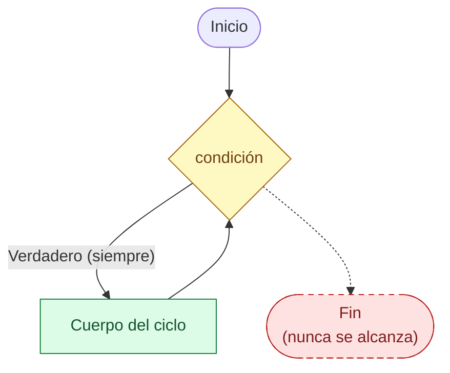
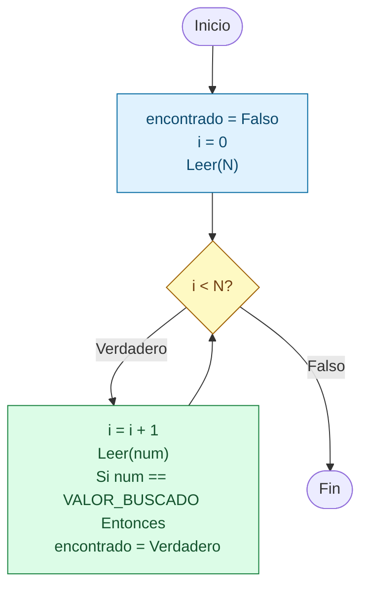
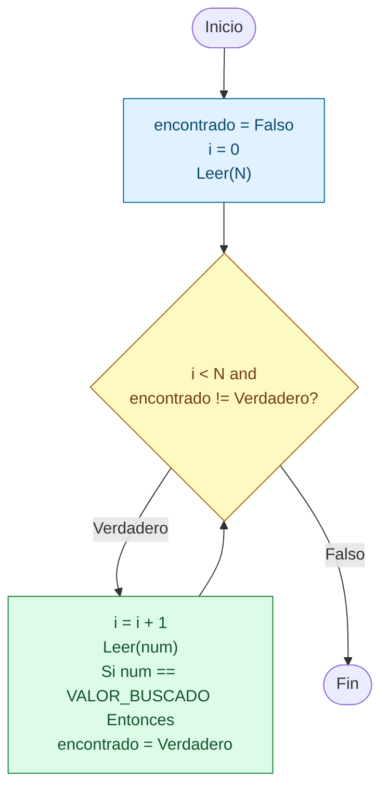
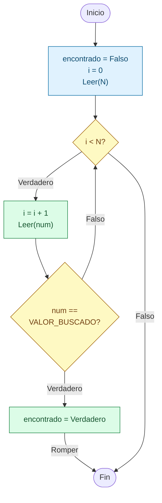

# Sesion magistral 16

* **Tipo**: Presencial
* **Fecha**: 15/09/2026
* **Parte**: Segundo bloque de clase (16-18)

## Resumen

Esta sesión cierra el bloque de ciclos de la clase 7 retomando tres ideas de la teoría y profundizándolas con ejemplos ejecutables, a partir de los scripts en `codigo/`. Se organiza en tres partes:

* **Parte 1** retoma un aparte ya señalado en la [sesión 13](../sesion_magistral-13/README.md#casos-de-repaso--frontera-de-la-condición-y-componentes-del-ciclo) — el orden de las instrucciones dentro del cuerpo de un ciclo — usando como base el bloque activo de [`ciclos_infinitos.py`](codigo/ciclos_infinitos.py) (suma de los enteros de 1 a 3).
* **Parte 2** trabaja los cuatro bloques comentados de ese mismo script para mostrar distintas formas de escribir, a propósito, un ciclo infinito en Python.
* **Parte 3** retoma el Ejemplo 8 de la [teoría](../teoria/#contenido-cubierto) (buscar un cero entre `N` números) y agrega, antes de las dos soluciones ya vistas allí, un tercer caso que evidencia el problema que ambas resuelven: qué pasa si el ciclo nunca se rompe.

**Contenido de esta página:**

* [Parte 1 — Orden de las instrucciones dentro del ciclo](#parte-1--orden-de-las-instrucciones-dentro-del-ciclo)
* [Parte 2 — Ciclos infinitos](#parte-2--ciclos-infinitos)
* [Parte 3 — Ruptura de ciclos](#parte-3--ruptura-de-ciclos)
* [Para explorar por su cuenta](#para-explorar-por-su-cuenta)

## Parte 1 — Orden de las instrucciones dentro del ciclo

### Repaso rápido: por qué el orden importa

Se retoma una idea ya señalada en la [sesión 13](../sesion_magistral-13/README.md#casos-de-repaso--frontera-de-la-condición-y-componentes-del-ciclo): cuando el cuerpo de un ciclo tiene varias instrucciones que usan la misma variable, el orden en que aparecen no es un detalle de estilo — decide qué valor se usa en cada vuelta. El ejemplo de esta parte suma los números de `1` a `3`, pero el cuerpo tiene **dos** instrucciones (`i = i + 1` y `suma = suma + i`), y a continuación se comparan las dos formas de ordenarlas.

### Caso 1 — código original: `i` se actualiza antes que `suma`

<table>
<tr><th>Pseudocódigo</th><th>Python</th></tr>
<tr><td>

```
Inicio
  i = 1
  suma = 0
  Mientras (i <= 3) Haga
    i = i + 1
    suma = suma + i
  Fin_Mientras
  Escribir('La suma es: ', suma)
Fin
```

</td><td>

```python
i = 1
suma = 0
while i <= 3:
    i += 1
    suma += i

print("La suma es: " + str(suma))
```

</td></tr>
</table>

|`i`|`suma`|`i <= 3`|
|---|---|---|
|~~1~~|~~0~~|~~Verdadera~~|
|~~2~~|~~2~~|~~Verdadera~~|
|~~3~~|~~5~~|~~Verdadera~~|
|**4**|**9**|**Falsa**|

**Código**: bloque activo (sin comentar) de [ciclos_infinitos.py](codigo/ciclos_infinitos.py).

**Salida esperada**: como `i` ya quedó incrementado antes de sumarse, `suma` acumula los valores 2, 3 y 4 (2+3+4 = 9):

```
La suma es: 9
```

### Caso 2 — orden invertido: `suma` se actualiza antes que `i`

<table>
<tr><th>Pseudocódigo</th><th>Python</th></tr>
<tr><td>

```
Inicio
  i = 1
  suma = 0
  Mientras (i <= 3) Haga
    suma = suma + i
    i = i + 1
  Fin_Mientras
  Escribir('La suma es: ', suma)
Fin
```

</td><td>

```python
i = 1
suma = 0
while i <= 3:
    suma += i
    i += 1

print("La suma es: " + str(suma))
```

</td></tr>
</table>

|`i`|`suma`|`i <= 3`|
|---|---|---|
|~~2~~|~~1~~|~~Verdadera~~|
|~~3~~|~~3~~|~~Verdadera~~|
|**4**|**6**|**Falsa**|

**Código**: variante hipotética — no está en el script; se obtiene invirtiendo el orden de las dos instrucciones del Caso 1.

**Salida esperada**: aquí `suma` toma el valor de `i` **antes** de incrementarlo, así que acumula 1, 2 y 3 (1+2+3 = 6):

```
La suma es: 6
```

### Conclusiones de la Parte 1

Ambas versiones inicializan igual (`i = 1`, `suma = 0`), usan la misma condición (`i <= 3`) y ejecutan el cuerpo exactamente 3 veces — pero el resultado final cambia (9 contra 6) solo por el orden de las dos instrucciones dentro del ciclo:

* **Caso 1** (`i` primero): en cada vuelta se suma el valor de `i` *ya incrementado*, así que `suma` termina acumulando 2 + 3 + 4.
* **Caso 2** (`suma` primero): en cada vuelta se suma el valor de `i` *todavía sin incrementar*, así que `suma` termina acumulando 1 + 2 + 3.

> [!NOTE]
> ### ¿Qué es un "off-by-one"?
>
> "Off-by-one" (literalmente, *desviado por uno*) es el nombre en inglés — sin una traducción fija al español, se suele dejar tal cual o llamarlo "error de conteo corrido en uno" — de un error en el que un ciclo termina ejecutándose exactamente una vez de más o una vez de menos de lo esperado, o un valor queda desplazado en una unidad respecto al que se esperaba. Sus causas más comunes son: usar `<` en vez de `<=` (o viceversa) en la condición del ciclo, inicializar la variable de control en el valor equivocado, o —como en el Caso 1 de esta misma parte— actualizar la variable de control *antes* de usarla en vez de *después*. Es un error sutil precisamente porque el ciclo sí termina y sí produce una salida: solo que esa salida está corrida en uno respecto a la esperada.

Está estrechamente emparentado con el off-by-one señalado en la sesión 13: cuando el cuerpo tiene varias instrucciones que usan la misma variable, no basta con saber *qué* se hace — también importa *en qué momento*, porque cada instrucción ve el valor de `i` tal como quedó después de las instrucciones que la precedieron en esa misma vuelta. Además, a diferencia de los casos de la Parte 2, aquí `i` sí se actualiza dentro del cuerpo y llega a violar la condición, así que en ambas variantes el ciclo termina. Ese mismo cuidado por *dónde* vive cada instrucción dentro del cuerpo reaparece en la Parte 3, al comparar en qué punto exacto del ciclo se ubica la ruptura.

## Parte 2 — Ciclos infinitos

### Repaso rápido: ¿qué es un ciclo infinito?

Según la [teoría](../teoria/#contenido-cubierto): un ciclo infinito es aquel cuya condición nunca se vuelve falsa por sí sola. Puede presentarse **por error** de programación — se olvidó por completo la actualización de la variable de control, como en el [Caso 4 de la sesión 13](../sesion_magistral-13/README.md#caso-4) (`while i < 3` sin actualizar `i`) — o de forma **intencional**, cuando no existe una condición de parada natural para escribir desde el encabezado del ciclo. Ese olvido de actualización es un pariente cercano, pero no idéntico, del off-by-one visto en la [sesión 12](../sesion_magistral-12/README.md): el off-by-one hace que el ciclo repita una vez de más o de menos, mientras que aquí el ciclo directamente no llega a terminar. Un ciclo infinito intencional solo es útil si existe una forma de detenerlo desde adentro, lo cual se resuelve mediante la ruptura de ciclos (Parte 3 de esta misma sesión):



A partir de [`ciclos_infinitos.py`](codigo/ciclos_infinitos.py), a continuación se muestran los casos trabajados junto con su pseudocódigo equivalente. Los cuatro están comentados en el script (no se ejecutan). Los Casos 1, 2 y 4 expresan **deliberadamente** una condición siempre verdadera (`while True`, `while 1`, `while 5`); el Caso 3 es distinto — reproduce el patrón típico de un ciclo que se vuelve infinito **por error**, porque la variable de control nunca se actualiza.

### Caso 1 — `while 1`

<table>
<tr><th>Pseudocódigo</th><th>Python</th></tr>
<tr><td>

```
Inicio
  Mientras (1) Haga
    Escribir('Hola...')
  Fin_Mientras
Fin
```

</td><td>

```python
while 1:
    print("Hola...")
```

</td></tr>
</table>

**Código**: bloque comentado en [ciclos_infinitos.py](codigo/ciclos_infinitos.py).

**Ciclo infinito**: en Python, cualquier número distinto de cero se evalúa como verdadero, así que la condición nunca cambia.

### Caso 2 — `while True`

<table>
<tr><th>Pseudocódigo</th><th>Python</th></tr>
<tr><td>

```
Inicio
  Mientras (Verdadero) Haga
    Escribir('Hola...')
  Fin_Mientras
Fin
```

</td><td>

```python
while True:
    print("Hola...")
```

</td></tr>
</table>

**Código**: bloque comentado en [ciclos_infinitos.py](codigo/ciclos_infinitos.py).

**Ciclo infinito**: forma más explícita e idiomática de escribir un ciclo infinito a propósito en Python (por ejemplo, para romperlo después con `break`).

### Caso 3 — `while i <= 0` con `else`

<table>
<tr><th>Pseudocódigo</th><th>Python</th></tr>
<tr><td>

```
Inicio
  i = 0
  Mientras (i <= 0) Haga
    Escribir('Hola')
  Fin_Mientras
  Escribir('Caso falso del ciclo while')
Fin
```

</td><td>

```python
i = 0
while i <= 0:
    print("Hola")
else:
    print("Caso falso del ciclo while")
```

</td></tr>
</table>

**Código**: bloque comentado en [ciclos_infinitos.py](codigo/ciclos_infinitos.py).

> [!NOTE]
> La cláusula `else` asociada a un `while` es una particularidad propia de Python: el pseudocódigo del curso no tiene ningún equivalente de esto. No hace falta memorizarla — lo importante aquí es la condición del `while`.

**Ciclo infinito**: a diferencia de los tres casos anteriores (que fijan la condición en un valor siempre verdadero a propósito), aquí el ciclo se vuelve infinito **por error**: `i` nunca se actualiza dentro del cuerpo, así que la condición `i <= 0` siempre es verdadera. Por eso el `else` de Python (última línea del pseudocódigo) nunca se alcanza: esa cláusula solo se ejecuta cuando el ciclo termina de forma natural (sin `break`), y aquí el ciclo jamás termina.

### Caso 4 — `while 5`

<table>
<tr><th>Pseudocódigo</th><th>Python</th></tr>
<tr><td>

```
Inicio
  Mientras (5) Haga
    Escribir('Hola...')
  Fin_Mientras
Fin
```

</td><td>

```python
while 5:
    print("Hola...")
```

</td></tr>
</table>

**Código**: bloque comentado en [ciclos_infinitos.py](codigo/ciclos_infinitos.py).

**Ciclo infinito**: mismo principio que el Caso 1 — cualquier valor numérico distinto de cero es verdadero — pero con otra constante para reforzar que no es un caso especial de `1`.

### Conclusiones de la Parte 2

Los Casos 1, 2 y 4 de esta parte son ciclos infinitos **intencionales**: se escriben así a propósito, casi siempre como preparación para instalar después una ruptura de ciclo dentro del cuerpo. El Caso 3 es la excepción: reproduce el patrón típico de un ciclo que se vuelve infinito **por error** (variable de control sin actualizar), aunque aquí se haya escrito así a propósito, con fines didácticos. De los tres casos intencionales, `while True` (Caso 2) es la forma idiomática y recomendada en código real; `while 1` y `while 5` (Casos 1 y 4) solo sirven para mostrar que Python evalúa como verdadero cualquier número distinto de cero.

Ninguno de los cuatro sirve de mucho por sí solo — para ser útiles necesitan una forma de detenerse desde adentro, que es justo el tema de la Parte 3. Ojo: allí los ejemplos no usan literalmente `Mientras (Verdadero)`, sino una condición acotada (`i < N`) que ya trae su propia salida natural; el patrón puro *ciclo infinito + `Romper`* (`Mientras (Verdadero) Haga ... Si (condición) Entonces Romper`) se retoma más adelante en "Para explorar por su cuenta", con la cita de CS50P.

## Parte 3 — Ruptura de ciclos

### Repaso rápido: ¿qué es romper un ciclo?

Un ciclo infinito solo es útil si existe una forma de detenerlo desde adentro; a eso se le llama **ruptura de ciclos**. Esta idea ya se trabajó en la teoría con el Ejemplo 8 (buscar si aparece un cero entre `N` números leídos: [`ciclos_ejemplo8_sin_break.py`](../teoria/codigo/ciclos_ejemplo8_sin_break.py) / [`ciclos_ejemplo8_con_break.py`](../teoria/codigo/ciclos_ejemplo8_con_break.py), ver [teoría](../teoria/#contenido-cubierto)); esta sesión retoma el mismo problema y agrega, antes de las dos soluciones vistas en teoría, un tercer bloque que muestra el problema que ambas resuelven: qué pasa si el ciclo **no** se rompe en absoluto.

Los tres casos parten del mismo enunciado: buscar `VALOR_BUSCADO = 0` entre `N` números ingresados por teclado, y avisar si se encontró (y en qué posición) o no. Para hacer la comparación concreta, en los tres se traza la misma entrada: `N = 4` con los números `0, 13, 1, 8` — el mismo caso de prueba de la diapositiva 77 de la teoría, donde el valor buscado aparece de una vez, en la primera posición.

### Caso 1 — sin ruptura (el problema)

<table>
<tr><th>Pseudocódigo</th><th>Python</th></tr>
<tr><td>

```
Inicio
  VALOR_BUSCADO = 0
  encontrado = Falso
  i = 0
  Leer(N)
  Mientras (i < N) Haga
    i = i + 1
    Leer(num)
    Si (num == VALOR_BUSCADO) Entonces
      encontrado = Verdadero
    Fin_Si
  Fin_Mientras
  Si (encontrado) Entonces
    Escribir(VALOR_BUSCADO, ' encontrado en la posicion ', i)
  Sino
    Escribir(VALOR_BUSCADO, ' no encontrado')
  Fin_Si
Fin
```

</td><td>

```python
VALOR_BUSCADO = 0
encontrado = False
i = 0

N = int(input('Ingrese el número de números: '))
while (i < N):
    i += 1   # i = i + 1
    num = int(input(f'Ingrese el número {i}: '))
    if num == VALOR_BUSCADO:
        encontrado = True

if encontrado:
    print(str(VALOR_BUSCADO) +
          " encontrado en la posición " +
          str(i))
else:
    print(str(VALOR_BUSCADO) + " no encontrado")
```

</td></tr>
</table>



Nótese que, aunque `encontrado` se vuelva verdadero dentro del cuerpo, el diagrama siempre regresa a la misma pregunta (`i < N?`) — no hay ninguna salida que dependa de `encontrado`.

**Código**: [numero_sin_romper_ciclo.py](codigo/numero_sin_romper_ciclo.py)

**Prueba de escritorio** (`N = 4`, números `0, 13, 1, 8`):

|`i`|`num`|`num == VALOR_BUSCADO`|`encontrado`|`i < N`|
|---|---|---|---|---|
|1|0|Verdadera|Verdadero|Verdadera|
|2|13|Falsa|Verdadero|Verdadera|
|3|1|Falsa|Verdadero|Verdadera|
|4|8|Falsa|Verdadero|**Falsa**|

**Resultado de ejecución**:

```
Ingrese el número de números: 4
Ingrese el número 1: 0
Ingrese el número 2: 13
Ingrese el número 3: 1
Ingrese el número 4: 8
0 encontrado en la posición 4
```

Aunque el `0` aparece en la primera posición, el ciclo sigue pidiendo los 4 números porque su condición (`i < N`) nunca revisa `encontrado`. El costo no es solo de eficiencia (3 lecturas de más, visibles en las 4 preguntas de la ejecución): el mensaje final queda **incorrecto**, porque `i` termina en `4` y no en la posición real donde se encontró el valor.

### Caso 2 — ruptura con bandera (forma estructurada)

<table>
<tr><th>Pseudocódigo</th><th>Python</th></tr>
<tr><td>

```
Inicio
  VALOR_BUSCADO = 0
  encontrado = Falso
  i = 0
  Leer(N)
  Mientras ((i < N) and (encontrado != Verdadero)) Haga
    i = i + 1
    Leer(num)
    Si (num == VALOR_BUSCADO) Entonces
      encontrado = Verdadero
    Fin_Si
  Fin_Mientras
  Si (encontrado) Entonces
    Escribir(VALOR_BUSCADO, ' encontrado en la posicion ', i)
  Sino
    Escribir(VALOR_BUSCADO, ' no encontrado')
  Fin_Si
Fin
```

</td><td>

```python
VALOR_BUSCADO = 0
encontrado = False
i = 0

N = int(input('Ingrese el número de números: '))
while ((i < N)and(encontrado != True)):
    i += 1   # i = i + 1
    num = int(input(f'Ingrese el número {i}: '))
    if num == VALOR_BUSCADO:
        encontrado = True

if encontrado:
    print(str(VALOR_BUSCADO) +
          " encontrado en la posición " +
          str(i))
else:
    print(str(VALOR_BUSCADO) + " no encontrado")
```

</td></tr>
</table>



A diferencia del Caso 1, ahora la pregunta del rombo sí incluye a `encontrado`: apenas se vuelve verdadero, la siguiente vez que el diagrama llega al rombo, la respuesta es "Falso" y se sale por `Fin`.

**Código**: [numero_romper_bandera.py](codigo/numero_romper_bandera.py) — nota: una forma más idiomática en Python de la misma condición sería `while i < N and not encontrado:`; aquí se usó la forma explícita (`!= True`) porque hace más directa la traducción línea a línea desde el pseudocódigo.

**Prueba de escritorio** (misma entrada: `N = 4`, números `0, 13, 1, 8`):

|`i`|`num`|`num == VALOR_BUSCADO`|`encontrado`|`i < N and encontrado != Verdadero`|
|---|---|---|---|---|
|1|0|Verdadera|Verdadero|**Falsa**|

**Resultado de ejecución**:

```
Ingrese el número de números: 4
Ingrese el número 1: 0
0 encontrado en la posición 1
```

Aquí la condición de parada anticipada está **a la vista, en el encabezado del `Mientras`**: apenas `encontrado` se vuelve verdadero, la próxima evaluación de la condición ya es falsa y el ciclo se detiene solo, sin necesitar ninguna instrucción especial dentro del cuerpo. Con eso se corrigen los dos problemas del Caso 1: **una sola pregunta en pantalla en vez de 4** (compárese con la ejecución del Caso 1) y la posición reportada es la correcta.

### Caso 3 — ruptura con instrucción especial (forma directa: `Romper`/`break`)

<table>
<tr><th>Pseudocódigo</th><th>Python</th></tr>
<tr><td>

```
Inicio
  VALOR_BUSCADO = 0
  encontrado = Falso
  i = 0
  Leer(N)
  Mientras (i < N) Haga
    i = i + 1
    Leer(num)
    Si (num == VALOR_BUSCADO) Entonces
      encontrado = Verdadero
      Romper
    Fin_Si
  Fin_Mientras
  Si (encontrado) Entonces
    Escribir(VALOR_BUSCADO, ' encontrado en la posicion ', i)
  Sino
    Escribir(VALOR_BUSCADO, ' no encontrado')
  Fin_Si
Fin
```

</td><td>

```python
VALOR_BUSCADO = 0
encontrado = False
i = 0

N = int(input('Ingrese el número de números: '))
while (i < N):
    i += 1   # i = i + 1
    num = int(input(f'Ingrese el número {i}: '))
    if num == VALOR_BUSCADO:
        encontrado = True
        break

if encontrado:
    print(str(VALOR_BUSCADO) +
          " encontrado en la posición " +
          str(i))
else:
    print(str(VALOR_BUSCADO) + " no encontrado")
```

</td></tr>
</table>



A diferencia de los dos diagramas anteriores, aquí aparece una flecha nueva: la que sale de `Set` etiquetada `Romper`, que va **directo** a `Fin` sin volver a pasar por el rombo `i < N?`. Esa flecha es, visualmente, lo que hace `break`: cortar el ciclo desde adentro, sin esperar a que se reevalúe la condición del encabezado.

**Código**: [numero_romper_break.py](codigo/numero_romper_break.py)

**Prueba de escritorio** (misma entrada: `N = 4`, números `0, 13, 1, 8`):

|`i`|`num`|`num == VALOR_BUSCADO`|`encontrado`|`Romper`?|
|---|---|---|---|---|
|1|0|Verdadera|Verdadero|**Sí**|

**Resultado de ejecución**:

```
Ingrese el número de números: 4
Ingrese el número 1: 0
0 encontrado en la posición 1
```

Misma traza y misma ejecución que el Caso 2 — la diferencia no está en el resultado, sino en **dónde vive la condición de parada**: el encabezado del `Mientras` vuelve a ser simplemente `i < N`, y quien corta el ciclo de inmediato es la instrucción `Romper` (`break` en Python) dentro del cuerpo, sin esperar a que se reevalúe la condición.

### Conclusiones de la Parte 3

Los tres casos comparten enunciado, entrada y estructura general, pero difieren en cuándo y cómo se detiene el ciclo:

| | ¿Dónde vive la condición de parada anticipada? | Lecturas para `0, 13, 1, 8` | Posición reportada |
|---|---|---|---|
| **Caso 1** (sin ruptura) | No existe: el `Mientras` solo mira `i < N` | 4 (todas) | `4` — **incorrecta** |
| **Caso 2** (bandera) | En el encabezado del `Mientras` (`and encontrado != Verdadero`) | 1 | `1` — correcta |
| **Caso 3** (`Romper`/`break`) | En el cuerpo, dentro del `Si` que detecta el valor | 1 | `1` — correcta |

El Caso 1 dispara ambos problemas a la vez (lecturas de más y un dato de salida incorrecto) precisamente por no tener ninguna forma de romper el ciclo antes de agotar `i < N`. Los Casos 2 y 3 resuelven exactamente lo mismo, y solo se diferencian en el mecanismo: mover la condición de parada al encabezado (estructurado) o dejarla donde ocurre el hallazgo, dentro del cuerpo, con una instrucción explícita (`Romper`/`break`) — el mismo contraste que señala la teoría: *"la condición de parada no desaparece: se mueve"*. En últimas, el algoritmo no cambia solo porque se use `Romper`/`break`; lo que cambia es dónde se expresa la condición de terminación.

## Para explorar por su cuenta

*Ideas complementarias, consultadas en dos de las referencias externas del curso (ver [teoría](../teoria/#contenido-cubierto)). No fueron parte del contenido dictado en esta sesión.*

### El `else` de un `while`: la otra forma de que quede "sin ejecutar"

En la Parte 2 (Caso 3), el `else` nunca se alcanza porque el ciclo es infinito. [*El libro de Python*](https://ellibrodepython.com/while-python) señala una segunda forma, no vista en esta sesión, de que eso pase: el `else` se salta también cuando el ciclo termina por `break` — "si el bucle termina […] porque se ha hecho uso del `break`", no se ejecuta. Combinando esa regla con el patrón de búsqueda de la Parte 3 (`break` al encontrar el valor buscado):

```python
numeros = [4, 7, 2, 9]
i = 0
while i < len(numeros):
    if numeros[i] == 0:
        print("Encontrado")
        break
    i += 1
else:
    print("No encontrado")   # solo corre si el ciclo NO terminó por break
```

Con `[4, 7, 2, 9]` (sin ningún `0`) imprime `No encontrado`: el ciclo termina "por las buenas" y el `else` sí corre. Con `[4, 0, 2, 9]` imprime solo `Encontrado`: el `break` interrumpe el ciclo y el `else` se salta. La misma fuente resume por qué esta cláusula se usa poco: "sin `break` en el bucle, el `else` probablemente sea innecesario".

### `break` para buscar un valor: el mismo patrón de la Parte 3

[*El libro de Python*](https://ellibrodepython.com/break-python) describe la búsqueda de un valor (como en el ejemplo anterior) como el caso de uso más característico de `break` — el mismo problema del Ejemplo 8 de la teoría y de la Parte 3: "se rompe el bucle" apenas se encuentra lo buscado, evitando iteraciones innecesarias (la ventaja ya vista al comparar el Caso 1 sin ruptura contra los Casos 2 y 3). También advierte una limitación relevante para el Ejemplo 14 de la teoría (números primos): "el `break` romperá el bucle anidado, pero no el exterior".

### El mismo patrón `while True` + `break`, ya citado en la sesión 15

Esta sesión ilustra por separado las dos mitades de un mismo patrón, sin combinarlas en un solo ejemplo: el Caso 2 de la Parte 2 muestra la forma explícita del ciclo infinito (`while True`), y el Caso 3 de la Parte 3 muestra cómo se detiene un ciclo desde adentro con `Romper`/`break` — aunque ahí el encabezado ya trae su propia condición acotada (`i < N`), no `Verdadero`. Juntando ambas mitades se llega exactamente al patrón que la [sesión 15](../sesion_magistral-15/README.md#el-patrón-while-true--break-otra-forma-de-resolver-lo-mismo-que-bandera-y-centinela) cita de la Lecture 2 de CS50P: un ciclo infinito intencional (`while True`) que solo termina cuando una condición interna dispara un `break`. Vale la pena releer esa cita ahora que ya se vieron ambas piezas por separado.

### La estructura `Haga` que se viene

La teoría de esta clase anuncia como próximo tema `Haga` (equivalente al `do-while` de otros lenguajes), que ejecuta el cuerpo al menos una vez antes de evaluar la condición. Vale la pena volver a esta sesión cuando se vea esa estructura, para comparar cómo cambiaría el patrón de validación de edad (Ejemplo 9 de la teoría, `while True` + `break`) si en vez de eso se usara directamente un `Haga...Mientras`.

### Referencias

* *El libro de Python* — [Bucle while](https://ellibrodepython.com/while-python) (bucles infinitos, cláusula `else`).
* *El libro de Python* — [Break](https://ellibrodepython.com/break-python) (búsqueda de valores, límites en ciclos anidados).
* Malan, D. (Harvard). *CS50's Introduction to Programming with Python* — [Lecture 2: Loops](https://cs50.harvard.edu/python/notes/2/) (citado en la [sesión 15](../sesion_magistral-15/README.md#referencia)).

> [!Important]
> Se usó IA generativa para redactar y organizar este contenido a partir del material de la clase. El docente revisó y validó la versión final.
