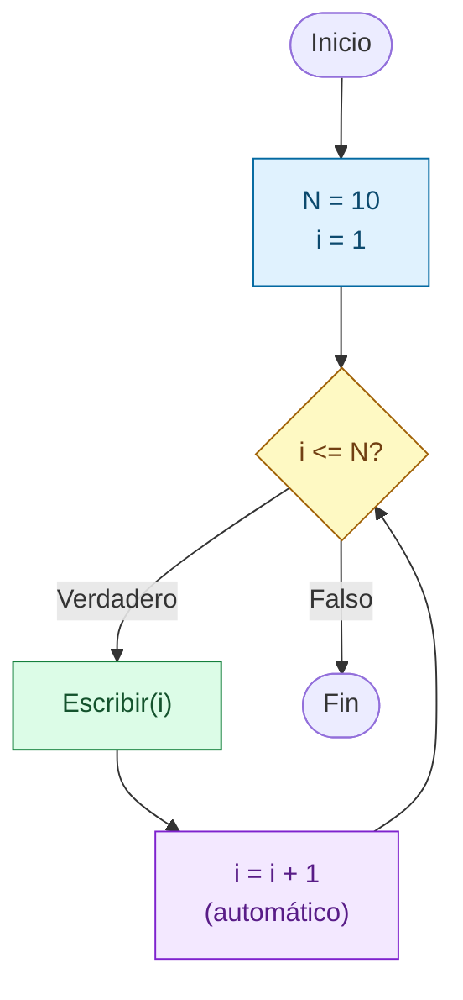
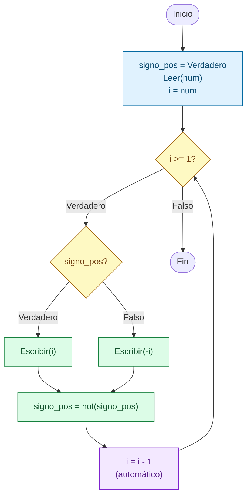

# Sesion magistral 17

* **Tipo**: Presencial
* **Fecha**: 22/09/2026
* **Parte**: Primer bloque de clase (14-16)

## Resumen

Esta sesión abre la clase 8 con la introducción práctica del **ciclo Para** (`for` en Python). A partir de los scripts de esta carpeta, se programaron en vivo, en orden, los ejemplos 1 a 4 de la [teoría](../teoria/#contenido-cubierto). El hilo conductor de toda la sesión es el mismo: los problemas ya se sabían resolver con `Mientras`/`while` (clase 7), y ahora se resuelven con `Para`, en el que la inicialización, la condición y la actualización de la variable de control quedan escritas juntas en la cabecera del ciclo.

La sesión se presenta en el orden cronológico en que se escribieron los scripts, según la marca de hora (`Created on`) que Spyder deja en el encabezado de cada archivo:

| Orden | Hora | Script | Problema | Ejemplo de la teoría |
|---|---|---|---|---|
| 1 | — (*) | [ejemplo1.py](ejemplo1.py) | Imprimir los números de 1 a `N` | Ejemplo 1 |
| 2 | 15:05 | [ejemplo2.py](ejemplo2.py) | Suma de los primeros `N` números | Ejemplo 2 |
| 3 | 15:19 | [ejemplo3.py](ejemplo3.py) | Factorial de un número | Ejemplo 3 |
| 4 | 15:44 | [ejemplo4.py](ejemplo4.py) | Números de `n` a 1 alternando el signo | Ejemplo 4 |

(*) `ejemplo1.py` no tiene marca de hora: conserva el encabezado del archivo temporal que Spyder abre por defecto ("Este es un archivo temporal"). Se ubica de primero porque es el ejemplo de entrada al tema y porque los demás parten de él.

**Contenido de esta página:**

* [Parte 1 — Del ciclo Mientras al ciclo Para](#parte-1--del-ciclo-mientras-al-ciclo-para)
* [Parte 2 — Suma de los primeros N números](#parte-2--suma-de-los-primeros-n-números)
* [Parte 3 — Factorial de un número](#parte-3--factorial-de-un-número)
* [Parte 4 — Secuencia alternante de signos](#parte-4--secuencia-alternante-de-signos)
* [Para explorar por su cuenta](#para-explorar-por-su-cuenta)

## Parte 1 — Del ciclo Mientras al ciclo Para

### Repaso rápido: los tres componentes de un ciclo

Como se formalizó en la [sesión 13](../../7/sesion_magistral-13/README.md), todo ciclo tiene tres componentes: **inicialización** de la variable de control, **condición** de control y **cuerpo** (que incluye la actualización de la variable de control). En el `Mientras`, esos componentes están repartidos en tres lugares distintos del programa. En el `Para`, en cambio, se escriben todos en una sola línea. Esta parte lo muestra con el mismo problema de motivación de la clase 7: imprimir los números de 1 a `N = 10`.

### Caso 1 — con Mientras (versión comentada en el script)

<table>
<tr><th>Pseudocódigo</th><th>Python</th></tr>
<tr><td>

```
Inicio
  N = 10
  i = 0
  Mientras (i < N) Haga
    i = i + 1
    Escribir(i)
  Fin_Mientras
Fin
```

</td><td>

```python
N = 10
i = 0
while i < N:
    i = i + 1
    print(i)
```

</td></tr>
</table>

**Código**: bloque comentado (entre `"""`) al inicio de [ejemplo1.py](ejemplo1.py).

Esta versión no es idéntica a la de las diapositivas (que inicializa `i = 1`, usa `i <= N` e imprime **antes** de actualizar), pero es equivalente: como `i` arranca en `0` y se actualiza **antes** de imprimir, el primer valor impreso es `1` y el último es `10`. Es el mismo cuidado con el orden de las instrucciones dentro del cuerpo que se trabajó en la [Parte 1 de la sesión 16](../../7/sesion_magistral-16/README.md#parte-1--orden-de-las-instrucciones-dentro-del-ciclo): si se cambia el orden, también hay que cambiar la inicialización o la condición.

### Caso 2 — con Para (versión activa del script)

<table>
<tr><th>Pseudocódigo</th><th>Python</th></tr>
<tr><td>

```
Inicio
  N = 10
  Para (i = 1,N,1) Haga
    Escribir(i)
  Fin_Para
Fin
```

</td><td>

```python
N = 10
for i in range(1,N + 1,1):
    print(i)
```

</td></tr>
</table>



El diagrama tiene la misma forma que el de un `Mientras`. La diferencia está en quién escribe cada pieza: en el `Para`, el programador solo escribe `Escribir(i)` en el cuerpo. La inicialización (`i = 1`), la condición (`i <= N`) y la actualización (`i = i + 1`) salen de la cabecera `Para (i = 1,N,1)`, y el ciclo las ejecuta por su cuenta.

**Código**: bloque activo de [ejemplo1.py](ejemplo1.py).

**Resultado de ejecución** (idéntico en ambos casos):

```
1
2
3
4
5
6
7
8
9
10
```

### Conclusiones de la Parte 1

La siguiente tabla ubica cada componente del ciclo en las dos versiones:

| Componente | Caso 1 (`while`) | Caso 2 (`for`) |
|---|---|---|
| Inicialización | `i = 0`, antes del ciclo | `1`, primer argumento de `range` |
| Condición | `i < N`, en el encabezado | implícita: `range` produce valores mientras no llegue al segundo argumento, `N + 1` |
| Actualización | `i = i + 1`, escrita a mano dentro del cuerpo | `1`, tercer argumento de `range`; automática |
| Cuerpo | `print(i)` | `print(i)` |

Dos consecuencias prácticas:

* Con `Para` **no se puede olvidar la actualización**: el error de la [sesión 13, Caso 4](../../7/sesion_magistral-13/README.md#caso-4) (ciclo infinito por no actualizar la variable de control) no puede ocurrir.
* `range()` **excluye su límite superior**. Por eso el `Para (i = 1,N,1)` del pseudocódigo se traduce como `range(1, N + 1, 1)` y no como `range(1, N, 1)`: con este último, el programa imprimiría solo de 1 a 9 (un off-by-one, ver la [sesión 12](../../7/sesion_magistral-12/README.md)).

### Comparación: while vs. for

Para que la comparación sea línea a línea, la columna `while` usa aquí la traducción directa del `Para (i = 1,N,1)` (la misma de la diapositiva del Ejemplo 1 de la clase 7): `i` empieza en `1` y la condición es `i <= N`. Es equivalente al Caso 1 de esta parte, que empezaba en `0`.

<table>
<tr><th>Solución con <code>while</code></th><th>Solución con <code>for</code></th></tr>
<tr><td>

```python
N = 10
i = 1              # Inicialización
while i <= N:      # Condición
    print(i)
    i = i + 1      # Actualización
```

</td><td>

```python
N = 10
# Inicialización, condición y
# actualización en la cabecera
for i in range(1,N + 1,1):
    print(i)
```

</td></tr>
</table>

## Parte 2 — Suma de los primeros N números

### Enunciado

Escriba un algoritmo que calcule la suma de los primeros `N` números enteros mayores que 0, donde `N` es un dato de entrada.

### Solución

<table>
<tr><th>Pseudocódigo</th><th>Python</th></tr>
<tr><td>

```
Inicio
  suma = 0
  Leer(N)
  Para (num = 1,N,1) Haga
    suma = suma + num
  Fin_Para
  Escribir('La suma es: ', suma)
Fin
```

</td><td>

```python
suma = 0
N = int(input("Numero: "))
for num in range(1,N+1,1):
    # Cuerpo
    suma += num
    # print(num,suma)

print("La suma es: " + str(suma))
```

</td></tr>
</table>

**Código**: [ejemplo2.py](ejemplo2.py)

`suma` es un **acumulador**: empieza en `0` y en cada vuelta se le agrega el valor de `num`. La instrucción `suma += num` es una forma abreviada de escribir `suma = suma + num`. A diferencia de la Parte 1, aquí `N` no es fijo: se lee por teclado, así que el número de iteraciones se conoce **antes** de entrar al ciclo, que es justo el caso para el que el `Para` es apropiado.

**Prueba de escritorio** (`N = 4`, el mismo caso de las diapositivas):

|`N`|`num`|`suma`|
|---|---|---|
|4|—|0|
||1|1|
||2|3|
||3|6|
||4|**10**|

**Resultado de ejecución**:

```
Numero: 4
La suma es: 10
```

> [!TIP]
> La línea `# print(num,suma)` del script es una prueba de escritorio automática: si se le quita el `#`, el programa imprime en cada vuelta los mismos valores de la tabla anterior (`1 1`, `2 3`, `3 6`, `4 10`). Es una forma rápida de comprobar que la prueba hecha a mano coincide con lo que realmente hace el programa. Una vez verificado, la línea se vuelve a comentar para que no ensucie la salida.

### Conclusiones de la Parte 2

* El patrón **acumulador** (inicializar en el valor neutro, `0` para la suma, y actualizar dentro del cuerpo) es el mismo que en la clase 7; lo único que cambia es que el `Para` se encarga de la variable de control.
* Si se ingresa `N = 0`, `range(1, 1, 1)` no produce ningún valor, el cuerpo no se ejecuta ninguna vez, y el programa imprime `La suma es: 0`. Es el mismo resultado esperado en la prueba de escritorio de las diapositivas, y se obtiene sin escribir ningún caso especial.

### Comparación: while vs. for

<table>
<tr><th>Solución con <code>while</code></th><th>Solución con <code>for</code></th></tr>
<tr><td>

```python
suma = 0
N = int(input("Numero: "))
num = 1                 # Inicialización
while num <= N:         # Condición
    suma += num
    num += 1            # Actualización

print("La suma es: " + str(suma))
```

</td><td>

```python
suma = 0
N = int(input("Numero: "))
# Inicialización, condición y
# actualización en la cabecera
for num in range(1,N+1,1):
    suma += num

print("La suma es: " + str(suma))
```

</td></tr>
</table>

Las dos versiones comparten la inicialización del acumulador (`suma = 0`), la lectura de `N`, la instrucción del cuerpo (`suma += num`) y la salida. Lo único que cambia es el manejo de `num`: tres líneas separadas en el `while` (`num = 1`, `num <= N`, `num += 1`), una sola cabecera en el `for`.

## Parte 3 — Factorial de un número

### Enunciado

Haga un programa que calcule el factorial de un número entero no negativo `n`. Recuerde que `0! = 1` y que, para cualquier otro valor, `n! = 1 × 2 × 3 × … × (n − 1) × n`.

### Solución

<table>
<tr><th>Pseudocódigo</th><th>Python</th></tr>
<tr><td>

```
Inicio
  fact = 1
  Leer(num)
  Para (i = 1,num,1) Haga
    fact = fact * i
  Fin_Para
  Si (num >= 0) Entonces
    Escribir(num, '! = ', fact)
  Sino
    Escribir('ERROR: El numero debe ser positivo o 0')
  Fin_Si
Fin
```

</td><td>

```python
# Inicializacion
fact = 1

# Entradas
num = int(input("Digite el numero: "))

# Proceso
for i in range(1,num+1,1):
    fact = fact*i

# Salidas
if num >= 0:
    print(f"{num}! = {fact}")
else:
    print("ERROR: El numero debe ser positivo o 0")
```

</td></tr>
</table>

**Código**: [ejemplo3.py](ejemplo3.py) (en el script, además, hay tres `print` comentados dentro del ciclo para depurar `i` y `fact`, con la misma técnica de la Parte 2).

El script está organizado con comentarios en las secciones **Inicialización / Entradas / Proceso / Salidas**, la misma estructura de entrada, procesamiento y salida del repaso de la teoría. `fact` también es un acumulador, pero de **producto**: por eso se inicializa en `1` (el valor neutro de la multiplicación) y no en `0`. Si empezara en `0`, el resultado siempre sería `0`.

**Prueba de escritorio** (`num = 5`):

|`num`|`i`|`fact`|
|---|---|---|
|5|—|1|
||1|1|
||2|2|
||3|6|
||4|24|
||5|**120**|

**Resultados de ejecución** (tres casos de prueba):

```
Digite el numero: 5
5! = 120
```

```
Digite el numero: 0
0! = 1
```

```
Digite el numero: -3
ERROR: El numero debe ser positivo o 0
```

### Conclusiones de la Parte 3

* **`0! = 1` sale solo.** Con `num = 0`, `range(1, 1, 1)` no produce valores, el cuerpo no se ejecuta, y `fact` conserva su valor inicial `1`. La inicialización correcta del acumulador resuelve el caso especial sin necesidad de un `Si` adicional.
* **La validación está después del ciclo.** Con `num = -3`, `range(1, -2, 1)` tampoco produce valores (el inicio ya es mayor que el fin), así que el ciclo no hace nada y el `Si` final muestra el mensaje de error. El programa responde bien, pero calcula antes de revisar si el dato es válido. Aquí funciona porque, con un negativo, el ciclo simplemente no se ejecuta. En general, sin embargo, es más seguro **validar la entrada antes de procesarla**, como en esta variante (no está en el script):

```python
fact = 1
num = int(input("Digite el numero: "))
if num >= 0:
    for i in range(1,num+1,1):
        fact = fact*i
    print(f"{num}! = {fact}")
else:
    print("ERROR: El numero debe ser positivo o 0")
```

### Comparación: while vs. for

Ambas columnas conservan la estructura del script de la sesión (validación después del ciclo).

<table>
<tr><th>Solución con <code>while</code></th><th>Solución con <code>for</code></th></tr>
<tr><td>

```python
fact = 1
num = int(input("Digite el numero: "))
i = 1                  # Inicialización
while i <= num:        # Condición
    fact = fact*i
    i += 1             # Actualización

if num >= 0:
    print(f"{num}! = {fact}")
else:
    print("ERROR: El numero debe ser positivo o 0")
```

</td><td>

```python
fact = 1
num = int(input("Digite el numero: "))
# Inicialización, condición y
# actualización en la cabecera
for i in range(1,num+1,1):
    fact = fact*i

if num >= 0:
    print(f"{num}! = {fact}")
else:
    print("ERROR: El numero debe ser positivo o 0")
```

</td></tr>
</table>

Con `num = 0` o con un negativo, en el `while` la condición `i <= num` es falsa desde la primera evaluación; en el `for`, `range` no produce ningún valor. En los dos casos el cuerpo no se ejecuta y `fact` queda en `1`.

## Parte 4 — Secuencia alternante de signos

### Enunciado

Imprimir los números de `n` a 1 alternando el signo, por ejemplo: `6, -5, 4, -3, 2, -1`.

Este problema ya se resolvió con `Mientras` en la [teoría de la clase 7](../../7/teoria/#contenido-cubierto) (Ejemplo 4, en cuatro formas). En esta sesión se resolvió con `Para` en dos formas, que corresponden a dos de esas cuatro. Ambas recorren los números **de mayor a menor**, así que usan un paso negativo: `Para (i = num,1,-1)`, que en Python es `range(num, 0, -1)`.

> [!NOTE]
> Con paso negativo, la regla de traducción del límite cambia: como `range()` excluye su límite en la dirección del paso, el `1` del pseudocódigo se convierte en `1 - 1 = 0` (no en `1 + 1`). Por eso se escribe `range(num, 0, -1)`: el último valor producido es `1`. Esta es la nota de la diapositiva del Ejemplo 4 de la [teoría](../teoria/#contenido-cubierto).

### Forma 1 — potencia de -1 (versión comentada en el script)

<table>
<tr><th>Pseudocódigo</th><th>Python</th></tr>
<tr><td>

```
Inicio
  e = 0
  Leer(num)
  Para (i = num,1,-1) Haga
    Escribir(((-1)**e)*i)
    e = e + 1
  Fin_Para
Fin
```

</td><td>

```python
# Inicializacion
e = 0

# num = int(input("Ingrese el numero: "))
num = 7
for i in range(num,0,-1):
    print(((-1)**e)*i)
    e += 1
```

</td></tr>
</table>

**Código**: bloque comentado `Forma 1` en [ejemplo4.py](ejemplo4.py). En el script, la lectura por teclado quedó comentada y `num` está fijo en `7`, algo útil para probar rápido durante la clase.

La variable `e` es un **contador** que se usa como exponente: `(-1)**e` vale `1` cuando `e` es par y `-1` cuando `e` es impar, así que al multiplicarlo por `i` el signo se alterna en cada vuelta. Es la misma solución de la diapositiva del Ejemplo 4 de la teoría de la clase 8, pero con otros nombres de variables (`e` para el exponente e `i` para la variable de control, en vez de `i` y `num`).

### Forma 2 — bandera booleana (versión activa del script)

<table>
<tr><th>Pseudocódigo</th><th>Python</th></tr>
<tr><td>

```
Inicio
  signo_pos = Verdadero
  Leer(num)
  Para (i = num,1,-1) Haga
    Si (signo_pos) Entonces
      Escribir(i)
    Sino
      Escribir(-i)
    Fin_Si
    signo_pos = not(signo_pos)
  Fin_Para
Fin
```

</td><td>

```python
signo_pos = True

num = int(input("Ingrese el numero: "))
for i in range(num,0,-1):
    if signo_pos:
        print(i)
    else:
        print(-i)
    signo_pos = not(signo_pos)
```

</td></tr>
</table>



**Código**: bloque activo de [ejemplo4.py](ejemplo4.py).

`signo_pos` es una **bandera**: una variable de dos valores excluyentes (`True`/`False`) que recuerda si el próximo número debe imprimirse positivo o negativo. Al final de cada vuelta, `not(signo_pos)` la invierte: lo que era `True` pasa a `False` y viceversa. Es la misma idea de la forma 3 del Ejemplo 4 de la clase 7 ([`ciclos_ejemplo4c.py`](../../7/teoria/codigo/ciclos_ejemplo4c.py)), que usaba una bandera `flag_negativo` alternada con `not()` dentro de un `while`.

### Prueba de escritorio de ambas formas

Misma entrada para las dos formas: `num = 7`.

|`i`|`e` (Forma 1)|`(-1)**e`|`signo_pos` (Forma 2)|Salida|
|---|---|---|---|---|
|7|0|1|`True`|`7`|
|6|1|-1|`False`|`-6`|
|5|2|1|`True`|`5`|
|4|3|-1|`False`|`-4`|
|3|4|1|`True`|`3`|
|2|5|-1|`False`|`-2`|
|1|6|1|`True`|`1`|

Las columnas `e` y `signo_pos` muestran el valor **al momento de imprimir**, antes de que se actualicen al final de la vuelta.

**Resultado de ejecución** (idéntico en ambas formas):

```
Ingrese el numero: 7
7
-6
5
-4
3
-2
1
```

### Conclusiones de la Parte 4

| | Forma 1 (potencia) | Forma 2 (bandera) |
|---|---|---|
| Variable auxiliar | `e`, contador usado como exponente | `signo_pos`, bandera booleana |
| Cómo decide el signo | Con una operación aritmética: `(-1)**e` | Con una decisión: `Si (signo_pos) ... Sino ...` |
| Actualización de la variable auxiliar | `e = e + 1` | `signo_pos = not(signo_pos)` |
| Ventaja | Más corta: una sola instrucción imprime el número con su signo | Más fácil de leer: el `Si` dice explícitamente cuándo se imprime positivo y cuándo negativo |

Las dos formas resuelven lo mismo. Además, al compararlas con sus versiones de la clase 7 se ve una idea importante: **pasar de `Mientras` a `Para` no cambió el cuerpo del ciclo**. La lógica que alterna el signo (la potencia o la bandera) es la misma; solo cambió quién maneja la variable de control: antes, el programador, con `num = num - 1` dentro del cuerpo; ahora, la cabecera del `Para`, con el paso `-1`.

### Comparación: while vs. for

Con paso negativo, la condición del `while` pasa a ser `i >= 1` y la actualización resta en vez de sumar.

**Forma 1 — potencia de -1**

<table>
<tr><th>Solución con <code>while</code></th><th>Solución con <code>for</code></th></tr>
<tr><td>

```python
e = 0
num = int(input("Ingrese el numero: "))
i = num                # Inicialización
while i >= 1:          # Condición
    print(((-1)**e)*i)
    e += 1
    i -= 1             # Actualización
```

</td><td>

```python
e = 0
num = int(input("Ingrese el numero: "))
# Inicialización, condición y
# actualización en la cabecera
for i in range(num,0,-1):
    print(((-1)**e)*i)
    e += 1
```

</td></tr>
</table>

**Forma 2 — bandera booleana**

<table>
<tr><th>Solución con <code>while</code></th><th>Solución con <code>for</code></th></tr>
<tr><td>

```python
signo_pos = True
num = int(input("Ingrese el numero: "))
i = num                # Inicialización
while i >= 1:          # Condición
    if signo_pos:
        print(i)
    else:
        print(-i)
    signo_pos = not(signo_pos)
    i -= 1             # Actualización
```

</td><td>

```python
signo_pos = True
num = int(input("Ingrese el numero: "))
# Inicialización, condición y
# actualización en la cabecera
for i in range(num,0,-1):
    if signo_pos:
        print(i)
    else:
        print(-i)
    signo_pos = not(signo_pos)
```

</td></tr>
</table>

En las dos formas, la variable auxiliar (`e` o `signo_pos`) se sigue actualizando a mano dentro del cuerpo también en la versión `for`: el `Para` solo automatiza la variable de control `i`, no las demás variables del ciclo.

## Para explorar por su cuenta

*Ideas complementarias para practicar con los mismos ejemplos. No fueron parte del contenido dictado en esta sesión.*

### Imprimir en una sola línea

Los cuatro ejemplos imprimen un valor por línea. La versión de la teoría del Ejemplo 1 ([`ejemplo1_para.py`](../teoria/codigo/ejemplo1_para.py)) deja comentada la alternativa `print(i, end = ' ')`, que imprime todos los valores en la misma línea separados por un espacio. Pruebe cambiarla en `ejemplo1.py` y en `ejemplo4.py` y compare la salida.

### Verificar la suma con una fórmula

La suma de los primeros `N` enteros positivos también se puede calcular sin ciclo, con la fórmula `N * (N + 1) // 2`. Para `N = 4` da `4 * 5 // 2 = 10`, el mismo resultado de la Parte 2. Agregue esa línea al final de `ejemplo2.py` e imprima los dos valores: si alguna vez no coinciden, el ciclo tiene un error (por ejemplo, un `range(1, N)` que se quedó corto en uno).

### Recorrer hacia atrás en los otros ejemplos

La Parte 4 usó un paso negativo. Intente reescribir el factorial de la Parte 3 multiplicando de `num` hacia `1` (`range(num, 0, -1)`). ¿Cambia el resultado? ¿Por qué? (Pista: el orden de los factores en una multiplicación).

### Referencias

* *El libro de Python* — [Bucle for en Python](https://ellibrodepython.com/for-python) (diferencias con `while`, uso de `range`, recorrido de cadenas y listas — este último tema se ve en la sección "¿Qué es una secuencia?" de la [teoría](../teoria/#contenido-cubierto)).
* Malan, D. (Harvard). *CS50's Introduction to Programming with Python* — [Lecture 2: Loops](https://cs50.harvard.edu/python/notes/2/) (la misma lectura citada en las sesiones [15](../../7/sesion_magistral-15/README.md) y [16](../../7/sesion_magistral-16/README.md); su parte sobre `for` y `range` corresponde a lo visto en esta sesión).

> [!Important]
> Se usó IA generativa para redactar y organizar este contenido a partir del material de la clase. El docente revisó y validó la versión final.
