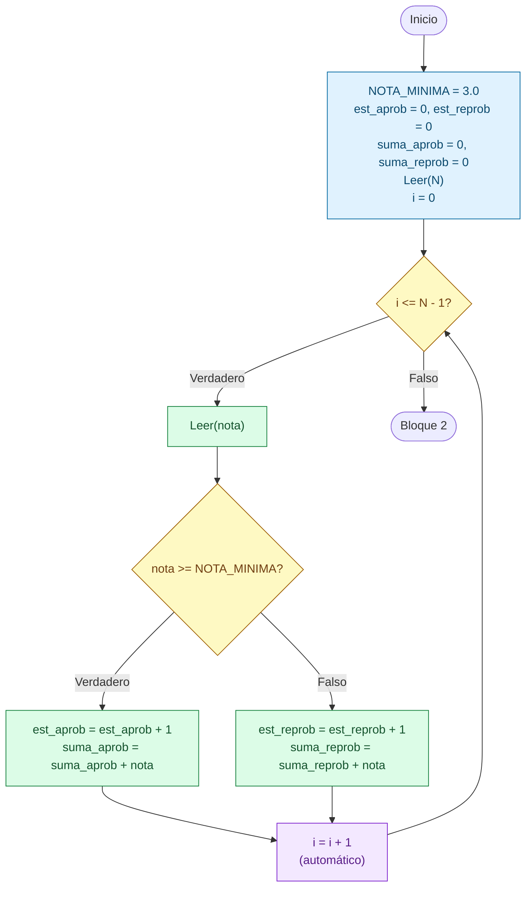

# Sesion magistral 18

* **Tipo**: Presencial
* **Fecha**: 22/09/2026
* **Parte**: Segundo bloque de clase (16-18)

## Resumen

Esta sesión continúa la [sesión 17](../sesion_magistral-17/README.md) con el **Ejemplo 5** de la [teoría](../teoria/#contenido-cubierto): leer las notas de los `N` estudiantes de un curso y calcular estadísticas de aprobados y reprobados. Es el primer ejemplo del ciclo `Para` que combina en un mismo programa varios elementos ya vistos: un ciclo de iteraciones **conocidas**, dos **contadores** y dos **acumuladores** que se actualizan según una decisión dentro del cuerpo (acumulador condicional), y una alternativa múltiple al final para evitar divisiones por cero.

A partir de [`ejemplo5.py`](ejemplo5.py), la sesión se organiza en cuatro partes:

* **Parte 1** presenta el enunciado del problema.
* **Parte 2** diseña la solución antes de escribir código: datos de entrada y salida, plan en palabras y definición de las variables con su rol dentro del ciclo, siguiendo el formato del [Laboratorio 3](../../../laboratorios/3/README.md).
* **Parte 3** presenta el pseudocódigo y el código Python, dividido en dos bloques (lectura de datos y cálculo de resultados), junto con los casos de prueba.
* **Parte 4** analiza un error de la primera versión escrita en clase, que no mostraba ningún resultado cuando todos los estudiantes ganaban o todos perdían, y cómo se corrigió.

**Contenido de esta página:**

* [Parte 1 — Enunciado](#parte-1--enunciado)
* [Parte 2 — Diseño de la solución](#parte-2--diseño-de-la-solución)
* [Parte 3 — Solución](#parte-3--solución)
* [Parte 4 — Un error de la versión escrita en clase](#parte-4--un-error-de-la-versión-escrita-en-clase)
* [Limitación pendiente: la nota no se valida](#limitación-pendiente-la-nota-no-se-valida)
* [Para explorar por su cuenta](#para-explorar-por-su-cuenta)

## Parte 1 — Enunciado

Tomado de la diapositiva del Ejemplo 5 de la [teoría](../teoria/#contenido-cubierto):

> Hacer un programa que lea primero el número de estudiantes de un curso (`N`), y luego lea las `N` notas correspondientes (valores decimales entre 0.0 y 5.0), una a una.
>
> Considere que la nota mínima aprobatoria es 3.0: una nota es aprobada si es mayor o igual a 3.0, y reprobada si es menor a 3.0.
>
> Al finalizar la lectura, el programa deberá entregar:
>
> * El porcentaje de estudiantes aprobados.
> * El porcentaje de estudiantes reprobados.
> * El promedio de las notas aprobadas.
> * El promedio de las notas reprobadas.
> * El promedio de las notas del curso.

> [!NOTE]
> La versión trabajada en esta sesión simplifica las dos primeras salidas: en vez del **porcentaje** de aprobados y reprobados, muestra la **cantidad** de estudiantes que ganaron y que perdieron. Las otras tres salidas (los tres promedios) son las del enunciado. Agregar los porcentajes queda como ejercicio en [Para explorar por su cuenta](#completar-el-enunciado-los-porcentajes).

## Parte 2 — Diseño de la solución

### Entradas y salidas

| Entradas | Salidas |
|---|---|
| Cantidad de estudiantes del curso (`N`) | Cantidad de estudiantes que ganaron |
| Nota de cada estudiante (`nota`), leída `N` veces | Cantidad de estudiantes que perdieron |
| | Promedio de las notas reprobadas |
| | Promedio de las notas aprobadas |
| | Promedio de las notas del curso |

Como `N` se lee **antes** de empezar a leer las notas, el número de iteraciones se conoce antes de entrar al ciclo. Por eso este problema se resuelve con un ciclo `Para`, a diferencia de los problemas de la clase 7 en los que no se sabía cuántos datos iban a llegar (bandera o centinela, ver la [sesión 15](../../7/sesion_magistral-15/README.md)).

### Plan en palabras

1. Guardar la nota mínima aprobatoria (3.0) en una constante e inicializar en `0` los dos contadores y los dos acumuladores.
2. Leer la cantidad de estudiantes `N`.
3. Repetir `N` veces:
   1. Leer la nota del estudiante.
   2. Si la nota es mayor o igual a la nota mínima, sumar 1 a los estudiantes que ganaron y sumar la nota a la suma de notas aprobadas.
   3. Si no, sumar 1 a los estudiantes que perdieron y sumar la nota a la suma de notas reprobadas.
4. Al terminar el ciclo, si no hay estudiantes (`N <= 0`), mostrar un mensaje y no calcular nada.
5. Si hay estudiantes, calcular los promedios **sin dividir por cero**: si nadie perdió, el promedio de reprobados es `0`; si nadie ganó, el promedio de aprobados es `0`; en otro caso, se calculan ambos.
6. Calcular el promedio del curso y mostrar los resultados.

### Definición de variables

Con el plan claro, se define qué se va a almacenar en cada variable y, cuando aplica, qué rol cumple dentro del ciclo (los roles se definieron en la [teoría de la clase 7](../../7/teoria/#contenido-cubierto)):

| Variable | Descripción | Rol (si aplica) |
|---|---|---|
| `NOTA_MINIMA` | Nota mínima para aprobar (3.0) | Constante |
| `N` | Cantidad de estudiantes del curso (dato de entrada) | |
| `i` | Número de la iteración actual (de `0` a `N - 1`) | Variable de control del ciclo |
| `nota` | Nota del estudiante leída en la iteración actual (dato de entrada) | |
| `est_aprob` | Cuenta cuántos estudiantes ganaron | Contador |
| `est_reprob` | Cuenta cuántos estudiantes perdieron | Contador |
| `suma_aprob` | Acumula la suma de las notas de los estudiantes que ganaron | Acumulador |
| `suma_reprob` | Acumula la suma de las notas de los estudiantes que perdieron | Acumulador |
| `prom_aprob` | Promedio de las notas aprobadas (dato de salida) | |
| `prom_reprob` | Promedio de las notas reprobadas (dato de salida) | |
| `prom_nota` | Promedio de todas las notas del curso (dato de salida) | |

Los nombres son más cortos que los de la diapositiva (`est_aprob` en vez de `notas_aprobadas`, `prom_nota` en vez de `prom`, etc.), pero cada variable cumple el mismo papel. Dos detalles:

* **Contador vs. acumulador**: `est_aprob` y `suma_aprob` se actualizan en el mismo `Si`, pero de forma distinta. El contador suma siempre una cantidad fija (`1`); el acumulador suma una cantidad variable (el valor de `nota`).
* **`i` no se usa dentro del cuerpo.** Solo sirve para que el ciclo se repita `N` veces. Por eso `range(N)` basta: produce `0, 1, …, N - 1`, que son `N` valores, igual que el `Para (i = 0,N - 1,1)` de la diapositiva.

## Parte 3 — Solución

Como en la diapositiva, la solución se divide en dos bloques: primero la lectura de las notas (el ciclo) y después el cálculo y la presentación de los resultados.

### Bloque 1 — Lectura de las notas

<table>
<tr><th>Pseudocódigo</th><th>Python</th></tr>
<tr><td>

```
Inicio
  NOTA_MINIMA = 3.0
  est_aprob = 0
  est_reprob = 0
  suma_aprob = 0
  suma_reprob = 0
  Leer(N)
  Para (i = 0,N - 1,1) Haga
    Leer(nota)
    Si (nota >= NOTA_MINIMA) Entonces
      est_aprob = est_aprob + 1
      suma_aprob = suma_aprob + nota
    Sino
      est_reprob = est_reprob + 1
      suma_reprob = suma_reprob + nota
    Fin_Si
  Fin_Para
  ...
```

</td><td>

```python
# Constantea
NOTA_MINIMA = 3.0

# Inicializacion de variables
est_aprob = 0
est_reprob = 0
suma_aprob = 0
suma_reprob = 0

# Entradas
N = int(input("Numero de estudiantes: "))
for i in range(N):
    # print(i)
    # Solicitud de nota
    nota = float(input("- Digite la nota: "))
    if nota >= NOTA_MINIMA:
        # Gano
        est_aprob += 1 # est_aprob = est_aprob + 1
        suma_aprob += nota
    else:
        # perdio
        est_reprob += 1
        suma_reprob += nota
```

</td></tr>
</table>



En cada vuelta se actualiza **solo una** de las dos parejas contador/acumulador, según la nota leída. Al terminar el ciclo se cumple siempre que `est_aprob + est_reprob == N`: cada estudiante quedó contado exactamente una vez, como aprobado o como reprobado.

### Bloque 2 — Cálculo y presentación de los resultados

<table>
<tr><th>Pseudocódigo</th><th>Python</th></tr>
<tr><td>

```
  ...
  Si (N <= 0) Entonces
    Escribir('No hay estudiantes')
  Sino
    Si (est_reprob == 0) Entonces
      prom_reprob = 0
      prom_aprob = suma_aprob / est_aprob
    Sino
      Si (est_aprob == 0) Entonces
        prom_aprob = 0
        prom_reprob = suma_reprob / est_reprob
      Sino
        prom_reprob = suma_reprob / est_reprob
        prom_aprob = suma_aprob / est_aprob
      Fin_Si
    Fin_Si
    prom_nota = (suma_reprob + suma_aprob) / N
    Escribir('Ganaron: ', est_aprob)
    Escribir('Perdieron: ', est_reprob)
    Escribir('Prom reprob: ', prom_reprob)
    Escribir('Prom aprob: ', prom_aprob)
    Escribir('Prom nota: ', prom_nota)
  Fin_Si
Fin
```

</td><td>

```python
# Validaciones
if N <= 0:
    # No hay estutiantes
    print("No hay estudiantes")
else:
    if est_reprob == 0:
        # Todos ganadon
        prom_reprob = 0
        prom_aprob = suma_aprob/est_aprob
    elif est_aprob == 0:
        # Todos perdieron
        prom_aprob = 0
        prom_reprob = suma_reprob/est_reprob
    else:
        # Hay estudiantes que ganaron y que perdieron
        prom_reprob = suma_reprob/est_reprob
        prom_aprob = suma_aprob/est_aprob

    # Promedio de notas
    prom_nota = (suma_reprob + suma_aprob)/N

    # Despliegue de resultados
    print(f"Ganaron: {est_aprob}")
    print(f"Perdieron: {est_reprob}")
    print(f"Prom reprob: {prom_reprob}")
    print(f"Prom aprob: {prom_aprob}")
    print(f"Prom nota: {prom_nota}")
```

</td></tr>
</table>

**Código**: [ejemplo5.py](ejemplo5.py) (los comentarios conservan algunos errores de digitación de la clase en vivo, como `Constantea`, `estutiantes` y `ganadon`).

Este bloque tiene dos niveles de decisión:

* El `Si` externo separa el caso sin estudiantes (`N <= 0`) del caso con estudiantes. Sin él, la línea `prom_nota = (...) / N` dividiría por cero cuando `N = 0`.
* El `Si` interno es una alternativa múltiple con tres casos: nadie perdió, nadie ganó, o hay de los dos. Cada caso divide **solo** por un contador que sabe que es mayor que cero. Por ejemplo, si nadie perdió, `est_reprob` es `0`, así que `suma_reprob / est_reprob` produciría un error, y en su lugar se asigna `prom_reprob = 0`.

Como en la [sesión 15](../../7/sesion_magistral-15/README.md), el pseudocódigo escribe la alternativa múltiple con `Si` anidados (no existe un equivalente de `elif`), mientras que en Python se escribe con `if-elif-else`. Las dos formas describen la misma decisión. Además, todo lo que va después del `Si` interno (el promedio del curso y los cinco `print`) queda **dentro** del `Sino` externo, pero **fuera** del `Si` interno: se ejecuta en los tres casos. Ese detalle es justamente el que falló en la versión escrita en clase (ver la [Parte 4](#parte-4--un-error-de-la-versión-escrita-en-clase)).

### Casos de prueba

Cada caso recorre un camino distinto del Bloque 2:

| Caso | `N` | Notas | Camino del Bloque 2 | Salida esperada |
|---|---|---|---|---|
| 1 | 4 | 4.5, 2.0, 3.5, 1.0 | Hay estudiantes que ganaron y que perdieron | Ganaron 2, perdieron 2, prom. reprob. 1.5, prom. aprob. 4.0, prom. nota 2.75 |
| 2 | 2 | 4.0, 3.5 | Todos ganaron (`est_reprob == 0`) | Ganaron 2, perdieron 0, prom. reprob. 0, prom. aprob. 3.75, prom. nota 3.75 |
| 3 | 2 | 1.0, 2.5 | Todos perdieron (`est_aprob == 0`) | Ganaron 0, perdieron 2, prom. reprob. 1.75, prom. aprob. 0, prom. nota 1.75 |
| 4 | 0 | — | No hay estudiantes (`N <= 0`) | `No hay estudiantes` |

**Prueba de escritorio** (Caso 1: `N = 4`, notas `4.5, 2.0, 3.5, 1.0`):

|`i`|`nota`|`nota >= NOTA_MINIMA`|`est_aprob`|`suma_aprob`|`est_reprob`|`suma_reprob`|
|---|---|---|---|---|---|---|
|—|—|—|0|0|0|0|
|0|4.5|Verdadera|1|4.5|0|0|
|1|2.0|Falsa|1|4.5|1|2.0|
|2|3.5|Verdadera|**2**|**8.0**|1|2.0|
|3|1.0|Falsa|2|8.0|**2**|**3.0**|

Al salir del ciclo, como `N = 4` y ninguno de los dos contadores es `0`, se toma el último camino: `prom_reprob = 3.0 / 2 = 1.5`, `prom_aprob = 8.0 / 2 = 4.0` y `prom_nota = (3.0 + 8.0) / 4 = 2.75`.

**Resultados de ejecución** (se verificaron los cuatro casos; se muestran el 1 y el 2):

```
Numero de estudiantes: 4
- Digite la nota: 4.5
- Digite la nota: 2.0
- Digite la nota: 3.5
- Digite la nota: 1.0
Ganaron: 2
Perdieron: 2
Prom reprob: 1.5
Prom aprob: 4.0
Prom nota: 2.75
```

```
Numero de estudiantes: 2
- Digite la nota: 4.0
- Digite la nota: 3.5
Ganaron: 2
Perdieron: 0
Prom reprob: 0
Prom aprob: 3.75
Prom nota: 3.75
```

### Comparación: while vs. for

Como en la [sesión 17](../sesion_magistral-17/README.md), la misma lectura de notas se puede escribir con `while`. Solo cambia el Bloque 1; el Bloque 2 es idéntico en las dos versiones.

<table>
<tr><th>Solución con <code>while</code></th><th>Solución con <code>for</code></th></tr>
<tr><td>

```python
N = int(input("Numero de estudiantes: "))
i = 0                   # Inicialización
while i < N:            # Condición
    nota = float(input("- Digite la nota: "))
    if nota >= NOTA_MINIMA:
        est_aprob += 1
        suma_aprob += nota
    else:
        est_reprob += 1
        suma_reprob += nota
    i += 1              # Actualización
```

</td><td>

```python
N = int(input("Numero de estudiantes: "))
# Inicialización, condición y
# actualización en la cabecera
for i in range(N):
    nota = float(input("- Digite la nota: "))
    if nota >= NOTA_MINIMA:
        est_aprob += 1
        suma_aprob += nota
    else:
        est_reprob += 1
        suma_reprob += nota
```

</td></tr>
</table>

En la versión `while`, la actualización `i += 1` tiene que quedar **fuera** del `if-else` (al final del cuerpo). Si quedara dentro de una sola de las ramas, `i` solo avanzaría con algunas notas y el ciclo pediría más notas de las debidas. En el `for` ese error no puede ocurrir, porque la actualización no se escribe.

## Parte 4 — Un error de la versión escrita en clase

La primera versión del Bloque 2, escrita en vivo durante la sesión, organizaba las decisiones de otra forma: los cuatro casos quedaban en una sola alternativa múltiple, al mismo nivel.

<table>
<tr><th>Versión escrita en clase</th><th>Versión corregida</th></tr>
<tr><td>

```python
if N <= 0:
    print("No hay estudiantes")
elif est_reprob == 0:
    prom_reprob = 0
    prom_aprob = suma_aprob/est_aprob
elif est_aprob == 0:
    prom_aprob = 0
    prom_reprob = suma_reprob/est_reprob
else:
    prom_reprob = suma_reprob/est_reprob
    prom_aprob = suma_aprob/est_aprob

    prom_nota = (suma_reprob + suma_aprob)/N
    print(f"Ganaron: {est_aprob}")
    print(f"Perdieron: {est_reprob}")
    print(f"Prom reprob: {prom_reprob}")
    print(f"Prom aprob: {prom_aprob}")
    print(f"Prom nota: {prom_nota}")
```

</td><td>

```python
if N <= 0:
    print("No hay estudiantes")
else:
    if est_reprob == 0:
        prom_reprob = 0
        prom_aprob = suma_aprob/est_aprob
    elif est_aprob == 0:
        prom_aprob = 0
        prom_reprob = suma_reprob/est_reprob
    else:
        prom_reprob = suma_reprob/est_reprob
        prom_aprob = suma_aprob/est_aprob

    prom_nota = (suma_reprob + suma_aprob)/N
    print(f"Ganaron: {est_aprob}")
    print(f"Perdieron: {est_reprob}")
    print(f"Prom reprob: {prom_reprob}")
    print(f"Prom aprob: {prom_aprob}")
    print(f"Prom nota: {prom_nota}")
```

</td></tr>
</table>

*(Se omiten los comentarios para que la diferencia de sangría se vea mejor.)*

En la versión de clase, el cálculo de `prom_nota` y los cinco `print` quedaron con la misma sangría que las instrucciones del `else` final, así que **solo se ejecutan en ese caso**. En los casos "todos ganaron" y "todos perdieron", el programa calcula bien los promedios pero termina sin mostrar nada. El programa no produce ningún error: simplemente no imprime nada, y por eso el problema es difícil de notar si solo se prueba con un caso mixto.

Resultado de la versión de clase con los mismos casos de prueba de la Parte 3:

| Caso | Salida de la versión de clase | ¿Correcta? |
|---|---|---|
| 1 — ganaron y perdieron | Los cinco resultados | Sí |
| 2 — todos ganaron | Solo `Numero de estudiantes:` y las dos notas; **ningún resultado** | No |
| 3 — todos perdieron | Solo `Numero de estudiantes:` y las dos notas; **ningún resultado** | No |
| 4 — no hay estudiantes | `No hay estudiantes` | Sí |

La corrección separa las dos decisiones que estaban mezcladas:

1. **¿Hay estudiantes?** (`N <= 0`). Es la única que decide si se muestran resultados o no.
2. **¿Cómo se calculan los promedios sin dividir por cero?** Esta decisión va **dentro** del `else` de la primera, y después de ella, ya fuera del `if-elif-else` interno, van el promedio del curso y los `print`, que así se ejecutan en los tres casos.

> [!TIP]
> Este error muestra por qué los casos de prueba deben cubrir **cada camino** del programa y no solo el caso "normal". Con el Caso 1 las dos versiones dan exactamente la misma salida; la diferencia solo aparece con los Casos 2 y 3. Cuando un programa tiene una alternativa múltiple, conviene diseñar al menos un caso de prueba por cada rama, como en la tabla de casos de la Parte 3.

## Limitación pendiente: la nota no se valida

El enunciado dice que las notas son valores entre 0.0 y 5.0, pero el programa no lo revisa. Por ejemplo, con `N = 1` y la nota `7.5`, el programa la acepta como aprobada:

```
Numero de estudiantes: 1
- Digite la nota: 7.5
Ganaron: 1
Perdieron: 0
Prom reprob: 0
Prom aprob: 7.5
Prom nota: 7.5
```

Esta limitación viene de la misma teoría, que deja el Ejemplo 5 sin validar a propósito. Se resuelve más adelante en la clase, en el Ejemplo 9 ([`ejemplo9_opcion2.py`](../teoria/codigo/ejemplo9_opcion2.py)), con la instrucción `continue`.

## Para explorar por su cuenta

*Ideas complementarias para practicar con este mismo ejemplo. No fueron parte del contenido dictado en esta sesión.*

### Completar el enunciado: los porcentajes

Agregue al programa el porcentaje de estudiantes que ganaron y el de los que perdieron, como pide el enunciado. Pista: el porcentaje de aprobados es `est_aprob / N * 100`. ¿En qué parte del Bloque 2 deben ir estos cálculos para que nunca se divida por cero? Compare su solución con [`ejemplo5_para.py`](../teoria/codigo/ejemplo5_para.py) de la teoría, que sí los calcula.

### Mostrar los promedios con dos decimales

Con notas como `4.5, 2.0, 3.8`, el promedio del curso se imprime como `3.4333333333333336`. Cambie los `print` para usar el formato `:.2f` de los f-strings (por ejemplo, `print(f"Prom nota: {prom_nota:.2f}")`), que muestra el resultado como `3.43`.

### Numerar cada nota

El programa pide todas las notas con el mismo mensaje (`- Digite la nota:`), así que el usuario no sabe cuántas lleva. Use la variable de control `i` para numerarlas: `input(f"- Digite la nota del estudiante {i + 1}: ")`. ¿Por qué hace falta el `+ 1`?

> [!Important]
> Se usó IA generativa para redactar y organizar este contenido a partir del material de la clase. El docente revisó y validó la versión final.
