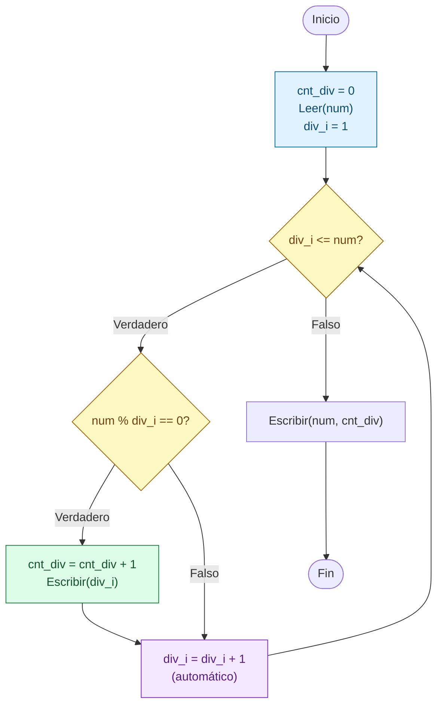
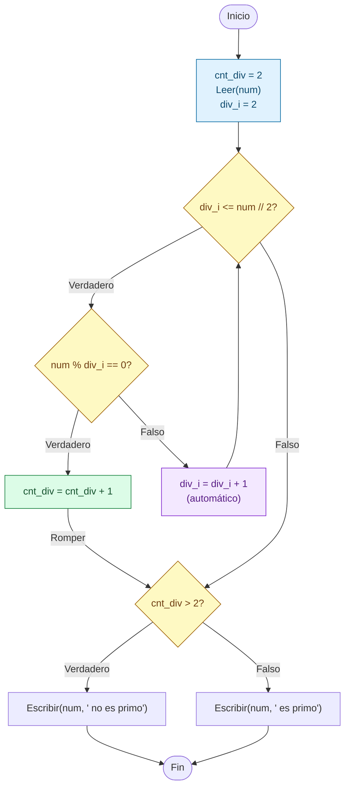

# Sesion magistral 19

* **Tipo**: Presencial
* **Fecha**: 29/09/2026
* **Parte**: Primer bloque de clase (14-16)

## Resumen

Esta sesión aplica el ciclo `Para` a un tipo de problema nuevo: **calcular la suma de los primeros términos de una serie matemática**. El problema de fondo es el mismo que el de la suma de los primeros `N` números de la [sesión 17](../sesion_magistral-17/README.md#parte-2--suma-de-los-primeros-n-números): un acumulador que empieza en `0` y un ciclo que le suma un valor en cada vuelta. La diferencia es que ahora el valor que se suma (el **término** de la serie) hay que calcularlo en cada vuelta a partir de la posición en que va el ciclo.

La sesión tiene dos momentos. El primero, a partir de [`ejemplo1.py`](ejemplo1.py), se organiza en cuatro partes:

* **Parte 1** presenta el enunciado del problema.
* **Parte 2** diseña la solución: primero se analiza la serie para encontrar su **término general** (la fórmula que da cualquier término a partir de su posición), y luego se definen las entradas, las salidas, el plan y las variables, siguiendo el formato del [Laboratorio 3](../../../laboratorios/3/README.md).
* **Parte 3** presenta el pseudocódigo y el código Python, los casos de prueba y la comparación con `while`.
* **Parte 4** muestra otras dos formas de calcular el término y resume los pasos para resolver cualquier problema de series.

El segundo momento cambia de herramienta: los ejemplos se escriben en un **Jupyter Notebook**, [`ejemplo_divisores.ipynb`](ejemplo_divisores.ipynb), el primero del curso. Los problemas son los ejemplos 6 y 7 de la [teoría de la clase 8](../teoria/README.md):

* **Parte 5** explica qué es un notebook y cómo crearlo y abrirlo con Anaconda (y, como alternativa, con VS Code).
* **Parte 6** muestra los divisores de un número, en dos versiones: la directa y una mejorada que recorre la mitad de los candidatos.
* **Parte 7** decide si un número es primo, primero contando divisores y luego rompiendo el ciclo con `break` (como en la [sesión 16](../../7/sesion_magistral-16/README.md#parte-3--ruptura-de-ciclos)), y mide cuántas vueltas se ahorran.

**Contenido de esta página:**

* [Parte 1 — Enunciado](#parte-1--enunciado)
* [Parte 2 — Diseño de la solución](#parte-2--diseño-de-la-solución)
* [Parte 3 — Solución](#parte-3--solución)
* [Parte 4 — Otras formas de calcular el término](#parte-4--otras-formas-de-calcular-el-término)
* [Parte 5 — El entorno de trabajo: Jupyter Notebook](#parte-5--el-entorno-de-trabajo-jupyter-notebook)
* [Parte 6 — Divisores de un número](#parte-6--divisores-de-un-número)
* [Parte 7 — ¿Es primo? Contar divisores y romper el ciclo](#parte-7--es-primo-contar-divisores-y-romper-el-ciclo)
* [Para explorar por su cuenta](#para-explorar-por-su-cuenta)

## Parte 1 — Enunciado

> Escriba un programa que lea la cantidad de términos `N` y un valor real `x`, y calcule la suma de los primeros `N` términos de la siguiente serie:
>
> $$s = 1 + 2x + 3x^2 + 4x^3 + \cdots + Nx^{N-1}$$
>
> Además de la suma final, el programa debe mostrar, para cada término, su posición `i`, la potencia $x^i$, el coeficiente y el valor del término.

**Ejemplo de ejecución** (`N = 4`, `x = 2`, es decir, $s = 1 + 2 \cdot 2 + 3 \cdot 2^2 + 4 \cdot 2^3$):

```
Digite el numero de entradas: 4
Digite el valor de la variable: 2
i = 0; x**i = 1.0, coef = 1, term = 1.0
i = 1; x**i = 2.0, coef = 2, term = 4.0
i = 2; x**i = 4.0, coef = 3, term = 12.0
i = 3; x**i = 8.0, coef = 4, term = 32.0
s = 49.0
```

## Parte 2 — Diseño de la solución

### Análisis de la serie: el término general

Antes de pensar en el ciclo, hay que entender la serie. La forma más segura es escribir los primeros términos en una tabla, numerándolos desde `0` (así se numeran las iteraciones de `range(N)`), y separar cada término en sus partes:

| Término | Posición `i` | Coeficiente | Potencia de `x` |
|---|---|---|---|
| $1$ | 0 | 1 | $x^0 = 1$ |
| $2x$ | 1 | 2 | $x^1$ |
| $3x^2$ | 2 | 3 | $x^2$ |
| $4x^3$ | 3 | 4 | $x^3$ |
| $\vdots$ | $\vdots$ | $\vdots$ | $\vdots$ |
| $Nx^{N-1}$ | $N - 1$ | $N$ | $x^{N-1}$ |

Leyendo la tabla por columnas aparecen dos patrones:

* El **coeficiente** siempre es uno más que la posición: `i + 1`. Arranca en `1` y aumenta de 1 en 1, como un contador.
* El **exponente** de `x` es exactamente la posición `i`.

Con eso, el término que ocupa la posición `i` es:

$$t_i = (i + 1)x^i \qquad i = 0, 1, 2, \ldots, N - 1$$

y la serie completa se puede escribir como una sumatoria:

$$s = \sum_{i=0}^{N-1} (i + 1)x^i$$

Esta fórmula es la que se programa. El ciclo recorre las posiciones `i = 0, 1, …, N - 1`, en cada vuelta calcula $t_i$ y lo suma al acumulador `s`.

> [!NOTE]
> El primer término, `1`, no parece seguir el patrón, pero sí lo sigue: con `i = 0` el término general da $(0 + 1)x^0 = 1 \cdot 1 = 1$, porque cualquier número elevado a la `0` es `1`. Por eso no hace falta tratarlo como un caso especial.

### Entradas y salidas

| Entradas | Salidas |
|---|---|
| Cantidad de términos a sumar (`N`) | Para cada término: su posición, la potencia $x^i$, el coeficiente y su valor |
| Valor real de la variable (`x`) | La suma `s` de los `N` términos |

La cantidad de términos `N` se lee **antes** del ciclo, así que el número de iteraciones es conocido y el problema se resuelve con un ciclo `Para`, como los de las sesiones 17 y 18.

### Plan en palabras

1. Inicializar el acumulador de la suma en `0` y el coeficiente en `1` (el coeficiente del primer término).
2. Leer la cantidad de términos `N` y el valor de `x`.
3. Repetir para cada posición `i`, desde `0` hasta `N - 1`:
   1. Calcular el término: el coeficiente multiplicado por `x` elevado a la `i`.
   2. Mostrar la posición, la potencia, el coeficiente y el término.
   3. Sumar el término al acumulador.
   4. Aumentar el coeficiente en 1, para el término siguiente.
4. Al terminar el ciclo, mostrar la suma.

### Definición de variables

| Variable | Descripción | Rol (si aplica) |
|---|---|---|
| `N` | Cantidad de términos a sumar (dato de entrada) | |
| `x` | Valor real de la variable de la serie (dato de entrada) | |
| `i` | Posición del término actual (de `0` a `N - 1`); también es el exponente de `x` | Variable de control del ciclo |
| `coef` | Coeficiente del término actual (1, 2, 3, …) | Contador |
| `term` | Valor del término actual, $(i + 1)x^i$; se recalcula en cada vuelta | |
| `s` | Suma de los términos calculados hasta el momento (dato de salida) | Acumulador |

Dos detalles:

* **`i` cumple dos papeles.** Es la variable de control del ciclo (cuenta las vueltas) y, al mismo tiempo, es el exponente de `x`. Se aprovecha que la posición de cada término coincide con su exponente.
* **`term` no es un acumulador.** No guarda nada de una vuelta a la siguiente: en cada vuelta se calcula de nuevo, se usa y se reemplaza en la vuelta siguiente. El que sí acumula es `s`.

## Parte 3 — Solución

<table>
<tr><th>Pseudocódigo</th><th>Python</th></tr>
<tr><td>

```
Inicio
  s = 0
  coef = 1
  Leer(N)
  Leer(x)
  Para (i = 0,N - 1,1) Haga
    term = coef * (x**i)
    Escribir('i = ', i, '; x**i = ', x**i,
             ', coef = ', coef, ', term = ', term)
    s = s + term
    coef = coef + 1
  Fin_Para
  Escribir('s = ', s)
Fin
```

</td><td>

```python
# Inicializacion de variables

s = 0
coef = 1

# Entradas
N = int(input("Digite el numero de entradas: "))
x = float(input("Digite el valor de la variable: "))

# Proceso
for i in range(N):
    term = coef*(x**i)
    print(f"i = {i}; x**i = {x**i}, coef = {coef}, term = {term}")
    s += term
    coef += 1

# Salidas
print(f"s = {s}")
```

</td></tr>
</table>


**Código**: [ejemplo1.py](ejemplo1.py)

El cuerpo del ciclo sigue siempre el mismo orden: **calcular** el término, **mostrarlo**, **acumularlo** y **preparar** el coeficiente del término siguiente. El orden importa (ver la [Parte 1 de la sesión 16](../../7/sesion_magistral-16/README.md#parte-1--orden-de-las-instrucciones-dentro-del-ciclo)): si `coef += 1` se escribiera antes de calcular `term`, el primer término usaría el coeficiente `2` y toda la serie quedaría corrida en uno.

> [!TIP]
> El `print` dentro del ciclo es la misma técnica de las sesiones 17 y 18 (una prueba de escritorio automática), pero aquí se deja **activo** porque el enunciado pide mostrar cada término. Permite comprobar, vuelta por vuelta, que el programa calcula los mismos términos que se escribieron a mano en la tabla de la Parte 2.

### Casos de prueba

Varios casos se escogieron porque su resultado se puede comprobar sin el programa:

| Caso | `N` | `x` | Serie | Suma esperada | Qué prueba |
|---|---|---|---|---|---|
| 1 | 4 | 2 | $1 + 4 + 12 + 32$ | `49.0` | Caso general |
| 2 | 4 | 1 | $1 + 2 + 3 + 4$ | `10.0` | Con `x = 1` todas las potencias valen `1` y la serie se vuelve la suma de 1 a `N` de la [sesión 17](../sesion_magistral-17/README.md#parte-2--suma-de-los-primeros-n-números) |
| 3 | 4 | -1 | $1 - 2 + 3 - 4$ | `-2.0` | Con `x = -1` los signos se alternan solos, como con `(-1)**e` en la [Parte 4 de la sesión 17](../sesion_magistral-17/README.md#parte-4--secuencia-alternante-de-signos) |
| 4 | 5 | 0.5 | $1 + 1 + 0.75 + 0.5 + 0.3125$ | `3.5625` | Con `0 < x < 1` las potencias se hacen cada vez más pequeñas |
| 5 | 3 | 0 | $1 + 0 + 0$ | `1.0` | Con `x = 0` solo queda el primer término, porque en Python `0.0**0` vale `1.0` |
| 6 | 0 | 3 | (ningún término) | `0` | El cuerpo no se ejecuta; `s` conserva su valor inicial |

En el Caso 6 el programa imprime `s = 0` y no `s = 0.0`. `s` se inicializó con el entero `0` y, como no se le sumó ningún término, nunca pasó a ser decimal. En los demás casos, al sumarle el primer término (un `float`, porque `x` se leyó con `float()`), `s` pasa a ser decimal. Algo parecido pasa si `N` es negativo: `range(N)` no produce ningún valor y el resultado también es `s = 0`. El programa no valida que `N` sea positivo.

**Prueba de escritorio** (Caso 1: `N = 4`, `x = 2`):

|`i`|`coef`|`x**i`|`term`|`s`|
|---|---|---|---|---|
|—|1|—|—|0|
|0|1|1.0|1.0|1.0|
|1|2|2.0|4.0|5.0|
|2|3|4.0|12.0|17.0|
|3|4|8.0|32.0|**49.0**|

La columna `coef` muestra el valor que se usó para calcular `term` en esa vuelta. Al final de cada vuelta `coef` aumenta en 1, así que después de la última vuelta queda en `5`, pero ese valor ya no se usa.

**Resultados de ejecución** (se verificaron los seis casos; se muestran el 3 y el 6):

```
Digite el numero de entradas: 4
Digite el valor de la variable: -1
i = 0; x**i = 1.0, coef = 1, term = 1.0
i = 1; x**i = -1.0, coef = 2, term = -2.0
i = 2; x**i = 1.0, coef = 3, term = 3.0
i = 3; x**i = -1.0, coef = 4, term = -4.0
s = -2.0
```

```
Digite el numero de entradas: 0
Digite el valor de la variable: 3
s = 0
```

### Comparación: while vs. for

Como en las sesiones [17](../sesion_magistral-17/README.md) y [18](../sesion_magistral-18/README.md), se muestra la misma solución escrita con `while` (se omite el `print` de cada término para que la comparación sea más corta):

<table>
<tr><th>Solución con <code>while</code></th><th>Solución con <code>for</code></th></tr>
<tr><td>

```python
s = 0
coef = 1
N = int(input("Digite el numero de entradas: "))
x = float(input("Digite el valor de la variable: "))
i = 0                   # Inicialización
while i < N:            # Condición
    term = coef*(x**i)
    s += term
    coef += 1
    i += 1              # Actualización
print(f"s = {s}")
```

</td><td>

```python
s = 0
coef = 1
N = int(input("Digite el numero de entradas: "))
x = float(input("Digite el valor de la variable: "))
# Inicialización, condición y
# actualización en la cabecera
for i in range(N):
    term = coef*(x**i)
    s += term
    coef += 1
print(f"s = {s}")
```

</td></tr>
</table>

En la versión `while` se ve con claridad que `i` y `coef` avanzan juntos: los dos aumentan en 1 al final de cada vuelta, y `coef` siempre va uno por delante de `i`. Esa observación lleva a la primera variante de la Parte 4.

## Parte 4 — Otras formas de calcular el término

La solución de la Parte 3 no es la única. Las dos variantes siguientes calculan exactamente la misma suma (se verificaron con los seis casos de prueba) y muestran ideas útiles para otras series.

### Variante 1 — sin la variable `coef`

Como `coef` siempre vale `i + 1`, se puede eliminar y escribir el término general tal como quedó en la Parte 2:

<table>
<tr><th>Con <code>coef</code> (Parte 3)</th><th>Sin <code>coef</code></th></tr>
<tr><td>

```python
s = 0
coef = 1
N = int(input("Digite el numero de entradas: "))
x = float(input("Digite el valor de la variable: "))
for i in range(N):
    term = coef*(x**i)
    s += term
    coef += 1
print(f"s = {s}")
```

</td><td>

```python
s = 0
N = int(input("Digite el numero de entradas: "))
x = float(input("Digite el valor de la variable: "))
for i in range(N):
    term = (i + 1)*(x**i)
    s += term
print(f"s = {s}")
```

</td></tr>
</table>

La versión sin `coef` es más corta y se parece más a la fórmula $t_i = (i + 1)x^i$. La versión con `coef` hace más visible cada parte del término por separado, lo que ayuda mientras se está aprendiendo a descomponer una serie. Las dos son correctas.

### Variante 2 — la potencia como acumulador de producto

En vez de calcular `x**i` desde cero en cada vuelta, se puede guardar la potencia en una variable `pot` y multiplicarla por `x` al final de cada vuelta. Así, `pot` vale $1, x, x^2, x^3, \ldots$ en vueltas sucesivas:

```python
s = 0
coef = 1
pot = 1                 # x elevado a la 0
N = int(input("Digite el numero de entradas: "))
x = float(input("Digite el valor de la variable: "))
for i in range(N):
    term = coef*pot
    s += term
    coef += 1
    pot *= x            # prepara x elevado a la i + 1
print(f"s = {s}")
```

`pot` es un **acumulador de producto**, como `fact` en el factorial de la [sesión 17](../sesion_magistral-17/README.md#parte-3--factorial-de-un-número): empieza en `1` (el valor neutro de la multiplicación) y en cada vuelta se multiplica por algo. La idea de fondo es que **cada término se puede construir a partir del anterior**, en vez de calcularlo desde cero. Esa idea es muy útil en series cuyos términos tienen factoriales, porque recalcular un factorial en cada vuelta exige un ciclo adicional.

### Resumen: pasos para resolver un problema de series

1. **Escribir los primeros términos en una tabla**, con su posición (desde `0` si se va a usar `range(N)`).
2. **Separar cada término en sus partes** (coeficiente, potencia, signo, denominador, factorial…) y ver cómo cambia cada parte de un término al siguiente.
3. **Escribir el término general** en función de la posición `i`, y comprobarlo con el primer término.
4. **Programar el patrón del acumulador**: `s = 0` antes del ciclo, y en el cuerpo calcular el término y sumarlo.
5. **Probar con valores cuyo resultado se conoce** (como `x = 1` o `x = 0` en esta serie) antes de confiar en el programa.

Estos mismos pasos sirven para las series de los ejercicios 6 (aproximación de π) y 8 (aproximación de cos(x)) del [Laboratorio 3](../../../laboratorios/3/README.md).

## Parte 5 — El entorno de trabajo: Jupyter Notebook

Los ejemplos de esta segunda parte de la sesión se escribieron en [`ejemplo_divisores.ipynb`](ejemplo_divisores.ipynb), un notebook creado con **Jupyter Notebook**, que viene incluido en **Anaconda**, la distribución de Python que se instaló en la [clase 1](../../1/README.md). No hay que instalar nada adicional.

### ¿Qué es un notebook?

Hasta ahora todos los programas del curso se habían escrito en archivos `.py`, que se ejecutan completos de principio a fin. Un notebook (archivo `.ipynb`) es distinto: es un documento dividido en **celdas** que se ejecutan una por una, y que se abre y se trabaja en el navegador. Hay dos tipos de celdas:

| Tipo de celda | Qué contiene | Qué pasa al ejecutarla |
|---|---|---|
| **Code** (código) | Instrucciones de Python | Python las ejecuta y la **salida** (lo que imprime `print`, y lo que se escribe en `input`) aparece justo debajo de la celda |
| **Markdown** | Texto con formato: títulos, listas, negritas | El texto se muestra con formato. Sirve para escribir el enunciado y las explicaciones al lado del código |

Así, en un mismo archivo quedan el enunciado, el código y los resultados de haberlo ejecutado. Por eso `ejemplo_divisores.ipynb` empieza con celdas Markdown ("Enunciado 1", "Solucion") antes de la primera celda de código.

> [!IMPORTANT]
> La salida que se ve debajo de una celda es la de **la última vez que se ejecutó**, y queda guardada dentro del archivo. Si después se modifica el código y no se vuelve a ejecutar la celda, la salida guardada ya no corresponde al código que se ve. En la [Parte 7](#cuántas-vueltas-se-ahorran) aparece un caso real de esto.

### Cómo crear un notebook nuevo

1. Abra **Anaconda Navigator** desde el menú Inicio de Windows.
2. En la tarjeta **Jupyter Notebook**, haga clic en **Launch**. Se abre una pestaña del navegador con el explorador de archivos de Jupyter, ubicado en su carpeta personal (`C:\Users\<su usuario>`). Si además se abre una ventana de consola, no la cierre: es la que mantiene funcionando a Jupyter.
3. En ese explorador, entre a la carpeta donde quiere guardar el trabajo (haciendo clic en los nombres de las carpetas).
4. Haga clic en **New** y escoja **Notebook** (en versiones anteriores de Jupyter la opción se llama **Python 3**). Si Jupyter pregunta qué *kernel* usar, escoja **Python 3 (ipykernel)**. El kernel es el programa que ejecuta el código de las celdas.
5. El notebook se crea con el nombre `Untitled.ipynb`. Haga clic sobre ese nombre, en la parte superior, para cambiarlo (por ejemplo, `ejemplo_divisores`).
6. Escriba código en la primera celda y ejecútela con **Shift + Enter**: la salida aparece debajo y el cursor pasa a una celda nueva. Para convertir una celda en texto, cambie su tipo de **Code** a **Markdown** en la lista desplegable de la barra de herramientas.
7. Guarde con **Ctrl + S**. Se guarda el archivo `.ipynb` con todas sus celdas y sus salidas.

La primera celda de código de `ejemplo_divisores.ipynb` es justamente una prueba de este tipo:

```python
print("Ensayo")
a = 5
print(a)
```

```
Ensayo
5
```

No hace parte de ningún ejemplo: solo comprueba que el kernel responde y muestra dónde aparece la salida. Es una buena costumbre hacer esta prueba al crear un notebook, antes de escribir el programa real.

### Cómo abrir un notebook que ya existe

Suponga que el notebook está guardado en `C:\Users\<su usuario>\Documents\logica1\ejemplo_divisores.ipynb`.

> [!NOTE]
> En Windows en español, el Explorador de archivos muestra la carpeta `C:\Users` con el nombre **"Usuarios"** y la carpeta `Documents` como **"Documentos"**, pero los nombres reales son `Users` y `Documents`. En Jupyter y en la consola hay que usar los nombres reales: `C:\Usuarios\...` no existe.

**Opción A — el archivo está dentro de su carpeta personal** (el caso del ejemplo):

1. Abra Jupyter Notebook desde Anaconda Navigator (pasos 1 y 2 de la sección anterior).
2. En el explorador de Jupyter, haga clic en `Documents`, luego en `logica1`.
3. Haga clic en `ejemplo_divisores.ipynb`. El notebook se abre en una pestaña nueva, con las salidas que tenía guardadas.

**Opción B — el archivo está en otra unidad** (por ejemplo `D:\UdeA\logica1\ejemplo_divisores.ipynb`). Jupyter abierto desde Navigator solo muestra lo que está dentro de la carpeta personal, así que no se ve la unidad `D:`. En ese caso:

1. Abra **Anaconda Prompt** desde el menú Inicio.
2. Vaya a la carpeta del archivo y abra Jupyter desde ahí:

   ```
   cd /d D:\UdeA\logica1
   jupyter notebook
   ```

   La opción `/d` le permite a `cd` cambiar también de unidad (de `C:` a `D:`). Si se escribe `jupyter notebook ejemplo_divisores.ipynb`, se abre directamente ese archivo.
3. No cierre Anaconda Prompt mientras esté trabajando: si lo cierra, Jupyter deja de funcionar.

Para descargar el notebook de este repositorio: GitHub muestra el contenido del `.ipynb` (celdas y salidas), pero no lo ejecuta. Abra el archivo en GitHub, use el botón **Download raw file** y guárdelo con la extensión `.ipynb`.

> [!TIP]
> **Notebooks en VS Code.** Si prefiere trabajar en VS Code (instalado desde la [clase 1](../../1/README.md)), también puede abrir y ejecutar archivos `.ipynb` ahí, sin el navegador. Solo necesita la extensión [Jupyter](https://marketplace.visualstudio.com/items?itemName=ms-toolsai.jupyter) de Microsoft, que normalmente se instala junto con la extensión **Python**. El procedimiento completo (instalar la extensión, crear o abrir un notebook, ejecutar celdas) está en la guía oficial: [Jupyter Notebooks in VS Code](https://code.visualstudio.com/docs/datascience/jupyter-notebooks). Al ejecutar la primera celda, VS Code pide **escoger un kernel**: escoja el Python de Anaconda (el entorno `base`), para usar el mismo Python del resto del curso.

## Parte 6 — Divisores de un número

> **Enunciado 1.** Hacer un programa que muestre los divisores de un número ingresado por teclado. El programa también debe mostrar la cantidad total de divisores.

Es el Ejemplo 6 de la [teoría de la clase 8](../teoria/README.md) ([ejemplo6_para.py](../teoria/codigo/ejemplo6_para.py)).

### Diseño

Un número `d` es **divisor** de `num` si la división de `num` entre `d` es exacta, es decir, si el residuo es cero: `num % d == 0`. Por ejemplo, `3` es divisor de `12` porque `12 % 3` vale `0`, y `5` no lo es porque `12 % 5` vale `2`.

Plan en palabras: probar uno por uno todos los **candidatos** a divisor, desde `1` hasta `num`. Cada candidato que cumpla `num % div_i == 0` se muestra y se cuenta. Como la cantidad de candidatos se conoce antes de empezar (son `num`), el ciclo es un `Para`.

| Variable | Descripción | Rol |
|---|---|---|
| `num` | Número ingresado por el usuario (dato de entrada) | |
| `div_i` | Candidato a divisor que se prueba en la vuelta actual (`1`, `2`, …, `num`) | Variable de control del ciclo |
| `cnt_div` | Cantidad de divisores encontrados hasta el momento (dato de salida) | Contador |

`cnt_div` no aumenta en todas las vueltas, solo en las que el `Si` encuentra un divisor. Es el patrón de **conteo condicional** que la teoría de la clase 8 identifica en los ejemplos 6 y 7.

### Solución 1 — probar todos los candidatos

<table>
<tr><th>Pseudocódigo</th><th>Python</th></tr>
<tr><td>

```
Inicio
  cnt_div = 0
  Leer(num)
  Escribir('Lista de divisores: ')
  Para (div_i = 1,num,1) Haga
    Si (num % div_i == 0) Entonces
      cnt_div = cnt_div + 1
      Escribir('-> ', div_i)
    Fin_Si
  Fin_Para
  Escribir('La cantidad de divisores de ',
           num, ' es ', cnt_div)
Fin
```

</td><td>

```python
# Inicializacion de variables
cnt_div = 0


# Entrada
num = int(input("Ingrese el numero: "))

# Proceso
print("Lista de divisores: ")
for div_i in range(1,num + 1,1):
    # print(div_i, end = " ")
    if (num % div_i == 0):
        cnt_div += 1
        # print(div_i, " ", cnt_div)
        print(f"-> {div_i}")
# Salidas
print(f"La cantidad de divisores de {num} es {cnt_div}")
```

</td></tr>
</table>

Los dos `print` comentados son rastros de la depuración que se hizo en clase: el primero mostraba cada candidato y el segundo cada divisor con el contador. Es la misma técnica de las sesiones 17 y 18, y se dejan comentados una vez se comprueba que el programa funciona.



`range(1, num + 1, 1)` escribe el paso `1` de forma explícita, igual que el pseudocódigo `Para (div_i = 1,num,1)`. Como `range` excluye su límite superior, hay que poner `num + 1` para que el último candidato probado sea el propio `num`.

**Prueba de escritorio** (`num = 12`):

|`div_i`|`num % div_i`|¿Divisor?|`cnt_div`|
|---|---|---|---|
|—|—|—|0|
|1|0|Sí|1|
|2|0|Sí|2|
|3|0|Sí|3|
|4|0|Sí|4|
|5|2|No|4|
|6|0|Sí|5|
|7|5|No|5|
|8|4|No|5|
|9|3|No|5|
|10|2|No|5|
|11|1|No|5|
|12|0|Sí|**6**|

**Resultado de ejecución** (la entrada que se usó en clase):

```
Ingrese el numero: 34
Lista de divisores: 
-> 1
-> 2
-> 17
-> 34
La cantidad de divisores de 34 es 4
```

### Solución 2 — versión mejorada: recorrer solo hasta la mitad

La prueba de escritorio muestra que, entre `7` y `11`, ningún candidato fue divisor de `12`. No es casualidad: **ningún número tiene divisores entre su mitad y él mismo**. Si `d` es mayor que la mitad de `num` y menor que `num`, la división `num / d` da un valor entre `1` y `2`, que no puede ser entero. Con `34`: su mitad es `17`, y `34 / 17 = 2` es exacta; cualquier candidato de `18` a `33` da un cociente entre `1` y `2`.

Además, **`1` y `num` siempre son divisores de `num`**, así que no hace falta probarlos. La versión mejorada los muestra fuera del ciclo, empieza el contador en `2` (por esos dos divisores) y solo prueba los candidatos de `2` hasta `num // 2`:

<table>
<tr><th>Pseudocódigo</th><th>Python</th></tr>
<tr><td>

```
Inicio
  cnt_div = 2
  Leer(num)
  Escribir('Lista de divisores: ')
  Escribir('-> 1')
  Para (div_i = 2,num // 2,1) Haga
    Si (num % div_i == 0) Entonces
      cnt_div = cnt_div + 1
      Escribir('-> ', div_i)
    Fin_Si
  Fin_Para
  Escribir('-> ', num)
  Escribir('La cantidad de divisores de ',
           num, ' es ', cnt_div)
Fin
```

</td><td>

```python
# Inicializacion de variables
cnt_div = 2

# Entrada
num = int(input("Ingrese el numero: "))

# Proceso
print("Lista de divisores: ")
print("-> 1")
for div_i in range(2,num//2 + 1):
    # print(div_i, end = " ")
    if (num % div_i == 0):
        cnt_div += 1
        # print(div_i, " ", cnt_div)
        print(f"-> {div_i}")
print(f"-> {num}")
# Salidas
print(f"La cantidad de divisores de {num} es {cnt_div}")
```

</td></tr>
</table>

Aquí `range` se escribe sin el tercer valor: cuando se omite, el paso es `1`. Otra vez hace falta el `+ 1` en el límite, para que la mitad (`num // 2`) también se pruebe.

La ganancia está en la cantidad de vueltas:

| `num` | Vueltas de la Solución 1 | Vueltas de la Solución 2 |
|---|---|---|
| 12 | 12 | 5 |
| 34 | 34 | 16 |
| 10007 | 10007 | 5002 |

**Casos de prueba** (se ejecutaron con las dos soluciones y dan el mismo resultado):

| Caso | `num` | Divisores esperados | Cantidad | Qué prueba |
|---|---|---|---|---|
| 1 | 12 | 1, 2, 3, 4, 6, 12 | 6 | Caso general |
| 2 | 34 | 1, 2, 17, 34 | 4 | La entrada usada en clase; `17` es justo la mitad |
| 3 | 4 | 1, 2, 4 | 3 | `num // 2` vale `2` y sí se prueba. Sin el `+ 1` del `range`, se perdería el divisor `2` |
| 4 | 2 | 1, 2 | 2 | En la Solución 2 el ciclo no da ninguna vuelta (`range(2, 2)` está vacío); los dos divisores salen de las instrucciones de fuera del ciclo |
| 5 | 10007 | 1, 10007 | 2 | Un número con solo dos divisores: es **primo**. Es la puerta a la Parte 7 |

**Resultado de ejecución** (Caso 5, con la Solución 2):

```
Ingrese el numero:  10007
Lista de divisores: 
-> 1
-> 10007
La cantidad de divisores de 10007 es 2
```

> **Pregunta para pensar:** ejecute las dos soluciones con `num = 1`. La Solución 1 responde que `1` tiene un divisor, pero la Solución 2 muestra `-> 1` dos veces y dice que tiene dos. ¿Qué supuesto de la versión mejorada deja de cumplirse cuando `num` vale `1`? ¿Y qué muestra cada solución con `num = 0` o con un número negativo?

## Parte 7 — ¿Es primo? Contar divisores y romper el ciclo

> **Enunciado 2.** Hacer un programa que diga si un número es primo o no.

Es el Ejemplo 7 de la [teoría de la clase 8](../teoria/README.md) ([ejemplo7_para.py](../teoria/codigo/ejemplo7_para.py)).

### Idea: un primo tiene exactamente dos divisores

Un número es **primo** si tiene exactamente dos divisores: `1` y él mismo. El Caso 5 de la Parte 6 ya lo mostró con `10007`. Por eso el problema se resuelve reutilizando la Solución 2 de la Parte 6: `cnt_div` empieza en `2`, se prueban los candidatos de `2` hasta `num // 2`, y si al terminar `cnt_div` es mayor que `2`, apareció algún divisor adicional y el número **no** es primo. Ya no hace falta mostrar los divisores, así que el `print` del ciclo se comenta.

### Versión 1 — contar todos los divisores

<table>
<tr><th>Pseudocódigo</th><th>Python</th></tr>
<tr><td>

```
Inicio
  cnt_div = 2
  Leer(num)
  Para (div_i = 2,num // 2,1) Haga
    Si (num % div_i == 0) Entonces
      cnt_div = cnt_div + 1
    Fin_Si
  Fin_Para
  Si (cnt_div > 2) Entonces
    Escribir(num, ' no es primo')
  Sino
    Escribir(num, ' es primo')
  Fin_Si
Fin
```

</td><td>

```python
# Inicializacion de variables
cnt_div = 2
num_ciclos = 0
# Entrada
num = int(input("Ingrese el numero: "))

# Proceso
for div_i in range(2,num//2 + 1):
    # print(div_i, end = " ")
    if (num % div_i == 0):
        cnt_div += 1
        # print(div_i, " ", cnt_div)
        # print(f"-> {div_i}")
    # num_ciclos += 1
# Salidas
# print(num_ciclos)
if (cnt_div > 2):
    print(f"{num} no es primo")
else:
    print(f"{num} es primo")
```

</td></tr>
</table>

La variable `num_ciclos` y sus dos líneas comentadas son un **instrumento de medición**: sirven para contar cuántas vueltas da el ciclo. Se usan más adelante, en [¿Cuántas vueltas se ahorran?](#cuántas-vueltas-se-ahorran).

Esta versión funciona, pero desperdicia trabajo. Con `num = 100000000`, el primer candidato, `2`, ya es divisor, así que desde la primera vuelta se sabe que el número no es primo. Aun así, el ciclo sigue probando los 49 999 999 candidatos hasta `50000000`, solo para seguir aumentando un contador cuyo valor exacto no importa: basta con saber que pasó de `2`.

### Versión 2 — mejora: romper el ciclo con `break`

Es el mismo problema de la [Parte 3 de la sesión 16](../../7/sesion_magistral-16/README.md#parte-3--ruptura-de-ciclos): una búsqueda que debe detenerse apenas encuentra lo que busca. La solución también es la misma: la instrucción `Romper` (`break` en Python), dentro del `Si` que detecta el divisor.

<table>
<tr><th>Pseudocódigo</th><th>Python</th></tr>
<tr><td>

```
Inicio
  cnt_div = 2
  Leer(num)
  Para (div_i = 2,num // 2,1) Haga
    Si (num % div_i == 0) Entonces
      cnt_div = cnt_div + 1
      Romper
    Fin_Si
  Fin_Para
  Si (cnt_div > 2) Entonces
    Escribir(num, ' no es primo')
  Sino
    Escribir(num, ' es primo')
  Fin_Si
Fin
```

</td><td>

```python
# Inicializacion de variables
cnt_div = 2
num_ciclos = 0
# Entrada
num = int(input("Ingrese el numero: "))

# Proceso
for div_i in range(2,num//2 + 1):
    # print(div_i, end = " ")
    if (num % div_i == 0):
        cnt_div += 1
        break
    # num_ciclos += 1
# Salidas
# print(num_ciclos)
if (cnt_div > 2):
    print(f"{num} no es primo")
else:
    print(f"{num} es primo")
```

</td></tr>
</table>



Igual que en la sesión 16, la flecha `Romper` sale del cuerpo del ciclo y va **directo** a la decisión final, sin volver a pasar por la condición `div_i <= num // 2?` ni por la actualización automática de `div_i`.

**Prueba de escritorio** (`num = 25`):

|`div_i`|`num % div_i`|¿Divisor?|`cnt_div`|¿`Romper`?|
|---|---|---|---|---|
|—|—|—|2|—|
|2|1|No|2|No|
|3|1|No|2|No|
|4|1|No|2|No|
|5|0|Sí|3|**Sí**|

El ciclo termina en la cuarta vuelta y se escribe `25 no es primo`. Sin `break`, la Versión 1 habría seguido probando los candidatos `6` a `12`: 11 vueltas en total en vez de 4.

**Casos de prueba** (las dos versiones dan la misma respuesta en todos):

| Caso | `num` | Respuesta esperada | Qué prueba |
|---|---|---|---|
| 1 | 7 | `7 es primo` | Primo pequeño |
| 2 | 12 | `12 no es primo` | El primer candidato (`2`) ya es divisor |
| 3 | 25 | `25 no es primo` | Su único divisor adicional, `5`, aparece tarde. Comprueba que el ciclo llega hasta ahí |
| 4 | 2 | `2 es primo` | El ciclo no da ninguna vuelta (`range(2, 2)` está vacío) y `cnt_div` se queda en `2` |
| 5 | 10007 | `10007 es primo` | Primo grande (el mismo del Caso 5 de la Parte 6) |
| 6 | 100000000 | `100000000 no es primo` | La entrada usada en clase para medir el ahorro de `break` |

> **Pregunta para pensar:** ejecute cualquiera de las dos versiones con `num = 1`. El programa responde `1 es primo`, pero `1` no es primo: tiene un solo divisor. Con `0` o con un número negativo también responde que es primo. ¿Por qué el ciclo no da ninguna vuelta en esos casos, y por qué eso lleva a la respuesta equivocada? Compárelo con la pregunta de la Parte 6.

### ¿Cuántas vueltas se ahorran?

Para medir el ahorro se activa el instrumento `num_ciclos`: se inicializa en `0`, aumenta en `1` en cada vuelta y se imprime al final. En clase se ejecutaron las dos versiones con `num = 100000000`, y las salidas que quedaron guardadas en el notebook son:

| Versión | Salida guardada de `print(num_ciclos)` |
|---|---|
| Versión 1 (sin `break`) | `49999999` |
| Versión 2 (con `break`) | `0` |

Hay que leer esas salidas con cuidado, por dos razones:

1. **Son salidas guardadas.** En el código que quedó en el notebook, `num_ciclos += 1` y `print(num_ciclos)` están comentados. Las salidas son de una ejecución anterior, cuando esas líneas estaban activas. Es el caso que se anunció en la [Parte 5](#qué-es-un-notebook): si se vuelven a ejecutar las celdas tal como están, ese número ya no aparece.
2. **El `0` es engañoso: la vuelta sí ocurrió.** El contador está *después* del `if`. Cuando se encuentra el divisor `2`, el `break` corta el ciclo antes de llegar a `num_ciclos += 1`, así que esa vuelta nunca se cuenta. Es el mismo tema de la [Parte 1 de la sesión 16](../../7/sesion_magistral-16/README.md#parte-1--orden-de-las-instrucciones-dentro-del-ciclo): **el orden de las instrucciones dentro del ciclo cambia el resultado**.

La forma correcta de medir es poner el contador **al inicio** del cuerpo, antes de que un `break` pueda saltarlo:

```python
# Inicializacion de variables
cnt_div = 2
num_ciclos = 0
# Entrada
num = int(input("Ingrese el numero: "))

# Proceso
for div_i in range(2,num//2 + 1):
    num_ciclos += 1          # se cuenta la vuelta antes de un posible break
    if (num % div_i == 0):
        cnt_div += 1
        break
# Salidas
print(f"Vueltas: {num_ciclos}")
if (cnt_div > 2):
    print(f"{num} no es primo")
else:
    print(f"{num} es primo")
```

Con el contador al inicio del cuerpo en las dos versiones, las vueltas medidas son:

| `num` | ¿Primo? | Vueltas sin `break` | Vueltas con `break` |
|---|---|---|---|
| 12 | No | 5 | 1 |
| 25 | No | 11 | 4 |
| 100000000 | No | 49 999 999 | **1** |
| 7 | Sí | 2 | 2 |
| 10007 | Sí | 5002 | 5002 |

La tabla deja dos conclusiones:

* Con un número **que no es primo**, `break` ahorra muchísimo trabajo: con `100000000` pasa de casi cincuenta millones de vueltas a una sola. En un computador normal, la Versión 1 tarda varios segundos en responder con ese número; la Versión 2 responde de inmediato.
* Con un número **primo**, `break` no ahorra nada: no hay ningún divisor que lo dispare, y el ciclo tiene que probar todos los candidatos para poder asegurar que no hay ninguno. `break` mejora el caso en que la búsqueda tiene éxito, no el caso en que fracasa.

### La otra forma: una bandera en vez del contador

En la Versión 2, después del `break`, `cnt_div` ya no cuenta todos los divisores: solo puede valer `2` (no se encontró ninguno) o `3` (se encontró uno y se cortó el ciclo). En la práctica funciona como una **bandera**: lo único que importa es si pasó de `2`. La teoría de la clase 8 resuelve el mismo problema con una bandera de verdad, `es_primo`, que hace explícita esa idea ([ejemplo7_para_bandera.py](../teoria/codigo/ejemplo7_para_bandera.py)):

<table>
<tr><th>Notebook (contador)</th><th>Teoría (bandera)</th></tr>
<tr><td>

```python
cnt_div = 2
num = int(input("Ingrese el numero: "))
for div_i in range(2,num//2 + 1):
    if (num % div_i == 0):
        cnt_div += 1
        break
if (cnt_div > 2):
    print(f"{num} no es primo")
else:
    print(f"{num} es primo")
```

</td><td>

```python
es_primo = True
num = int(input("Ingrese un número entero positivo: "))
for i in range(2, num//2 + 1):
    if num % i == 0:
        es_primo = False
        break
if es_primo:
    print(f"{num} es primo")
else:
    print(f"{num} no es primo")
```

</td></tr>
</table>

Las dos formas son correctas y dan el mismo resultado. La de la teoría se lee más fácil, porque el nombre `es_primo` dice exactamente qué se está averiguando, y la condición final (`if es_primo:`) no depende de recordar por qué el contador empezó en `2`.

## Para explorar por su cuenta

*Ideas complementarias para practicar con los ejemplos de esta sesión. No hacen parte del contenido principal de la sesión.*

### ¿A qué valor se acerca la suma?

Ejecute el programa con `x = 0.5` y valores de `N` cada vez más grandes. Con el `print` de cada término comentado, se obtiene:

| `N` | `s` |
|---|---|
| 5 | 3.5625 |
| 10 | 3.9765625 |
| 20 | 3.999958038330078 |
| 50 | 3.9999999999999076 |

La suma se acerca cada vez más a `4` sin pasarse. Se dice que la serie **converge** a 4. Cuando $x$ está entre $-1$ y $1$ (sin incluirlos), esta serie converge a $\frac{1}{(1 - x)^2}$, y con $x = 0.5$ ese valor es $\frac{1}{0.25} = 4$. Pruebe ahora con `x = 2` y `N` cada vez más grande: ¿qué pasa con la suma?

### Mostrar la suma con seis decimales

Cambie el último `print` para usar el formato `:.6f` de los f-strings (`print(f"s = {s:.6f}")`), el mismo que se pide en las series del Laboratorio 3. Con `N = 20` y `x = 0.5`, ¿qué se imprime?

### Mostrar la suma parcial en cada vuelta

Agregue `s` al `print` del ciclo para ver cómo va creciendo la suma término a término. Es la misma idea de la tabla del ejercicio 6 del [Laboratorio 3](../../../laboratorios/3/README.md), que muestra la aproximación obtenida con 1 término, 2 términos, y así sucesivamente.

### ¿Hace falta llegar hasta la mitad?

Los divisores de un número vienen en **parejas**: si `d` es divisor de `num`, también lo es `num // d`. Con `36`, las parejas son `1 × 36`, `2 × 18`, `3 × 12`, `4 × 9` y `6 × 6`. En cada pareja, uno de los dos números es menor o igual que la **raíz cuadrada** de `num` (que para `36` es `6`). Entonces, si `num` no tiene ningún divisor entre `2` y su raíz cuadrada, tampoco tiene ninguno más arriba, y es primo.

En Python, la raíz cuadrada se puede calcular sin importar ningún módulo, elevando a la `0.5` (como en el ejercicio de la hipotenusa de la sesión 7, [hipotenusa.py](../../3/sesion_magistral-7/ejemplos_clase/codigos/hipotenusa.py)). Cambie el ciclo de la Versión 2 de la Parte 7 por:

```python
for div_i in range(2, int(num ** 0.5) + 1):
```

Con `num = 10007`, ¿cuántas vueltas da ahora el ciclo, comparado con las 5002 de antes? ¿Sigue respondiendo bien con `num = 25`, cuya raíz cuadrada es exactamente `5`?

> [!Important]
> Se usó IA generativa para redactar y organizar este contenido a partir del material de la clase. El docente revisó y validó la versión final.
