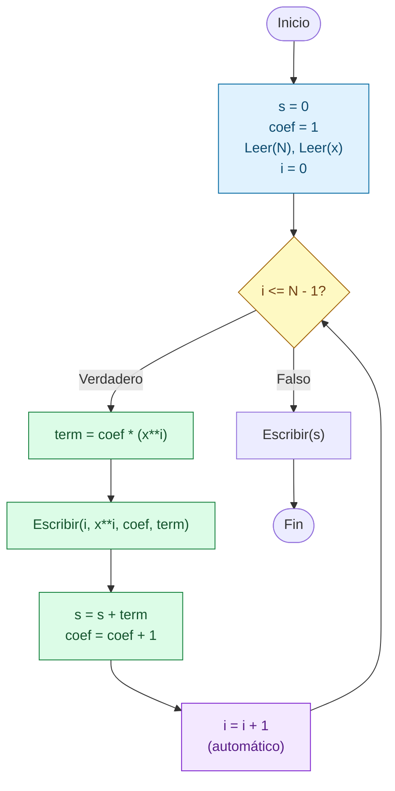

# Sesion magistral 19

* **Tipo**: Presencial
* **Fecha**: 29/09/2026
* **Parte**: Primer bloque de clase (14-16)

## Resumen

Esta sesión aplica el ciclo `Para` a un tipo de problema nuevo: **calcular la suma de los primeros términos de una serie matemática**. El problema de fondo es el mismo que el de la suma de los primeros `N` números de la [sesión 17](../sesion_magistral-17/README.md#parte-2--suma-de-los-primeros-n-números): un acumulador que empieza en `0` y un ciclo que le suma un valor en cada vuelta. La diferencia es que ahora el valor que se suma (el **término** de la serie) hay que calcularlo en cada vuelta a partir de la posición en que va el ciclo.

A partir de [`ejemplo1.py`](ejemplo1.py), la sesión se organiza en cuatro partes:

* **Parte 1** presenta el enunciado del problema.
* **Parte 2** diseña la solución: primero se analiza la serie para encontrar su **término general** (la fórmula que da cualquier término a partir de su posición), y luego se definen las entradas, las salidas, el plan y las variables, siguiendo el formato del [Laboratorio 3](../../../laboratorios/3/README.md).
* **Parte 3** presenta el pseudocódigo y el código Python, los casos de prueba y la comparación con `while`.
* **Parte 4** muestra otras dos formas de calcular el término y resume los pasos para resolver cualquier problema de series.

**Contenido de esta página:**

* [Parte 1 — Enunciado](#parte-1--enunciado)
* [Parte 2 — Diseño de la solución](#parte-2--diseño-de-la-solución)
* [Parte 3 — Solución](#parte-3--solución)
* [Parte 4 — Otras formas de calcular el término](#parte-4--otras-formas-de-calcular-el-término)
* [Para explorar por su cuenta](#para-explorar-por-su-cuenta)

## Parte 1 — Enunciado

> Escriba un programa que lea la cantidad de términos `N` y un valor real `x`, y calcule la suma de los primeros `N` términos de la siguiente serie:
>
> $$s = 1 + 2x + 3x^2 + 4x^3 + \cdots + N\,x^{N-1}$$
>
> Además de la suma final, el programa debe mostrar, para cada término, su posición `i`, la potencia $x^i$, el coeficiente y el valor del término.

**Ejemplo de ejecución** (`N = 4`, `x = 2`, es decir, $s = 1 + 2 \cdot 2 + 3 \cdot 2^2 + 4 \cdot 2^3$):

```
Digite el numero de entradas: 4
Digite el valor de la variable: 2
i = 0; x**i = 1.0, coef = 1, term = 1.0
i = 1; x**i = 2.0, coef = 2, term = 4.0
i = 2; x**i = 4.0, coef = 3, term = 12.0
i = 3; x**i = 8.0, coef = 4, term = 32.0
s = 49.0
```

## Parte 2 — Diseño de la solución

### Análisis de la serie: el término general

Antes de pensar en el ciclo, hay que entender la serie. La forma más segura es escribir los primeros términos en una tabla, numerándolos desde `0` (así se numeran las iteraciones de `range(N)`), y separar cada término en sus partes:

| Término | Posición `i` | Coeficiente | Potencia de `x` |
|---|---|---|---|
| $1$ | 0 | 1 | $x^0 = 1$ |
| $2x$ | 1 | 2 | $x^1$ |
| $3x^2$ | 2 | 3 | $x^2$ |
| $4x^3$ | 3 | 4 | $x^3$ |
| $\vdots$ | $\vdots$ | $\vdots$ | $\vdots$ |
| $N\,x^{N-1}$ | $N - 1$ | $N$ | $x^{N-1}$ |

Leyendo la tabla por columnas aparecen dos patrones:

* El **coeficiente** siempre es uno más que la posición: `i + 1`. Arranca en `1` y aumenta de 1 en 1, como un contador.
* El **exponente** de `x` es exactamente la posición `i`.

Con eso, el término que ocupa la posición `i` es:

$$t_i = (i + 1)\,x^i \qquad i = 0, 1, 2, \ldots, N - 1$$

y la serie completa se puede escribir como una sumatoria:

$$s = \sum_{i=0}^{N-1} (i + 1)\,x^i$$

Esta fórmula es la que se programa. El ciclo recorre las posiciones `i = 0, 1, …, N - 1`, en cada vuelta calcula $t_i$ y lo suma al acumulador `s`.

> [!NOTE]
> El primer término, `1`, no parece seguir el patrón, pero sí lo sigue: con `i = 0` el término general da $(0 + 1)\,x^0 = 1 \cdot 1 = 1$, porque cualquier número elevado a la `0` es `1`. Por eso no hace falta tratarlo como un caso especial.

### Entradas y salidas

| Entradas | Salidas |
|---|---|
| Cantidad de términos a sumar (`N`) | Para cada término: su posición, la potencia $x^i$, el coeficiente y su valor |
| Valor real de la variable (`x`) | La suma `s` de los `N` términos |

La cantidad de términos `N` se lee **antes** del ciclo, así que el número de iteraciones es conocido y el problema se resuelve con un ciclo `Para`, como los de las sesiones 17 y 18.

### Plan en palabras

1. Inicializar el acumulador de la suma en `0` y el coeficiente en `1` (el coeficiente del primer término).
2. Leer la cantidad de términos `N` y el valor de `x`.
3. Repetir para cada posición `i`, desde `0` hasta `N - 1`:
   1. Calcular el término: el coeficiente multiplicado por `x` elevado a la `i`.
   2. Mostrar la posición, la potencia, el coeficiente y el término.
   3. Sumar el término al acumulador.
   4. Aumentar el coeficiente en 1, para el término siguiente.
4. Al terminar el ciclo, mostrar la suma.

### Definición de variables

| Variable | Descripción | Rol (si aplica) |
|---|---|---|
| `N` | Cantidad de términos a sumar (dato de entrada) | |
| `x` | Valor real de la variable de la serie (dato de entrada) | |
| `i` | Posición del término actual (de `0` a `N - 1`); también es el exponente de `x` | Variable de control del ciclo |
| `coef` | Coeficiente del término actual (1, 2, 3, …) | Contador |
| `term` | Valor del término actual, $(i + 1)\,x^i$; se recalcula en cada vuelta | |
| `s` | Suma de los términos calculados hasta el momento (dato de salida) | Acumulador |

Dos detalles:

* **`i` cumple dos papeles.** Es la variable de control del ciclo (cuenta las vueltas) y, al mismo tiempo, es el exponente de `x`. Se aprovecha que la posición de cada término coincide con su exponente.
* **`term` no es un acumulador.** No guarda nada de una vuelta a la siguiente: en cada vuelta se calcula de nuevo, se usa y se reemplaza en la vuelta siguiente. El que sí acumula es `s`.

## Parte 3 — Solución

<table>
<tr><th>Pseudocódigo</th><th>Python</th></tr>
<tr><td>

```
Inicio
  s = 0
  coef = 1
  Leer(N)
  Leer(x)
  Para (i = 0,N - 1,1) Haga
    term = coef * (x**i)
    Escribir('i = ', i, '; x**i = ', x**i,
             ', coef = ', coef, ', term = ', term)
    s = s + term
    coef = coef + 1
  Fin_Para
  Escribir('s = ', s)
Fin
```

</td><td>

```python
# Inicializacion de variables

s = 0
coef = 1

# Entradas
N = int(input("Digite el numero de entradas: "))
x = float(input("Digite el valor de la variable: "))

# Proceso
for i in range(N):
    term = coef*(x**i)
    print(f"i = {i}; x**i = {x**i}, coef = {coef}, term = {term}")
    s += term
    coef += 1

# Salidas
print(f"s = {s}")
```

</td></tr>
</table>



**Código**: [ejemplo1.py](ejemplo1.py)

El cuerpo del ciclo sigue siempre el mismo orden: **calcular** el término, **mostrarlo**, **acumularlo** y **preparar** el coeficiente del término siguiente. El orden importa (ver la [Parte 1 de la sesión 16](../../7/sesion_magistral-16/README.md#parte-1--orden-de-las-instrucciones-dentro-del-ciclo)): si `coef += 1` se escribiera antes de calcular `term`, el primer término usaría el coeficiente `2` y toda la serie quedaría corrida en uno.

> [!TIP]
> El `print` dentro del ciclo es la misma técnica de las sesiones 17 y 18 (una prueba de escritorio automática), pero aquí se deja **activo** porque el enunciado pide mostrar cada término. Permite comprobar, vuelta por vuelta, que el programa calcula los mismos términos que se escribieron a mano en la tabla de la Parte 2.

### Casos de prueba

Varios casos se escogieron porque su resultado se puede comprobar sin el programa:

| Caso | `N` | `x` | Serie | Suma esperada | Qué prueba |
|---|---|---|---|---|---|
| 1 | 4 | 2 | $1 + 4 + 12 + 32$ | `49.0` | Caso general |
| 2 | 4 | 1 | $1 + 2 + 3 + 4$ | `10.0` | Con `x = 1` todas las potencias valen `1` y la serie se vuelve la suma de 1 a `N` de la [sesión 17](../sesion_magistral-17/README.md#parte-2--suma-de-los-primeros-n-números) |
| 3 | 4 | -1 | $1 - 2 + 3 - 4$ | `-2.0` | Con `x = -1` los signos se alternan solos, como con `(-1)**e` en la [Parte 4 de la sesión 17](../sesion_magistral-17/README.md#parte-4--secuencia-alternante-de-signos) |
| 4 | 5 | 0.5 | $1 + 1 + 0.75 + 0.5 + 0.3125$ | `3.5625` | Con `0 < x < 1` las potencias se hacen cada vez más pequeñas |
| 5 | 3 | 0 | $1 + 0 + 0$ | `1.0` | Con `x = 0` solo queda el primer término, porque en Python `0.0**0` vale `1.0` |
| 6 | 0 | 3 | (ningún término) | `0` | El cuerpo no se ejecuta; `s` conserva su valor inicial |

En el Caso 6 el programa imprime `s = 0` y no `s = 0.0`. `s` se inicializó con el entero `0` y, como no se le sumó ningún término, nunca pasó a ser decimal. En los demás casos, al sumarle el primer término (un `float`, porque `x` se leyó con `float()`), `s` pasa a ser decimal. Algo parecido pasa si `N` es negativo: `range(N)` no produce ningún valor y el resultado también es `s = 0`. El programa no valida que `N` sea positivo.

**Prueba de escritorio** (Caso 1: `N = 4`, `x = 2`):

|`i`|`coef`|`x**i`|`term`|`s`|
|---|---|---|---|---|
|—|1|—|—|0|
|0|1|1.0|1.0|1.0|
|1|2|2.0|4.0|5.0|
|2|3|4.0|12.0|17.0|
|3|4|8.0|32.0|**49.0**|

La columna `coef` muestra el valor que se usó para calcular `term` en esa vuelta. Al final de cada vuelta `coef` aumenta en 1, así que después de la última vuelta queda en `5`, pero ese valor ya no se usa.

**Resultados de ejecución** (se verificaron los seis casos; se muestran el 3 y el 6):

```
Digite el numero de entradas: 4
Digite el valor de la variable: -1
i = 0; x**i = 1.0, coef = 1, term = 1.0
i = 1; x**i = -1.0, coef = 2, term = -2.0
i = 2; x**i = 1.0, coef = 3, term = 3.0
i = 3; x**i = -1.0, coef = 4, term = -4.0
s = -2.0
```

```
Digite el numero de entradas: 0
Digite el valor de la variable: 3
s = 0
```

### Comparación: while vs. for

Como en las sesiones [17](../sesion_magistral-17/README.md) y [18](../sesion_magistral-18/README.md), se muestra la misma solución escrita con `while` (se omite el `print` de cada término para que la comparación sea más corta):

<table>
<tr><th>Solución con <code>while</code></th><th>Solución con <code>for</code></th></tr>
<tr><td>

```python
s = 0
coef = 1
N = int(input("Digite el numero de entradas: "))
x = float(input("Digite el valor de la variable: "))
i = 0                   # Inicialización
while i < N:            # Condición
    term = coef*(x**i)
    s += term
    coef += 1
    i += 1              # Actualización
print(f"s = {s}")
```

</td><td>

```python
s = 0
coef = 1
N = int(input("Digite el numero de entradas: "))
x = float(input("Digite el valor de la variable: "))
# Inicialización, condición y
# actualización en la cabecera
for i in range(N):
    term = coef*(x**i)
    s += term
    coef += 1
print(f"s = {s}")
```

</td></tr>
</table>

En la versión `while` se ve con claridad que `i` y `coef` avanzan juntos: los dos aumentan en 1 al final de cada vuelta, y `coef` siempre va uno por delante de `i`. Esa observación lleva a la primera variante de la Parte 4.

## Parte 4 — Otras formas de calcular el término

La solución de la Parte 3 no es la única. Las dos variantes siguientes calculan exactamente la misma suma (se verificaron con los seis casos de prueba) y muestran ideas útiles para otras series.

### Variante 1 — sin la variable `coef`

Como `coef` siempre vale `i + 1`, se puede eliminar y escribir el término general tal como quedó en la Parte 2:

<table>
<tr><th>Con <code>coef</code> (Parte 3)</th><th>Sin <code>coef</code></th></tr>
<tr><td>

```python
s = 0
coef = 1
N = int(input("Digite el numero de entradas: "))
x = float(input("Digite el valor de la variable: "))
for i in range(N):
    term = coef*(x**i)
    s += term
    coef += 1
print(f"s = {s}")
```

</td><td>

```python
s = 0
N = int(input("Digite el numero de entradas: "))
x = float(input("Digite el valor de la variable: "))
for i in range(N):
    term = (i + 1)*(x**i)
    s += term
print(f"s = {s}")
```

</td></tr>
</table>

La versión sin `coef` es más corta y se parece más a la fórmula $t_i = (i + 1)\,x^i$. La versión con `coef` hace más visible cada parte del término por separado, lo que ayuda mientras se está aprendiendo a descomponer una serie. Las dos son correctas.

### Variante 2 — la potencia como acumulador de producto

En vez de calcular `x**i` desde cero en cada vuelta, se puede guardar la potencia en una variable `pot` y multiplicarla por `x` al final de cada vuelta. Así, `pot` vale $1, x, x^2, x^3, \ldots$ en vueltas sucesivas:

```python
s = 0
coef = 1
pot = 1                 # x elevado a la 0
N = int(input("Digite el numero de entradas: "))
x = float(input("Digite el valor de la variable: "))
for i in range(N):
    term = coef*pot
    s += term
    coef += 1
    pot *= x            # prepara x elevado a la i + 1
print(f"s = {s}")
```

`pot` es un **acumulador de producto**, como `fact` en el factorial de la [sesión 17](../sesion_magistral-17/README.md#parte-3--factorial-de-un-número): empieza en `1` (el valor neutro de la multiplicación) y en cada vuelta se multiplica por algo. La idea de fondo es que **cada término se puede construir a partir del anterior**, en vez de calcularlo desde cero. Esa idea es muy útil en series cuyos términos tienen factoriales, porque recalcular un factorial en cada vuelta exige un ciclo adicional.

### Resumen: pasos para resolver un problema de series

1. **Escribir los primeros términos en una tabla**, con su posición (desde `0` si se va a usar `range(N)`).
2. **Separar cada término en sus partes** (coeficiente, potencia, signo, denominador, factorial…) y ver cómo cambia cada parte de un término al siguiente.
3. **Escribir el término general** en función de la posición `i`, y comprobarlo con el primer término.
4. **Programar el patrón del acumulador**: `s = 0` antes del ciclo, y en el cuerpo calcular el término y sumarlo.
5. **Probar con valores cuyo resultado se conoce** (como `x = 1` o `x = 0` en esta serie) antes de confiar en el programa.

Estos mismos pasos sirven para las series de los ejercicios 6 (aproximación de π) y 8 (aproximación de cos(x)) del [Laboratorio 3](../../../laboratorios/3/README.md).

## Para explorar por su cuenta

*Ideas complementarias para practicar con este mismo ejemplo. No hacen parte del contenido principal de la sesión.*

### ¿A qué valor se acerca la suma?

Ejecute el programa con `x = 0.5` y valores de `N` cada vez más grandes. Con el `print` de cada término comentado, se obtiene:

| `N` | `s` |
|---|---|
| 5 | 3.5625 |
| 10 | 3.9765625 |
| 20 | 3.999958038330078 |
| 50 | 3.9999999999999076 |

La suma se acerca cada vez más a `4` sin pasarse. Se dice que la serie **converge** a 4. Cuando $x$ está entre $-1$ y $1$ (sin incluirlos), esta serie converge a $\frac{1}{(1 - x)^2}$, y con $x = 0.5$ ese valor es $\frac{1}{0.25} = 4$. Pruebe ahora con `x = 2` y `N` cada vez más grande: ¿qué pasa con la suma?

### Mostrar la suma con seis decimales

Cambie el último `print` para usar el formato `:.6f` de los f-strings (`print(f"s = {s:.6f}")`), el mismo que se pide en las series del Laboratorio 3. Con `N = 20` y `x = 0.5`, ¿qué se imprime?

### Mostrar la suma parcial en cada vuelta

Agregue `s` al `print` del ciclo para ver cómo va creciendo la suma término a término. Es la misma idea de la tabla del ejercicio 6 del [Laboratorio 3](../../../laboratorios/3/README.md), que muestra la aproximación obtenida con 1 término, 2 términos, y así sucesivamente.

> [!Important]
> Se usó IA generativa para redactar y organizar este contenido a partir del material de la clase. El docente revisó y validó la versión final.
