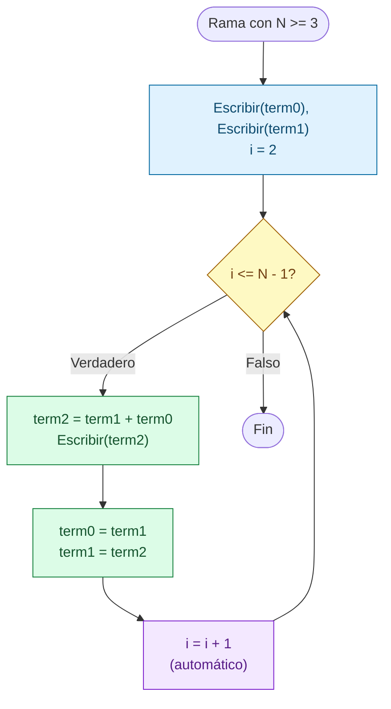
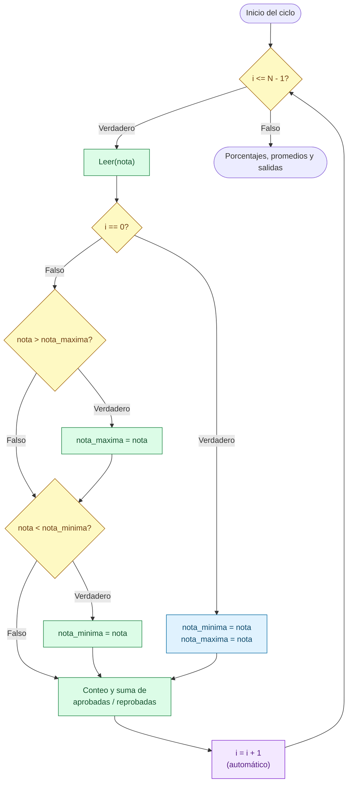

# Sesion magistral 20

* **Tipo**: Presencial
* **Fecha**: 29/09/2026
* **Parte**: Segundo bloque de clase (16-18)

## Resumen

Esta sesión continúa la [sesión 19](../sesion_magistral-19/README.md) con dos ejemplos más del ciclo `Para`, los ejemplos 8 y 9 de la [teoría de la clase 8](../teoria/README.md). Los dos tienen algo en común: en cada vuelta del ciclo no basta con sumar o contar, sino que hay que **recordar valores de vueltas anteriores** para decidir qué hacer en la vuelta actual.

Los ejemplos se escribieron en **Google Colab**, una versión en línea de los notebooks de Jupyter que se vieron en la sesión 19, y se descargaron como archivos `.ipynb`:

* **Parte 1** explica qué es Google Colab y cómo crear, ejecutar, descargar y abrir notebooks en él.
* **Parte 2** genera la serie de Fibonacci ([`ejemplo_fibonacci.ipynb`](ejemplo_fibonacci.ipynb)) con **variables temporales**: dos variables que guardan los dos últimos términos y se "corren" en cada vuelta.
* **Parte 3** retoma las calificaciones de la [sesión 18](../sesion_magistral-18/README.md) ([`calificaciones.ipynb`](calificaciones.ipynb)) para encontrar la **nota máxima y la nota mínima** del curso, y compara las dos formas en que se resolvió: iniciar con los extremos del rango de notas, o iniciar con la primera nota leída.

**Contenido de esta página:**

* [Parte 1 — El entorno de trabajo: Google Colab](#parte-1--el-entorno-de-trabajo-google-colab)
* [Parte 2 — Serie de Fibonacci: variables temporales](#parte-2--serie-de-fibonacci-variables-temporales)
* [Parte 3 — Valores extremos: nota máxima y nota mínima](#parte-3--valores-extremos-nota-máxima-y-nota-mínima)
* [Para explorar por su cuenta](#para-explorar-por-su-cuenta)

## Parte 1 — El entorno de trabajo: Google Colab

### ¿Qué es Google Colab?

**Google Colab** (Colaboratory) es un servicio gratuito de Google para trabajar con notebooks desde el navegador. Está basado en Jupyter, así que los notebooks tienen las mismas celdas de código y de texto, y el mismo formato de archivo `.ipynb`, que se explicaron en la [Parte 5 de la sesión 19](../sesion_magistral-19/README.md#qué-es-un-notebook). La diferencia está en **dónde** se ejecuta el código:

| | Jupyter Notebook (Anaconda) | Google Colab |
|---|---|---|
| Dónde se ejecuta el código | En su computador | En una máquina virtual de Google, en internet |
| Qué hay que instalar | Anaconda | Nada: solo un navegador y una cuenta de Google |
| Dónde se guardan los notebooks | En una carpeta de su computador | En su Google Drive, en la carpeta **Colab Notebooks** |
| ¿Necesita internet? | No | Sí, todo el tiempo |
| ¿Qué pasa si deja de usarlo un rato? | Nada: Jupyter sigue abierto mientras no lo cierre | La máquina virtual se elimina y **se pierden las variables** (el código y las salidas guardadas no se pierden) |

Colab es útil cuando se trabaja en un computador sin Anaconda (por ejemplo, en una sala de la universidad) o para compartir un notebook con otra persona, como un documento de Google Drive.

### Cómo crear un notebook en Colab

1. Entre a [colab.research.google.com](https://colab.research.google.com) e inicie sesión con su cuenta de Google.
2. En el menú **Archivo**, escoja **Cuaderno nuevo** (en Colab en español, los notebooks se llaman **cuadernos**). El cuaderno se guarda automáticamente en Google Drive, en la carpeta **Colab Notebooks**.
3. El cuaderno se crea con un nombre como `Untitled0.ipynb`. Haga clic sobre ese nombre, en la parte superior izquierda, para cambiarlo (por ejemplo, `ejemplo_fibonacci.ipynb`).
4. Agregue celdas con los botones **+ Código** y **+ Texto** de la barra superior.
5. Ejecute una celda con el botón ▶ que aparece a su izquierda, o con **Shift + Enter** (ejecuta y pasa a la celda siguiente). La primera ejecución tarda unos segundos, porque Colab se conecta a una máquina virtual (el **entorno de ejecución**). Cuando el programa usa `input`, aparece un cuadro de texto debajo de la celda para escribir el dato y presionar Enter.

> [!NOTE]
> Los nombres de los menús pueden variar un poco según el idioma de la cuenta y la versión de Colab. En inglés, por ejemplo, **Archivo → Cuaderno nuevo** aparece como **File → New notebook**, y el menú **Entorno de ejecución** como **Runtime**.

### Cómo descargar y abrir notebooks

**Descargar** (así se obtuvieron los archivos de esta sesión): en el menú **Archivo**, escoja **Descargar → Descargar .ipynb**. El archivo descargado se puede abrir después con Jupyter o con VS Code, siguiendo la [Parte 5 de la sesión 19](../sesion_magistral-19/README.md#cómo-abrir-un-notebook-que-ya-existe).

**Abrir** un notebook en Colab: en el menú **Archivo**, escoja **Abrir cuaderno**. La ventana que aparece tiene varias pestañas:

* **Google Drive**: los cuadernos que ya tiene en su Drive.
* **GitHub**: permite pegar el enlace de un notebook publicado en GitHub, como los de este repositorio, y abrirlo directamente en Colab.
* **Subir**: permite escoger un archivo `.ipynb` de su computador (por ejemplo, uno descargado de este repositorio).

> [!TIP]
> **Reiniciar y ejecutar todo, también en Colab.** La recomendación de la [sesión 19](../sesion_magistral-19/README.md#qué-es-un-notebook) vale igual aquí, y con más razón, porque Colab elimina la máquina virtual cuando no se usa: al volver, las variables ya no existen y las celdas que dependen de ellas fallan. Antes de descargar o entregar un cuaderno, use en el menú **Entorno de ejecución** la opción **Reiniciar sesión y ejecutar todo**, para comprobar que funciona de arriba hacia abajo.

> [!WARNING]
> **Revise el archivo antes de publicarlo.** Un `.ipynb` descargado de Colab puede guardar en sus datos internos (los *metadatos*, que no se ven al abrir el notebook) el nombre de la cuenta de Google que ejecutó cada celda. Si va a publicar el notebook, por ejemplo en GitHub, tenga en cuenta que esos datos viajan con el archivo. En el notebook de Fibonacci de esta sesión esos datos se borraron antes de subirlo al repositorio.

## Parte 2 — Serie de Fibonacci: variables temporales

> **Enunciado.** Hacer un programa que genere los `N` primeros términos de una serie Fibonacci.

Es el Ejemplo 8 de la [teoría de la clase 8](../teoria/README.md) ([ejemplo8_para.py](../teoria/codigo/ejemplo8_para.py)).

### Análisis de la serie

La serie de Fibonacci empieza con `0` y `1`, y cada término siguiente es la **suma de los dos anteriores**:

| Posición | 0 | 1 | 2 | 3 | 4 | 5 | 6 | 7 |
|---|---|---|---|---|---|---|---|---|
| Término | 0 | 1 | 1 | 2 | 3 | 5 | 8 | 13 |
| Cómo se obtiene | (dado) | (dado) | 0 + 1 | 1 + 1 | 1 + 2 | 2 + 3 | 3 + 5 | 5 + 8 |

A diferencia de la serie de la [sesión 19](../sesion_magistral-19/README.md#análisis-de-la-serie-el-término-general), aquí no hay una fórmula sencilla que dé el término a partir de su posición `i`. Cada término depende de los **dos términos anteriores**, así que el programa tiene que recordarlos de una vuelta a la siguiente.

La buena noticia es que **solo hacen falta los dos últimos**. Para calcular el 13 basta con conocer el 5 y el 8; el 0, el 1, el 1, el 2 y el 3 ya no se necesitan. Por eso el programa usa solo tres variables, que funcionan como una "ventana" que se corre un lugar en cada vuelta:

| Variable | Descripción | Rol |
|---|---|---|
| `N` | Cantidad de términos a mostrar (dato de entrada) | |
| `term0` | El penúltimo término calculado (dos lugares antes del nuevo) | Variable temporal |
| `term1` | El último término calculado (el anterior al nuevo) | Variable temporal |
| `term2` | El término nuevo, que se calcula y se muestra en la vuelta actual | |
| `i` | Posición del término que se calcula | Variable de control del ciclo |

> [!NOTE]
> En la descripción de variables del notebook, `term0` aparece como "antepenúltimo" y `term1` como "penúltimo". Esos nombres son correctos si se cuenta incluyendo al término nuevo (`term2` sería el último). En esta página se toma como referencia el término nuevo: `term1` es el anterior a él y `term0` el que está dos lugares antes. Las dos formas describen las mismas variables.

Se les llama **variables temporales** porque su valor solo sirve por un rato: `term0` y `term1` guardan los dos términos que se necesitan para calcular el siguiente, y en la vuelta siguiente se reemplazan por los dos más recientes.

### Solución

Los dos primeros términos (`0` y `1`) no se calculan: están dados. Por eso se muestran antes del ciclo, y el ciclo empieza en la posición `2`. Los casos en que se piden menos de tres términos se tratan aparte.

En el pseudocódigo del curso no existe una instrucción equivalente a `elif` (ver el [anexo del Laboratorio 3](../../../laboratorios/3/README.md)), así que la alternativa múltiple se escribe con bloques `Si...Sino` anidados:

<table>
<tr><th>Pseudocódigo</th><th>Python</th></tr>
<tr><td>

```
Inicio
  term0 = 0
  term1 = 1
  Leer(N)
  Si (N <= 0) Entonces
    Escribir('No hay numeros para mostrar')
  Sino
    Si (N == 1) Entonces
      Escribir('-> ', term0)
    Sino
      Si (N == 2) Entonces
        Escribir('-> ', term0)
        Escribir('-> ', term1)
      Sino
        Escribir('-> ', term0)
        Escribir('-> ', term1)
        Para (i = 2,N - 1,1) Haga
          term2 = term1 + term0
          Escribir('-> ', term2)
          term0 = term1
          term1 = term2
        Fin_Para
      Fin_Si
    Fin_Si
  Fin_Si
Fin
```

</td><td>

```python
# Inicializacion
term0 = 0
term1 = 1
term2 = 0
i = 0

# Entradas
N = int(input("Digite la cantidad de terminos a visualizar: "))

# Proceso y salidas
if(N <= 0):
  print("No hay numeros para mostrar")
elif(N == 1):
  # Solo un termino
  print(f"-> {term0}")
elif (N == 2):
  # Solo dos terminos
  print(f"-> {term0}")
  print(f"-> {term1}")
else:
  # Tres o mas terminos
  # Primeros dos terminos (fuera del ciclo)
  print(f"-> {term0}")
  print(f"-> {term1}")
  for i in range(2,N):
    # print(i)
    # Demas terminos
    term2 = term1 + term0
    print(f"-> {term2}")
    term0 = term1
    term1 = term2
```

</td></tr>
</table>

Dos detalles del código:

* El código usa sangría de **2 espacios** en vez de 4. Es la sangría que Colab usa por defecto. Python acepta cualquier cantidad de espacios, siempre que sea la misma dentro de un mismo bloque; la guía de estilo de Python recomienda 4.
* Las líneas `term2 = 0` e `i = 0` no son necesarias en Python: `term2` recibe su valor dentro del ciclo antes de usarse, y el `for` le da a `i` su valor inicial. No hacen daño, pero tampoco cambian el resultado.



El diagrama muestra solo la rama de tres o más términos, que es la que tiene el ciclo. El cuerpo tiene dos momentos: **calcular y mostrar** el término nuevo, y luego **correr la ventana** para la vuelta siguiente.

**Prueba de escritorio** (`N = 7`). Las columnas `term0` y `term1` muestran los valores al **final** de cada vuelta, después del corrimiento:

|`i`|`term2 = term1 + term0`|Se muestra|`term0`|`term1`|
|---|---|---|---|---|
|—|—|`0`, `1` (antes del ciclo)|0|1|
|2|1 + 0 = 1|`1`|1|1|
|3|1 + 1 = 2|`2`|1|2|
|4|2 + 1 = 3|`3`|2|3|
|5|3 + 2 = 5|`5`|3|5|
|6|5 + 3 = 8|`8`|5|8|

Salida completa: `0, 1, 1, 2, 3, 5, 8`, siete términos. Siguiendo las columnas se ve la ventana corriéndose: el `term1` de una fila pasa a ser el `term0` de la fila siguiente, y el `term2` recién calculado pasa a ser el nuevo `term1`.

### El orden del corrimiento importa

Las dos líneas del corrimiento no se pueden intercambiar. Si se escribe primero `term1 = term2` y después `term0 = term1`, el valor anterior de `term1` se pierde antes de pasarlo a `term0`, y las dos variables terminan con el mismo valor:

<table>
<tr><th>Orden correcto</th><th>Orden invertido (error)</th></tr>
<tr><td>

```python
term0 = term1
term1 = term2
```

</td><td>

```python
term1 = term2
term0 = term1   # term1 ya vale term2
```

</td></tr>
<tr><td>

```
-> 0
-> 1
-> 1
-> 2
-> 3
-> 5
-> 8
```

</td><td>

```
-> 0
-> 1
-> 1
-> 2
-> 4
-> 8
-> 16
```

</td></tr>
</table>

Con el orden invertido, a partir del cuarto término cada término es el doble del anterior, porque `term0` y `term1` siempre valen lo mismo. Es otro caso del tema de la [Parte 1 de la sesión 16](../../7/sesion_magistral-16/README.md#parte-1--orden-de-las-instrucciones-dentro-del-ciclo): el orden de las instrucciones dentro del ciclo cambia el resultado. La regla para no equivocarse es **guardar primero el valor que se va a perder**: `term0` recibe el valor de `term1` antes de que `term1` se reemplace.

### Casos de prueba

| Caso | `N` | Salida esperada | Qué prueba |
|---|---|---|---|
| 1 | 5 | `0, 1, 1, 2, 3` | La entrada usada en clase |
| 2 | 10 | `0, 1, 1, 2, 3, 5, 8, 13, 21, 34` | Varias vueltas del ciclo |
| 3 | 2 | `0, 1` | La rama `N == 2` |
| 4 | 1 | `0` | La rama `N == 1` |
| 5 | 0 | `No hay numeros para mostrar` | La rama `N <= 0` |
| 6 | -3 | `No hay numeros para mostrar` | Un valor negativo también cae en la primera rama |

**Resultado de ejecución** (Caso 1, la salida guardada en el notebook):

```
Digite la cantidad de terminos a visualizar: 5
-> 0
-> 1
-> 1
-> 2
-> 3
```

> **Pregunta para pensar:** con `N = 2`, ¿qué pasaría si se borrara la rama `elif (N == 2)` y ese caso lo atendiera el `else`? Pista: ¿cuántas vueltas da `range(2, 2)`? ¿Se podría hacer lo mismo con la rama `N == 1`?

### Comparación con la teoría

La solución de la teoría, [ejemplo8_para.py](../teoria/codigo/ejemplo8_para.py), usa la misma idea con otros nombres (`n0`, `n1`, `n2`) y tiene dos diferencias:

* No tiene una rama para `N == 2`: la resuelve la rama general, con un ciclo que no da ninguna vuelta.
* Solo muestra un mensaje cuando `N` es negativo. Con `N = 0` no muestra nada, mientras que el notebook muestra `No hay numeros para mostrar`.

## Parte 3 — Valores extremos: nota máxima y nota mínima

> **Enunciado.** Hacer un programa que lea primero el número de estudiantes de un curso (`N`), y luego lea las `N` notas correspondientes (valores decimales entre 0.0 y 5.0), una a una.
>
> Considere que la nota mínima aprobatoria es 3.0: una nota es aprobada si es mayor o igual a 3.0, y reprobada si es menor a 3.0.
>
> Al finalizar la lectura, el programa deberá entregar:
>
> * El porcentaje de estudiantes aprobados.
> * El porcentaje de estudiantes reprobados.
> * El promedio de las notas aprobadas.
> * El promedio de las notas reprobadas.
> * El promedio de las notas del curso.
> * La máxima nota obtenida en el curso.
> * La mínima nota obtenida en el curso.

Es el Ejemplo 9 de la [teoría de la clase 8](../teoria/README.md), una actualización del Ejemplo 5 que se trabajó en la [sesión 18](../sesion_magistral-18/README.md). Frente a la versión de la sesión 18, el programa cambia en dos cosas:

* Muestra los **porcentajes** de aprobados y reprobados, como pedía el enunciado original. En la sesión 18 se mostraban las cantidades y los porcentajes quedaron [como ejercicio](../sesion_magistral-18/README.md#completar-el-enunciado-los-porcentajes).
* Agrega la **nota máxima** y la **nota mínima** del curso. Esta página se concentra en esta parte, que es la nueva.

### El patrón: guardar el mejor valor visto hasta el momento

Para encontrar la nota más alta sin guardar todas las notas, se usa la misma idea que usaría una persona que revisa una pila de exámenes uno por uno: recordar **la nota más alta que ha visto hasta ahora**. Con cada examen nuevo, compara: si la nota nueva es más alta que la que recordaba, la reemplaza; si no, sigue con la que tenía. Al terminar la pila, la nota que recuerda es la máxima.

En el programa, esa "nota recordada" es una variable (`nota_maxima`), y la comparación va dentro del ciclo, después de leer cada nota:

```python
if(nota > nota_maxima):
    nota_maxima = nota
```

Para la mínima es igual, con la comparación al revés (`nota < nota_minima`).

Este patrón tiene una pregunta difícil: **¿con qué valor empieza `nota_maxima` antes de ver la primera nota?** Todavía no se ha visto ninguna, así que no hay una "más alta hasta ahora". El notebook responde esa pregunta de dos formas.

### Forma 1 — iniciar con los extremos del rango de notas

La primera forma aprovecha que las notas están entre `0.0` y `5.0`. La nota máxima empieza en el valor **más bajo posible** (`0.0`) y la mínima en el **más alto posible** (`5.0`). Parece al revés, pero es intencional: así, la primera nota que se lea siempre podrá reemplazarlas. Una nota real nunca es menor que `0.0`, así que la máxima solo puede subir desde ahí; y nunca es mayor que `5.0`, así que la mínima solo puede bajar.

Este es el programa completo de la Forma 1. Las líneas nuevas frente a la sesión 18 son las de las constantes `MAXIMO` y `MINIMO`, la inicialización de los extremos, los dos `if` al comienzo del ciclo, los porcentajes y los dos últimos `print`:

```python
# Constantes
NOTA_MINIMA = 3.0
MAXIMO = 5.0
MINIMO = 0.0

# Inicializacion
notas_reprobadas = 0
notas_aprobadas = 0
suma_reprobadas = 0
suma_aprobadas = 0
# Notas maxima y minima
nota_minima = MAXIMO
nota_maxima = MINIMO

# Solicitud de la nota del estudiante
N = int(input('Ingrese el número de estudiantes: '))
for i in range(N):
    # Solicitud de la nota del estudiante
    nota = float(input(f'Ingrese la nota del estudiante {i+1}: '))
    
    # Actualizacion de las nota maxima
    if(nota > nota_maxima):
        nota_maxima = nota
    # Actualizacion de las nota minima
    if(nota < nota_minima):
        nota_minima = nota
    
    # Validadación si gano o perdio
    if nota >= NOTA_MINIMA:
        # Gano
        notas_aprobadas += 1    
        suma_aprobadas += nota  
    else:
        # Perdio
        notas_reprobadas += 1
        suma_reprobadas += nota

    
# Calculo de los totales 
suma_notas = suma_reprobadas + suma_aprobadas
total_notas = notas_reprobadas + notas_aprobadas


if total_notas == 0:
    # Caso en el que no hay estudiantes
    print("No hay estudiantes")
else:
    # Caso en el que hay estudiantes

    # Calculo de los porcentajes y promedios
    p_aprobaron = (notas_aprobadas/total_notas)*100
    p_reprobaron = (notas_reprobadas/total_notas)*100

    if notas_aprobadas == 0:
        # Caso en el que nungun estudiante gano
        prom_nota_reprobada = suma_reprobadas/notas_reprobadas
        prom_nota_aprobada = 0
    elif notas_reprobadas == 0:
        # Caso en el que nungun estudiante perdio
        prom_nota_reprobada = 0
        prom_nota_aprobada = suma_aprobadas/notas_aprobadas
    else:
        # Caso en el que hay estudiantes que ganaron y perdieron
        prom_nota_reprobada = suma_reprobadas/notas_reprobadas
        prom_nota_aprobada = suma_aprobadas/notas_aprobadas
    prom = suma_notas/total_notas
    # Salida de datos (Despliegue de los resultados)
    print(f"Porcentaje de estudiantes que aprobaron: {p_aprobaron}%")
    print(f"Porcentaje de estudiantes que reprobaron: {p_reprobaron}%")
    print(f"Promedio de notas reprobadas: {prom_nota_reprobada}")
    print(f"Promedio de notas aprobadas: {prom_nota_aprobada}")
    print(f"Promedio general de notas: {prom}")
    print(f"Nota maxima: {nota_maxima}")
    print(f"Nota minima: {nota_minima}")
```

La parte de extremos, en pseudocódigo (se omiten los contadores y acumuladores, que son los de la sesión 18):

```
Inicio
  MAXIMO = 5.0
  MINIMO = 0.0
  nota_minima = MAXIMO
  nota_maxima = MINIMO
  Leer(N)
  Para (i = 0,N - 1,1) Haga
    Leer(nota)
    Si (nota > nota_maxima) Entonces
      nota_maxima = nota
    Fin_Si
    Si (nota < nota_minima) Entonces
      nota_minima = nota
    Fin_Si
    ... (conteo y suma de aprobadas y reprobadas)
  Fin_Para
  ... (porcentajes, promedios y salidas)
Fin
```

**Prueba de escritorio** (los datos usados en clase: `N = 4`, notas `2, 2.5, 3, 4.2`):

|`i`|`nota`|`nota > nota_maxima`?|`nota_maxima`|`nota < nota_minima`?|`nota_minima`|
|---|---|---|---|---|---|
|—|—|—|0.0|—|5.0|
|0|2.0|Sí (2.0 > 0.0)|2.0|Sí (2.0 < 5.0)|2.0|
|1|2.5|Sí|2.5|No|2.0|
|2|3.0|Sí|3.0|No|2.0|
|3|4.2|Sí|**4.2**|No|**2.0**|

En la primera vuelta, la nota `2.0` reemplaza a los dos valores iniciales a la vez: es la única nota vista, así que es al mismo tiempo la más alta y la más baja.

### Forma 2 — iniciar con la primera nota leída

La segunda forma no necesita conocer el rango de las notas. En la primera vuelta (`i == 0`) todavía no hay con qué comparar, así que la primera nota se toma directamente como máxima y como mínima. Desde la segunda vuelta en adelante se compara igual que en la Forma 1.

El resto del programa es idéntico al de la Forma 1, salvo que no tiene las constantes `MAXIMO` y `MINIMO` ni la inicialización de los extremos antes del ciclo. Esta es la comparación de los dos ciclos:

<table>
<tr><th>Forma 1 — extremos del rango</th><th>Forma 2 — primera nota</th></tr>
<tr><td>

```python
# antes del ciclo:
nota_minima = MAXIMO
nota_maxima = MINIMO

for i in range(N):
    nota = float(input(...))

    if(nota > nota_maxima):
        nota_maxima = nota
    if(nota < nota_minima):
        nota_minima = nota

    # ... aprobadas / reprobadas
```

</td><td>

```python
# antes del ciclo: nada


for i in range(N):
    nota = float(input(...))
    if i == 0:
        # Inicializacion (primera iteracion)
        nota_minima = nota
        nota_maxima = nota
    else:
        if(nota > nota_maxima):
            nota_maxima = nota
        if(nota < nota_minima):
            nota_minima = nota

    # ... aprobadas / reprobadas
```

</td></tr>
</table>

En pseudocódigo, el ciclo de la Forma 2 queda así:

```
  Para (i = 0,N - 1,1) Haga
    Leer(nota)
    Si (i == 0) Entonces
      nota_minima = nota
      nota_maxima = nota
    Sino
      Si (nota > nota_maxima) Entonces
        nota_maxima = nota
      Fin_Si
      Si (nota < nota_minima) Entonces
        nota_minima = nota
      Fin_Si
    Fin_Si
    ... (conteo y suma de aprobadas y reprobadas)
  Fin_Para
```



**Prueba de escritorio** (mismos datos: `2, 2.5, 3, 4.2`):

|`i`|`nota`|`i == 0`?|`nota_maxima`|`nota_minima`|
|---|---|---|---|---|
|0|2.0|Sí: se toma la primera nota|2.0|2.0|
|1|2.5|No: 2.5 > 2.0|2.5|2.0|
|2|3.0|No: 3.0 > 2.5|3.0|2.0|
|3|4.2|No: 4.2 > 3.0|**4.2**|**2.0**|

Antes de la primera vuelta, `nota_maxima` y `nota_minima` **no existen** en la Forma 2: se crean dentro del ciclo, cuando `i == 0`. Si `N` es `0`, el ciclo no da ninguna vuelta y nunca se crean, y un `print(nota_maxima)` produciría un error (`NameError`). El programa no falla porque esos `print` están dentro del `else` de `if total_notas == 0`, que con `N = 0` no se ejecuta. Es la misma protección que evita la división por cero en los promedios.

**Resultado de ejecución** (Forma 2, la salida guardada en el notebook):

```
Ingrese el número de estudiantes:  4
Ingrese la nota del estudiante 1:  2
Ingrese la nota del estudiante 2:  2.5
Ingrese la nota del estudiante 3:  3
Ingrese la nota del estudiante 4:  4.2
Porcentaje de estudiantes que aprobaron: 50.0%
Porcentaje de estudiantes que reprobaron: 50.0%
Promedio de notas reprobadas: 2.25
Promedio de notas aprobadas: 3.6
Promedio general de notas: 2.925
Nota maxima: 4.2
Nota minima: 2.0
```

> [!NOTE]
> La Forma 1 da exactamente la misma salida, pero en el notebook su última línea aparece como `Nota maxima: 2.0`, aunque el código imprime `Nota minima`. Es una salida de una ejecución anterior: probablemente ese `print` decía "maxima" (por ejemplo, al copiar la línea de arriba), el texto se corrigió después y la celda no se volvió a ejecutar. Es el caso que advierte la [sesión 19](../sesion_magistral-19/README.md#qué-es-un-notebook), y la razón para reiniciar y ejecutar todo antes de guardar.

### ¿Por qué dos `if` separados y no un `if-elif`?

Podría parecer que una nota no puede ser a la vez la nueva máxima y la nueva mínima, y que por eso basta con un `if-elif`. En la Forma 1 eso es un error, y los mismos datos de clase lo muestran:

<table>
<tr><th>Dos <code>if</code> separados (notebook)</th><th>Con <code>elif</code> (error)</th></tr>
<tr><td>

```python
if(nota > nota_maxima):
    nota_maxima = nota
if(nota < nota_minima):
    nota_minima = nota
```

```
Nota maxima: 4.2
Nota minima: 2.0
```

</td><td>

```python
if(nota > nota_maxima):
    nota_maxima = nota
elif(nota < nota_minima):
    nota_minima = nota
```

```
Nota maxima: 4.2
Nota minima: 5.0
```

</td></tr>
</table>

Con `elif`, la mínima nunca se actualiza: en la primera vuelta, `2.0 > 0.0` es verdadero, así que el `elif` ni se evalúa y `nota_minima` se queda en `5.0`. Y como las notas de clase vienen en orden creciente, en todas las vueltas siguientes la nota también supera a la máxima, y el `elif` tampoco se evalúa. El resultado dice que la nota mínima fue `5.0`, una nota que nadie sacó. En la Forma 1, la **primera nota siempre debe actualizar los dos extremos**, y eso solo se logra con dos `if` independientes.

En la Forma 2, en cambio, el `elif` sí funcionaría: después de la primera vuelta, la máxima y la mínima ya son notas reales, y una nota nueva no puede ser mayor que la máxima y menor que la mínima a la vez. Aun así, los dos `if` separados son la opción más segura, porque funcionan en las dos formas.

### Casos de prueba

Los siguientes casos se ejecutaron con las dos formas, y las dos dieron exactamente los mismos resultados:

| Caso | `N` | Notas | Máxima | Mínima | Qué prueba |
|---|---|---|---|---|---|
| 1 | 4 | 2, 2.5, 3, 4.2 | 4.2 | 2.0 | Los datos de clase, en orden creciente |
| 2 | 3 | 4.5, 3, 1 | 4.5 | 1.0 | Notas en orden decreciente: ahora es la mínima la que cambia en cada vuelta |
| 3 | 1 | 3.5 | 3.5 | 3.5 | Una sola nota es a la vez la máxima y la mínima |
| 4 | 3 | 4, 4, 4 | 4.0 | 4.0 | Notas iguales: con `>` y `<` estrictos, las repetidas no cambian nada |
| 5 | 2 | 0, 0 | 0.0 | 0.0 | En la Forma 1, la máxima nunca se reemplaza (`0.0 > 0.0` es falso), pero su valor inicial coincide con la respuesta correcta |
| 6 | 2 | 5, 5 | 5.0 | 5.0 | Lo mismo, con la mínima y el valor `5.0` |
| 7 | 0 | (ninguna) | — | — | Se imprime `No hay estudiantes` |
| 8 | 3 | 4, 7, -1 | 7.0 | -1.0 | Notas fuera del rango: el programa **no valida** y las acepta como máxima y mínima |

### Comparación de las dos formas

| | Forma 1 — extremos del rango | Forma 2 — primera nota |
|---|---|---|
| Valor inicial de los extremos | Los límites del rango, "al revés": máxima = `0.0`, mínima = `5.0` | La primera nota leída |
| ¿Necesita conocer el rango de los datos? | Sí | No |
| ¿Dónde se inicializan? | Antes del ciclo | Dentro del ciclo, con `if i == 0` |
| Costo | Ninguno adicional | Un `if` más en cada vuelta |
| Con `N = 0` | Las variables existen, con los valores iniciales | Las variables no existen; hay que evitar usarlas |
| Corresponde en la teoría a | Opción 1, [ejemplo9_opcion1.py](../teoria/codigo/ejemplo9_opcion1.py) | Opción 2, [ejemplo9_opcion2.py](../teoria/codigo/ejemplo9_opcion2.py) |

Las dos formas son correctas para este problema. La Forma 1 es la más sencilla cuando se conoce el rango de los datos, como pasa con las notas. La Forma 2 sirve siempre, incluso cuando no hay un rango conocido: por ejemplo, para encontrar la temperatura más baja de una lista de mediciones o el número más grande entre `N` enteros cualesquiera.

### Limitación pendiente: las notas no se validan

El Caso 8 muestra que ninguna de las dos formas revisa que la nota esté entre `0.0` y `5.0`. Una nota de `7.0` se acepta, se cuenta como aprobada y se reporta como la máxima. Es la misma limitación que dejó pendiente la [sesión 18](../sesion_magistral-18/README.md#limitación-pendiente-la-nota-no-se-valida).

La teoría la resuelve en [ejemplo9_opcion2.py](../teoria/codigo/ejemplo9_opcion2.py) con la instrucción `continue`, que descarta la nota inválida y salta a la vuelta siguiente sin contarla. Esa versión tiene un detalle que conecta con la Forma 2: si la **primera** nota es inválida y se descarta, en la vuelta `i == 1` todavía no se ha visto ninguna nota válida, así que la condición `i == 0` ya no sirve para saber cuándo inicializar. Por eso la teoría usa un contador aparte, `notas_validas`, y pregunta `if notas_validas == 0:` en lugar de `if i == 0:`.

## Para explorar por su cuenta

*Ideas complementarias para practicar con los ejemplos de esta sesión. No hacen parte del contenido principal de la sesión.*

### Intercambiar dos variables

La idea de la Parte 2 (guardar un valor en otra variable antes de que se pierda) aparece en su forma más sencilla cuando se quiere **intercambiar** el valor de dos variables. Escriba un programa que lea dos números `a` y `b`, intercambie sus valores y los muestre. Pruebe primero esta versión:

```python
a = int(input("a: "))
b = int(input("b: "))
a = b
b = a
print(f"a = {a}, b = {b}")
```

¿Por qué no funciona? Es el mismo error del corrimiento invertido de Fibonacci. Corríjalo usando una tercera variable, `tmp`, que guarde el valor de `a` antes de reemplazarlo. CS50x (Harvard) explica este mismo problema en su Week 4, en la sección *Swapping*.

> [!NOTE]
> Python permite además escribir el intercambio en una sola línea: `a, b = b, a`. Es una facilidad propia de Python, sin equivalente en el pseudocódigo del curso. Por eso conviene entender primero la versión con `tmp`, que funciona en cualquier lenguaje.

### ¿Cuál es el primer término de Fibonacci mayor que 1000?

Cambie el enunciado de la Parte 2: en vez de pedir `N` términos, el programa debe mostrar los términos de la serie **hasta** el primero que sea mayor que `1000`. Ya no se sabe cuántas vueltas se necesitan, así que el `Para` no sirve: ¿qué ciclo de la [clase 7](../../7/README.md) hay que usar? ¿Cómo cambia la condición?

### Las funciones `max()` y `min()` de Python

Python tiene las funciones `max()` y `min()`, que devuelven el mayor y el menor de varios valores. Con ellas, las dos actualizaciones de la Parte 3 se pueden escribir así:

```python
nota_maxima = max(nota_maxima, nota)
nota_minima = min(nota_minima, nota)
```

Compruebe que la Forma 1 sigue dando los mismos resultados con este cambio. El curso construye el patrón a mano con `if` porque es lo que hacen `max()` y `min()` por dentro, y porque la misma idea se necesita en problemas donde no basta con comparar números: por ejemplo, encontrar **qué estudiante** sacó la nota más alta, y no solo cuál fue la nota.

### Referencias

* Malan, D. (Harvard). *CS50 Introduction to Computer Science* — [Lecture 4: Memory — Swapping](https://cs50.harvard.edu/x/notes/4/#swapping).
* Google. [*Colaboratory — Preguntas frecuentes*](https://research.google.com/colaboratory/faq.html) (dónde se guardan los notebooks, formato `.ipynb`, máquinas virtuales que se eliminan tras un tiempo sin uso).
* Python Software Foundation. [*Built-in Functions* — `max()`](https://docs.python.org/3/library/functions.html#max) y [`min()`](https://docs.python.org/3/library/functions.html#min).

> [!Important]
> Se usó IA generativa para redactar y organizar este contenido a partir del material de la clase. El docente revisó y validó la versión final.
