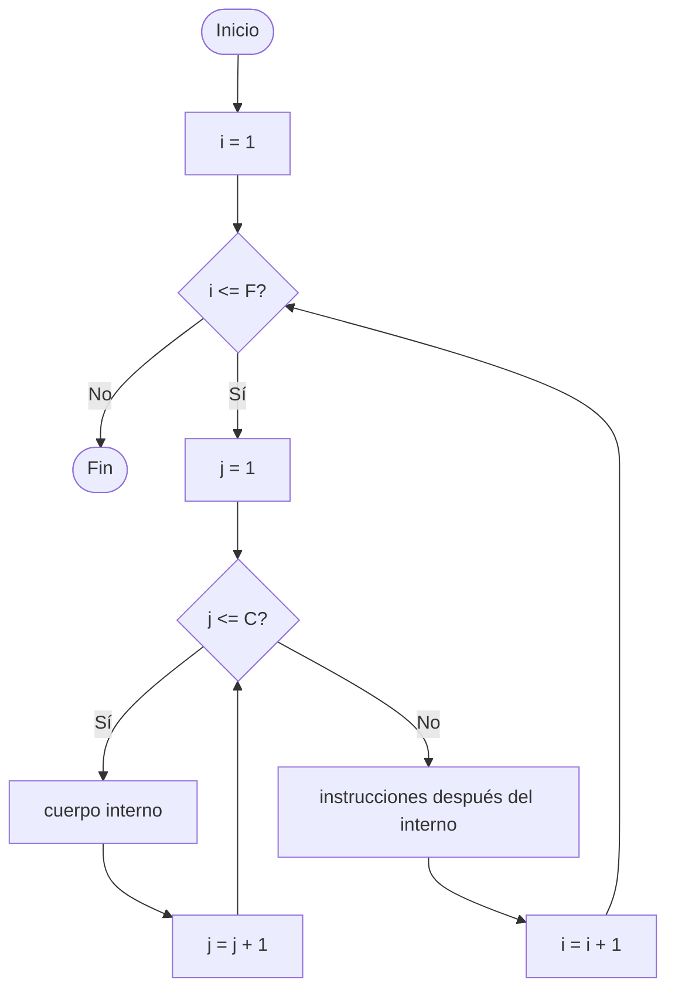

# Sesion magistral 21

* **Tipo**: Presencial
* **Fecha**: 06/10/2026
* **Parte**: Primer bloque de clase (14-16) — tentativo

## Resumen

Esta sesión vuelve a la [clase 8](../README.md) para cubrir con calma los **ciclos anidados**, el último tema de la [teoría de la clase 8](../teoria/README.md), que no alcanzó a trabajarse bien en las sesiones anteriores. Se resuelven los seis ejercicios de la diapositiva *"Ciclos anidados: Ejercicios"*, cada uno con su script en esta carpeta:

| # | Ejercicio | Script | Estado |
|---|---|---|---|
| 1 | Cuadrado de asteriscos | [`ejercicio1_anidados.py`](ejercicio1_anidados.py) | ✅ Correcto |
| 2 | Cuadrado de asteriscos hueco | [`ejercicio2_anidados.py`](ejercicio2_anidados.py) | ✅ Correcto |
| 3 | Pirámide de asteriscos | [`ejercicio3_anidados.py`](ejercicio3_anidados.py) | ✅ Correcto |
| 4 | Cantidad de primos hasta un número | [`ejercicio4_anidados.py`](ejercicio4_anidados.py) | ⚠️ Tiene errores — actividad |
| 5 | Los primeros `N` primos | [`ejercicio5_anidados.py`](ejercicio5_anidados.py) | ⚠️ Tiene errores — actividad |
| 6 | Aproximación de $e^x$ por serie | [`ejercicio6_anidados.py`](ejercicio6_anidados.py) | ✅ Correcto |

Los ejercicios 4 y 5 tienen errores que se dejan **a propósito** como actividad: en cada uno se explica qué falla y se demuestra con una ejecución, pero la corrección le corresponde a usted.

**Contenido de esta página:**

* [Repaso: ¿qué es un ciclo anidado?](#repaso-qué-es-un-ciclo-anidado)
* [Ejercicio 1 — Cuadrado de asteriscos](#ejercicio-1--cuadrado-de-asteriscos)
* [Ejercicio 2 — Cuadrado de asteriscos hueco](#ejercicio-2--cuadrado-de-asteriscos-hueco)
* [Ejercicio 3 — Pirámide de asteriscos](#ejercicio-3--pirámide-de-asteriscos)
* [Ejercicio 4 — Cantidad de primos hasta un número (actividad)](#ejercicio-4--cantidad-de-primos-hasta-un-número-actividad)
* [Ejercicio 5 — Los primeros N primos (actividad)](#ejercicio-5--los-primeros-n-primos-actividad)
* [Ejercicio 6 — Aproximación de eˣ](#ejercicio-6--aproximación-de-eˣ)
* [Consejos para usar contadores, banderas y acumuladores en ciclos anidados](#consejos-para-usar-contadores-banderas-y-acumuladores-en-ciclos-anidados)
* [Para explorar por su cuenta](#para-explorar-por-su-cuenta)

## Repaso: ¿qué es un ciclo anidado?

Un ciclo anidado es un ciclo que está **dentro del cuerpo** de otro ciclo. Cada uno tiene su propia variable de control (por lo general `i` para el externo y `j` para el interno), y su propia inicialización, condición y actualización.

La regla clave es esta: **por cada vuelta del ciclo externo, el ciclo interno se ejecuta completo**. Si el externo da `F` vueltas y el interno da `C` vueltas, el cuerpo del ciclo interno se ejecuta `F × C` veces.

<table>
<tr><th>Pseudocódigo</th><th>Python</th></tr>
<tr><td>

```
Para (i = 1,F,1) Haga
  Para (j = 1,C,1) Haga
    // cuerpo interno: F × C veces
  Fin_Para
  // después del interno: F veces
Fin_Para
```

</td><td>

```python
for i in range(1, F + 1):
    for j in range(1, C + 1):
        # cuerpo interno: F × C veces
        ...
    # después del interno: F veces
    ...
```

</td></tr>
</table>



Fíjese en que `j` vuelve a valer `1` **cada vez** que se entra al ciclo interno: el interno "arranca de cero" en cada vuelta del externo.

En los ejercicios de asteriscos (1, 2 y 3) se usa una idea muy útil para dibujar figuras: **el ciclo externo recorre las filas y el ciclo interno recorre las columnas** de cada fila. Para eso hacen falta dos detalles de `print`:

* `print("*", end="")` imprime un asterisco **sin** saltar de línea (por defecto `print` termina con un salto de línea; `end=""` lo cambia por nada).
* `print()` sin argumentos solo salta de línea. Se pone **después** del ciclo interno, para pasar a la siguiente fila.

## Ejercicio 1 — Cuadrado de asteriscos

> **Enunciado:** dado un entero positivo `N`, imprimir un cuadrado de asteriscos de `N × N`.

### Diseño

* **Entrada:** `N`, el lado del cuadrado.
* **Salida:** `N` filas, cada una con `N` asteriscos.
* **Plan:** repetir `N` veces (una por fila): imprimir `N` asteriscos seguidos y luego saltar de línea.

### Solución

<table>
<tr><th>Pseudocódigo</th><th>Python</th></tr>
<tr><td>

```
Inicio
  Leer(N)
  Para (i = 1,N,1) Haga
    Para (j = 1,N,1) Haga
      Escribir('*') // sin salto de línea
    Fin_Para
    Escribir() // salto de línea
  Fin_Para
Fin
```

</td><td>

```python
# Entradas
N = int(input("Ingrese el lado del cuadrado (numero positivo): "))

# Proceso y salidas
print()
for i in range(N):
    # Filas
    for j in range(N):
        # Columnas
        print("*", end="")
    print() # Cambio de linea
```

</td></tr>
</table>

En el script, `range(N)` recorre `0, 1, …, N - 1`: también son `N` vueltas. Como aquí no se usa el valor de `i` ni de `j` (solo importa **cuántas** vueltas se dan), da igual empezar en `0` o en `1`.

### Prueba de escritorio (`N = 3`)

| `i` | valores de `j` | se imprime en la fila |
|---|---|---|
| 0 | 0, 1, 2 | `***` |
| 1 | 0, 1, 2 | `***` |
| 2 | 0, 1, 2 | `***` |

El `print("*", end="")` se ejecutó `3 × 3 = 9` veces y el `print()` solo `3` veces. Salida:

```
Ingrese el lado del cuadrado (numero positivo): 3

***
***
***
```

> [!TIP]
> Pruebe mover el `print()` **dentro** del ciclo interno (con un nivel más de sangría). ¿Qué figura sale? ¿Y si se borra? Con ese experimento se ve que la **sangría** decide a qué ciclo pertenece cada instrucción.

## Ejercicio 2 — Cuadrado de asteriscos hueco

> **Enunciado:** dado un entero positivo `N`, imprimir un cuadrado de asteriscos de `N × N` que sea vacío por dentro; es decir, que el borde sea de un solo asterisco.

### Diseño

Hay dos tipos de filas:

| Fila | Qué se imprime |
|---|---|
| La primera (`i == 0`) y la última (`i == N - 1`) | `N` asteriscos |
| Las del medio | un asterisco, `N - 2` espacios y otro asterisco |

Por eso, dentro del ciclo de filas va una **alternativa doble** que decide qué tipo de fila imprimir, y cada rama tiene su propio ciclo interno.

### Solución

<table>
<tr><th>Pseudocódigo</th><th>Python</th></tr>
<tr><td>

```
Inicio
  Leer(N)
  Para (i = 0,N - 1,1) Haga
    Si (i == 0 o i == N - 1) Entonces
      Para (j = 1,N,1) Haga
        Escribir('*')
      Fin_Para
    Sino
      Escribir('*')
      Para (j = 1,N - 2,1) Haga
        Escribir(' ')
      Fin_Para
      Escribir('*')
    Fin_Si
    Escribir() // salto de línea
  Fin_Para
Fin
```

</td><td>

```python
# Entradas
N = int(input("Ingrese el lado del cuadrado (numero positivo): "))

# Proceso y salidas
print()
for i in range(N):
    # Bordes inferior y superior
    if i == 0 or i == N-1:
        # Se imprimen todas las columnas
        for j in range(N):
            print("*", end="")
    else:
        # Bordes laterales
        print("*", end="") # Borde izquierdo
        for j in range(1, N-1):
            print(" ", end="")
        print("*", end="") # Borde derecho
    # Cambio de linea (proxima fila)
    print()
```

</td></tr>
</table>

`range(1, N-1)` da `N - 2` vueltas, una por cada espacio interior.

### Casos de prueba

| `N` | Salida | Qué se comprueba |
|---|---|---|
| 5 | `*****`<br>`*   *`<br>`*   *`<br>`*   *`<br>`*****` | Caso general |
| 2 | `**`<br>`**` | No hay filas del medio: las dos filas son borde |
| 1 | `*` | Con una sola fila, `i == 0` y también `i == N - 1`: entra por el `if` una sola vez |

> [!NOTE]
> Una forma alternativa, sin `if` por tipo de fila, es decidir **asterisco por asterisco**: con dos ciclos completos de `N × N` vueltas, se imprime `*` si la posición está en el borde (`i == 0`, `i == N - 1`, `j == 0` o `j == N - 1`) y un espacio si no. Intente escribirla: es más corta, aunque hace más comparaciones.

## Ejercicio 3 — Pirámide de asteriscos

> **Enunciado:** dado un entero positivo `N`, imprimir una **pirámide** de asteriscos de `N` filas, centrada. La fila `i` (con `i` de `1` a `N`) empieza con `N - i` espacios, seguidos de `2i - 1` asteriscos. Por ejemplo, para `N = 4`:
>
> ```
>    *
>   ***
>  *****
> *******
> ```

> [!NOTE]
> La diapositiva plantea un **triángulo rectángulo**, en el que la fila `i` tiene `i` asteriscos. En clase se resolvió la versión de la **pirámide**, que es un poco más exigente porque hay que imprimir dos cosas por fila (espacios y asteriscos). El triángulo rectángulo queda como ejercicio en [Para explorar por su cuenta](#para-explorar-por-su-cuenta).

### Diseño

Primero se analiza la figura fila por fila (`N = 4`):

| Fila `i` | Espacios | Asteriscos |
|---|---|---|
| 1 | 3 | 1 |
| 2 | 2 | 3 |
| 3 | 1 | 5 |
| 4 | 0 | 7 |

En cada fila, los espacios **disminuyen en 1** y los asteriscos **aumentan en 2**. El script aprovecha esa regularidad con dos **contadores** que se actualizan al final de cada fila, en vez de calcular `N - i` y `2i - 1` con fórmulas:

| Variable | Descripción | Rol |
|---|---|---|
| `N` | Número de filas | Entrada |
| `i` | Fila actual | Variable de control (ciclo externo) |
| `j` | Posición dentro de la fila | Variable de control (ciclos internos) |
| `num_espacios` | Espacios que lleva la fila actual; empieza en `N - 1` | Contador (decrece de 1 en 1) |
| `num_asteriscos` | Asteriscos que lleva la fila actual; empieza en `1` | Contador (crece de 2 en 2) |

Esta vez **dentro del ciclo externo hay dos ciclos internos, uno después del otro**: primero el de los espacios y después el de los asteriscos.

### Solución

<table>
<tr><th>Pseudocódigo</th><th>Python</th></tr>
<tr><td>

```
Inicio
  num_asteriscos = 1
  Leer(N)
  num_espacios = N - 1
  Para (i = 1,N,1) Haga
    Para (j = 1,num_espacios,1) Haga
      Escribir(' ')
    Fin_Para
    num_espacios = num_espacios - 1
    Para (j = 1,num_asteriscos,1) Haga
      Escribir('*')
    Fin_Para
    num_asteriscos = num_asteriscos + 2
    Escribir() // salto de línea
  Fin_Para
Fin
```

</td><td>

```python
# Inicializacion
num_asteriscos = 1 # Contador de asteriscos por fila

# Entradas
N = int(input("Ingrese el numero de filas: "))
num_espacios = N - 1   # Contador de espacios por fila

# Proceso y salidas
for i in range(1, N+1):
    # Espacios por fila
    for j in range(num_espacios):
        print(" ", end="")
    num_espacios -= 1
    # Asteriscos por fila
    for j in range(num_asteriscos):
        print("*", end="")
    num_asteriscos += 2
    print()  # Nueva línea después de cada fila
```

</td></tr>
</table>

`num_espacios` se inicializa **después** de leer `N`, porque depende de ella.

### Prueba de escritorio (`N = 4`)

| `i` | `num_espacios` (antes) | `num_asteriscos` (antes) | Fila impresa |
|---|---|---|---|
| 1 | 3 | 1 | `···*` |
| 2 | 2 | 3 | `··***` |
| 3 | 1 | 5 | `·*****` |
| 4 | 0 | 7 | `*******` |

(En la tabla, `·` representa un espacio.) En la última fila, `range(0)` está vacío: el ciclo de espacios no da ninguna vuelta, y eso es justo lo que se necesita.

> [!TIP]
> Las variables `i` y `j` no se usan dentro de los cálculos: lo que controla cuántos espacios y asteriscos se imprimen son los contadores. Intente una segunda versión **sin** `num_espacios` ni `num_asteriscos`, usando directamente las fórmulas de la tabla de diseño: `range(N - i)` y `range(2 * i - 1)`. ¿Da la misma figura?

## Ejercicio 4 — Cantidad de primos hasta un número (actividad)

> **Enunciado:** hacer un programa que muestre la **cantidad** de números primos que hay entre `2` y un número ingresado por el usuario (incluido).
>
> Recuerde: un número **primo** es un entero **mayor que 1** que solo es divisible por `1` y por sí mismo; es decir, tiene exactamente dos divisores. Por eso el `1` **no es primo** (tiene un solo divisor), y el primer primo es el `2`.

### Idea de la solución

Es la primalidad del [Ejemplo 7 de la teoría](../teoria/README.md) (trabajada en la [Parte 7 de la sesión 19](../sesion_magistral-19/README.md)), pero ahora repetida para **cada número** de `1` a `num_sup`:

* El **ciclo externo** recorre los candidatos `i = 1, 2, …, num_sup`.
* El **ciclo interno** busca un divisor de `i` entre `2` e `i // 2`. Si encuentra uno, `i` no es primo y se rompe el ciclo con `break`.

El script usa `cnt_div` como una bandera disfrazada: empieza en `2` (los divisores `1` e `i`, que siempre existen), y si aparece otro divisor sube a `3` y se rompe el ciclo. Al final, `cnt_div <= 2` significa "no se encontró ningún otro divisor".

```python
# Entradas
num_sup = int(input("Indique el limite superior de los numeros a visualizar: "))

# Salidas
for i in range(1, num_sup+1):
    # print(i)
    cnt_div = 2  # Contador de divisores
    for j in range(2,i//2 + 1):
        if (i % j == 0):
            cnt_div += 1
            break
    # Salidas
    if (cnt_div <= 2):
        print(f"{i} ")
```

Observe que el `break` rompe solamente el ciclo **interno**: el externo sigue con el siguiente candidato. Es el caso del ejemplo 14 de la [teoría de la clase 7](../../7/teoria/README.md) (`break` en ciclos anidados).

### ⚠️ Errores para corregir

Al ejecutar el script con `num_sup = 20` se obtiene:

```
1
2
3
5
7
11
13
17
19
```

1. **No cumple el enunciado.** El enunciado pide la **cantidad** de primos (para `20` la respuesta es `8`), pero el programa nunca dice cuántos son. Mostrar la lista de primos (uno por línea) no está mal, y sirve para comprobar el resultado, pero no reemplaza la cantidad que se pide.
2. **El 1 aparece como primo.** Según la definición del enunciado, el `1` no es primo porque tiene un solo divisor. ¿Por qué el programa lo acepta? Haga la prueba de escritorio para `i = 1`: ¿cuántas vueltas da `range(2, 1 // 2 + 1)`? ¿Con qué valor queda `cnt_div`?

**Actividad:** corrija el script para que muestre la cantidad correcta de primos. Pistas: ¿qué tipo de variable de la [clase 7](../../7/README.md) sirve para contar? ¿Dónde se inicializa, dónde se actualiza y dónde se imprime? Para el `1`, piense si basta con cambiar el valor inicial del `range` externo.

| `num_sup` | Cantidad esperada | Primos |
|---|---|---|
| 1 | 0 | — |
| 2 | 1 | 2 |
| 10 | 4 | 2, 3, 5, 7 |
| 20 | 8 | 2, 3, 5, 7, 11, 13, 17, 19 |

## Ejercicio 5 — Los primeros N primos (actividad)

> **Enunciado:** hacer un programa que muestre los primeros `N` números primos.
>
> Recuerde: un número **primo** es un entero **mayor que 1** que solo es divisible por `1` y por sí mismo; es decir, tiene exactamente dos divisores. Por eso el `1` **no es primo** (tiene un solo divisor), y el primer primo es el `2`.

### Idea de la solución

La diferencia con el ejercicio 4 parece pequeña, pero cambia el tipo de ciclo externo:

* En el ejercicio 4 se sabe **hasta qué número** revisar: iteraciones conocidas → `for`.
* Aquí se sabe **cuántos primos** se quieren, pero no hasta qué número hay que llegar para encontrarlos: iteraciones desconocidas → `while`, con un contador de primos encontrados en la condición.

El ciclo interno (buscar un divisor) es el mismo del ejercicio 4. Este ejercicio muestra que **se pueden anidar ciclos de tipos distintos**: aquí hay un `for` dentro de un `while`.

```python
num_primo_count = 0  # Contador de primos
num = 1              # Numero a evaluar

# Entradas
N = int(input("Indique el limite superior de los numeros a visualizar: "))

# Salidas
while num_primo_count < N:
    cnt_div = 2  # Contador de divisores
    for j in range(2,num//2 + 1):
        if (num % j == 0):
            cnt_div += 1
            break
    # Impresion del numero primo y actualizacion del contador de primos
    if (cnt_div <= 2):
        print(f"{num} ")
        num_primo_count += 1  # Actualizacion
    num += 1 # Actualizacion del numero a evaluar
```

Fíjese en que el `while` tiene **dos** variables que se actualizan: `num` cambia en todas las vueltas, pero `num_primo_count` (la que está en la condición) solo cambia cuando se encuentra un primo.

### ⚠️ Errores para corregir

Al ejecutar el script con `N = 5` se obtiene:

```
1
2
3
5
7
```

1. **El 1 aparece como primo**, por la misma razón del ejercicio 4. Como además se cuenta como uno de los `N` primos, la lista queda corrida: falta el `11`, que sí es el quinto primo.
2. **El mensaje de entrada no corresponde al problema.** Dice *"Indique el limite superior…"*, pero `N` no es un límite superior sino **cuántos primos** se quieren. Un usuario que lea ese mensaje entenderá otra cosa.

**Actividad:** corrija los dos errores. Pista: ¿desde qué valor debe empezar `num` para que el `1` nunca se evalúe?

| `N` | Primos que se deben mostrar (pueden ir uno por línea) |
|---|---|
| 1 | 2 |
| 5 | 2, 3, 5, 7, 11 |
| 10 | 2, 3, 5, 7, 11, 13, 17, 19, 23, 29 |
| 0 | (nada) |

> [!NOTE]
> ¿Qué pasaría si se intentara resolver el ejercicio 5 con un `for` externo? ¿Hasta qué número habría que recorrer? Esa pregunta, sin respuesta fácil, es justo la razón para usar `while`.

## Ejercicio 6 — Aproximación de eˣ

> **Enunciado:** dados un valor real `x` y un entero `N >= 0`, aproximar $e^x$ mediante la serie:
>
> $$e^x \approx \sum_{n=0}^{N} \frac{x^n}{n!} = 1 + x + \frac{x^2}{2!} + \frac{x^3}{3!} + \cdots + \frac{x^N}{N!}$$

### Diseño

Es el caso de uso "cálculo de series" de la teoría: el **ciclo externo** recorre los términos de la serie y, por cada término, un **ciclo interno** calcula el factorial del denominador. Se aplican los pasos para resolver series de la [Parte 4 de la sesión 19](../sesion_magistral-19/README.md): escribir los primeros términos, encontrar el término general, y acumular.

| `n` | Término | Numerador | Denominador |
|---|---|---|---|
| 0 | $1$ | $x^0 = 1$ | $0! = 1$ |
| 1 | $x$ | $x^1$ | $1! = 1$ |
| 2 | $\frac{x^2}{2!}$ | $x^2$ | $2! = 2$ |
| 3 | $\frac{x^3}{3!}$ | $x^3$ | $3! = 6$ |

Término general: $\dfrac{x^n}{n!}$, con `n` desde `0` hasta `N`. Observe que **`N` no es la cantidad de términos sino el exponente del último**: la serie tiene `N + 1` términos.

| Variable | Descripción | Rol |
|---|---|---|
| `N`, `x` | Exponente del último término y valor de `x` | Entradas |
| `n` | Término actual de la serie | Variable de control (ciclo externo) |
| `j` | Factor actual del factorial | Variable de control (ciclo interno) |
| `fact` | Factorial de `n`; vuelve a `1` en cada término | Acumulador de producto |
| `term` | Valor del término `n` | Auxiliar |
| `suma` | Aproximación de $e^x$ | Acumulador de suma |

### Solución

<table>
<tr><th>Pseudocódigo</th><th>Python</th></tr>
<tr><td>

```
Inicio
  suma = 0
  Leer(N)
  Leer(x)
  Para (n = 0,N,1) Haga
    fact = 1
    Para (j = 1,n,1) Haga
      fact = fact * j
    Fin_Para
    term = x**n / fact
    suma = suma + term
  Fin_Para
  Escribir('e^', x, ' = ', suma)
Fin
```

</td><td>

```python
# Inicializacion
suma = 0 # Aproximacion de e^x

# Entradas
N = int(input("Indique el valor de N (exponente del ultimo termino): "))
x = float(input("Indique el valor de x: "))

# Proceso
for n in range(0, N + 1):
    # Calculo del factorial de n
    fact = 1
    for j in range(1, n + 1):
        fact *= j

    # Calculo del termino n-esimo
    term = (x**n)/fact

    # Actualizacion de la suma
    suma += term

# Salidas
print(f"e^{x} aproximado con N = {N} es: {suma:.6f}")
```

</td></tr>
</table>

Dos detalles importantes:

* `fact = 1` va **dentro** del ciclo externo, antes del interno: cada término necesita su propio factorial calculado desde cero. Si se pusiera antes del ciclo externo, el factorial de un término se seguiría multiplicando sobre el del término anterior.
* Para `n = 0`, `range(1, 1)` está vacío: el ciclo interno no da ninguna vuelta y `fact` se queda en `1`, que es justamente $0! = 1$. Igual que en el factorial del [Ejemplo 3 de la teoría](../teoria/README.md), no hace falta un caso especial.

### Prueba de escritorio (`N = 3`, `x = 1`)

| `n` | vueltas del ciclo interno (`j`) | `fact` | `term` | `suma` |
|---|---|---|---|---|
| — | — | — | — | 0 |
| 0 | ninguna | 1 | 1.0 | 1.0 |
| 1 | 1 | 1 | 1.0 | 2.0 |
| 2 | 1, 2 | 2 | 0.5 | 2.5 |
| 3 | 1, 2, 3 | 6 | 0.1667 | 2.6667 |

Salida: `e^1.0 aproximado con N = 3 es: 2.666667`. El valor real es $e \approx 2.718281828$: con solo cuatro términos la aproximación todavía se queda corta.

### Casos de prueba

| `N` | `x` | Salida (`:.6f`) | Qué se comprueba |
|---|---|---|---|
| 0 | 1 | 1.000000 | Un solo término: el ciclo interno no da vueltas |
| 1 | 1 | 2.000000 | $1 + x$ |
| 2 | 1 | 2.500000 | Primer término con factorial distinto de 1 |
| 10 | 1 | 2.718282 | Con más términos, se acerca a $e$ |
| 10 | -1 | 0.367879 | Con `x` negativo, los términos alternan de signo |
| 15 | 2 | 7.389056 | $e^2$ |
| 5 | 0 | 1.000000 | $e^0 = 1$ (en Python, `0.0**0` vale `1.0`) |

## Consejos para usar contadores, banderas y acumuladores en ciclos anidados

Casi todos los errores con variables especiales en ciclos anidados vienen de la misma pregunta: **¿a qué nivel pertenece cada variable?** Estos consejos lo muestran con los ejercicios de esta sesión.

### 1. Inicialice cada variable en el nivel correcto

Una variable se inicializa justo antes del ciclo cuyas vueltas debe recorrer completas:

| La variable mide algo… | Se inicializa… | Ejemplos de esta sesión |
|---|---|---|
| de **todo el programa** | antes del ciclo externo | `num_primo_count` (ejercicio 5), `suma` (ejercicio 6) |
| de **cada vuelta del ciclo externo** | dentro del ciclo externo, **antes** del interno | `cnt_div = 2` (ejercicios 4 y 5), `fact = 1` (ejercicio 6) |

> [!WARNING]
> Este es el error más común. Suponga que en el ejercicio 4 se usa una bandera `es_primo = True` y se inicializa **antes** del ciclo externo. Con el primer número que no es primo (el `4`), la bandera pasa a `False` y ya nada la devuelve a `True`: desde ahí, ningún número sale primo. Lo mismo ocurre con `fact = 1` en el ejercicio 6: si se pone antes del ciclo externo, cada factorial se sigue multiplicando sobre el del término anterior.

### 2. Use el resultado del ciclo interno cuando este haya terminado

La bandera o el contador del ciclo interno solo tiene su valor definitivo **después** de que ese ciclo termina. Por eso la decisión ("¿es primo?") va en el cuerpo del ciclo externo, **después** del interno, como el `if (cnt_div <= 2):` del ejercicio 4. Si esa decisión se pone dentro del ciclo interno, el programa decide con información incompleta y puede imprimir el mismo número varias veces.

### 3. `break` solo rompe el ciclo más interno

En el ejercicio 4, `break` termina la búsqueda de divisores, pero el ciclo externo continúa con el siguiente número, que es justo lo que se necesita. Si se quiere detener **los dos** ciclos, hace falta una bandera que el ciclo externo revise:

```python
encontrado = False
for i in range(1, N + 1):
    for j in range(1, N + 1):
        if (condicion):
            encontrado = True
            break        # sale solo del ciclo interno
    if (encontrado):
        break            # ahora sale también del ciclo externo
```

Si el ciclo externo es un `while`, la bandera puede ir directamente en su condición (`while i <= N and not encontrado:`), sin el segundo `break`. Real Python explica este mismo comportamiento de `break` en su artículo [*Nested Loops in Python*](https://realpython.com/nested-loops-python/).

### 4. Con un `while` interno, reinicie su variable de control en cada vuelta

En el `for`, la variable de control vuelve a su valor inicial sola cada vez que se entra al ciclo. En el `while`, hay que hacerlo a mano:

```python
i = 1
while i <= N:
    j = 1            # debe ir aquí, dentro del ciclo externo
    while j <= N:
        print("*", end="")
        j += 1
    print()
    i += 1
```

Si `j = 1` se pone antes del ciclo externo, el ciclo interno solo funciona en la primera vuelta: en las siguientes, `j` ya vale `N + 1` y el interno no da ninguna vuelta. Es el mismo error de la [clase 7](../../7/README.md) de olvidar la variable de control, pero aquí es más difícil de ver porque el programa no se bloquea: simplemente deja de hacer parte del trabajo.

### 5. Cada ciclo debe tener su propia variable de control

Si el ciclo externo y el interno usan la misma variable (por ejemplo, los dos usan `i`), el interno cambia el valor que necesita el externo. Con `for`, Python no muestra ningún error, pero después del ciclo interno `i` ya no vale lo que se espera. Con `while`, el resultado puede ser un ciclo infinito.

También conviene que los nombres digan el nivel y el rol de cada variable: `cnt_div` (divisores **de un número**) y `num_primo_count` (primos **de todo el programa**) se entienden mejor que dos variables llamadas `cont`. El artículo [*Nested Loops in Python*](https://realpython.com/nested-loops-python/) de Real Python señala este error entre los más frecuentes con ciclos anidados.

### 6. Revise los casos borde del ciclo interno

Cuando el rango del ciclo interno depende de la variable del externo (`range(2, i//2 + 1)`, `range(num_espacios)`, `range(1, n + 1)`), pregúntese qué pasa en la primera y en la última vuelta del ciclo externo. Un ciclo interno que no da ninguna vuelta puede ser correcto o puede ser un error:

* **Correcto:** en el ejercicio 6, con `n = 0` el factorial queda en `1`, que es $0!$. En la pirámide, la última fila no lleva espacios.
* **Error:** en el ejercicio 4, con `i = 1` el ciclo de divisores no da ninguna vuelta y el `1` termina contado como primo.

### 7. Que cada variable diga lo que significa

En los ejercicios 4 y 5, `cnt_div` empieza en `2` y se compara con `<= 2` para saber si apareció otro divisor: en la práctica funciona como una bandera, aunque se llame contador. Si una variable responde **sí o no**, es más claro que sea una bandera (`es_primo`); si una variable **cuenta**, debe contar de verdad.

### 8. Cómo encontrar los errores

* Haga la **prueba de escritorio** con una columna para la variable del ciclo externo y otra para la del interno, usando valores pequeños de `N` (`0`, `1`, `2`, `3`). Con valores grandes la tabla se vuelve inmanejable.
* Ejecute el programa en **Python Tutor** (pythontutor.com), la herramienta del [laboratorio 3](../../../laboratorios/3/README.md). Allí se ve, paso a paso, cómo `j` vuelve a empezar en cada vuelta de `i` y en qué momento cambia cada contador o bandera.
* Use `print` con **sangría** para ver en qué nivel está el programa en cada momento:

  ```python
  print(f"i = {i}")                             # en el ciclo externo
  print(f"    j = {j}, cnt_div = {cnt_div}")    # en el ciclo interno
  ```

* Recuerde que el cuerpo del ciclo interno se ejecuta `F × C` veces. Si un cálculo da el mismo resultado en todas las vueltas, conviene sacarlo del ciclo interno o convertirlo en un acumulador, como en la versión de un solo ciclo de [Para explorar por su cuenta](#hace-falta-el-ciclo-interno-del-factorial). Al hacerlo, revise de nuevo el consejo 1: esa variable ya no se reinicia en cada vuelta.

## Para explorar por su cuenta

### El triángulo rectángulo de la diapositiva

Resuelva la versión original del ejercicio 3: dado `N`, imprimir `N` filas en las que la fila `i` tiene `i` asteriscos.

```
*
**
***
****
```

Pista: es el ejercicio 1 con un solo cambio. El ciclo interno ya no da siempre `N` vueltas: ¿de qué variable depende ahora? Después intente el triángulo **invertido** (la primera fila con `N` asteriscos y la última con `1`), recordando el `range` descendente del [Ejemplo 4 de la teoría](../teoria/README.md).

### La pirámide doble de Mario

El curso CS50 de Harvard tiene un problema muy parecido al ejercicio 3, inspirado en las pirámides del videojuego *Super Mario Bros.*: [*Mario (less)*](https://cs50.harvard.edu/x/psets/1/mario/less/) pide una media pirámide alineada a la derecha, y [*Mario (more)*](https://cs50.harvard.edu/x/psets/1/mario/more/) dos medias pirámides enfrentadas, separadas por dos espacios. Para `N = 4`:

```
   #  #
  ##  ##
 ###  ###
####  ####
```

Resuélvalo en Python. Antes de programar, haga una tabla como la del diseño del ejercicio 3: ¿cuántos espacios, cuántos `#` a la izquierda, cuántos espacios en el medio y cuántos `#` a la derecha lleva cada fila? ¿Cuántos ciclos internos necesita?

> [!NOTE]
> Los problemas de CS50 están planteados en el lenguaje C, pero el enunciado y la estrategia (primero los espacios, luego los ladrillos) son los mismos en Python.

### ¿Se puede dibujar sin ciclo interno?

En Python, una cadena multiplicada por un entero se repite: `"*" * 5` es `"*****"` y `" " * 3` es `"   "`. Con eso, el ciclo interno del ejercicio 1 se puede reemplazar por una sola instrucción, `print("*" * N)`, como muestra CS50 en su [Lecture 6 (Mario)](https://cs50.harvard.edu/x/notes/6/#mario).

Escriba de esta forma el ejercicio 3 (la pirámide), con un solo ciclo. Luego piense: ¿desapareció el ciclo interno o solo quedó escondido dentro de la multiplicación? ¿Cuántos caracteres se imprimen en total en cada versión?

> [!TIP]
> Este atajo es propio de Python y no tiene equivalente en el pseudocódigo del curso. Úselo solo cuando ya domine la versión con ciclos anidados: lo que se practica en esta sesión es justamente el ciclo interno.

### ¿Hace falta el ciclo interno del factorial?

En el ejercicio 6 el factorial se calcula desde cero en cada término, aunque $n! = n \times (n-1)!$: el factorial de un término se obtiene multiplicando el del término anterior por `n`. Lo mismo pasa con la potencia (la variante `pot *= x` de la [sesión 19](../sesion_magistral-19/README.md)). Escriba una versión del ejercicio 6 **con un solo ciclo**, usando acumuladores de producto para `fact` y para la potencia, y compruebe que da los mismos resultados. ¿Cuántas multiplicaciones se ahorran con `N = 10`?

### Primos más rápidos

En los ejercicios 4 y 5, el ciclo interno busca divisores hasta `num // 2`. En la sesión 19 se vio que basta con buscar hasta la raíz cuadrada del número (`int(num ** 0.5) + 1`). Aplique ese cambio a su versión corregida del ejercicio 4 y cuente, con un contador de vueltas como el `num_ciclos` de la sesión 19, cuántas vueltas del ciclo interno se ahorran con `num_sup = 100`.

### Referencias

* Python Software Foundation. [*Built-in Functions* — `print()`](https://docs.python.org/3/library/functions.html#print) (parámetro `end`).
* El Libro de Python. [*Bucle for en Python* — For anidados](https://ellibrodepython.com/for-python#for-anidados) (recorre una lista de listas, un adelanto de los arreglos).
* Malan, D. (Harvard). *CS50's Introduction to Programming with Python* — [Lecture 2: Loops — Mario](https://cs50.harvard.edu/python/notes/2/#mario) (el cuadrado del ejercicio 1 con `for` anidados, organizado después en funciones, como se verá en la [clase 9](../../9/README.md)).
* Malan, D. (Harvard). *CS50 Introduction to Computer Science* — [Problem Set 1: Mario (less)](https://cs50.harvard.edu/x/psets/1/mario/less/), [Mario (more)](https://cs50.harvard.edu/x/psets/1/mario/more/) y [Lecture 6: Python — Mario](https://cs50.harvard.edu/x/notes/6/#mario).
* Real Python. [*Nested Loops in Python*](https://realpython.com/nested-loops-python/) (`break` en ciclos anidados, errores frecuentes y costo de anidar muchos ciclos).

> [!Important]
> Se usó IA generativa para redactar y organizar este contenido a partir del material de la clase. El docente revisó y validó la versión final.
