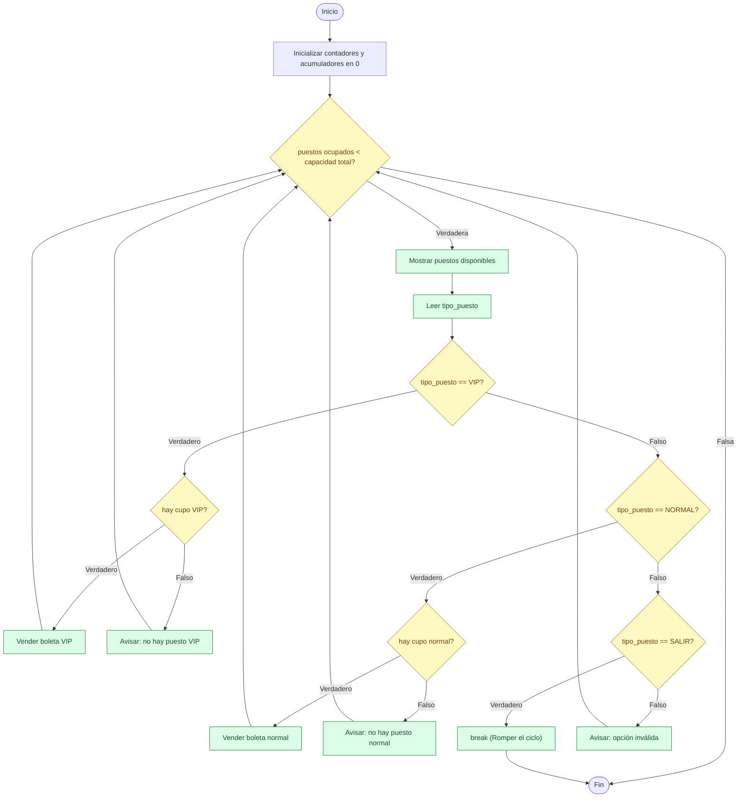

# Cine del señor Burns — venta de boletas con `while`

Este ejemplo retoma el problema planteado (pero no resuelto) en la teoría de la clase 7: la venta de boletas para el cine del señor Burns, un ciclo de número de iteraciones **desconocido** (no se sabe de antemano cuántos clientes van a comprar boleta) — a diferencia de los ejemplos con `for` de esta clase, donde `N` siempre se conoce antes de empezar. Sirve como repaso de los conceptos de la clase anterior — `while`, contador, acumulador y ruptura de ciclos con `break` — antes de continuar con el ciclo `Para`/`for`.

## Enunciado

El señor Burns, como buen capitalista que es, decidió construir un cine en Springfield. El cine es pequeño: tiene capacidad para 8 puestos VIP (a $7000 cada uno) y 40 puestos normales (a $5000 cada uno).

Para cada función, el señor Burns no sabe de antemano cuántos clientes van a asistir: puede que se llenen todos los puestos, o que la venta se cierre antes con puestos disponibles. Desarrolle una aplicación que:

* Registre la venta de una boleta solicitando al cajero el tipo de puesto (VIP o normal), y repita este registro hasta que ocurra una de estas dos condiciones: se agoten los 48 puestos, o el cajero seleccione la opción "Salir" para indicar que no hay más clientes y cerrar la venta.
* Si el tipo de puesto solicitado ya alcanzó su capacidad máxima, no contabilizar esa venta, informarlo al cajero, y volver a solicitar el tipo de puesto (sin que esto se interprete como el cierre de la venta).
* Obtener, para cada tipo de puesto, el total de asistentes y la ganancia obtenida.
* Cuando se cierre la venta de boletas para la función (por cualquiera de las dos condiciones anteriores), imprimir el total de asistentes y las siguientes estadísticas:
  * El porcentaje de ocupación de cada zona (qué porcentaje de la capacidad VIP y de la capacidad Normal se logró vender).
  * El dinero total recaudado por las entradas VIP, por las entradas Normales y la taquilla total del cine.

> [!NOTE]
> Las diapositivas de la clase 7 describían el cierre de venta como "el cajero ingresa -1". Aquí se implementa, en cambio, con un pequeño menú (1: VIP, 2: Normal, 3: Salir) — una forma equivalente de resolver el mismo problema: en vez de un centinela sobre el mismo dato de entrada, se reserva un valor del menú para la salida. El resto del enunciado y los casos de prueba de este documento ya reflejan esa decisión.

## Análisis del problema

### Entradas

Por cada cliente se solicita el tipo de boleta que desea comprar. Se usa un pequeño menú numérico para representar esa elección:

* `1` → boleta en la zona VIP
* `2` → boleta en la zona normal
* `3` → salir del menú (ciclo), porque va a empezar la función y ya no se venderán más entradas

### Salidas

Las estadísticas de la taquilla al cierre de la venta: puestos ocupados de cada zona con su porcentaje de ocupación, y el total recaudado (VIP, normal y taquilla completa).

### Variables

| Variable | Descripción | Tipo | Observaciones |
|---|---|---|---|
| `VALOR_VIP` | Precio de una boleta VIP | Constante (Entera) | 7000 |
| `VALOR_NORMAL` | Precio de una boleta normal | Constante (Entera) | 5000 |
| `PUESTOS_VIP` | Capacidad de la zona VIP | Constante (Entera) | 8 |
| `PUESTOS_NORMAL` | Capacidad de la zona normal | Constante (Entera) | 40 |
| `tipo_puesto` | Opción de menú leída en la iteración actual (1: VIP; 2: Normal; 3: Salir) | Entrada (Entera) | No es necesario inicializarla: es una entrada de datos |
| `p_VIP_ocupados` | Puestos VIP vendidos hasta el momento | Contador (Entera) | No olvidar inicializar en 0 |
| `p_normal_ocupados` | Puestos normales vendidos hasta el momento | Contador (Entera) | No olvidar inicializar en 0 |
| `taquilla_VIP` | Total recaudado en la zona VIP | Acumulador (Entera) | No olvidar inicializar en 0 |
| `taquilla_normal` | Total recaudado en la zona normal | Acumulador (Entera) | No olvidar inicializar en 0 |
| `porc_lleno_VIP` | Porcentaje de ocupación de la zona VIP | Calculada (Real) | No es necesario inicializarla: siempre se calcula antes de usarse |
| `porc_lleno_Normal` | Porcentaje de ocupación de la zona normal | Calculada (Real) | No es necesario inicializarla: siempre se calcula antes de usarse |
| `total_taquilla` | Suma de la taquilla VIP y normal | Calculada (Entera) | No es necesario inicializarla: siempre se calcula antes de usarse |

Es un problema de número de iteraciones **desconocido**: no hay un `N` que indique de antemano cuántos clientes van a comprar boleta, así que la condición del ciclo no puede ser un simple contador acotado — necesita, además, una forma de terminar anticipadamente cuando el cajero elige salir. Por eso la condición combina dos motivos de parada: se llenó el cine, **o** el cajero pidió cerrar la venta.

## Diseño de la solución

### Diagrama de flujo



Nótese que `break` es la única salida que no vuelve a pasar por la condición del ciclo (`Cond`): corta directamente hacia `Fin`, igual que se explicó en la teoría de ruptura de ciclos de la clase 7.

### Pseudocódigo

```
Inicio
  # Opciones del menu
  VIP = 1
  NORMAL = 2
  SALIR = 3

  # Precios
  VALOR_VIP = 7000
  VALOR_NORMAL = 5000

  # Capacidad del cine
  PUESTOS_VIP = 8
  PUESTOS_NORMAL = 40

  # Variables
  p_VIP_ocupados = 0
  p_normal_ocupados = 0
  taquilla_VIP = 0
  taquilla_normal = 0

  # Ciclo principal
  Mientras (p_normal_ocupados + p_VIP_ocupados < PUESTOS_VIP + PUESTOS_NORMAL) Haga
    # Estado del cine
    Escribir(PUESTOS_VIP - p_VIP_ocupados, PUESTOS_NORMAL - p_normal_ocupados)
    # Solicitud del tipo de entrada
    Leer(tipo_puesto)

    Si (tipo_puesto == VIP) Entonces
      # Opcion 1: Entrada VIP
      Si (p_VIP_ocupados < PUESTOS_VIP) Entonces
        # Hay puesto VIP
        p_VIP_ocupados = p_VIP_ocupados + 1
        taquilla_VIP = taquilla_VIP + VALOR_VIP
      Sino
        # No hay puesto VIP
        Escribir("No hay puesto VIP")
      Fin_Si
    Sino
      Si (tipo_puesto == NORMAL) Entonces
        # Opcion 2: Entrada Normal
        Si (p_normal_ocupados < PUESTOS_NORMAL) Entonces
          # Hay puesto normal
          p_normal_ocupados = p_normal_ocupados + 1
          taquilla_normal = taquilla_normal + VALOR_NORMAL
        Sino
          # No hay puesto normal
          Escribir("No hay puesto normal")
        Fin_Si
      Sino
        Si (tipo_puesto == SALIR) Entonces
          # Opcion 3: Salir
          Romper # Ruptura del ciclo (el cajero selecciono salir)
        Sino
          # Otro numero: Opcion invalida
          Escribir("ERROR: Opcion invalida")
        Fin_Si
      Fin_Si
    Fin_Si
  Fin_Mientras

  Escribir("Empieza la funcion...")

  # Estadisticas exigidas
  porc_lleno_VIP = p_VIP_ocupados / PUESTOS_VIP * 100
  porc_lleno_Normal = p_normal_ocupados / PUESTOS_NORMAL * 100
  total_taquilla = taquilla_VIP + taquilla_normal

  Escribir("---- Totales ----")
  Escribir(porc_lleno_VIP, porc_lleno_Normal, taquilla_VIP, taquilla_normal, total_taquilla)
  Escribir("-----------------")
Fin
```

## Implementación en Python

> [!TIP]
> Para poder trazar el ciclo a mano en una prueba de escritorio razonable, [ejemplo_cine.py](ejemplo_cine.py) reduce temporalmente la capacidad del cine a `PUESTOS_VIP = 2` y `PUESTOS_NORMAL = 4` en lugar de los valores reales del enunciado (8 y 40). Es la misma idea que reducir `N` en los ejemplos de la teoría: la lógica del programa no cambia, solo se hace más corta de recorrer a mano. Para usar el programa con la capacidad real del cine basta con restaurar esos dos valores.

La solución en Python se encuentra en [ejemplo_cine.py](ejemplo_cine.py); su código se muestra a continuación:

```python
"""
Constantes
"""

# Opciones del menu
VIP = 1
NORMAL = 2
SALIR = 3

# Precios 
VALOR_VIP = 7000
VALOR_NORMAL = 5000
  
# Capacidad del cine
PUESTOS_VIP = 2
PUESTOS_NORMAL = 4
  
"""
Variables
"""

# Contadores
p_VIP_ocupados = 0 
p_normal_ocupados = 0 

# Acumuladores
taquilla_VIP = 0
taquilla_normal = 0

"""
Programa principal
"""

# Ciclo de venta de entradas
while (p_normal_ocupados + p_VIP_ocupados < PUESTOS_VIP + PUESTOS_NORMAL):
    # Estado del cine
    print(" CINE DE SPRINGFIELD")
    print("- Puestos VIP disponibles: ", PUESTOS_VIP - p_VIP_ocupados)
    print("- Puestos normales disponibles: ", PUESTOS_NORMAL - p_normal_ocupados)

    # Solicitud del tipo de entrada
    tipo_puesto = int(input("\nIngrese el tipo de puesto (1: VIP, 2: Normal, 3: Salir): "))
    # Seleccion del tipo de puesto
    if (tipo_puesto == VIP):
        # Entrada VIP
        if (p_VIP_ocupados < PUESTOS_VIP):
            # Hay puesto VIP 
            p_VIP_ocupados = p_VIP_ocupados + 1
            taquilla_VIP = taquilla_VIP + VALOR_VIP          
        else:
            # No hay puesto VIP
            print("No hay puesto VIP\n")          
    elif (tipo_puesto == NORMAL):
        # Entrada Normal
        if (p_normal_ocupados < PUESTOS_NORMAL):
            # Hay puesto normal
            p_normal_ocupados = p_normal_ocupados + 1
            taquilla_normal = taquilla_normal + VALOR_NORMAL
        else:
            # No hay puesto normal
            print("No hay puesto normal\n")          
    elif (tipo_puesto == SALIR):
        # Ruptura del ciclo (El usuario selecciono salir)
        break  
    else: 
        # Opcion invalida
        print("ERROR: Opcion invalida.\n")


# Mensaje de salida del ciclo que indica el inicio de la funcion de cine
print("Empieza la funcion...")
  
# Calculo de estadisticas
porc_lleno_VIP = p_VIP_ocupados / PUESTOS_VIP * 100
porc_lleno_Normal = p_normal_ocupados / PUESTOS_NORMAL * 100
total_taquilla = taquilla_VIP + taquilla_normal

# Despliegue de la informacion de la funcion  
print("------------------------------------------------ Totales ------------------------------------------------")
print(f"- Porcentaje de puestos VIP ocupados ({p_VIP_ocupados}/{PUESTOS_VIP}): {porc_lleno_VIP:.2f}%")
print(f"- Puestos normales ocupados ({p_normal_ocupados}/{PUESTOS_NORMAL}): {porc_lleno_Normal:.2f}%")
print(f"- Total en taquilla VIP: {taquilla_VIP}")
print(f"- Total en taquilla Normal: {taquilla_normal}")
print(f"- Total en taquilla: {total_taquilla}")
print("---------------------------------------------------------------------------------------------------------")
```

## Verificación

Los siguientes casos de prueba usan la capacidad reducida del script (`PUESTOS_VIP = 2`, `PUESTOS_NORMAL = 4`):

| Caso | Entradas (`tipo_puesto`) | Resultado esperado |
|---|---|---|
| 1 | `1,2,1,2,2,2` | Cine lleno (VIP y Normal al 100 %) |
| 2 | `1,1,3` | VIP lleno, Normal vacío |
| 3 | `2,2,2,4,2,3` | Normal lleno, VIP vacío, 1 error de menú |
| 4 | `-2,1,2,2,2,3` | Normal al 75 %, VIP al 50 %, 1 error de menú |
| 5 | `4,5,3` | 2 errores de menú, cine vacío |

### Prueba de escritorio del caso 2

Trazar a mano el caso más corto ayuda a confirmar dos cosas a la vez: que el contador y el acumulador de la zona VIP se actualizan correctamente, y que `break` interrumpe el ciclo sin volver a evaluar su condición.

| Iteración | Condición (`ocupados < 6`) | `tipo_puesto` | Acción | `p_VIP_ocupados` | `taquilla_VIP` |
|---|---|---|---|---|---|
| ~~1~~ | ~~0 < 6 → Verdadera~~ | ~~1 (VIP)~~ | ~~Vende boleta VIP~~ | ~~1~~ | ~~7000~~ |
| ~~2~~ | ~~1 < 6 → Verdadera~~ | ~~1 (VIP)~~ | ~~Vende boleta VIP~~ | ~~2~~ | ~~14000~~ |
| **3** | **2 < 6 → Verdadera** | **3 (Salir)** | **`break`** | **2** | **14000** |

En la tercera iteración la condición del `while` sigue siendo verdadera (`2 < 6`), pero eso ya no importa: `break` saca del ciclo sin volver a preguntarlo, tal como muestra el diagrama de flujo. Al terminar, `p_VIP_ocupados = 2` agotó la capacidad VIP (`porc_lleno_VIP = 100%`) y `p_normal_ocupados = 0` deja la zona normal vacía (`porc_lleno_Normal = 0%`), que es justo el resultado esperado del caso 2.

### Salida de consola para el caso 4

```
 CINE DE SPRINGFIELD
- Puestos VIP disponibles:  2
- Puestos normales disponibles:  4

Ingrese el tipo de puesto (1: VIP, 2: Normal, 3: Salir): -2
ERROR: Opcion invalida.

 CINE DE SPRINGFIELD
- Puestos VIP disponibles:  2
- Puestos normales disponibles:  4

Ingrese el tipo de puesto (1: VIP, 2: Normal, 3: Salir): 1
 CINE DE SPRINGFIELD
- Puestos VIP disponibles:  1
- Puestos normales disponibles:  4

Ingrese el tipo de puesto (1: VIP, 2: Normal, 3: Salir): 2
 CINE DE SPRINGFIELD
- Puestos VIP disponibles:  1
- Puestos normales disponibles:  3

Ingrese el tipo de puesto (1: VIP, 2: Normal, 3: Salir): 2
 CINE DE SPRINGFIELD
- Puestos VIP disponibles:  1
- Puestos normales disponibles:  2

Ingrese el tipo de puesto (1: VIP, 2: Normal, 3: Salir): 2
 CINE DE SPRINGFIELD
- Puestos VIP disponibles:  1
- Puestos normales disponibles:  1

Ingrese el tipo de puesto (1: VIP, 2: Normal, 3: Salir): 3
Empieza la funcion...
------------------------------------------------ Totales ------------------------------------------------
- Porcentaje de puestos VIP ocupados (1/2): 50.00%
- Puestos normales ocupados (3/4): 75.00%
- Total en taquilla VIP: 7000
- Total en taquilla Normal: 15000
- Total en taquilla: 22000
---------------------------------------------------------------------------------------------------------
```

> [!IMPORTANT]
> Se usó IA generativa para redactar y organizar este contenido a partir de un borrador previo. El docente revisó y validó la versión final.
