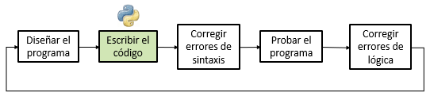

# Laboratorio 3 — Ciclos

## Antes de empezar

Antes de la sesión de laboratorio, vea estos dos videos cortos de Code.org (están en inglés; active los subtítulos en español si los necesita):

* [CSA: While Loops](https://www.youtube.com/watch?v=qnz0LVpUr88&start=88): introducción al ciclo `while`, controlado por una condición que se evalúa antes de cada repetición.
* [CSA: For Loops](https://www.youtube.com/watch?v=EF3laugNVCI&start=148): introducción al ciclo `for`, útil cuando se conoce de antemano el número de repeticiones.

> [!NOTE]
> Los videos usan **Java**, no Python. Lo importante aquí es el **fundamento** (cómo se construye un ciclo), no el lenguaje: la lógica es la misma que vimos en pseudocódigo, y solo cambia la forma de escribirla. Fíjese en estas diferencias al verlos:
>
> | Idea | Pseudocódigo | Java (video) | Python (curso) |
> |---|---|---|---|
> | Ciclo por condición | `Mientras (i <= n) Haga` | `while (i <= n) { ... }` | `while i <= n:` |
> | Ciclo por contador | `Para (i = 1, n, 1) Haga` | `for (int i = 1; i <= n; i++) { ... }` | `for i in range(1, n + 1):` |
> | Delimitar el cuerpo | `Fin_Mientras` / `Fin_Para` | llaves `{ }` | sangría (indentación) |
> | Incrementar | `i = i + 1` | `i++` | `i += 1` |
>
> Observe que el `for` de Java escribe en la cabecera la inicialización, la condición y la actualización, igual que nuestro `Para`, mientras que en Python el `for` recorre la secuencia que genera `range()`. Para la equivalencia completa entre pseudocódigo y Python, consulte el [Anexo](#anexo-equivalencias-entre-pseudocódigo-y-python).

## Objetivos

Al finalizar este laboratorio, el estudiante estará en capacidad de:

* Reconocer, dentro de un problema, en qué punto el algoritmo debe **repetir un conjunto de pasos** en lugar de ejecutarlos una sola vez.
* Diferenciar entre ciclos controlados por **contador** (`for`, cuando se conoce de antemano el número de iteraciones) y ciclos controlados por **centinela** (`while`, cuando no se conoce de antemano cuántas iteraciones habrá).
* Diseñar algoritmos que utilicen correctamente las variables de apoyo propias de los ciclos: **contador**, **acumulador** y **centinela**.
* Diseñar y depurar **ciclos anidados**, reconociendo cómo el límite de un ciclo interior puede depender del valor de la variable del ciclo exterior.
* Verificar manualmente un algoritmo con ciclos mediante **prueba de escritorio**, incluyendo casos límite (cero iteraciones, una sola iteración).
* Implementar en Python ciclos `while` y `for`, simples y anidados.
* Usar `print()` como herramienta de depuración (*print debugging*) complementaria a la prueba de escritorio a mano.

## Herramientas necesarias

Para el desarrollo de esta práctica se necesita, como mínimo, lo siguiente:

* **Anaconda**: distribución de Python que incluye el intérprete, el gestor de paquetes y Jupyter Notebook.
* **Visual Studio Code**: editor de código ligero, con la extensión de Python instalada, para escribir y ejecutar los programas.
* **draw.io** (opcional): herramienta para bocetar diagramas de flujo antes de pasarlos a papel.
* **PyCharm** (opcional): alternativa de IDE más completa a Visual Studio Code.

Si no desea instalar nada, también se puede trabajar con las siguientes plataformas en línea, sin necesidad de instalación:

* **Python Tutor** (pythontutor.com): visualización paso a paso de la ejecución de un programa, útil para observar cómo cambian las variables en cada vuelta de un ciclo. Se usará también en la sección [Visualización de la ejecución](#visualización-de-la-ejecución).
* **CodeSkulptor** (py3.codeskulptor.org): entorno de Python en el navegador, orientado a principiantes.

Adicionalmente, cada estudiante debe traer hojas y lápiz o lapicero para desarrollar a mano el diseño de cada problema (tabla de variables y bocetos), según se indica en la metodología de trabajo.

## Metodología de trabajo

Este laboratorio se desarrolla exclusivamente en Python. Para cada problema, se deben seguir estos pasos:

Los pasos que siguen no son un trámite: cada uno es un compromiso más concreto que el anterior, pero ninguno se da por bueno hasta haber verificado el que lo precede. No se llega al código definitivo de un salto — se pasa primero por el problema en palabras, luego por las variables que lo representan, y luego por una versión del código que expone su propio estado interno mientras se construye, antes de limpiarla para la entrega final.

Este proceso se relaciona con el ciclo clásico de desarrollo de un programa:



En Python, sin embargo, los errores de sintaxis no se detectan en una fase aparte antes de ejecutar: aparecen exactamente al correr el programa. Por eso, en este laboratorio, "escribir el código", "corregir errores de sintaxis", "probar el programa" y "corregir errores de lógica" se tratan como una sola actividad — el paso 3 (Implementar y verificar) — en vez de dividirse en pasos separados.

### 1. Entender el problema (a mano)

Leer el problema completo. Identificar qué datos se van a recibir, qué se debe producir y qué restricciones aplican. Por ejemplo, para el siguiente problema:

> Un profesor desea conocer algunas estadísticas sobre las notas finales de su curso. Escriba un programa que le pida al usuario la cantidad de estudiantes N y, para cada uno, su nota final (la nota mínima para aprobar es 3.0). El programa debe calcular y mostrar el porcentaje de estudiantes que aprobaron, el porcentaje que reprobaron, el promedio de las notas aprobadas, el promedio de las notas reprobadas, y el promedio general de todas las notas. Si no hay estudiantes, el programa debe indicarlo sin intentar calcular nada; si todos los estudiantes aprobaron (o todos reprobaron), el promedio de la categoría vacía debe mostrarse como 0, sin intentar dividir entre cero.

### 2. Diseñar (a mano, en papel)

#### Proceso

Antes de pasar a la tabla de variables, conviene resumir en palabras cuál va a ser el plan para resolver el problema — la misma explicación que se daría al sustentar el ejercicio ante el docente. Por ejemplo, para el problema anterior:

> Como el número de estudiantes N se conoce desde el inicio (lo da el usuario), se usa un `for` que se repite N veces. En cada vuelta se pide la nota y se verifica si es mayor o igual a 3.0: si lo es, se suma 1 al contador de aprobados y se suma la nota al acumulador de aprobados; si no, se hace lo mismo pero con reprobados. Cuando el ciclo termina, se calculan los totales sumando las dos categorías, y con eso se obtienen los porcentajes de aprobados y reprobados. Antes de calcular el promedio de cada categoría, se revisa que tenga al menos un estudiante, para no dividir entre cero si todos aprobaron o todos reprobaron.

#### De Polya a la práctica

A medida que se va adquiriendo más pericia en el arte de programar, lo que antes se hacía siguiendo cada paso del método de Polya se va sintetizando. Con el proceso ya claro en palabras, basta con tener muy claro qué se va a almacenar en cada variable:

| Variable | Descripción |
|---|---|
| `NOTA_MINIMA` | Constante que define la nota mínima para aprobar |
| `notas_reprobadas` | Cuenta cuántos estudiantes reprobaron |
| `notas_aprobadas` | Cuenta cuántos estudiantes aprobaron |
| `suma_reprobadas` | Acumula la suma de las notas de los estudiantes reprobados |
| `suma_aprobadas` | Acumula la suma de las notas de los estudiantes aprobados |
| `N` | Cantidad de estudiantes a procesar (dato de entrada) |
| `i` | Cuenta cuántos estudiantes se han leído hasta el momento (variable de control del ciclo) |
| `nota` | Nota del estudiante leída en la iteración actual (dato de entrada) |
| `suma_notas` | Suma total de todas las notas, aprobadas y reprobadas |
| `total_notas` | Total de estudiantes procesados |
| `p_aprobaron` | Porcentaje de estudiantes que aprobaron |
| `p_reprobaron` | Porcentaje de estudiantes que reprobaron |
| `prom_nota_reprobada` | Promedio de las notas de los estudiantes reprobados |
| `prom_nota_aprobada` | Promedio de las notas de los estudiantes aprobados |
| `prom` | Promedio general de todas las notas |

Con esto claro, se puede empezar a plantear el algoritmo.

Antes de abrir el editor, se debe plantear la solución físicamente, a mano. Esto es obligatorio e incluye:

* Para cada variable que se vaya a usar en el programa, su **nombre** y una **breve descripción** de para qué sirve — no es necesario indicar tipo, ni si es contador o acumulador, ni observaciones adicionales; basta con dejar claro qué va a guardar cada una.
* Cualquier **boceto, diagrama o esquema** que haya servido para pensar el problema (diagrama de flujo, dibujo del patrón a imprimir, seguimiento manual de una iteración, etc.).

Este material debe conservarse — es la evidencia del proceso de diseño, y podrá solicitarse como parte de la entrega o de la sustentación.

### 3. Implementar y verificar

Traducir el diseño ya planteado a código Python, ejecutarlo, y corregir tanto errores de sintaxis como de lógica hasta que el resultado coincida con lo esperado (ver también [Verificación](#verificación), incluyendo el uso de `print()` como apoyo). Siguiendo con el ejemplo del problema de notas, así se ve este proceso en dos momentos.

#### Primer resultado: código con `print()` de depuración

Mientras se traduce el diseño a código, se usa `print()` para verificar que cada variable va tomando el valor esperado en cada paso — todavía sin la salida final formateada, que se agrega más abajo, una vez las variables ya están validadas:

```python
# Constantes
NOTA_MINIMA = 3.0

# Inicializacion
notas_reprobadas = 0
notas_aprobadas = 0
suma_reprobadas = 0
suma_aprobadas = 0

# Solicitud de la nota del estudiante
N = int(input('Ingrese el número de estudiantes: '))
for i in range(N):
    # Solicitud de la nota del estudiante
    nota = float(input(f'Ingrese la nota del estudiante {i+1}: '))

    # Validadación si gano o perdio
    if nota >= NOTA_MINIMA:
        # Gano
        notas_aprobadas += 1
        suma_aprobadas += nota
    else:
        # Perdio
        notas_reprobadas += 1
        suma_reprobadas += nota

    print(f"nota={nota}, notas_aprobadas={notas_aprobadas}, suma_aprobadas={suma_aprobadas}, notas_reprobadas={notas_reprobadas}, suma_reprobadas={suma_reprobadas}")


# Calculo de los totales
suma_notas = suma_reprobadas + suma_aprobadas
total_notas = notas_reprobadas + notas_aprobadas

print(f"suma_notas={suma_notas}, total_notas={total_notas}")

if total_notas == 0:
    # Caso en el que no hay estudiantes
    print("No hay estudiantes")
else:
    # Caso en el que hay estudiantes

    # Calculo de los porcentajes y promedios
    p_aprobaron = (notas_aprobadas/total_notas)*100
    p_reprobaron = (notas_reprobadas/total_notas)*100

    if notas_aprobadas == 0:
        # Caso en el que nungun estudiante gano
        prom_nota_reprobada = suma_reprobadas/notas_reprobadas
        prom_nota_aprobada = 0
    elif notas_reprobadas == 0:
        # Caso en el que nungun estudiante perdio
        prom_nota_reprobada = 0
        prom_nota_aprobada = suma_aprobadas/notas_aprobadas
    else:
        # Caso en el que hay estudiantes que ganaron y perdieron
        prom_nota_reprobada = suma_reprobadas/notas_reprobadas
        prom_nota_aprobada = suma_aprobadas/notas_aprobadas
    prom = suma_notas/total_notas

    print(f"p_aprobaron={p_aprobaron}, p_reprobaron={p_reprobaron}, prom_nota_aprobada={prom_nota_aprobada}, prom_nota_reprobada={prom_nota_reprobada}, prom={prom}")
```

Ejemplo de ejecución de esta versión con prints de depuración (mismo caso de prueba: N=4, notas 4.2, 2.5, 3.0 y 1.8), verificado ejecutando el código:

```
Ingrese el número de estudiantes: 4
Ingrese la nota del estudiante 1: 4.2
nota=4.2, notas_aprobadas=1, suma_aprobadas=4.2, notas_reprobadas=0, suma_reprobadas=0
Ingrese la nota del estudiante 2: 2.5
nota=2.5, notas_aprobadas=1, suma_aprobadas=4.2, notas_reprobadas=1, suma_reprobadas=2.5
Ingrese la nota del estudiante 3: 3.0
nota=3.0, notas_aprobadas=2, suma_aprobadas=7.2, notas_reprobadas=1, suma_reprobadas=2.5
Ingrese la nota del estudiante 4: 1.8
nota=1.8, notas_aprobadas=2, suma_aprobadas=7.2, notas_reprobadas=2, suma_reprobadas=4.3
suma_notas=11.5, total_notas=4
p_aprobaron=50.0, p_reprobaron=50.0, prom_nota_aprobada=3.6, prom_nota_reprobada=2.15, prom=2.875
```

#### Resultado final: código verificado

Una vez las variables ya se confirmaron correctas con los `print()` anteriores, se agrega la salida final formateada. Los `print()` de depuración **no se borran** — se dejan comentados, como evidencia del trabajo de verificación que ya se hizo:

```python
# Constantes
NOTA_MINIMA = 3.0

# Inicializacion
notas_reprobadas = 0
notas_aprobadas = 0
suma_reprobadas = 0
suma_aprobadas = 0

# Solicitud de la nota del estudiante
N = int(input('Ingrese el número de estudiantes: '))
for i in range(N):
    # Solicitud de la nota del estudiante
    nota = float(input(f'Ingrese la nota del estudiante {i+1}: '))

    # Validadación si gano o perdio
    if nota >= NOTA_MINIMA:
        # Gano
        notas_aprobadas += 1
        suma_aprobadas += nota
    else:
        # Perdio
        notas_reprobadas += 1
        suma_reprobadas += nota

    # print(f"nota={nota}, notas_aprobadas={notas_aprobadas}, suma_aprobadas={suma_aprobadas}, notas_reprobadas={notas_reprobadas}, suma_reprobadas={suma_reprobadas}")


# Calculo de los totales
suma_notas = suma_reprobadas + suma_aprobadas
total_notas = notas_reprobadas + notas_aprobadas

# print(f"suma_notas={suma_notas}, total_notas={total_notas}")

if total_notas == 0:
    # Caso en el que no hay estudiantes
    print("No hay estudiantes")
else:
    # Caso en el que hay estudiantes

    # Calculo de los porcentajes y promedios
    p_aprobaron = (notas_aprobadas/total_notas)*100
    p_reprobaron = (notas_reprobadas/total_notas)*100

    if notas_aprobadas == 0:
        # Caso en el que nungun estudiante gano
        prom_nota_reprobada = suma_reprobadas/notas_reprobadas
        prom_nota_aprobada = 0
    elif notas_reprobadas == 0:
        # Caso en el que nungun estudiante perdio
        prom_nota_reprobada = 0
        prom_nota_aprobada = suma_aprobadas/notas_aprobadas
    else:
        # Caso en el que hay estudiantes que ganaron y perdieron
        prom_nota_reprobada = suma_reprobadas/notas_reprobadas
        prom_nota_aprobada = suma_aprobadas/notas_aprobadas
    prom = suma_notas/total_notas

    # print(f"p_aprobaron={p_aprobaron}, p_reprobaron={p_reprobaron}, prom_nota_aprobada={prom_nota_aprobada}, prom_nota_reprobada={prom_nota_reprobada}, prom={prom}")

    # Salida de datos (Despliegue de los resultados)
    print(f"Porcentaje de estudiantes que aprobaron: {p_aprobaron}%")
    print(f"Porcentaje de estudiantes que reprobaron: {p_reprobaron}%")
    print(f"Promedio de notas reprobadas: {prom_nota_reprobada}")
    print(f"Promedio de notas aprobadas: {prom_nota_aprobada}")
    print(f"Promedio general de notas: {prom}")
```

Como los `print()` de depuración quedaron comentados, no aparecen en la salida — el ejemplo de ejecución de esta versión final es el mismo que se pediría entregar (verificado, con N=4 estudiantes y notas 4.2, 2.5, 3.0 y 1.8):

```
Ingrese el número de estudiantes: 4
Ingrese la nota del estudiante 1: 4.2
Ingrese la nota del estudiante 2: 2.5
Ingrese la nota del estudiante 3: 3.0
Ingrese la nota del estudiante 4: 1.8
Porcentaje de estudiantes que aprobaron: 50.0%
Porcentaje de estudiantes que reprobaron: 50.0%
Promedio de notas reprobadas: 2.15
Promedio de notas aprobadas: 3.6
Promedio general de notas: 2.875
```

#### Casos de prueba

Todo lo anterior (el código con `print()` de depuración y el código final) se construyó y se siguió con **un solo caso** (N=4, notas 4.2, 2.5, 3.0 y 1.8) — eso alcanza para diseñar e implementar, pero no para confiar en que el programa esté completo. El paso que sigue, ya con el programa terminado, es probarlo contra varios casos distintos y hacer los ajustes que hagan falta hasta que todos den el resultado esperado:

| Caso | Notas ingresadas | % Aprobaron | % Reprobaron | Prom. aprobadas | Prom. reprobadas | Promedio general |
|---|---|---|---|---|---|---|
| 1 | 4.2, 2.5, 3.0, 1.8 | 50.0% | 50.0% | 3.6 | 2.15 | 2.875 |
| 2 | 5.0, 4.0, 3.0 (todos aprueban) | 100.0% | 0.0% | 4.0 | 0 | 4.0 |
| 3 | 1.0, 2.0 (todos reprueban) | 0.0% | 100.0% | 0 | 1.5 | 1.5 |
| 4 | 3.0 (un solo estudiante, caso límite) | 100.0% | 0.0% | 3.0 | 0 | 3.0 |
| 5 | (ninguna, N=0) | — | — | — | — | No hay estudiantes |

Los casos 2 y 3 prueban los dos escenarios donde una categoría queda vacía (la razón por la que se necesitó el `if`/`elif`/`else` al calcular los promedios); el caso 4 prueba el ciclo con una sola iteración; el caso 5 prueba el ciclo con cero iteraciones.

## Trabajo individual

Este laboratorio se realiza de manera **individual**. Cada estudiante es responsable de aplicar por sí mismo las tres etapas anteriores en cada uno de los problemas.

**Importante:** al no haber reparto de roles con un compañero, no hay nadie más revisando el código mientras se escribe ni ayudando a detectar errores en el momento — la depuración y la prueba de escritorio de cada problema quedan enteramente bajo su responsabilidad. Se recomienda ejecutar y probar cada solución con los casos de prueba propuestos antes de pasar al siguiente problema.

## Fechas importantes

* **Asignación:** 28 de septiembre de 2026 (sesión de laboratorio).
* **Entrega y sustentación:** 12 de octubre de 2026, durante la sesión de laboratorio. Traiga completo el material en papel (ver [Entregables](#entregables)) y esté en capacidad de sustentar cualquiera de los 10 problemas ante el docente.

## Entregables

Al finalizar el laboratorio, cada estudiante debe entregar:

* **En papel (a mano):** para cada uno de los 10 problemas, la tabla de variables (diccionario de datos) y los bocetos o diagramas usados en el diseño, según lo indicado en [Metodología de trabajo](#metodología-de-trabajo). Este material debe traerse a la sesión de laboratorio, ya que es la base para la sustentación del ejercicio ante el docente.
* **En Python:** un script `.py` por cada problema, que implemente el algoritmo diseñado y permita verificar todos los casos de prueba correspondientes.

---

# Problemas

Los problemas están organizados de menor a mayor complejidad, según el tipo de ciclo y de variables de apoyo que requieren: primero ciclos simples con contador o centinela, luego ciclos simples con acumuladores dobles o patrones de signo alternante, y finalmente ciclos anidados.

## Nivel 1 — Básico

### 1. Número invertido (con ciclo)

Escriba un programa que le pida al usuario un número entero positivo (de cualquier cantidad de dígitos) y muestre el número resultante de invertir el orden de sus dígitos. Por ejemplo, si el usuario ingresa 123, el programa debe mostrar 321.

**Restricción:** resuelva este problema usando un ciclo `while`, y las operaciones de división entera (`//`) y módulo (`%`) para ir extrayendo cada dígito — uno a la vez, empezando por el de las unidades. No convierta el número a texto (`str`) ni use técnicas de "volteo" de cadenas (como `[::-1]`); la idea es practicar la construcción del ciclo, no un atajo del lenguaje.

**Ejemplo de ejecución del programa:**

```
Ingrese un número entero positivo: 123

Número invertido: 321
```

<details>
<summary>Pista adicional</summary>

Necesita dos variables: el número original (que va a ir "encogiendo" en cada vuelta del ciclo) y un **acumulador** que va construyendo el resultado. En cada vuelta: obtenga el último dígito del número con `% 10`, agréguelo al acumulador (multiplicando el acumulador por 10 antes de sumar el nuevo dígito), y luego reduzca el número con `// 10`. El ciclo continúa **mientras el número sea mayor que 0** — no necesita una variable centinela aparte, porque el número mismo, al irse achicando, le indica cuándo detenerse.

</details>

**Casos de prueba:**

| Caso | Número | Número invertido |
|---|---|---|
| 1 | 123 | 321 |
| 2 | 42339 | 93324 |
| 3 | 7 | 7 |
| 4 | 120 | 21 |
| 5 | 1000 | 1 |
| 6 | 0 | 0 |

**Pregunta para pensar** (respóndala después de resolver el problema, no antes):

> En los casos 4 y 5, el número invertido tiene menos dígitos que el original (120 → 21, no "021"; 1000 → 1, no "0001"). ¿Por qué ocurre esto con la forma en que construimos el acumulador? ¿En qué situación real podría ser un problema que se "pierdan" esos ceros a la izquierda?

### 2. Cuentas de crédito excedidas

Desarrolle una aplicación que determine si alguno de los clientes de una tienda de departamentos se ha excedido del límite de crédito en su cuenta. Para cada cliente se tienen los siguientes datos:

* Número de cuenta (un entero).
* Saldo al inicio del mes.
* Total de todos los artículos cargados por el cliente en el mes.
* Total de todos los créditos aplicados a la cuenta del cliente en el mes.
* Límite de crédito permitido.

El programa debe usar una instrucción `while` para recibir como entrada cada uno de estos datos, calcular el nuevo saldo (`= saldo inicial + cargos − créditos`) y determinar si éste **excede** el límite de crédito del cliente. Para los clientes cuyo límite se haya excedido, el programa debe mostrar el número de cuenta, el límite de crédito, el nuevo saldo, y el mensaje `Se excedió el límite de su crédito`. El programa termina cuando el usuario ingresa `-1` como número de cuenta.

**Ejemplo de ejecución del programa:**

```
Introduzca el numero de cuenta (o -1 para salir): 100
Introduzca el saldo inicial: 5394.78
Introduzca los cargos totales: 1000.00
Introduzca los creditos totales: 500.00
Introduzca el limite de credito: 5500.00
El nuevo saldo es 5894.78
Cuenta: 100
Limite de credito: 5500.00
Saldo: 5894.78
Se excedio el limite de su credito.

Introduzca el numero de cuenta (o -1 para salir): 200
Introduzca el saldo inicial: 1000.00
Introduzca los cargos totales: 123.45
Introduzca los creditos totales: 321.00
Introduzca el limite de credito: 1500.00
El nuevo saldo es 802.45

Introduzca el numero de cuenta (o -1 para salir): -1
```

<details>
<summary>Pista adicional</summary>

Esta es la estructura clásica de **ciclo controlado por centinela**: no se sabe de antemano cuántos clientes se van a procesar, así que no se puede usar un ciclo `for` contando iteraciones. En su lugar, el número de cuenta cumple doble función: es un dato del cliente, y a la vez es el **centinela** que le indica al ciclo cuándo detenerse. `-1` funciona bien como centinela porque nunca podría ser un número de cuenta real. La condición del `while` debe evaluar el número de cuenta *antes* de procesar el resto de los datos de ese cliente.

</details>

**Casos de prueba** (una sola ejecución, procesando tres cuentas y luego saliendo):

| Cuenta | Saldo inicial | Cargos | Créditos | Límite | Nuevo saldo | ¿Excede? |
|---|---|---|---|---|---|---|
| 100 | 5394.78 | 1000.00 | 500.00 | 5500.00 | 5894.78 | Sí |
| 200 | 1000.00 | 123.45 | 321.00 | 1500.00 | 802.45 | No |
| 300 | 1000.00 | 500.00 | 0.00 | 1500.00 | 1500.00 | No (el nuevo saldo es igual al límite, no mayor) |

**Caso adicional (ciclo con cero iteraciones):** si el usuario ingresa `-1` como el primer número de cuenta, el programa debe terminar de inmediato sin pedir ningún otro dato y sin mostrar ningún mensaje de cliente.

**Pregunta para pensar** (respóndala después de resolver el problema, no antes):

> En el caso de la cuenta 300, el nuevo saldo queda exactamente igual al límite de crédito. Según el enunciado ("si éste excede el límite"), ¿ese cliente debería recibir el mensaje de exceso o no? ¿Qué operador relacional (`>` o `>=`) usó en su condición, y coincide con la respuesta que acaba de dar?

### 3. Clasificación de N valores

Dados N valores, diseñe un algoritmo que, para cada uno, calcule lo siguiente según el rango en el que caiga:

* Si el valor es menor que 0, calcule su **cubo**.
* Si el valor está entre 0 y 100 (ambos incluidos), calcule su **cuadrado**.
* Si el valor está entre 101 y 1000 (ambos incluidos), calcule su **raíz cuadrada** (redondeada a 2 decimales).
* Si el valor es mayor que 1000, el programa debe indicar que el valor está **fuera de rango** y no debe intentar calcular nada.

El programa debe leer primero la cantidad de valores N que se van a procesar, y luego, para cada uno de los N valores, leerlo y mostrar de inmediato el resultado correspondiente.

**Ejemplo de ejecución del programa:**

```
Cuantos valores desea procesar? 5

Ingrese el valor 1: -8
Cubo: -512

Ingrese el valor 2: 50
Cuadrado: 2500

Ingrese el valor 3: 500
Raiz cuadrada: 22.36

Ingrese el valor 4: 1500
Valor fuera de rango

Ingrese el valor 5: 0
Cuadrado: 0
```

<details>
<summary>Pista adicional</summary>

Esta es la primera vez en el laboratorio que combina un ciclo `for` (para leer los N valores) con una selección por rangos dentro del ciclo (`if`/`elif`/`else`). Cada vuelta del ciclo lee un valor nuevo y, dentro de esa misma vuelta, decide en qué rango cae y calcula el resultado correspondiente — no necesita guardar los N valores en ningún lado, solo procesarlos uno a uno.

</details>

**Casos de prueba:**

| Valor | Resultado esperado |
|---|---|
| -8 | Cubo = -512 |
| 0 | Cuadrado = 0 |
| 100 | Cuadrado = 10000 |
| 101 | Raíz cuadrada ≈ 10.05 |
| 500 | Raíz cuadrada ≈ 22.36 |
| 1000 | Raíz cuadrada ≈ 31.62 |
| 1500 | Fuera de rango |

Los casos 0/100/101/1000 prueban los límites exactos entre los cuatro rangos.

**Pregunta para pensar** (respóndala después de resolver el problema, no antes):

> ¿Qué pasaría si escribiera la condición del cuarto caso simplemente como `else` (sin comparar explícitamente contra 1000), asumiendo que "todo lo que no cayó en los rangos anteriores" es el caso por defecto? ¿Funcionaría igual de bien, o hay alguna razón para preferir una comparación explícita `valor > 1000`?

## Nivel 2 — Intermedio

### 4. El juego del PUM

Para jugar al PUM, N jugadores se sientan en círculo y van diciendo números consecutivos a partir del 1 (1, 2, 3, ...). Se escoge un número X (menor que 10) y, cuando le corresponda a un jugador decir un múltiplo de X, ese jugador debe decir "pum" en lugar del número.

Escriba un programa que lea el número de jugadores N, el número escogido X, y la cantidad de números que se quieren generar, y que muestre el desarrollo del juego para esa cantidad de números, indicando en cada línea el número del jugador al que le tocó el turno y lo que dijo (el número, o "pum").

**Ejemplo de ejecución del programa:**

```
Numero de jugadores: 3
Numero elegido para el PUM: 4
Cantidad de numeros a generar: 8

jugador             jugada
1                   1
2                   2
3                   3
1                   pum
2                   5
3                   6
1                   7
2                   pum
```

<details>
<summary>Pista adicional</summary>

Solo se necesita **un** contador real: el número que se va diciendo, que va de 1 hasta la cantidad ingresada (ideal para un `for` con `range`). El jugador al que le toca el turno **no necesita su propio contador aparte** — se calcula a partir del número actual con una fórmula de módulo, ya que los jugadores se repiten en ciclos de tamaño N. Una vez se tiene el jugador, se decide con un `if` si lo que debe decir es "pum" (cuando el número es múltiplo de X) o el número mismo.

</details>

**Casos de prueba** (ejecuciones completas):

**Caso 1 — N=3, X=4, cantidad=8:**

| Número | Jugador | Dice |
|---|---|---|
| 1 | 1 | 1 |
| 2 | 2 | 2 |
| 3 | 3 | 3 |
| 4 | 1 | pum |
| 5 | 2 | 5 |
| 6 | 3 | 6 |
| 7 | 1 | 7 |
| 8 | 2 | pum |

**Caso 2 — N=4, X=3, cantidad=12:**

| Número | Jugador | Dice |
|---|---|---|
| 1 | 1 | 1 |
| 2 | 2 | 2 |
| 3 | 3 | pum |
| 4 | 4 | 4 |
| 5 | 1 | 5 |
| 6 | 2 | pum |
| 7 | 3 | 7 |
| 8 | 4 | 8 |
| 9 | 1 | pum |
| 10 | 2 | 10 |
| 11 | 3 | 11 |
| 12 | 4 | pum |

**Caso 3 — N=3, X=4, cantidad=1:** solo debe imprimirse una línea: `1   1`.

**Caso 4 — N=3, X=4, cantidad=0:** el programa no debe imprimir ninguna línea del desarrollo del juego (el ciclo se ejecuta cero veces).

**Pregunta para pensar** (respóndala después de resolver el problema, no antes):

> ¿Qué pasaría si N=1 (un solo jugador)? Trace mentalmente los primeros números con ese valor. ¿El juego sigue teniendo sentido? ¿Su fórmula para calcular el jugador sigue funcionando correctamente en ese caso, o necesita revisarla?

### 5. Rendimiento de combustible

A los conductores les preocupa el rendimiento de combustible de sus vehículos. Un conductor ha llevado el registro de varios tanqueos, anotando los kilómetros recorridos y los litros consumidos en cada uno.

Escriba un programa, controlado por centinela, que le pida al usuario los litros consumidos y los kilómetros recorridos en cada tanqueo. El programa debe calcular y mostrar el rendimiento (km/litro) obtenido en cada tanqueo. Después de procesar todos los tanqueos, debe calcular y mostrar el rendimiento promedio general de todos ellos (es decir, el total de kilómetros recorridos dividido entre el total de litros consumidos). El programa termina cuando el usuario ingresa `-1` en los litros consumidos.

Si el usuario ingresa `-1` de inmediato (sin registrar ningún tanqueo), el programa **no debe intentar calcular el promedio general** — evite una división por cero — y en su lugar debe mostrar un mensaje indicando que no se registró ningún tanqueo.

**Ejemplo de ejecución del programa:**

```
Ingrese los litros consumidos (-1 para terminar): 48
Ingrese los kilometros recorridos: 610
El rendimiento de este tanqueo fue: 12.71 km/l

Ingrese los litros consumidos (-1 para terminar): 39
Ingrese los kilometros recorridos: 430
El rendimiento de este tanqueo fue: 11.03 km/l

Ingrese los litros consumidos (-1 para terminar): 19
Ingrese los kilometros recorridos: 245
El rendimiento de este tanqueo fue: 12.89 km/l

Ingrese los litros consumidos (-1 para terminar): -1
El rendimiento promedio general fue: 12.12 km/l
```

<details>
<summary>Pista adicional</summary>

Este problema necesita **dos acumuladores** funcionando al mismo tiempo dentro del mismo ciclo centinela: uno para el total de kilómetros y otro para el total de litros. El rendimiento de cada tanqueo individual se calcula y se muestra dentro del ciclo (con los valores de esa vuelta), mientras que el rendimiento promedio general se calcula **una sola vez, después de que termine el ciclo**, usando los dos acumuladores ya completos — no el promedio de los promedios individuales, que daría un resultado distinto (y matemáticamente incorrecto) al pedido.

</details>

**Casos de prueba** (una sola ejecución, tres tanqueos y luego salir):

| Litros | Kilómetros | Rendimiento del tanqueo |
|---|---|---|
| 48 | 610 | 12.71 km/l |
| 39 | 430 | 11.03 km/l |
| 19 | 245 | 12.89 km/l |

**Rendimiento promedio general esperado:** 12.12 km/l (= 1285 km ÷ 106 litros)

**Caso adicional (sin tanqueos):** si el usuario ingresa `-1` como primer dato, el programa debe mostrar un mensaje indicando que no se registró ningún tanqueo, sin intentar calcular ningún promedio.

**Pregunta para pensar** (respóndala después de resolver el problema, no antes):

> Si en vez de acumular kilómetros y litros por separado se hubiera acumulado la suma de los rendimientos individuales de cada tanqueo (12.71 + 11.03 + 12.89) y se hubiera dividido entre 3, ¿se habría obtenido el mismo resultado que el promedio general pedido (12.12)? Calcúlelo y explique por qué dan distinto — y por qué el método que pide el enunciado (total km ÷ total litros) es el correcto.

### 6. Aproximando π (serie de Leibniz)

Escriba un programa que le pida al usuario la cantidad de términos N que desea usar para aproximar el valor de π, mediante la siguiente serie infinita:

$$\pi \approx 4 - \frac{4}{3} + \frac{4}{5} - \frac{4}{7} + \frac{4}{9} - \frac{4}{11} + \cdots$$

El programa debe imprimir una tabla mostrando el valor aproximado de π obtenido usando 1 término, 2 términos, 3 términos, y así sucesivamente, hasta los N términos ingresados por el usuario.

**Ejemplo de ejecución del programa (N=5):**

```
Cuantos terminos desea usar? 5

Terminos     Aproximacion de pi
1            4.000000
2            2.666667
3            3.466667
4            2.895238
5            3.339683
```

<details>
<summary>Pista adicional</summary>

Note el patrón de la serie: el numerador siempre es 4, el denominador aumenta de 2 en 2 en cada término (3, 5, 7, 9, 11, ...), y el signo se alterna entre suma y resta en cada término. Se necesitan tres cosas llevando cuenta al mismo tiempo dentro del ciclo: el **acumulador** (la aproximación de π que se va ajustando y se imprime en cada vuelta), una variable para el **denominador** (que aumenta en 2 cada vez), y una variable de **signo** (que se multiplica por −1 en cada vuelta para alternar entre sumar y restar).

</details>

**Casos de prueba:**

**Caso 1 — N=5:** la tabla completa es la del ejemplo de arriba.

**Caso 2 — N=1:** la tabla debe tener una sola fila: `1   4.000000`.

**Caso 3 — N=10:**

```
Terminos     Aproximacion de pi
1            4.000000
2            2.666667
3            3.466667
4            2.895238
5            3.339683
6            2.976046
7            3.283738
8            3.017072
9            3.252366
10           3.041840
```

**Pregunta para pensar** (respóndala después de resolver el problema, no antes):

> Ejecute su programa con N=150, N=1000 y N=7000, y observe qué tan cerca queda la aproximación de 3.14159265... ¿Le sorprende cuántos términos hacen falta para acercarse, considerando que la serie converge matemáticamente a π pero lo hace muy lento? (Como dato: se necesitan 151 términos para que la aproximación llegue por primera vez a 3.14, 915 para llegar a 3.141, 7.009 para 3.1415, ¡y más de 130.000 para 3.14159!)

### 7. Conversión de binario a decimal

Escriba un programa que le pida al usuario un número entero compuesto únicamente por 0s y 1s (un número "binario", por ejemplo 1101) y que muestre su equivalente en el sistema decimal.

Recuerde que, así como en el sistema decimal la posición más a la derecha vale 1, la siguiente 10, luego 100, etc., en el sistema binario la posición más a la derecha vale 1, la siguiente 2, luego 4, luego 8, y así sucesivamente (duplicándose en cada posición hacia la izquierda). Por ejemplo, el binario 1101 equivale a `1×8 + 1×4 + 0×2 + 1×1 = 13` en decimal.

**Restricción:** use las operaciones de división entera (`//`) y módulo (`%`) para ir tomando los dígitos del número uno a la vez, de derecha a izquierda — la misma técnica del problema "Número invertido" del inicio de este laboratorio, pero acumulando de forma distinta.

**Ejemplo de ejecución del programa:**

```
Ingrese un numero binario (solo 0s y 1s): 1101

Equivalente decimal: 13
```

<details>
<summary>Pista adicional</summary>

Puede visualizarse el proceso como una serie de divisiones continuadas entre 10 (no entre 2 — se va en sentido contrario al de decimal-a-binario), donde cada residuo es un dígito del número y el valor posicional se va duplicando en vez de multiplicarse por 10:

$$
\begin{array}{rcl}
1101 \div 10 = 110, \text{ residuo } 1 & \Rightarrow & 1 \times 2^0 = 1 \times 1 = 1 \\
110 \div 10 = 11, \text{ residuo } 0 & \Rightarrow & 0 \times 2^1 = 0 \times 2 = 0 \\
11 \div 10 = 1, \text{ residuo } 1 & \Rightarrow & 1 \times 2^2 = 1 \times 4 = 4 \\
1 \div 10 = 0, \text{ residuo } 1 & \Rightarrow & 1 \times 2^3 = 1 \times 8 = 8 \\
\end{array}
$$

$$
\text{Decimal} = 1 + 0 + 4 + 8 = 13
$$

Se necesitan dos variables además del número original: un **acumulador** para el resultado decimal, y una variable de **valor posicional** que empieza en 1 y se **duplica** en cada vuelta del ciclo (1, 2, 4, 8, 16, ...). En cada vuelta: tome el último dígito del número con `% 10` (el residuo de la tabla anterior), multiplíquelo por el valor posicional actual y súmelo al acumulador; luego reduzca el número con `// 10` (el cociente) y duplique el valor posicional. El ciclo continúa mientras el número sea mayor que 0 — igual que en "Número invertido", el número mismo actúa como centinela.

</details>

**Casos de prueba:**

| Binario | Decimal |
|---|---|
| 1101 | 13 |
| 11111111 | 255 |
| 1000 | 8 |
| 1 | 1 |
| 0 | 0 |

**Pregunta para pensar** (respóndala después de resolver el problema, no antes):

> Compare este problema con "Número invertido", el primero del laboratorio. Ambos usan exactamente el mismo mecanismo para recorrer los dígitos (`% 10` y `// 10` dentro de un `while`). ¿Qué es lo único que realmente cambia entre los dos algoritmos? ¿Qué le dice eso sobre cuántas ideas distintas hay realmente detrás de estos dos problemas, aunque parezcan diferentes a primera vista?

### 8. Aproximación de cos(x) mediante series

El valor de cos(x) puede aproximarse mediante la siguiente serie infinita:

$$\cos(x) = \sum_{k=0}^{\infty} \frac{(-1)^k x^{2k}}{(2k)!} = 1 - \frac{x^2}{2!} + \frac{x^4}{4!} - \frac{x^6}{6!} + \cdots$$

Escriba un programa que calcule una aproximación de cos(x) usando esta serie. El programa debe solicitar al usuario:

* El valor de x, en radianes.
* El número de términos que desea que tenga la aproximación.

El programa debe calcular la suma de los primeros n términos de la serie y mostrar el resultado.

**Pista adicional:** el signo del término se alterna en cada iteración (positivo, negativo, positivo...) y tanto el exponente de x como el factorial del denominador crecen de 2 en 2 en cada término — es el mismo patrón de signo alternante y denominador creciente que se usó en la aproximación de π, solo que aquí el exponente avanza de dos en dos en lugar de uno en uno.

**Ejemplo de ejecución:**

```
Ingrese el valor de x (radianes): 1
Ingrese el numero de terminos: 5
Aproximacion de cos(1) con 5 terminos: 0.540303
```

**Prueba de escritorio (casos de prueba):**

| x | n (términos) | Aproximación esperada | cos(x) real |
|---|---|---|---|
| 1.0 | 1 | 1.000000 | 0.540302 |
| 1.0 | 5 | 0.540303 | 0.540302 |
| 0.5 | 4 | 0.877582 | 0.877583 |
| π/3 ≈ 1.047198 | 6 | 0.500000 | 0.500000 |

## Nivel 3 — Avanzado (ciclos anidados)

### 9. Patrones de triángulos con asteriscos

Escriba un programa que le pida al usuario la cantidad de filas N que desea para los triángulos, y que muestre, uno debajo del otro y separados por una línea en blanco, los siguientes cuatro patrones formados con asteriscos:

1. Triángulo alineado a la izquierda, creciente (cada fila tiene un asterisco más que la anterior).
2. Triángulo alineado a la izquierda, decreciente (empieza con N asteriscos y termina con 1).
3. Triángulo alineado a la derecha, creciente (cada fila empieza con espacios en blanco antes de los asteriscos).
4. Triángulo alineado a la derecha, decreciente.

**Restricción:** use ciclos `for` anidados para generar los patrones (el ciclo exterior recorre las filas; el ciclo interior construye el contenido de cada fila). Cada asterisco debe imprimirse con una instrucción de la forma `print('*', end='')`, la cual hace que los asteriscos se muestren uno al lado del otro en la misma línea — no imprima cadenas completas como `'****'` de una sola vez.

**Ejemplo de ejecución del programa (N=5):**

```
Cuantas filas desea? 5

*
**
***
****
*****

*****
****
***
**
*

    *
   **
  ***
 ****
*****

*****
 ****
  ***
   **
    *
```

<details>
<summary>Pista adicional</summary>

En los cuatro patrones, la cantidad de asteriscos de la fila `i` (con `i` de 1 a N) sigue una fórmula distinta:

* Patrón 1: `i` asteriscos.
* Patrón 2: `N + 1 - i` asteriscos.
* Patrón 3: `N - i` espacios, seguidos de `i` asteriscos.
* Patrón 4: `i - 1` espacios, seguidos de `N + 1 - i` asteriscos.

El ciclo interior de asteriscos debe repetirse tantas veces como indique la fórmula correspondiente a la fila actual — por eso es un ciclo *anidado* de verdad, y no dos ciclos independientes: el límite del ciclo interior depende del valor del ciclo exterior. Los espacios de los patrones 3 y 4 no tienen la misma restricción de imprimirse uno por uno; se pueden generar como se prefiera (por ejemplo, con `' ' * cantidad`).

</details>

**Casos de prueba:**

**Caso 1 — N=5:** los cuatro patrones completos son los del ejemplo de ejecución de arriba.

**Caso 2 — N=1 (caso límite):** los cuatro patrones deben quedar idénticos, cada uno de una sola línea: `*`.

**Pregunta para pensar** (respóndala después de resolver el problema, no antes):

> En el patrón 3, la fila `i=N` (la última) tiene `N - i = 0` espacios. ¿Su ciclo interior de espacios maneja correctamente el caso de "repetir cero veces", o tuvo que agregar un `if` adicional para evitarlo? ¿Por qué un ciclo `for` que va de 1 a 0 (o `range(0)`) ya resuelve esto sin necesidad de una condición extra?

### 10. Tabla de multiplicación combinada de 1 a N

Escriba un programa que despliegue, para los números del 1 al N (N ingresado por el usuario), sus tablas de multiplicación combinadas del 1 al 10. Es decir, para cada multiplicador j (de 1 a 10), el programa debe imprimir en una sola línea los productos `i x j` para cada i desde 1 hasta N.

**Ejemplo de ejecución:**

```
Numero final (empezando de 1): 8
Tabla de multiplicacion desde 1 hasta 8:
1x1 = 1, 2x1 = 2, 3x1 = 3, 4x1 = 4, 5x1 = 5, 6x1 = 6, 7x1 = 7, 8x1 = 8
1x2 = 2, 2x2 = 4, 3x2 = 6, 4x2 = 8, 5x2 = 10, 6x2 = 12, 7x2 = 14, 8x2 = 16
...
1x10 = 10, 2x10 = 20, 3x10 = 30, 4x10 = 40, 5x10 = 50, 6x10 = 60, 7x10 = 70, 8x10 = 80
```

**Pista adicional:** este problema requiere dos ciclos anidados, pero con una particularidad respecto al problema anterior: el ciclo externo siempre va de 1 a 10 (fijo), mientras que el ciclo interno va de 1 hasta N (el valor que ingresa el usuario) — es decir, el límite *interno* es el variable, no el externo.

---

## Visualización de la ejecución

Seleccione una de las soluciones desarrolladas con ciclos anidados — **Patrones de triángulos con asteriscos** o **Tabla de multiplicación combinada** — y ejecútela utilizando **Python Tutor** (ver [Herramientas necesarias](#herramientas-necesarias)). Observe, para al menos un caso de prueba:

1. cuántas veces se ejecuta el ciclo exterior y cuántas veces, dentro de cada una de esas vueltas, se ejecuta el ciclo interior;
2. en qué momento el límite del ciclo interior cambia porque depende de la variable del ciclo exterior;
3. si la ejecución real coincide con lo que había anticipado en su diseño a mano.

## Verificación

Para cada problema:

1. Diseñe el algoritmo, identificando explícitamente qué variables actúan como contador, acumulador o centinela.
2. Realice una prueba de escritorio a mano, incluyendo casos límite (cero iteraciones, una sola iteración) además del caso general.
3. Implemente el programa.
4. Ejecute todos los casos de prueba proporcionados y compare el resultado obtenido con el esperado.

Si los resultados son diferentes, **no modifique inmediatamente el código**. Primero intente identificar: **¿mi error está en la condición de parada del ciclo, en la inicialización de alguna variable, en el orden de las operaciones dentro del ciclo, o en mi predicción?**

### Tip: prueba de escritorio automática con `print()`

Antes de ejecutar el programa, ya se realizó la prueba de escritorio a mano como parte del diseño (ver [Metodología de trabajo](#metodología-de-trabajo)). Una vez el código esté funcionando, puede usarse `print()` dentro del ciclo para verificar que el comportamiento real coincide con lo planeado — esto se conoce como ***print debugging*** (o depuración por impresión), técnica ampliamente usada en la práctica profesional, no solo un atajo de estudiante.

La clave está en dónde se coloca el `print()`: debe ir justo después de que las variables cambien de valor en cada iteración, de manera que cada línea impresa equivalga a una fila de la tabla de prueba de escritorio. Por ejemplo, para el problema de sumar los números del 1 al N:

```python
suma = 0
N = int(input("Numero: "))
for num in range(1, N + 1, 1):
    suma += num
    print(f"num={num}, suma={suma}")   # traza: equivale a una fila de la prueba de escritorio

print("La suma es: " + str(suma))
```

Cuando se trabaje con varias variables a la vez (por ejemplo, los problemas con doble acumulador o con signo alternante), se recomienda usar f-strings con etiquetas como en el ejemplo, de modo que cada valor quede identificado y la traza sea legible.

**Importante:** este `print()` es un complemento a la prueba de escritorio a mano, no un reemplazo. La tabla a mano sigue siendo obligatoria como evidencia del diseño; el `print()` permite confirmar, ya en ejecución, que el código hace lo que se planeó.

## Reflexión final

Antes de finalizar el laboratorio, responda brevemente:

> ¿En cuál problema fue más difícil decidir si el ciclo debía ser `while` (centinela) o `for` (contador)? ¿Qué le indicó cuál de los dos era el adecuado?

> En los problemas con ciclos anidados, ¿hubo algún caso de prueba que reveló que el límite del ciclo interior no dependía correctamente del ciclo exterior? ¿Qué aprendió al corregirlo?

El objetivo de esta reflexión no es evaluar si cometió errores, sino reconocer cómo cambió su forma de razonar sobre un algoritmo cuando este deja de ejecutarse una sola vez y pasa a repetirse un número de veces que, en varios casos, ni siquiera se conoce de antemano.

**Idea central del laboratorio:** un ciclo no es solo "repetir código" — es decidir con precisión cuándo empieza, cuándo termina, y qué variables deben actualizarse en cada vuelta para que el resultado final sea correcto, incluyendo los casos límite de cero o una sola iteración.

## Recursos

* [Debugging and Profiling · Missing Semester (MIT)](https://missing.csail.mit.edu/2020/debugging-profiling/): referencia sobre *print debugging* como técnica profesional válida.
* [Real Python Pocket Reference](./python-cheatsheet.pdf): resumen de dos páginas (en inglés) de lo más importante de Python, útil como consulta rápida mientras se programa. Para este laboratorio son relevantes las secciones *Variables & Assignment*, *Numbers & Math*, *Conditionals* y *Loops*; el resto (funciones, clases, excepciones, listas) corresponde a temas que se verán más adelante en el curso.

## Anexo: Equivalencias entre pseudocódigo y Python

Las siguientes tablas resumen, con la notación usada en clase, cómo se escribe en Python cada estructura vista en pseudocódigo hasta el momento. Son material de consulta rápida para pasar del diseño a mano al código. Para más detalles de la sintaxis de Python, consulte también la [Real Python Pocket Reference](./python-cheatsheet.pdf).

### A.1 Instrucciones básicas

| Instrucción | Pseudocódigo | Python |
|---|---|---|
| Inicio y fin del algoritmo | `Inicio` ... `Fin` | No se escriben: el programa empieza en la primera línea y termina en la última. |
| Entrada | `Leer(N)` | `N = int(input('Mensaje: '))` |
| Salida | `Escribir('Suma: ', suma)` | `print('Suma: ', suma)` |
| Asignación | `suma = 0` | `suma = 0` |
| Constante | `NOTA_MINIMA = 3.0` | `NOTA_MINIMA = 3.0` |
| Valores lógicos | `Verdadero`, `Falso` | `True`, `False` |
| Actualizar un contador | `i = i + 1` | `i = i + 1` o `i += 1` |
| Actualizar un acumulador | `suma = suma + nota` | `suma = suma + nota` o `suma += nota` |

> En Python, `input()` siempre devuelve texto (`str`); si el valor se va a usar en una operación numérica, debe convertirse con `int()` o `float()`.

### A.2 Operadores

| Tipo | Pseudocódigo | Python |
|---|---|---|
| Aritméticos | `+`, `-`, `*`, `/`, `//`, `%` | `+`, `-`, `*`, `/`, `//`, `%` |
| Potencia | `^` | `**` |
| Relacionales | `>`, `>=`, `<`, `<=`, `==`, `!=` | `>`, `>=`, `<`, `<=`, `==`, `!=` |
| Lógicos | `and`, `or`, `not` | `and`, `or`, `not` |

### A.3 Estructuras condicionales

| Estructura | Pseudocódigo | Python |
|---|---|---|
| Alternativa simple | `Si (nota >= 3.0) Entonces`<br>&nbsp;&nbsp;`Escribir('Aprobó')`<br>`Fin_Si` | `if nota >= 3.0:`<br>&nbsp;&nbsp;&nbsp;&nbsp;`print('Aprobó')` |
| Alternativa doble | `Si (nota >= 3.0) Entonces`<br>&nbsp;&nbsp;`Escribir('Aprobó')`<br>`Sino`<br>&nbsp;&nbsp;`Escribir('Reprobó')`<br>`Fin_Si` | `if nota >= 3.0:`<br>&nbsp;&nbsp;&nbsp;&nbsp;`print('Aprobó')`<br>`else:`<br>&nbsp;&nbsp;&nbsp;&nbsp;`print('Reprobó')` |
| Alternativa múltiple | `Si (nota >= 4.0) Entonces`<br>&nbsp;&nbsp;`Escribir('Excelente')`<br>`Sino`<br>&nbsp;&nbsp;`Si (nota >= 3.0) Entonces`<br>&nbsp;&nbsp;&nbsp;&nbsp;`Escribir('Aprobó')`<br>&nbsp;&nbsp;`Sino`<br>&nbsp;&nbsp;&nbsp;&nbsp;`Escribir('Reprobó')`<br>&nbsp;&nbsp;`Fin_Si`<br>`Fin_Si` | `if nota >= 4.0:`<br>&nbsp;&nbsp;&nbsp;&nbsp;`print('Excelente')`<br>`elif nota >= 3.0:`<br>&nbsp;&nbsp;&nbsp;&nbsp;`print('Aprobó')`<br>`else:`<br>&nbsp;&nbsp;&nbsp;&nbsp;`print('Reprobó')` |

> El pseudocódigo no tiene un equivalente de `elif`: la alternativa múltiple siempre se escribe con bloques `Si ... Sino` anidados. En Python ese mismo algoritmo se puede escribir con `if` anidados o con `if`/`elif`/`else`; las dos formas son correctas, pero la segunda suele ser más fácil de leer.
>
> En pseudocódigo el final de cada bloque se marca con `Fin_Si`, `Fin_Mientras` o `Fin_Para`. En Python no existen esas palabras: el bloque lo delimita la **sangría** (indentación), por lo que un espacio de más o de menos cambia el significado del programa.

### A.4 Estructuras repetitivas

| Estructura | Pseudocódigo | Python |
|---|---|---|
| Ciclo `Mientras` | `i = 1`<br>`Mientras (i <= N) Haga`<br>&nbsp;&nbsp;`Escribir(i)`<br>&nbsp;&nbsp;`i = i + 1`<br>`Fin_Mientras` | `i = 1`<br>`while i <= N:`<br>&nbsp;&nbsp;&nbsp;&nbsp;`print(i)`<br>&nbsp;&nbsp;&nbsp;&nbsp;`i = i + 1` |
| Ciclo `Para` (paso positivo) | `Para (i = 1, N, 1) Haga`<br>&nbsp;&nbsp;`Escribir(i)`<br>`Fin_Para` | `for i in range(1, N + 1, 1):`<br>&nbsp;&nbsp;&nbsp;&nbsp;`print(i)` |
| Ciclo `Para` desde 0 | `Para (i = 0, N - 1, 1) Haga`<br>&nbsp;&nbsp;`Leer(nota)`<br>`Fin_Para` | `for i in range(N):`<br>&nbsp;&nbsp;&nbsp;&nbsp;`nota = float(input('Nota: '))` |
| Ciclo `Para` (paso negativo) | `Para (num = N, 1, -1) Haga`<br>&nbsp;&nbsp;`Escribir(num)`<br>`Fin_Para` | `for num in range(N, 0, -1):`<br>&nbsp;&nbsp;&nbsp;&nbsp;`print(num)` |
| Ciclo con centinela | `Leer(nota)`<br>`Mientras (nota != -1) Haga`<br>&nbsp;&nbsp;`...`<br>&nbsp;&nbsp;`Leer(nota)`<br>`Fin_Mientras` | `nota = float(input('Nota (-1 para terminar): '))`<br>`while nota != -1:`<br>&nbsp;&nbsp;&nbsp;&nbsp;`...`<br>&nbsp;&nbsp;&nbsp;&nbsp;`nota = float(input('Nota (-1 para terminar): '))` |
| Terminar el ciclo | `Romper` | `break` |
| Saltar a la siguiente iteración | `Continuar` | `continue` |

> **Cuidado con `range()`:** en `range(inicio, parada, paso)` el valor de parada **no se incluye**. Por eso el `fin` del pseudocódigo se traduce como `fin + 1` cuando el paso es positivo, y como `fin - 1` cuando el paso es negativo: `Para (num = N, 1, -1)` se escribe `range(N, 0, -1)`, y no `range(N, 2, -1)` (que sería aplicar por error la regla `fin + 1` del paso positivo).
>
> `Romper` (`break`) termina el ciclo por completo; `Continuar` (`continue`) solo salta el resto del cuerpo en la iteración actual y sigue con la siguiente.

> [!important]
> ### Nota de transparencia sobre uso de IA
> Se usó IA generativa para la redacción y organización del contenido de este laboratorio (enunciados, pistas y casos de prueba), adaptando problemas de distintas fuentes (algunas en inglés) al contexto del curso, y tomando como referencia el formato del laboratorio anterior. El docente revisó y validó el material final antes de su publicación; aun así, es posible que se haya pasado por alto algún error. Si encuentra alguna inconsistencia, se agradece informarla al docente para corregirla.