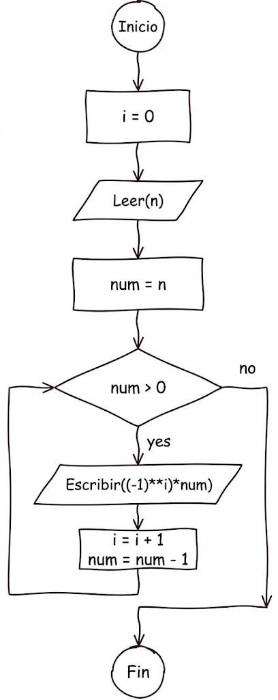
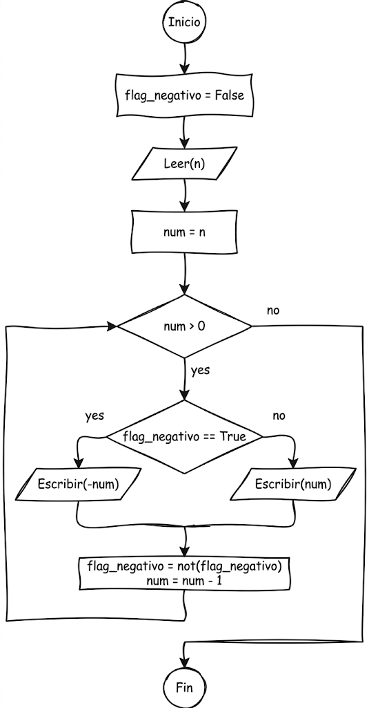
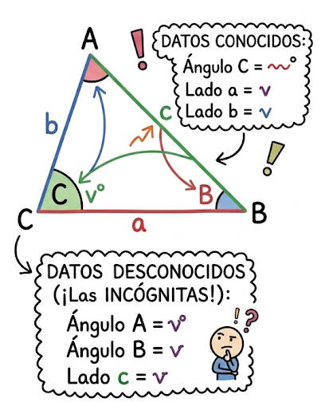
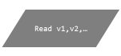
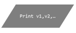
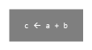
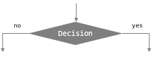
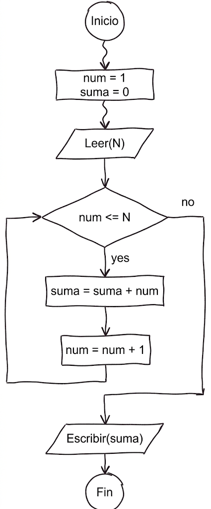

# Taller 1 — Expresiones y Algoritmos Secuenciales

> [!important]
> **Autoría:** Este taller fue diseñado y es propiedad intelectual del docente **Carlos Andrés Mera Banguero**. Lo unico que se hizo fue transcribirlo en este archivo y agregar algunas cosas adicionales de acuerdo a la notación vista en clase teorica.

## 1. Expresiones

Convierta las siguientes expresiones matemáticas a expresiones algorítmicas:

$$z = x^2 + 4xy$$

$$p = \frac{x+y}{2z} + \frac{3x}{5} - \frac{z}{2(y^2)}$$

$$a = \frac{-b + \sqrt[3]{a - 3(2b+3x)}}{2c - 2\sqrt[3]{b^{-3}}}$$

$$w = \frac{-2(3x^{-2}+5y-2yz)}{5x+4yz-\left(\frac{3}{4}+y\right)^{\frac{2}{5}}}$$

$$k = \sqrt{\frac{(4z)^2}{(b)^3}}$$

> [!Tip]
> **Pista**: si no recuerda el orden en que se evalúan los operadores, consulte la tabla de prioridad y asociatividad del Anexo A.3. Además, una raíz n-ésima se puede escribir como una potencia con exponente fraccionario (por ejemplo, la raíz cúbica de `x` equivale a `x^(1/3)`).

---

## 2. Prueba de escritorio

**2.1** Dadas las siguientes asignaciones:

```
Entero:   a = 5, b = 4, CUATRO = 6, TRES = 2
Real:     x = 0.5, y = 2, w
Booleano: p, q, r, z
```

Realice la prueba de escritorio de las siguientes expresiones, **en el orden dado**:

```
Inicio
  a = 5, b = 4, CUATRO = 6, TRES = 2
  x = 0.5, y = 2

  a = 5 + b % CUATRO
  p = 6 // CUATRO < TRES % 6
  q = TRES + b - 1 != a or b >= -b * a and a ^ 2 <= 10
  z = x * y * 10 == 0.1
  w = b % a + 5 * CUATRO // TRES
  r = not(x*a > y/b)
  q = p or not(7>6) and 6<=4 and q
  w = 10+38/(14-(10-12/(2*3)))-CUATRO*TRES
  p = 7>4 and 5<=5 or 4==5 and r
  q = not(9==9) and (7>8 or 8==6) or 9!=9
  r = 5+9<=5 and 3*2==5 or 8<=2*2 or 2*2<=2+2
  r = (not (14/2>8) or 5>5) and (5<=27/3 or 5+3<=3/2) and (not p or q)
  z = 3^2+6*2==12/3 and (5+3==16/9 or 10/2<=9) or not(10>=2) or r
Fin
```

> [!Tip]
> **Pista**: si no recuerda el orden en que se evalúan los operadores aritméticos, relacionales y lógicos cuando aparecen combinados en una misma expresión, consulte la tabla de prioridad y asociatividad del Anexo A.3.

**2.2** Realice la prueba de escritorio del siguiente diagrama de flujo con el valor de entrada `n = 3`:



**2.3** Realice la prueba de escritorio del siguiente diagrama de flujo con el valor de entrada `n = 3`:



---

## 3. Algoritmos secuenciales

Escriba en seudocódigo la secuencia de pasos que ayuden a solucionar cada uno de los siguientes problemas.

**3.1** Haga un algoritmo que dado el tamaño de un disco duro en MegaBytes (MB) permita a una persona saber el tamaño de ese disco en GigaBytes (GB) y TeraBytes (TB).

> [!Tip]
> **Pista**: recuerde que 1 GB equivale a 1024 MB, y 1 TB equivale a 1024 GB.

**3.2** Haga un algoritmo que calcule y muestre la edad de Pedro a partir de las edades de sus tres hijos sabiendo lo siguiente. Primero se le debe preguntar la edad a Carlos, es decir, este es un dato de entrada. Maria tiene tres veces la edad de Carlos, menos el módulo entre 100 y la edad de Carlos. Julian tiene tantos años como el resultado de hacer la división entera entre 85 y la edad de Maria, más el año actual módulo la edad de Carlos. Luego la edad de Pedro es dos veces la edad de Carlos, más la edad de Maria módulo 5, menos dos veces la edad de Julian dividida de manera entera con 10.

**3.3** Se requiere un algoritmo que permita calcular el salario semanal de un empleado que trabaja por horas. El valor de la hora varía así: cada hora diurna se paga a una tarifa de $12.500, mientras que la hora nocturna tiene un recargo del 25% sobre el valor de la hora diurna. La empresa debe descontar al empleado el 4% de lo devengado por salud y el 8% por pensión, además de un 10% por retención en la fuente. El algoritmo debe mostrar el salario bruto, el valor de cada descuento y el salario neto que debe recibir el empleado dadas las horas diurnas y nocturnas trabajadas en la semana.

> [!Tip]
> **Pista**: recuerde convertir cada porcentaje (25%, 4%, 8%, 10%) a su forma decimal (0.25, 0.04, 0.08, 0.10) antes de multiplicarlo.

**3.4** Dada una medida de tiempo expresada en horas, minutos y segundos con valores arbitrarios, elabore un programa que transforme dicha medida en una expresión correcta. Por ejemplo, dada la medida 3h 118m 195s, el algoritmo debe mostrar como resultado 5h 1m 15s.

> [!Tip]
> **Pista**: para convertir un exceso de segundos a minutos (o de minutos a horas), use la división entera (`//`) para obtener las unidades completas que se acarrean, y el módulo (`%`) para obtener el resto que queda en la unidad original.

**3.5** Escriba un algoritmo que permita calcular las calorías quemadas durante una rutina de ejercicios. El usuario debe ingresar el tiempo (en minutos) dedicado a cada actividad: correr, nadar y hacer ciclismo. El algoritmo debe utilizar las siguientes fórmulas para calcular las calorías quemadas:

- Correr: 10 calorías por minuto.
- Nadar: 8 calorías por minuto.
- Ciclismo: 7 calorías por minuto.

Finalmente, el algoritmo debe mostrar el total de calorías quemadas al final de la rutina.

**3.6** Se requiere un programa que calcule la cuota mensual (m) que se debe pagar para comprar una casa cuyo valor es h. Para el cálculo se debe utilizar una tasa de interés i (entre 0 y 100) a un plazo de n años. El cálculo de la cuota se hace con base en la siguiente fórmula:

$$m = \frac{hr}{1-(1+r)^{-12n}}$$

Tenga presente que:

$$r = \frac{i}{100 \cdot 12}$$

**3.7** El profesor de geometría requiere que usted desarrolle un programa que le ayude a los estudiantes a calcular los ángulos A y B de un triángulo irregular, a partir del ángulo C y el valor de los catetos a y b.



> [!Tip]
> **Pista**: recuerde la ley del coseno, `c² = a² + b² - 2ab·cos(C)`, para hallar el lado `c` que falta, y luego la ley del seno, `a/sen(A) = b/sen(B) = c/sen(C)`, para hallar los ángulos `A` y `B` restantes.

---

## Anexo: Tablas de referencia rápida

Las siguientes tablas resumen, con la notación usada en clase, los conceptos necesarios para resolver el taller (entrada/salida/proceso, operadores y sus prioridades). No son parte del taller original del profesor Mera; se agregan como material de consulta.

### A.1 Entrada, salida y proceso

| Tipo | Diagrama de bloques | Pseudocódigo | Python |
|---|---|---|---|
| Entrada |  | `Leer(v1,v2,…)` | `v1 = input(...)`<br>`v2 = input(...)` |
| Salida |  | `Escribir(v1,v2,…)` | `print(v1,v2,…)` |
| Proceso |  | `c = a + b` | `c = a + b` |
| Condición |  | `Si (condición) entonces`<br>&nbsp;&nbsp;`...`<br>`Sino`<br>&nbsp;&nbsp;`...`<br>`Fin_Si` | `if condición:`<br>&nbsp;&nbsp;`...`<br>`else:`<br>&nbsp;&nbsp;`...` |


> En Python, `input()` siempre devuelve texto (`str`); si el valor se va a usar en una operación numérica, debe convertirse con `int()` o `float()` (por ejemplo: `v1 = float(input(...))`).
>
> *Imágenes de diagrama de bloques tomadas del material de clase (diapositiva "Tabla resumen").*

### A.2 Operadores aritméticos

| Pseudocódigo | Python | Nombre | Ejemplo | Resultado |
|---|---|---|---|---|
| `+` | `+` | Suma | `5 + 3` | `8` |
| `-` | `-` | Resta | `5 - 3` | `2` |
| `*` | `*` | Multiplicación | `5 * 3` | `15` |
| `/` | `/` | División real | `7 / 2` | `3.5` |
| `//` | `//` | División entera | `7 // 2` | `3` |
| `%` | `%` | Módulo (residuo) | `7 % 2` | `1` |
| `^` | `**` | Potencia | `2 ^ 3` | `8` |

### A.3 Prioridad y asociatividad de operadores

Cuando concurren en una misma expresión diferentes tipos de operadores, se aplican las reglas de prioridad y asociatividad:

| Prioridad | Operadores | Asociatividad |
|---|---|---|
| 1 | `()` | Adentro → Afuera |
| 2 | `^` (potencia; `**` en Python) | D → I |
| 3 | `+` (unitario), `-` (unitario) | D → I |
| 4 | `*`, `/`, `//`, `%` | I → D |
| 5 | `+`, `-` (binarios) | I → D |
| 6 | `>`, `>=`, `<`, `<=`, `!=`, `==` | I → D (encadenados) |
| 7 | `not` | D → I |
| 8 | `and` | I → D |
| 9 | `or` | I → D |

### A.4 Operadores relacionales

Un operador relacional compara sus operandos y devuelve un valor lógico (booleano) basado en si la comparación es verdadera o no.

| Operador | Nombre | Ejemplo | Resultado |
|---|---|---|---|
| `>` | Mayor | `1 > 3` | F |
| `>=` | Mayor o igual | `2 >= 1` | V |
| `<` | Menor | `-5 < -1` | V |
| `<=` | Menor o igual | `3 <= 3` | V |
| `!=` | Diferente | `13 != 4` | V |
| `==` | Igual (comparación) | `0 == 1` | F |

### A.5 Operadores lógicos

Un operador lógico toma uno o dos operandos lógicos (cada uno `V` o `F`) y devuelve un valor `V` o `F`. Se usan para combinar múltiples comparaciones en una expresión condicional.

**`not`**

| x | not(x) |
|---|---|
| F | V |
| V | F |

**`and`**

| x | y | x and y |
|---|---|---|
| F | F | F |
| F | V | F |
| V | F | F |
| V | V | V |

**`or`**

| x | y | x or y |
|---|---|---|
| F | F | F |
| F | V | V |
| V | F | V |
| V | V | V |

### A.6 Método de Polya

El punto 3 (algoritmos secuenciales) se resuelve más fácilmente si se sigue el método de Polya visto en clase: antes de escribir el seudocódigo, conviene pasar por los cuatro pasos siguientes.

| Paso | Pregunta clave | Qué se produce |
|---|---|---|
| 1. Entender el problema | ¿Qué se pide calcular? ¿Cuáles son los datos de entrada, de salida y las variables auxiliares? ¿Hay constantes o fórmulas involucradas? | Lista de variables (entrada/salida/auxiliares/constantes) y la(s) fórmula(s) o relación matemática |
| 2. Diseñar un plan | ¿Cómo se llega de las entradas a las salidas? | Descripción del proceso, esquema `[Entradas] → [Proceso] → [Salidas]` |
| 3. Implementar el plan | ¿Cómo se traduce el plan a diagrama de flujo y a seudocódigo? | Diagrama de flujo (bloques de la tabla A.1) y seudocódigo (`Inicio` / `Leer` / … / `Escribir` / `Fin`) |
| 4. Revisar el plan | ¿El algoritmo funciona para distintos casos de prueba? | Prueba de escritorio con al menos dos casos (↓ valores que ingresan, ↑ valores que se calculan) |

### A.7 Cómo hacer la prueba de escritorio

La prueba de escritorio (paso 4 del método de Polya) consiste en simular a mano, **en el orden dado**, la ejecución del algoritmo (diagrama de flujo o seudocódigo) con valores concretos, para verificar que produce el resultado esperado antes de programarlo.

**Formato de la tabla**

- Una columna por cada variable que interviene en los cálculos (no es necesario incluir todas las variables del algoritmo, solo las relevantes).
- Notación de flechas en cada celda: **↓** para un valor que *ingresa* como entrada, **↑** para un valor que se *calcula* a partir de una fórmula.
- Si el algoritmo es puramente secuencial —sin ciclos ni decisiones, como los del punto 3 de este taller— **una sola fila es suficiente**, porque cada variable se calcula una única vez (ver Ejemplo 1).
- Si el algoritmo tiene un ciclo o una decisión que se repite, se necesita **una fila por cada iteración** (cada fila usa los valores ya actualizados por la fila anterior, igual que en el punto 2) — ver Ejemplo 2.
- Se repite con **al menos dos casos de prueba** distintos, y al final se compara el resultado obtenido contra el esperado.

**Ejemplo 1 — algoritmo secuencial** (cálculo de salario neto, con `num_horas` y `valor_hora` de entrada; sin ciclos ni decisiones, como en los ejercicios del punto 3):

| valor_hora | num_horas | salario_base | imp_salud | imp_pension | salario_neto |
|---|---|---|---|---|---|
| ↓2000 | ↓100 | ↑200000 | ↑20000 | ↑10000 | ↑170000 |

**Ejemplo 2 — algoritmo con ciclo** (adelanto de la clase 7 — *Ciclos*: suma de los primeros **N** números enteros mayores que 0, donde **N** es un dato de entrada). Este ejemplo va más allá de lo que pide este taller —que no incluye ciclos— pero muestra cómo se extiende la misma técnica cuando una instrucción se repite varias veces.

**Diagrama de flujo**



**Pseudocódigo**

```
Inicio
    num = 1
    suma = 0
    Leer(N)
    Mientras (num <= N) Entonces
        suma = suma + num
        num = num + 1
    Fin_Mientras
    Escribir(suma)
Fin
```

**Prueba de escritorio** (caso de prueba `N = 4`):

| N | num | suma |
|---|---|---|
| ~~?~~ | ~~?~~ | ~~?~~ |
| ↓4 | ~~1~~ | ~~0~~ |
| &nbsp; | ~~2~~ | ~~1~~ |
| &nbsp; | ~~3~~ | ~~3~~ |
| &nbsp; | ~~4~~ | ~~6~~ |
| &nbsp; | 5 | ↑10 |

Cada fila corresponde a una vuelta del ciclo `Mientras`:

1. Antes de leer `N`, se inicializan `num = 1` y `suma = 0`; luego se lee `N = 4` (fila con ↓).
2. Mientras `num <= N` sea verdadero se ejecuta el cuerpo del ciclo (`suma = suma + num` y después `num = num + 1`), lo que agrega una fila nueva por cada vuelta: `num` pasa de 1 a 2, de 2 a 3, etc., y `suma` va acumulando el total.
3. La última fila (`num = 5`) es la que hace que la condición `5 <= 4` sea **falsa** y el ciclo termine; el valor final que se escribe en pantalla es `suma = 10` (filas con ↑).

> [!tip]
> **Ciclo recomendado:** *Entender → Diseñar → Predecir (prueba de escritorio) → Implementar → Verificar*. Primero se predice el resultado a mano; luego se corre el código con los mismos datos. Si la salida real no coincide con la predicción, no se corrige el código de inmediato — primero se identifica si el error está en el algoritmo, en la predicción o en la implementación.
